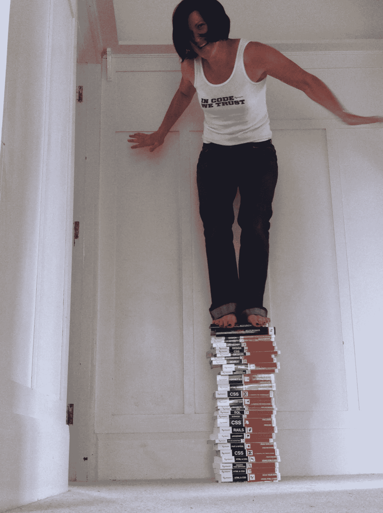

# 赢取装有 SitePoint 书籍的全新 Kindle！

> 原文：<https://www.sitepoint.com/win-a-brand-new-kindle-loaded-with-sitepoint-books-2/>

**参与竞争，赢取装满 SitePoint 书籍的全新亚马逊 Kindle！**

SitePoint 和 PHPMaster 正在为我们备受期待的摄影比赛做准备。一个幸运的条目将出现在 SitePoint 和 PHP 大师脸书页面上，这个人将赢得一个装有 SitePoint 电子书的新 Kindle。

很酷，是吧？

我们的主题是“给我们看看你的书”。

比赛于 2011 年 10 月 11 日开始，持续 14 天

**一点背景:**

10 多年来，SitePoint 一直致力于为 web 开发人员和设计人员出版最好的书籍。这一传统，以及对质量的关注，一直延续到今天，一本新的 PHP 大师书即将问世。

为了庆祝，我们想后退一步，看看 SitePoint 的书是如何帮助你“成为更好的 web 开发人员”的。

**如何进入:**

您可以通过访问 [PHPMaster 脸书页面](http://www.facebook.com/stripslashes "PHPMaster on Facebook")并上传您与您最喜爱的 SitePoint 图书的照片来报名。

这是你发挥创造力、独一无二、享受乐趣的机会！

**以下是指导方针:**

1.**像**我们的脸书页面 [PHPMaster](http://www.facebook.com/stripslashes "PHPMaster on Facebook") 和 [SitePoint](http://www.facebook.com/sitepoint "SitePoint on Facebook")

2.将你的照片上传到[竞赛页面](http://www.facebook.com/stripslashes?sk=app_239406449439539 "Facebook Competition Page")，并写一个巧妙的标题、大标题和/或描述。

3.在脸书和推特上与你的朋友分享你的照片

4.所有参赛作品将在短时间内开放投票

5.获得最多“赞”的条目获胜！

6.获胜者将在 phpmasterdotcom 和 sitepointdotcom 的脸书、推特(@phpmasterdotcom 和@sitepointdotcom)上公布

所以，准备好你的相机、iPhone、Android 等，给我们拍一张你的书的照片吧！

## 分享这篇文章