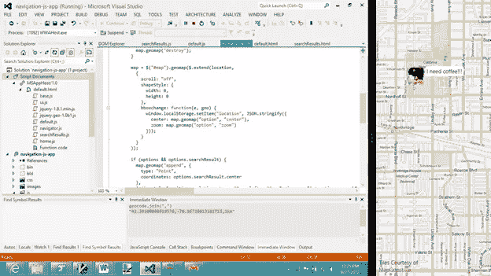

# Windows 8、jQuery Geo 和 toStaticHTML

> 原文：<https://www.sitepoint.com/windows-8-jquery-geo-and-tostatichtml/>

我最近参加了一个 Windows 8 开发营，打算第一次安装微软的最新操作系统，并让 jQuery Geo 作为 WinJS 之上的原生应用程序工作。

## 什么是 jQuery Geo？

jQuery Geo([http://jquerygeo.com](http://jquerygeo.com))是一个 JavaScript 地图 API，在概念上类似于必应地图 API 和谷歌地图 API。它是开源的，默认情况下使用开放数据，但可以使用开发人员希望使用的任何地图和数据服务。这是有据可查的，API 设计的灵感来自 jQuery 本身优雅的风格。少写，多图！

## 成功了吗？

### 是啊！

除了`$.ajax`，jQuery 在 WinJS 的 Chakra 引擎上运行良好。jQuery Geo 本身不使用 AJAX，所以这不是问题。

我必须对 jQuery Geo 的源代码做的唯一更改是用 Windows 8 JavaScript 方法将任何用于动态创建元素的 HTML 文本括起来:`toStaticHtml`。当您将 HTML 传递给任何 jQuery 操作方法(如 append)时，这是必需的。

之前:

`.append( '<div />' )`

后:

`.append( toStaticHTML( '<div />' ) )`

这就是我在 jQuery Geo source 中所做的全部更改，以使其在 Windows Store 应用程序中工作。请继续阅读，了解更多详情。



WinJS 在 Visual Studio 2012 中调试一个 jQuery Geo Windows Store 应用程序(右侧截图)映射推文

## 讨论

### jQuery 呢？

借助 Windows 8，可以使用 HTML、CSS 和 JavaScript 构建 Windows 应用商店应用。那么，jQuery 呢？当我面前出现一个空的 WinJS 项目时，我就把它包含进去了。

因为我们正在构建一个可以从 Windows Store 安装的桌面应用程序，所以我们必须在项目中包含 jQuery 的精简脚本，并在本地引用它。

在 Visual Studio 2012 中，使用以下内容创建一个新项目:

文件= >新项目= >模板=> JavaScript => Windows 商店样式= >空白应用程序。

然后从[http://jquery.com/download](http://jquery.com/download)下载 1.8.1 的副本。将其包含在项目的 js 文件夹中，并将其添加到 default.html**:**

 **`<script src="/js/jquery-1.8.1.min.js"></script>`

当你启动 app 时，会得到三个“无法添加动态内容”的错误。这是 jQuery/Sizzle 检测 JavaScript 引擎的特性。测试基于使用`innerHTML`创建的动态内容。如果没有`toStaticHTML`方法，Windows 8 不允许这样做，因此测试将无法正确检测所有 WinJS 功能。然而，在移植 jQuery Geo 时，我没有发现这方面的问题，我希望 jQuery 的大部分功能都能如预期的那样工作。如果你发现不是这样，你可以下载一个未缩小版本的 jQuery 并自己在这三个地方添加`toStaticHTML`。

### HTML1701

除了 jQuery 的初始测试之外，任何时候你自己使用 jQuery 操作方法(比如`append`)都会得到同样的错误。该错误的全文如下:

> HTML1701:无法添加动态内容。一个脚本试图插入动态内容，或以前动态修改过的元素，这可能是不安全的。例如，使用 innerHTML 属性添加脚本或格式错误的 HTML 将会生成此异常。使用 toStaticHTML 方法过滤动态内容，或者使用 createElement 等方法显式创建元素和属性。更多信息，请参见[http://go.microsoft.com/fwlink/?LinkID=247104](http://go.microsoft.com/fwlink/?LinkID=247104)。

错误消息的第一个建议是将 HTML 封装在对`toStaticHTML`的调用中。这包括发送到 jQuery 的任何 HTML。`toStaticHTML`方法去除了构成安全威胁的标签和字符。例如，它将完全删除脚本和链接标签以及内联事件处理程序。我在网上找到一些帖子，声称它也剥离 HTML5 数据属性，但在我的测试中并非如此。jQuery Geo 非常依赖数据属性，如果没有这些属性，它在 Windows 8 中就不能很好地工作。

第二个建议是使用 DOM 方法，比如`createElement`,但是，如果您正在创建带有数据属性和类的奇特元素层次结构，这会变得冗长，不值得放弃 innerHTML 的便利性。

由于 jQuery Geo 没有附加任何恶意内容，所以我选择遵循第一个建议，包装我们的动态 HTML。我们有八个调用，总共增加了大约 112 个字符。我们可以使用缩小技巧进一步缩小。

最后，如果你希望 jQuery core 能在内部包装 HTML，不要抱太大希望。jQuery 团队致力于 web 标准，这既不是 web 也不是标准。对于开发者来说，当他们知道他们正在编写 Windows 应用商店应用程序时，更正确的做法是改变他们调用 append 的方式。

### 仅换行文本

当我第一次开始添加`toStaticHTML`时，我太投入了。我将它添加到库中的每个 append 和 prepend 调用中。结果是我所有的地图都在左上角有一个字符串`[object Object]`。我认为这将是一个很难追踪的错误。

问题是我在 jQuery 集合上调用了`toStaticHTML`。该集合表示我需要在 DOM 中移动(使用`detach`和`append`)而不是动态创建的元素。`toStaticHTML`的决定是在那个对象上调用`toString`。

```
this._$existingChildren.detach( );   
this._$elem.html( '' );   
this._$elem.append( toStaticHTML( this._$existingChildren ) ); // don't use toStaticHTML here
```

## 往返旅行

`toStaticHTML`方法并不新鲜。它是在 IE8 中引入的，作为清除用户输入的第一道安全选项。Web 应用程序通常运行在沙盒中，对系统没有多少访问权限。Windows 应用商店应用以用户身份在桌面上运行，具有不同级别的访问权限。在这种情况下，要求清理以防止恶意操作(如删除用户文件)更有意义。

每当你想用 HTML 文本创建动态元素时，调用这个方法似乎很痛苦，但我很高兴这就是我将 jQuery Geo 移植到 Windows 8 所要做的一切。jQuery Geo 1.0b2 将支持 Windows 应用商店应用。

## 参考

*   [jQuery Geo](http://jquerygeo.com/)
*   [对 MSDN 进行统计](http://msdn.microsoft.com/en-us/library/windows/apps/hh465388.aspx)
*   [在 MSDN 开发安全应用](http://go.microsoft.com/fwlink/?LinkID=247104)
*   [为什么 toStaticHTML 删除 SO 上的 data-*属性](http://stackoverflow.com/questions/12234931/why-does-tostatichtml-remove-data-attributes)

## 分享这篇文章**