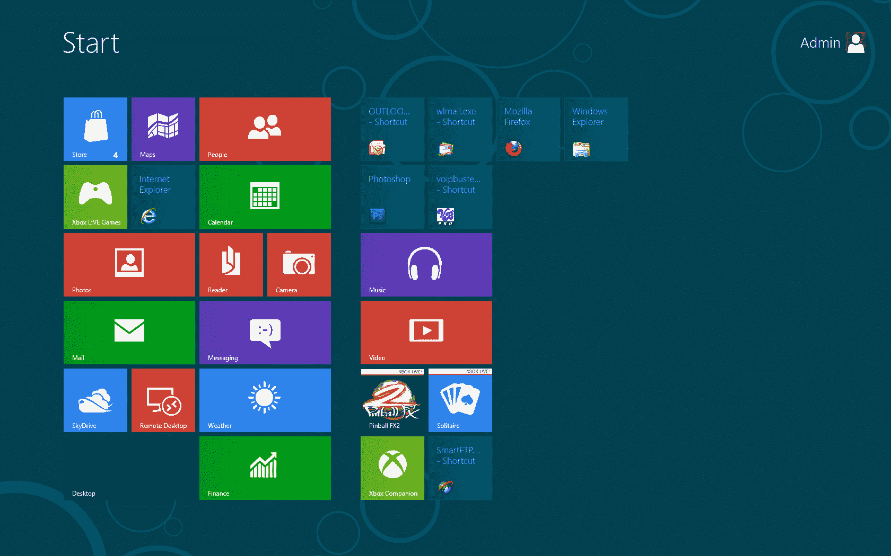
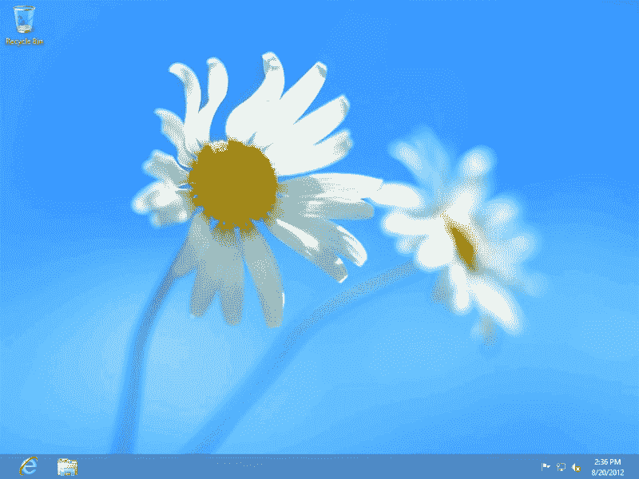
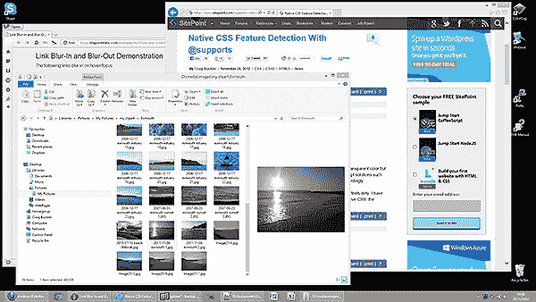
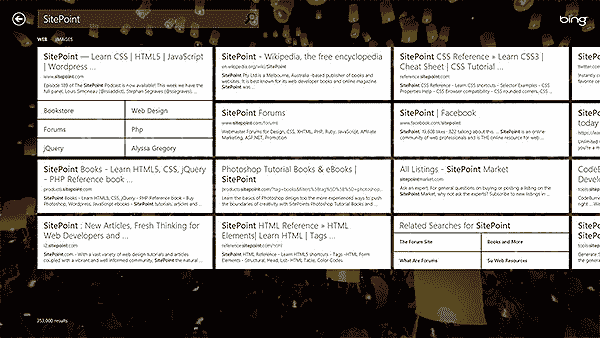

# Windows 8 第一个月回顾:安装和界面

> 原文：<https://www.sitepoint.com/windows-8-review-1/>

我[评测 Windows 7](https://www.sitepoint.com/windows-7-review-1/) 已经三年过去了。这个操作系统很受欢迎，但是在 Vista 崩溃之后，微软的旗舰操作系统只会变得更好。Windows 8 能否进一步改善用户感知？微软在头四天卖出了 400 万份 Windows 8，第一个月卖出了 4000 万份。取决于你相信谁，销售要么不景气，要么超过前几版。

虽然你可能已经看过很多关于 Windows 8 的评论，但我想分享一下自 10 月 26 日发布以来每天使用它的感受。我在一台配有双显示器(非触摸屏)、键盘和鼠标的标准 PC 上使用 Windows 8 Professional。声明一下，我从第 2 版开始就一直使用 Windows，在此之前一直使用 MS-DOS；我喜欢认为自己在操作微软的操作系统方面相当有能力。

这是一篇分为三部分的长篇评论。在第一部分，我们将看看定价，安装和新的界面。第二部分讨论软件、安全性和稳定性。最终总结包括生产率和绩效。

## Windows 8 定价

Windows 8 的定价与其前代产品相比颇具竞争力，折扣至 2013 年 2 月。如果你愿意下载一个 2.6GB 的 ISO 并刻录你自己的光盘，前往[Windows.com](http://www.windows.com/),在那里你可以以 39.99/24.99/29.99 美元的价格从任何版本的 XP、Vista 或 7 升级到 Windows 8 Pro。那些最近买了电脑的人可以在 windowsupgradeoffer.com 的[多省一点钱。](http://www.windowsupgradeoffer.com/)

如果您更喜欢包含 32 位和 64 位版本的盒装零售版本:

*   [Amazon.com Windows 8 专业版升级——66.99 美元](http://www.amazon.com/exec/obidos/ASIN/B008H3SW4I/windows8pro-21)
*   [Amazon.co.uk Windows 8 Pro 升级— 43.19](http://www.amazon.co.uk/exec/obidos/ASIN/B008GRKGXK/windows8pro-21)
*   [在 Amazon.de 升级 Windows 8 Pro—52，00 欧元](http://www.amazon.de/exec/obidos/ASIN/B008PAGYRU/windows8pro-21)
*   [在 Amazon.fr 升级 Windows 8 Pro——53.80 欧元](http://www.amazon.fr/exec/obidos/ASIN/B008O2RI1A/windows8pro-21)

## Windows 8 安装

正如你所料，Windows 8 安装相对来说没什么问题。你可以选择从 XP、Vista 或 7 升级，但我总是建议全新安装，以清理你的硬盘。回答几个选项，Windows 8 将在 30 分钟后启动。

Windows 8 基于 Windows 7；您不太可能遇到驱动程序兼容性问题，并且安装可以识别大多数硬件。理论上。最初我听不到声音，直到 BIOS 更新到来，但不可否认，这是在一台新电脑上。大多数设备都可以顺利识别。

最后，Windows 8 可能是一个新的操作系统，但微软已经发布了大量更新。准备在第一次启动后下载 1gb 的补丁。

## Windows 8 界面

界面是你喜欢或讨厌 Windows 8 的主要原因。从现在开始，我将把平铺的开始屏幕和应用程序称为*“Metro”*。出于法律原因，微软不能给它起这个名字，但我的生命太短暂了，不能称之为*“Windows 8 UI 风格”*。

你可能已经见过新的 Windows Metro 开始屏幕上的应用程序磁贴，但这里有一个提醒:

磁贴是标准应用程序或地铁应用程序的快捷方式，这些应用程序可以实时自动更新信息，如天气预报或股票价格。您可以通过拖动或右键单击调整大小、移除或卸载来重新排列图块。

隐藏在 Metro 背后的是标准的 Windows 桌面。您可以使用“桌面”链接、键盘上的 Windows 键或启动任何标准(非 Metro)应用程序来切换到它。

虽然 Windows 7 的功能如任务栏锁定、跳转列表和(Aero) peek 都可用，但微软已经清理了 Windows，删除了没有人使用的功能。比如开始按钮。17 年来，Start 一直是操作系统的核心部分，但它可能很快变成随机应用程序链接的一团乱麻。也就是说，我是那些积极地将快捷方式组织成逻辑层次的人之一，我最初错过了开始按钮。然而，你会发现自己把重要的快捷方式钉在任务栏和桌面上——这很快就会成为遥远的记忆。

Windows 8 Metro 开始屏幕是新的开始按钮。您可以通过单击键盘的 Windows 键，将鼠标移动到屏幕的左下角并单击弹出菜单，或者打开 Charms 菜单并单击开始图标(Win+C 或将鼠标移动到屏幕的右上角或右下角)来返回 Metro。

当我第一次打开一个标准的桌面应用程序时，我以为我的显卡有问题；窗口是没有 Aero 透明度的普通矩形。虽然我喜欢有吸引力的 Vista/7 视图，但我一直认为它是一个不必要的资源猪。看来微软同意了:

它让我想起了 Windows Home Basic 或者说是 Windows 3.1。它相当吸引人，你可以对配色方案进行基本的修改，但是，正如上面的截图所示，确定窗口边缘有点困难。我经常发现自己改变了错误窗口的尺寸。

桌面小工具也被扔进了 Windows 的墓地。它们从来都不是特别受欢迎，尽管我有一些有用的，我会怀念的。微软希望您改用 Metro 应用程序…

那么什么是地铁 app 呢？本质上，它是一个全屏运行的简化界面的应用程序。提供了几个，比如邮件、日历、天气和必应搜索:

[Windows 商店](https://www.sitepoint.com/microsoft-windows-store/)提供更多。应用程序也可以停靠在屏幕的左侧或右侧，这样你就可以同时使用两个应用程序。

虽然 Metro 应用程序可能对智能手机和平板电脑有用，但我不喜欢在 PC 上使用它们。第一个问题:除了游戏，你还想全屏运行多少应用？一个典型的例子是 Skype——标准的桌面界面并不出色，但 Metro 版令人震惊。即使在 24 英寸的显示器上，你也只能一次查看大约六个联系人，无法同时聊天、发送即时消息或上传文件。这在你执行单一任务的小型设备上不一定是个问题，但在多任务桌面 PC 上是个根本性的缺陷。

另一个恼人的问题是:所有 Metro 应用程序都显示闪屏。为什么我需要在单击后立即看到全屏日历图标？它可能只会出现一两秒钟，但不可能关掉它。

下一期:地铁应用水平滚动。同样，这在你可以滑动的平板电脑上可能感觉更自然，但在 PC 上却很奇怪。例如，鼠标的垂直滚轮左右移动屏幕。

发现能力是另一个缺陷。我完全支持简化界面，但是地铁应用程序通常更喜欢简单而不是实用。以 Windows 8 阅读器应用程序为例。微软终于意识到全世界都在使用 PDF 文档，并提供了内置阅读器。它速度很快，相当流畅。然而，一旦你看了 PDF，你很有可能想要打印它。但是没有菜单。右键单击会显示查看选项，但不会显示打印图标。我认为这一定是一个许可问题，直到谷歌搜索显示我需要打开 Charms 菜单，点击设备图标，选择一台打印机，然后点击“打印”。没错——单个工具栏图标已经被鼠标手势和四次点击所取代。臃肿的 Adobe Reader 又回到了我的系统上。

最后，如何关闭 Metro 应用程序？你需要将鼠标移动到屏幕顶部，点击以抓取应用程序，然后从底部拖动/滑动。这真的比单击一个“X”图标更好吗？我第一次开始使用 Alt+F4。

尽管我很消极，但没有必要使用地铁应用程序。我很少这样做，99%的时间都花在标准的 Windows 桌面上。

微软试图创建一个能在个人电脑和小屏幕设备上运行的统一操作系统。事实上，地铁和桌面模式是截然不同的界面，在两者之间切换会很不和谐。虽然平板电脑市场的增长速度与个人电脑市场的下滑速度一样快，但新的界面让现有的 Windows 用户迷失了方向。随着时间的推移，它变得越来越容易，但多年来，Windows 8 第一次让我感觉自己像一个 It 新手。

在第二部分中，我们将讨论 Windows 8 软件、安全性和稳定性…

如果你喜欢读这篇文章，你会爱上[可学的](https://learnable.com/)；向大师们学习新技能和技术的地方。会员可以即时访问 SitePoint 的所有电子书和交互式在线课程，如[微软 access 和 VBA](https://learnable.com/courses/microsoft-access-and-vba-139) 。

## 分享这篇文章