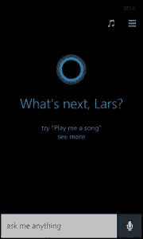
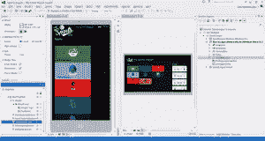
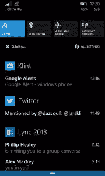
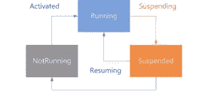

# Windows Phone 8.1:现在的失败者会吸引开发者吗？

> 原文：<https://www.sitepoint.com/windows-phone-8-1-will-underdog-appeal-developers-now/>

当微软最近发布最新版本的 Windows Phone 时，该平台的第三方开发者跳了起来，就像他们在极客健身中心的糟糕广告中一样。

大量的功能已经被更新并添加到平台中，许多功能为开发人员提供了新的机会来集成、扩展、改进和增加他们的工作价值。

有许多新的好东西，但我想在这里涵盖最令人兴奋的。我们将涵盖有记录的和传闻的特性，并附带一些一厢情愿的想法。

## 科尔塔纳

个人数字助理(PDA)让您的生活更加轻松，不仅能帮助您保持井然有序，还能丰富您的移动体验。大部分用户都听说过 Siri 或者 Google Now，就是苹果和谷歌的 PDA。

现在来认识一下 Cortana，这是微软版的手机 PDA。

Siri 在打开应用程序、安排约会和告诉你天气方面非常出色。谷歌现在在识别音乐、获取方向和寻找附近餐馆方面做得很好。Cortana 做了所有这些。

由于 Cortana 仍然是一个测试产品，所以她在某些领域不如这两个竞争对手那么精通。然而，“她”(微软一贯称之为 Cortana)的方法是通过保存一个关于你这个用户的笔记本来更加个性化。

这个笔记本可以让她知道你最喜欢的地点，比如家里和工作的地方。当该回家时，她会根据交通状况自动告诉你需要多长时间。

除了对特定问题的玩笑式回答(试试“你爸爸是谁”)，Cortana 在我看来有两大优势。

首先是理解语境。请允许我演示:

> 我:这附近有什么最好的日本餐馆？
> 
> 我在你住的地方找到了这 10 家日本餐馆
> 
> 我:告诉我怎么去第二个地方。
> 
> **Cortana** :这里是*的方向，插入餐厅名称*
> 
> 我:走到那里需要多长时间？
> 
> **Cortana** :步行 12 分钟到*插入餐厅名称*

这是一个巨大的进步，因为它允许你提炼你的问题或指示，而不必重新开始。这也适用于天气(“给我看摄氏温度”或“星期二天气如何”)。

第二个主要优势是 Cortana 旨在理解自然语言。随着时间的推移，Cortana 会自我学习，不仅仅是你，而是每个人。仍然有一些限制，但是你可以使用正常的措辞来安排约会，获取方向和联系人。

这使得 Cortana 比 Siri 更容易使用，Siri 需要一个学习曲线才能让苹果的 PDA 做你想做的事情。这只会随着时间的推移而改善。

这一切对开发者意味着什么？目前还不多，因为 Cortana 的 API 还没有正式发布给一般的开发社区。但允许第三方应用程序与 Cortana 集成并不断丰富体验的潜力是巨大的。

想象一下，你可以说“Cortana，在 Internet Explorer 中发布链接，并说‘很酷的 Windows Phone 新功能’”。或者，你可以让 Cortana 知道你的个人 FitBit 统计数据，这样，如果你落后于每天这么多步的目标，她可以提醒你步行，而不是坐火车。可能性是无限的。

未经证实的消息称，该 API 将与 Cortana 的公开发布一起发布，希望在 6 月底之前发布。我个人认为这需要更长的时间，因为这是一件棘手的事情。

## 通用应用程序

您可能已经注意到，微软的许多产品和服务最近被重新命名为“One”。比如有 [OneDrive](https://onedrive.live.com/) 和 [Xbox One](http://www.xbox.com/en-US/xbox-one/meet-xbox-one?xr=shellnav#adrenalinejunkie) 。这与微软“一个平台”和“一种体验”的长期目标是一致的。

这意味着您的应用程序可以在手机、平板电脑、桌面和 Xbox 上运行，并在 OneDrive 上有一个通用的数据存储库。没有其他生态系统可以提供这一点，这将是微软在未来几年的一个有价值的差异化优势。

在这种情况下，Windows Phone 8.1 提供了一种新的通用应用程序项目类型，这意味着你只需编写一次代码(几乎)，你的应用程序就可以在 Windows Phone 和 Windows 上运行。Windows Phone 8.1 现在可以运行 Windows 运行时，也称为 Windows RT。

这种方法很棒，从整体来看很有意义。但作为一名不得不为 Windows Phone 8.1 开发的开发人员，这确实令人困惑。不仅现在有两种开发 Windows Phone 的方法，而且“新”方法似乎没有任何官方命名。我听说它被称为:

*   通用应用程序
*   Xaml 应用程序
*   AppX 应用程序
*   Windows RT 应用程序
*   Windows Phone 商店应用

可能还有更多。这没有帮助。对于这篇文章，我将坚持通用应用程序。完成了。

更糟糕的是，开发应用程序的“旧”方式现在被称为“Silverlight 应用程序”。我在想 Silverlight 这个名字已经在佛罗里达一个阳光明媚的地方退休了。

这几乎就像是微软在说“在这个老女人永远消失之前，我们会再给她一次机会”。

话虽如此，微软还是非常强调说，你所有的 Windows Phone 8.0 应用程序仍然可以运行，8.1 将运行它们。此外，微软将继续投资 Silverlight(习惯这个名字)应用框架。

“什么时候你应该选择一个而不是另一个？”我听到你问了。

如果你有一个现有的 Windows Phone 8.0 应用程序，并希望升级，那么坚持 Silverlight。转换成通用应用程序太麻烦了。

但是，如果你有背景音频，或者你正在使用 8.0 应用程序中的 GPS 后台任务，那么就不要升级，因为它在 8.1 中不起作用。是的，没错。东西已经坏了。

构建一个全新的应用程序？我的建议是，一开始就启动一个通用的 app。你不仅可以接触到 2000 万 Windows Phone 用户，还可以一举接触到 2.2 亿多 Windows 用户。

您可以获得所有新的 API，例如 40 个通知和实时图块模板，而不是 5 或 6 个。您可以获得使用相同代码的响应控件，但根据平台的不同，它们的行为会有所不同。

有一些事情你不能用通用应用程序做，但它真的不是一个交易破坏者，除非你想使用提醒，剪贴板或创建一个锁屏提供商等功能。

尽管通用应用程序中缺失了许多 API，但我敢打赌，随着平台的扩展，它们会很快回归。我毫不怀疑微软会长期参与其中。

## 行动中心

通知是任何智能手机的主要功能。你想知道是否有人给你发了短信，你是否收到了推文，谁给你打了电话等等。虽然你在 Windows Phone 8.0 中收到了所有这些通知，但没有地方查看它们，而且通知经常会丢失。

易贝应用程序中的 15 分钟拍卖结束消息只有在你当时看着手机的情况下才有效。在 Windows Phone 8.1 中，通知在操作中心有了一个新家。如果用户允许，每个应用程序的通知都存储在操作中心。所有这些都可以通过设置菜单进行配置。

作为开发人员，您可以选择如何集成您的应用程序，并且可以与操作中心完全集成。您现在可以选择“幽灵”通知，这意味着用户永远不会收到警告。相反，通知会直接发送到行动中心。这是新商店应用程序用来通知用户有多少应用程序被自动更新(是的，应用程序最终会自动更新)。

开发人员现在终于可以依靠通知向用户发送重要消息，通用应用程序(见上文)也使用更可靠的 Windows 通知服务来发送通知。

## 地理位置警报

以我在地图、路线和物流方面的背景，我真的很喜欢地图和它带来的一切。在 Windows Phone 8.1 的讨论中，一个很少受到关注的功能是地理位置功能。

在您的应用程序中，您可以设置多达 1000 个地理点，您的应用程序可以响应这些地理点。如果你正在开发一个应用程序来跟踪最喜欢的咖啡店，用户可以在应用程序中标记位置，当他们下次路过你的应用程序时将触发一个事件。

当处理事件时，你可以用应用程序做任何你想做的事情，例如告诉用户他们接近优质咖啡，想象一下如果零售商也加入进来。他们的特色菜可以实时提供给你的用户。

"你知道山姆咖啡馆本周有新艺妓咖啡豆特价吗？"，或者类似的东西。

或者通过新的蓝牙 LE 协议将你的应用程序连接到汽车的 OBD 连接器，当你的应用程序检测到汽车燃料不足时，你可以提醒用户，并根据他们的偏好指引他们到最近的加油站。

## 应用程序生命周期管理

Silverlight 应用程序和通用应用程序的生命周期有很大不同。通用应用遵循 Windows 应用及其生命周期。

最主要的区别是，所有的应用程序总是暂停，而不是关闭。如果用户在应用的第一页按下后退按钮，它将不再被关闭(如 Windows Phone 8.0 中)，而只是暂停。就像用户已经按下开始按钮一样。

对于开发者来说，这意味着你的应用总是以同样的方式打开，不管入口点是什么，当然，除非用户在任务切换器中明确关闭应用。

与应用程序生命周期密切相关的另一个要点是导航框架，尤其是后退按钮。它不会自动将用户重定向到应用程序的上一页，而是操作系统堆栈中的上一个应用程序。

如果你想保留 Windows Phone 8.0 的导航方式，你需要拦截后退按钮事件，并手动将用户重定向到上一页。但对开发人员来说，最好的部分是取代 NavigationService 的新 Frame 类。

以前只能传递字符串参数，而 Frame 类允许在页面之间传递复杂的对象。很多开发者都在等这个。

## 未来是光明的

Windows Phone 8.1 为消费者和开发者提供了更多的功能。还有更多的内容，这篇文章只是给出了一些我认为最令人兴奋的部分。

Windows Phone 不会消失，尽管在一些市场表现不佳，尤其是那些更成熟的市场。

在欧洲、亚洲和南美，Windows Phone 正在崛起。在一些市场，该平台甚至超过了 iPhone。

阅读这篇文章时，你可能正在使用 Android 或 iPhone，这没什么。但我敢说你花点时间在 Windows Phone 8.1 上，给它一个机会。它可能会赢得你的心。

## 分享这篇文章