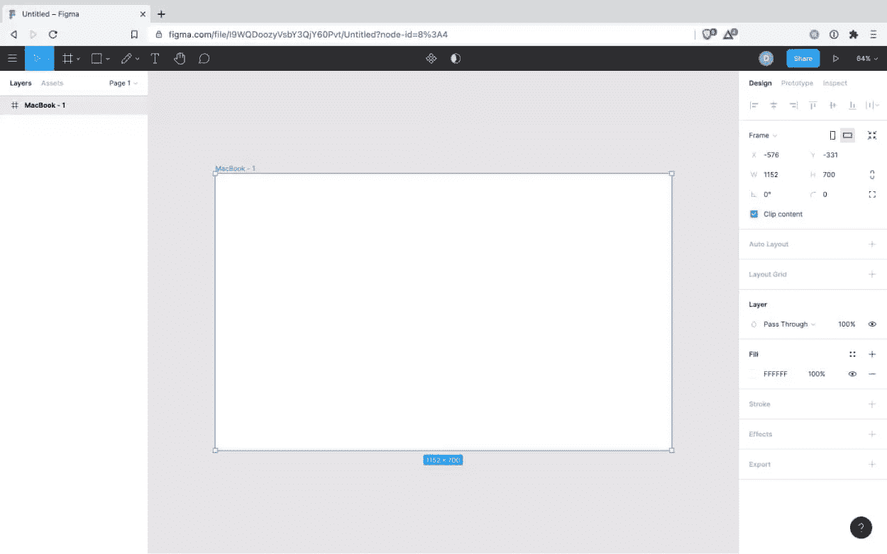
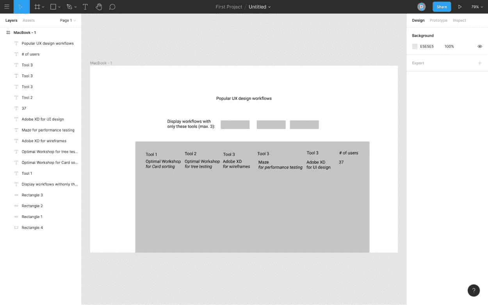
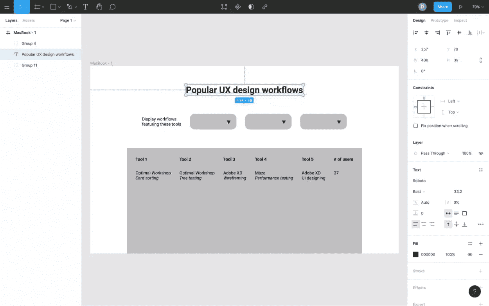
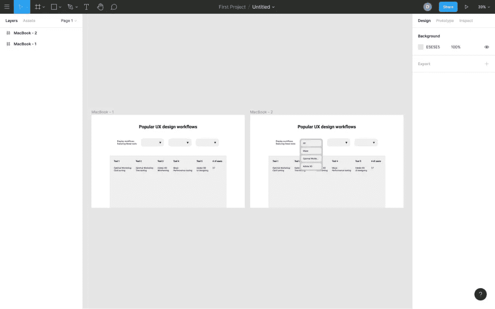
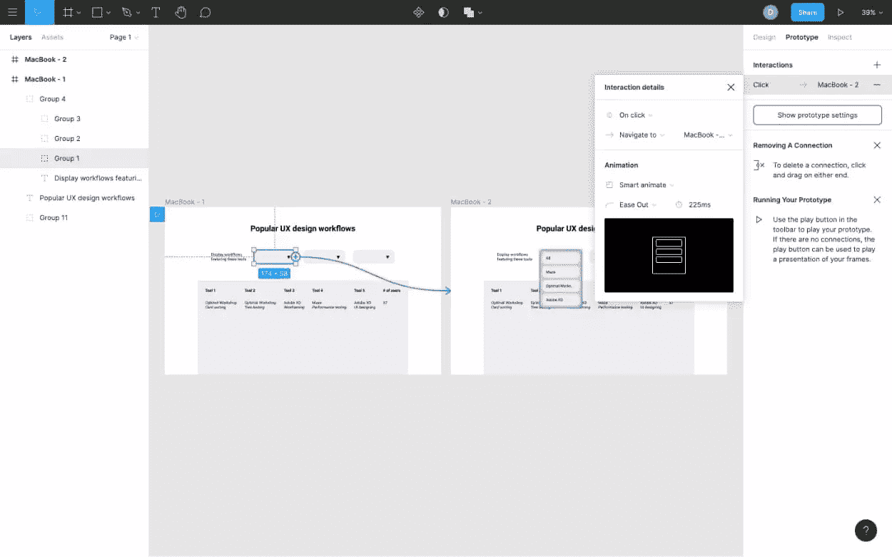
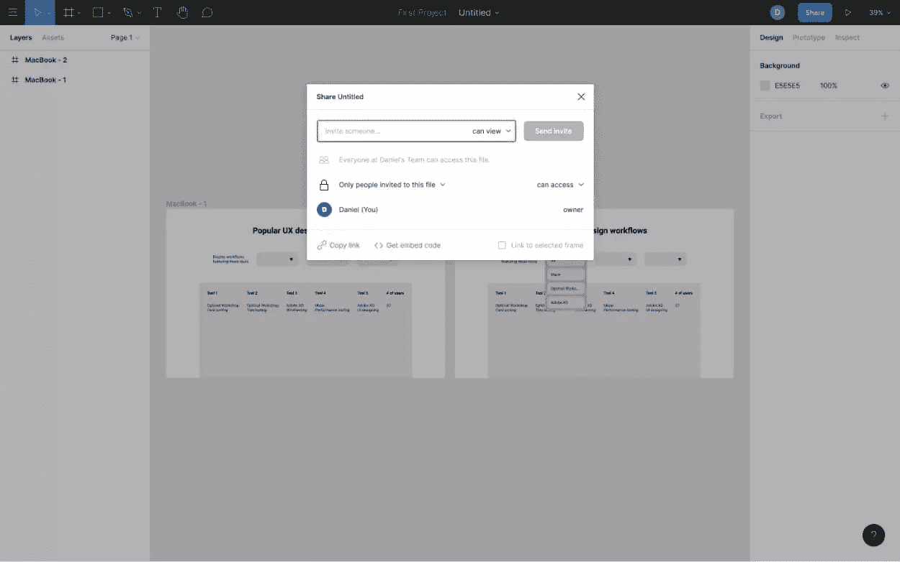

# Figma 线框图介绍

> 原文：<https://www.sitepoint.com/wireframing-figma/>

在这篇文章中，我们将探索什么是线框化，以及为什么值得用今天市场上最常用的 UI 设计工具 [Figma](https://figma.com/) 来做这件事。

我们将深入 Figma，并学习如何用它来设计用户界面——一边走一边深入研究线框。

*BTW:如果你看一下 [2020 年设计工具调查](https://uxtools.co/survey-2020/#toolkit)，Figma 在大多数类别中获胜:用户流、UI 设计、原型、移交、设计系统、版本，甚至“2021 年最激动人心的尝试”。*

## 线框化

线框是描述设计结构的图表，它们可以是低保真度的(用于用户研究)或中等保真度的(用于 UX 研究)。我们将专注于后者(UX 研究)，视觉效果对我们来说并不重要，因为我们在这个阶段想做的只是弄清楚内容和布局(也称为“信息架构”)。

### 我们在做什么线框？

首先，介绍一下我们将要构建的 UI 的背景。这将是一个类似表格的结构，显示各种 UX 设计工具，以及每个工具在 UX 设计工作流程的哪一步使用。数据将由用户提交，因此目的是看哪个 UX *设计工作流程*是最好的，而不是过度的“哪个 UI *设计工具*是最好的？”

线框将帮助我找出如何最好地构建这个界面，而不是浪费时间去搞清楚小的视觉细节。看起来不会很惊艳，但也没关系；它只需要看起来足够好，用户可以向我提供一些反馈。

是的，这是一个真正的 UI。目前我称之为“工具流”。

我们开始吧！

## 步骤 1:设置画板

我的网站的大部分用户是桌面用户，所以在桌面画板上绘制我的设计是有意义的。在你的键盘上按下`A`，然后在 Figma 的右边栏点击*设计* > *桌面* > *MacBook* 。

## 步骤 2:收集功能需求

假设你或其他人在某个阶段做了一些用户研究，我们将需要参考这些来创建我们的线框。在进行用户研究(*具体来说，用户访谈、焦点小组和使用低保真度线框进行的用户测试*)时，我们会意识到任何功能需求。

我们的是:

*   按工具过滤
*   工作流用户数量

让我们开始线框！

## 步骤 3:创建文本和形状

首先，有*有* [Figma 线框套件](https://figma.com/templates/wireframe-kits/)可用，但我并不完全是他们的粉丝。它们让我觉得只能用工具箱里的东西工作，这阻碍了我的创造力。

相反，我们将使用文本和形状线框。

正如我们之前在画板中了解到的，在 Figma 中创建任何东西的最简单方法是滥用键盘快捷键:

*   `T`:文字
*   `O`:椭圆
*   `R`:长方形
*   `⇧⌘K`:图像
*   `⇧L`:箭头
*   `L`:行

之后，只需在画板上点击您希望对象出现的大致位置，然后您可以使用鼠标和箭头键来调整大小和对齐方式。

有用的快捷方式:

*   `⌘-/+`缩放。
*   `⌘D`复制选中的对象。
*   `⌘G`对所选对象进行分组(`⌘rc`在其中选择)。
*   调整鼠标大小时按住`⌘`来旋转对象。
*   调整鼠标大小时按住`⇧`以保持纵横比。
*   使用箭头键将对象移动 1px(按住`⇧`移动 10px)。
*   箭头键+ `⌘`以 1px 调整大小(按住`⌘⇧`以 10px)。

接下来，我们将继续造型。

## 第四步:有型，但不要有型

使用(希望仍然可见) *Design* 侧边栏，我们可以改变画板上对象的样式，既美观又能更精确地指定它们的大小和对齐方式。

无论您是使用*设计*工具条还是箭头键来调整大小/对齐，按住`⌥` (option)来测量对象之间的距离。

请记住，不要设计超过尺寸和对齐。给按钮加圆角(这样我们就能清楚地看到它们是按钮)，粗体标题，等等。清晰，而不是美观。

仅此而已；现在我们有了一个线框。也就是说，对于需要交互的设计，我们想要展示我们的设计到底是如何运作的，所以不再多说，让我们进入*原型*。原型制作是我们让设计互动的一步(也就是说，感觉就像是真实的东西)。

## 步骤 6:创建过渡

这一步背后的概念是复制我们的画板，展示我们希望我们的设计在交互结束时的样子，然后定义将启动两个“状态”之间转换的触发器(动画可选)。

从复制画板(`⌘D`)开始，然后在这个新画板中更改任何需要更改的内容。在我的例子中，我想显示下拉菜单，它通过工具过滤工作流。

接下来，在选择将触发交互的对象之前，切换到*原型*侧边栏。对我来说，这是来自原始画板的*关闭的*下拉菜单。

一旦选中，应该有一个可拖动的圆形 *+* 图标。将这个圆拖到第二个画板上，创建一个“连接”。

## 步骤 7:设置动画(可选)

接下来，我们应该为交互设置一些动画，以便用户可以更容易地看到两种状态之间的变化。

动画不需要很花哨，因为我们现在只设计了中等保真度，所以从创建连接后显示的*交互细节*对话框中，将*动画*设置为*智能动画*。智能动画制作动画层不存在于“触发画板”。很聪明，是吧？

如果您正在使用中等保真度的线框进行原型制作，您真的不需要修改任何其他选项，但现在您知道如何创建动画连接，这很酷。

[https://www.figma.com/embed?embed_host=share&url=https%3A%2F%2Fwww.figma.com%2Ffile%2FI9WQDoozyVsbY3QjY60Pvt%2FInteractive-wireframe%3Fnode-id%3D0%253A1](https://www.figma.com/embed?embed_host=share&url=https%3A%2F%2Fwww.figma.com%2Ffile%2FI9WQDoozyVsbY3QjY60Pvt%2FInteractive-wireframe%3Fnode-id%3D0%253A1)

## 第八步:测试，测试，测试

接下来，我们想要测试它，首先确保所有的连接都工作正常，然后从利益相关者那里获得我认为的“低级反馈”。显然，真正的价值来自与用户的测试，但这并不意味着我们的利益相关者没有任何贡献。也许我们漏掉了什么？

要与利益相关者分享，点击右上角的*分享*按钮。利益相关者可以留下一些评论。

对于你自己的测试(我建议在与他人分享之前进行)，你会想要下载 iOS [或 Android](https://play.google.com/store/apps/details?id=com.figma.mirror) 的 [Figma Mirror。不过，当设计桌面时，只需点击右上角的*播放*图标，进入“呈现”模式。](https://itunes.apple.com/app/figma-mirror/id1152747299)

## 额外步骤 9:进行可用性测试

如果您想获得更多关于您设计的定性反馈(任务完成率、完成时间等)。)，那么像 [Maze](https://maze.design/figma/) 和 [Useberry](https://blog.useberry.com/test-your-figma-prototypes/) (都与 Figma 合作)这样的应用程序将帮助你完成这一点。毕竟，这就是为什么我们要线框化，对吧？让我们的设计更有用。

## 结论:菲格玛拥有一切

Figma 拥有一切，包括一个由 macOS 和 Windows 设计师组成的繁荣和专注的社区，甚至包括那些只想在 web 浏览器中设计的人(Linux 也是！).

那么，现在怎么办？你可以探索 Figma 社区，看看他们在做什么，甚至可以下载一些 Figma 插件来扩展和自动化你的 UI 设计工作流程。

## 分享这篇文章