# 如何用 Wix 创建一个网站

> 原文：<https://www.sitepoint.com/wix-create-website/>

这篇文章解释了如何用 Wix 建立一个免费的网站，Wix 是一个易于使用的网站构建器，它包含了许多功能，是为任何经验水平的网站所有者设计的。

我们正处于无代码网站建设者的时代，即使你缺乏网页设计师的设计和/或编码技能，你也可以建立自己的网站。近年来，用于构建和管理网站的站点构建器和无代码工具已经取得了长足的进步，对于那些希望构建和发布自己的站点的人来说，市场上有相当多的选择。

Wix 是这些无代码网站建设选项中最突出的一个。

*本文包含附属链接。*

[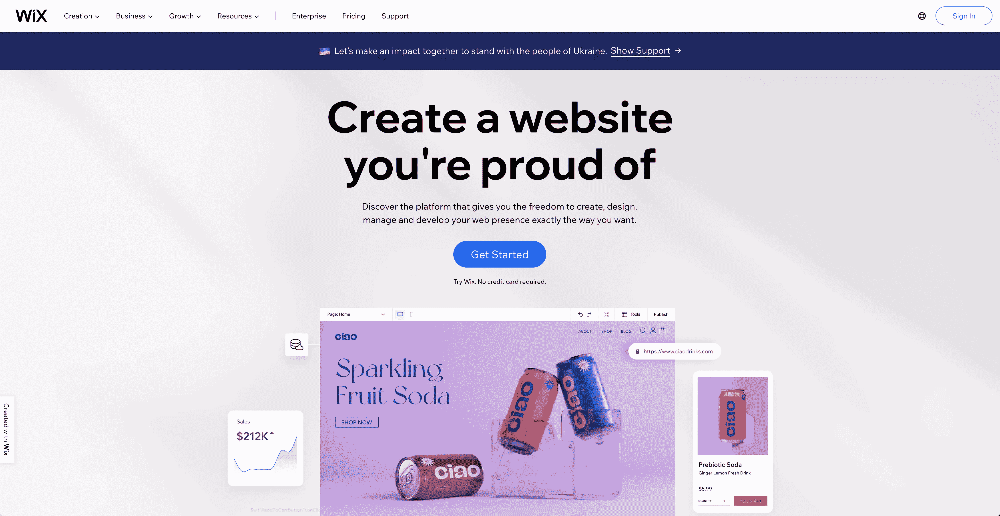](https://wixstats.com/?a=65839&oc=33&c=124&s1=)

Wix 在最好的网站建设者和无代码工具中独树一帜。它将自己标榜为“免费网站建设者”。当其他网站倾向于基于订阅的模式运行时，Wix 提供了构建免费网站的选项，以及升级选项。

以这种方式定位自己，几乎消除了建立和启动自己网站的所有障碍，Wix 作为一个易于使用的平台吸引了很多关注，因为它可以几乎没有摩擦地建立和运行网站，而且全部免费。

今天有数以百万计的 Wix 网站在线，如果你正在考虑建立你的网上业务，推出一个网上商店，或者只是想创建一个你可以自豪的网站，你是一个很好的公司。

## Wix 功能

也许 Wix 最大的吸引力之一是它的特性非常丰富，可以轻松快速地创建一个网站。Wix 为所有层次的体验提供了丰富的功能，从那些从未建立过自己网站的人到专业的网站设计师。

### 设计和内容

Wix 提供了数百个专业设计的模板供选择，因此找到您正在寻找的网站设计风格或美学是非常有效的。在 Wix 编辑器中，选择一个模板并放入您自己的内容非常简单。

### 三个站点创建选项

Wix 设置了三种主要途径来构建和发布您的网站，因此，根据您的知识和舒适程度，您可以选择如何创建您的网站和内容。

你可以回答几个问题，然后让 Wix ADI(人工设计智能)接手，在大约十分钟内为你建立一个网站。通过这一过程有助于导入您的内容和照片，并帮助您选择您想要的网站布局类型。

或者，您可以浏览数百个 Wix 模板，并为您的内容选择您喜欢的设计美学。

最后，如果你有信心，并且想在没有人工智能或模板的帮助下建立自己的网站，你可以直接进入 Wix 编辑器，开始拖放元素来建立你想要的网站。

### Wix 网站的类型

Wix 平台支持多种网站类型，包括在线商店、博客和专业网站。Wix 提供了各种应用程序，您可以根据自己的喜好定制自己的站点，而不必受限于它们的模板。

### 搜索引擎优化

Wix 拥有内置的 SEO 工具，可以确保搜索引擎找到你的网站并对其进行适当的排名。你可以定制网站的任何部分来改进 SEO，包括 meta 标签、`robot.txt`文件和 URL 结构。

对于那些想深入改进 Wix 网站 SEO 的人来说，Wix 提供了一个 SEO 向导，可以为任何搜索引擎优化你的网站。

### 域名

一旦你知道了你的企业名称(或者使用你现有的企业名称)并准备好创建一个网站，你可以通过两种不同的方式用 Wix 获得域名。

你可以选择有一个 Wix 子域，你的网站将会是`sitename.wix.com`。这可能是最快的方法来启动你的网站并发布它。如果你想测试这个平台，如果你已经有了一个网站，或者如果你只是想建立一个网站来测试一个商业想法，那么使用 Wix 域是一个不错的选择。

第二种方法是向 Wix 注册一个新域名，或者从另一个注册商那里引入您自己的域名，并将该域名连接到您的 Wix 站点。拥有自己的域名有助于提高网站和业务的专业水平，这也是人们浏览网站的方式。

### Wix 应用市场

Wix 还提供了一个完整的 Wix [应用市场](https://www.wix.com/app-market)，其中充满了第三方应用，您可以连接第三方服务，并在您的网站上提供特殊功能，以进一步定制它。提供按需打印服务、活动和票务、直运和增强表单等功能的应用程序可以帮助您构建网站，让它为您完成大部分繁重的工作，而无需花费大量时间进行配置。

## 为什么要在 Wix 上建网站？

用 Wix 构建你的网站有很多令人信服的理由。例如，您可能正在建立一个在线业务，开始一个电子商务网站，希望您的网站是移动友好的，或者只是希望控制您的整个网站。

首先也是最重要的是，让你的网站建立和启动的无成本因素。大多数其他非代码工具通常需要一些月费才能使用你在他们平台上建立的任何网站。Wix 定位独特，专注于拥有一个专业网站的免费方面。

另一个令人信服的原因是你可以启动网站的速度。Wix 的人工设计智能(ADI)可以让您在回答几个问题并导入内容后，快速轻松地构建您的网站。使用 Wix ADI 意味着您可以在短短 10 分钟内建立自己的专业网站。

## 如何用 Wix 建立网站

在接下来的几节中，我们将详细介绍实际构建 Wix 站点的步骤。

### 创建帐户

Wix 使得开始使用变得非常简单，并且[创建您的 Wix 帐户](https://wixstats.com/?a=65839&oc=33&c=124&s1=)。Wix 主页顶部中央是一个**入门**按钮，它将引导您完成入职流程并创建您的新 Wix 帐户。

点击主页上的 **Get Started** 按钮后，您将完成入职流程，首先会询问您的姓名和联系信息，并使用密码保护您的帐户。

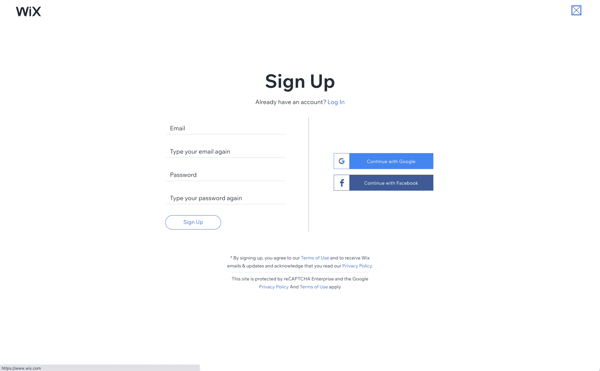

创建帐户后，Wix 会问你一系列问题，以了解如何帮助你建立专业网站。

首先，Wix 会问你正在建立什么类型的网站，比如网上商店或餐馆。接下来，它会问你想叫你的网站什么，以及你的网站目标。

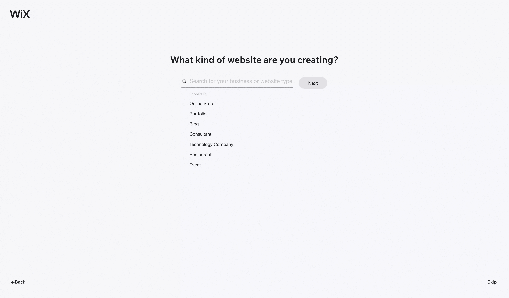

一旦你回答了关于你的站点的基本问题，Wix 将开始询问你的站点需要什么样的特性，比如聊天框、博客元素或者表单。

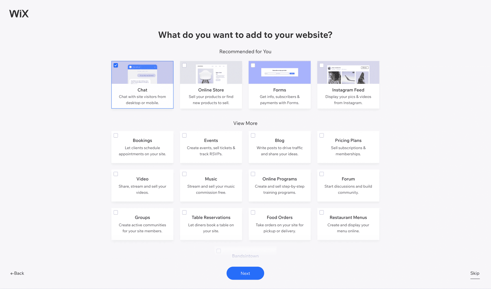

在你浏览完你网站上的功能后，Wix 会通过询问你以前是否创建过网站来询问你在网站开发方面的经验水平。这是 Wix 可以帮助引导你在建设你的网站的最佳路径上前进。

如果你表示你以前从未创建过网站，或者这方面的经验很少，Wix 会建议你要么使用 Wix ADI，要么从 Wix 提供的模板开始。如果你指出你以前已经建立了一些网站或者做得很专业，Wix 将推荐你开始使用 Wix 网站构建器或者浏览提供的许多模板。

## Wix 站点编辑器简介

Wix 站点编辑器是您编辑站点的主要方式，无论您选择哪种站点构建方式。当您在构建 Wix 网站时，熟悉 Wix 网站编辑器是关键。

无论是选择模板还是让 Wix 使用 Wix ADI 来构建您的站点，您都有可能在某个时候进入 Wix 编辑器。幸运的是，Wix 编辑器有一个相当简单易用的界面来帮助您编辑您的网站。

### 为您的网站选择模板

如果你选择先挑选一个你喜欢的模板，然后再添加你的内容，Wix 提供了广泛的预设计模板，几乎可以满足你正在寻找的任何设计美学。

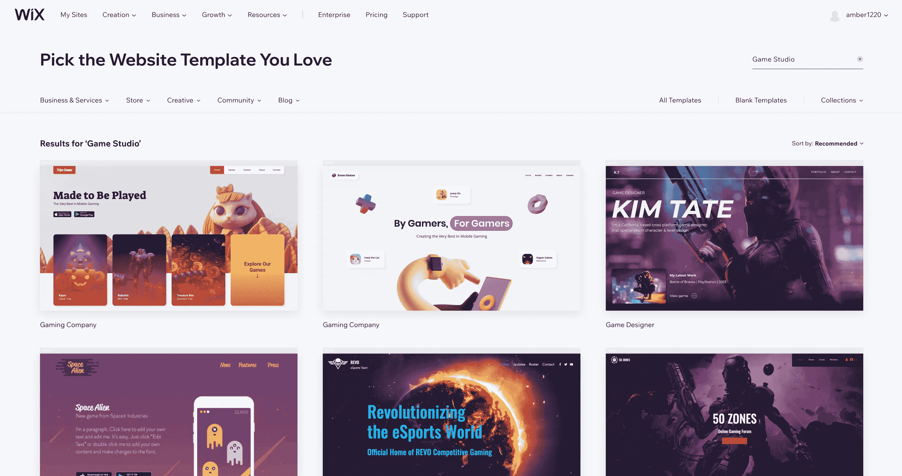

使用顶部的类别，您可以浏览 Wix 根据您要构建的站点类型提供的所有不同模板。一旦您找到一个您准备好的模板，您可以将鼠标悬停在它上面并点击 **Edit** 开始在 Wix 编辑器中编辑模板。

### 如何使用 Wix 编辑器

Wix 编辑器设计得非常直观，可以帮助您通过直观的可视化编辑器轻松编辑网站细节，如网站菜单、页面、网站的移动版本、背景图像以及与网站相关的所有内容。

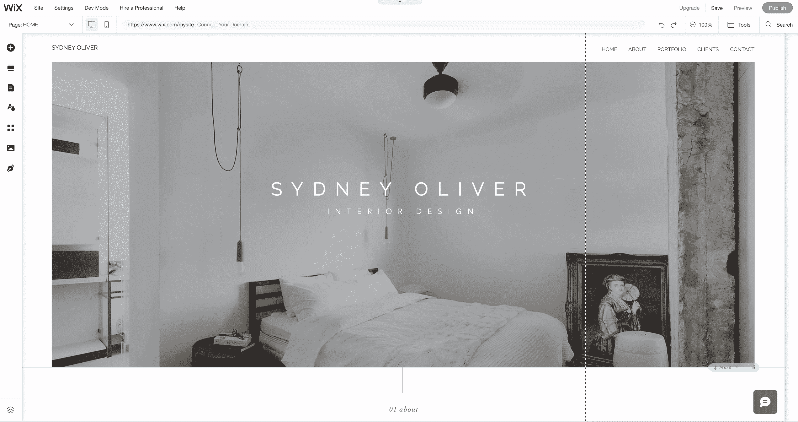

在 Wix 编辑器的左侧，您会找到编辑网站所需的主菜单。通过添加页面、部分、设计元素、应用程序(通过 Wix 应用程序市场)、菜单和媒体，您可以将鼠标悬停在左侧的图标上，找到您想要的内容。

通过顶部的菜单栏，您可以找到在 Wix 网站页面间导航的方法，在不同版本的网站间切换(例如在手机上或桌面上友好地查看您的网站)，连接自定义域名或使用 Wix 的域名，或者激活不同的工具来帮助您，例如网格线。此外，在顶部，您可以选择保存、预览和发布您的站点。

### 预览和保存您的网站

一旦您通过 Wix 编辑器设置了站点的所有页面，就可以预览和保存您的站点了。在 Wix 编辑器的右上角，有保存、预览和发布站点的选项。

当您预览您的站点时，它会在 Wix 编辑器中发生变化，显示出它在没有网格线和其他您在构建过程中可能使用的工具的帮助下将如何呈现。要退出 Wix 编辑器，点击右上角的**返回编辑器**。

### 定制您的网站

用 Wix 定制你的网站有很多不同的方法。您可以随时切换您的模板和/或使用 Wix 编辑器来编辑您的站点设计和内容。

您还可以浏览 Wix 应用市场，开始为您的网站添加特殊功能。此外，添加内容、更新图片(并利用 Wix 提供的免费图片)和/或创建博客有助于进一步定制您的网站，以满足您的需求，并为访问您网站的人提供更好的工具和信息。

### 使用 Wix 人工设计智能(ADI)

如果您是网站建设的新手，或者更喜欢现成的方法，那么 Wix ADI 可能是您的最佳选择。Wix ADI 在后台构建新网站时会询问您一系列问题，例如您是否已经有网站，或者您是否有要上传的图像和内容。

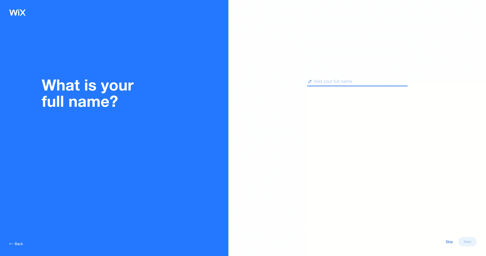

根据你提供的答案，它可以在短短 10 分钟内为你建立一个网站。对于那些觉得自己的网站需要很多帮助或者对网站设计不感兴趣的人来说，这是一个很好的选择。

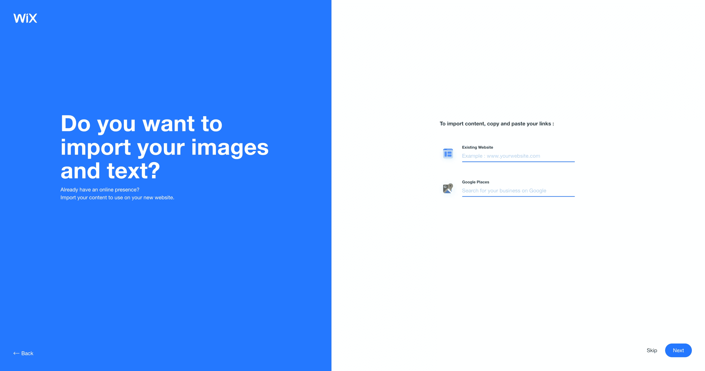

最后，Wix ADI 将要求您预览一些详细信息，如您的姓名、地址和社交媒体账户。现在填写这些细节有助于在以后的过程中节省时间。

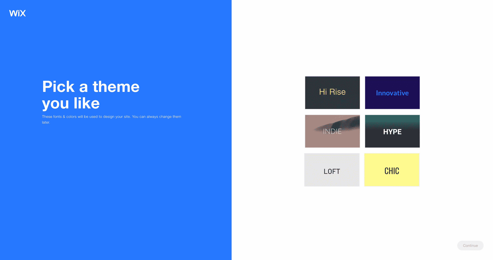

然后，Wix ADI 公司将指导您挑选一个主题，其中包含您想要的设计元素。选择主题后，ADI 会将您带到网站构建器，您可以在这里开始构建新 Wix 网站的每个页面。

当您对新 Wix 网站的外观感到满意时，您就可以发布新网站了。

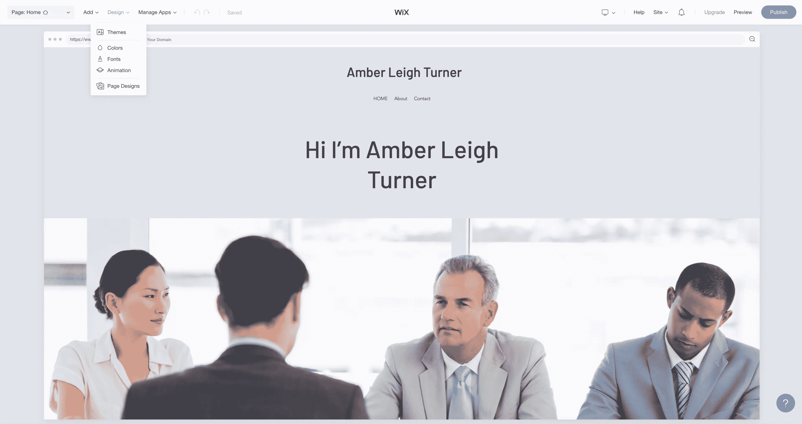

### 发布您的网站

用 Wix 发布你的网站非常简单。在 Wix 编辑器中，右上角有一个一直存在的**发布**按钮。如果你第一次点击**发布**，它会询问你是否想将一个现有的域名连接到你的新 Wix 网站，或者你是否想在 Wix 平台上免费托管它。

## 如何管理和更新您的 Wix 网站

一旦你的网站发布，保持网站的新鲜和更新是很重要的，这在 Wix 上相当简单。Wix 还提供了 Wix Mobile 编辑器，这样你就可以在手机上编辑你的网站，如果你经常通勤，或者可能需要对你的网站进行快速更改，并且你在路上，这是非常好的。

你可能想用几种不同的方式来编辑你的站点，比如添加新页面，更新你的站点菜单，或者简单地通过博客文章来更新用户。Wix 使您可以轻松更新内容，无论您是在电脑上还是在旅途中，并且只有手机可以访问您的网站。

### 使用菜单和页面

无论您是从模板开始还是让 Wix ADI 为您工作，您都可以在 Wix 编辑器中编辑菜单和页面。

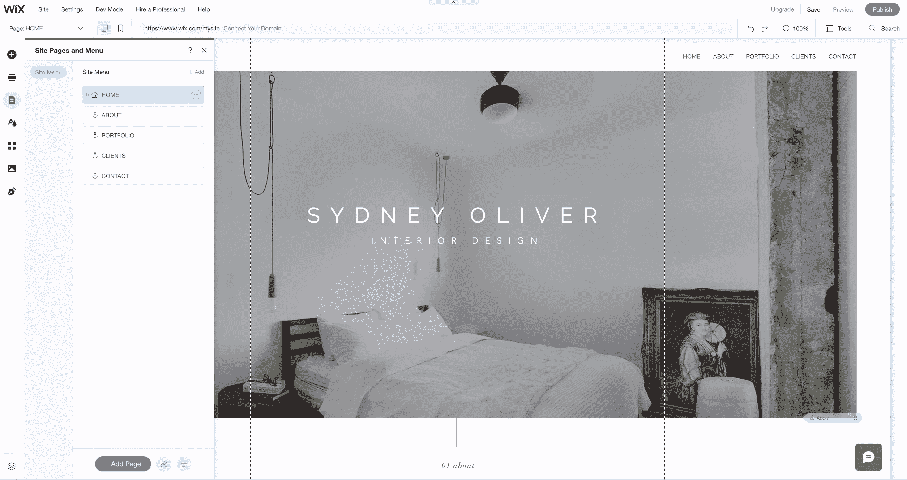

在 Wix 编辑器的左侧，您可以选择更新站点菜单和页面。点击**页面和菜单**打开您的页面和您希望菜单栏出现的顺序。从这里，您可以轻松地点击并拖动页面来影响您的站点菜单，或者您可以点击右上角的加号图标来添加一个新页面。

如果您想要将页面嵌套在其他页面下，单击、拖动并稍微移动到父页面的右下角有助于创建嵌套页面。这里的任何页面移动都会更新你的站点菜单。

### 创建博客文章

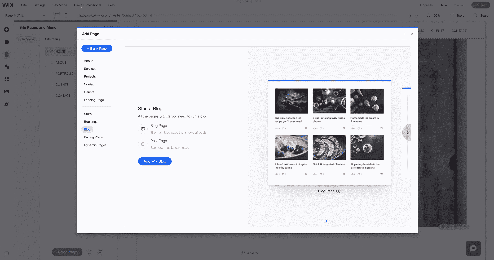

博客通常是网站上最常用的功能之一，Wix 让您能够在自己的站点上创建博客。如果你的网站上还没有博客，你可以通过进入 Wix 编辑器左侧的**页面和菜单**，点击右上角的**添加**，轻松添加一个。在这一阶段，您可以点击**博客**将博客添加到您的网站。

在 Wix 编辑器的左侧，点击**页面和菜单**来访问您站点的页面。点击**博客页面**以查看和编辑您的主博客页面和您的主博客文章页面。这将允许您自定义列出所有博客文章的主博客页面和显示每个博客文章在自己页面上的外观的博客文章页面的设计。

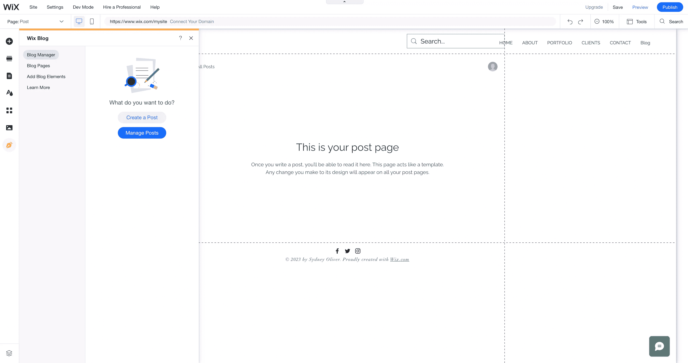

一旦你的博客建立起来，你会希望通过不时地创建新的帖子来保持它的更新。在 Wix 编辑器的左侧，点击底部的 **My Blog** ,打开发布新帖子或管理现有帖子的选项。

要创建新的博客文章，请单击**创建文章**，并在出现的新博客对话框中开始撰写文章。在编辑器的顶部，有标准的 WYSIWYG 选项，用于字体处理、对齐和列表。在博客编辑器的左侧，有一些选项，比如 SEO 特性、类别和标签，可以帮助你完善你的博客，以及你的博客需要的任何设置(主要是为了 SEO)。当你准备好发布时，点击右上角的**发布**，在你的站点上发布博文。

## 关于使用 Wix 需要注意的最后几点

在本文中，我们介绍了使用 Wix 创建专业高质量网站的基础知识。希望我们已经展示了使用 Wix 是多么容易，不管你创建网站的经验水平如何。

最后，让我们进一步讨论 Wix 的几个要点。

### 我应该免费使用 Wix，还是付费？

是的，你可以免费使用 Wix，但你也可以付费。你为什么要这么做？Wix 上的免费网站会有 Wix 广告在上面运行。为 Wix 付费可以移除这些广告，并为一系列额外功能开辟道路。这些额外的功能包括使用社交媒体图标，自定义专业域名(免费一年)，以及为您的网站提供更多存储空间。

### 该不该请开发商？

尽管任何人都可以构建自己的 Wix 站点，但是出于各种原因，您可能希望付钱给其他人来为您做这件事。你应该付多少钱？这在很大程度上取决于你需要完成的工作量和你要求的质量。平均而言，大多数 Wix 设计人员/开发人员的收费从每小时 75 美元到每小时 200 美元甚至更多。

Wix 有一个 [marketplace](https://www.wix.com/marketplace) 来帮助你寻找一个专业人士来帮助你的网站，如果你觉得你需要一个专家的帮助。在市场上，有各种各样的个人和机构以各种价位出租。

然而，除非你真的时间紧迫，否则我建议你尝试自己创建一个网站。无论你决定什么，祝你 Wix 之旅好运！

## 分享这篇文章