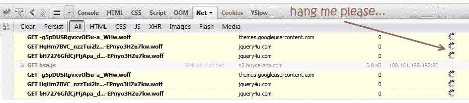
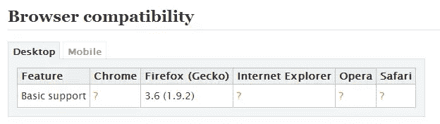
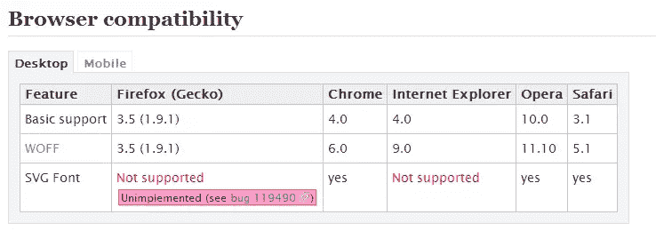
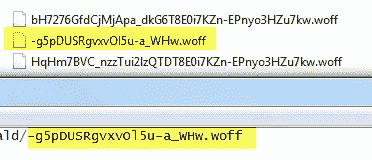

# 为什么 WOFF 字体会挂在火狐浏览器上

> 原文：<https://www.sitepoint.com/woff-fonts-hanging-firefox/>

我一直在尝试使用一种叫做 Oswald 的 WOFF 字体，并将其加载到本地，因为外部对谷歌网络字体的请求有时会很慢。它可以在 Chrome 和 IE9 上运行，但不能在 Firefox 上运行！调查开始…



有些正在流产。


## 为什么用 WOFF？

使用 WOFF 有三个主要好处:

*   字体数据是压缩的，因此使用 WOFF 的网站将比使用同等的未压缩 TrueType 或 OpenType 文件使用更少的带宽和更快的加载速度。
*   许多不愿意许可他们的 TrueType 或 OpenType 格式字体在网络上使用的字体供应商将许可 WOFF 格式字体。这提高了字体对网站设计者的可用性。
*   专有和自由软件浏览器供应商都喜欢 WOFF 格式，因此它有可能成为一种真正通用的、可互操作的 web 字体格式，而不像当前的其他字体格式。

## 这个吊怎么修！

Mozilla 有一个关于网页开放字体格式(WOFF)的页面，上面写着“这篇文章需要技术评论”我可能不得不同意这一点。



这个页面说火狐 3.6+支持 WOFF 字体。



我读到 Apache 需要通过定义一个专用的 MIME 类型来支持 woff 类型。也有部分在。过期和压缩的 htaccess。

```
AddType application/x-font-woff .woff
```

这没有帮助。

现在跳转到令人敬畏的网站 caniuse.com 与它的分析[我可以使用 WOFF 吗？](http://caniuse.com/woff)。这让我想到了 Mozilla hacks 博客上另一篇[关于 WOFF 的帖子。都说支持。这篇文章建议为那些不支持 WOFF 的浏览器指定 TTF 字体类型。](https://hacks.mozilla.org/2009/10/woff/)

```
@font-face {
  font-family: GentiumTest;
  src: url(fonts/GenR102.woff) format("woff"),
       url(fonts/GenR102.ttf) format("truetype");
}
```

[block quote class = " left "]WOFF 格式的字体是压缩的，但没有加密，这种格式不应该被那些寻求严格管理和控制字体使用的人视为“安全”格式。[/blockquote]

使用 JavaScript 加载字体似乎可行，但仍然会挂起对本地字体(在 CSS 中指定)的请求。

使用 PHP sniff 加载特定于 Firefox 的 JavaScript 是可能的，但这不是一个解决方案，因为使用@font-face 的 CSS 是相同的。

所以现在我试着加入一些。htaccess apache MIME 类型。

```
#add support for FONT TYPES
AddType application/x-font-woff .woff
AddType application/vnd.ms-fontobject .eot

 <ifmodule mod_expires.c="">Header set cache-control: public
  ExpiresActive on
  ExpiresByType font/ttf "access plus 1 year"
  ExpiresByType application/x-font-woff "access plus 1 year"
  ExpiresByType application/vnd.ms-fontobject "access plus 1 year"</ifmodule> 
```

答对了。好像 3 个都管用！然而，仍有 6 人要求悬挂 WOFF 档案。现在我认为它们可能是同一种字体的不同版本…比如粗体、细体等…



不，文件肯定在那里！

这是我的 CSS…Mozilla 到底是怎么回事？有什么想法吗？

```
@font-face {
  font-family: 'Oswald';
  font-style: normal;
  font-weight: 700;
  src: local('Oswald Bold'), local('Oswald-Bold'), url(http://jquery4u.com/wp-content/themes/jquery4u/css/fonts/oswald/bH7276GfdCjMjApa_dkG6T8E0i7KZn-EPnyo3HZu7kw.woff) format('woff');
}
@font-face {
  font-family: 'Oswald';
  font-style: normal;
  font-weight: 300;
  src: local('Oswald Light'), local('Oswald-Light'), url(http://jquery4u.com/wp-content/themes/jquery4u/css/fonts/oswald/HqHm7BVC_nzzTui2lzQTDT8E0i7KZn-EPnyo3HZu7kw.woff) format('woff');
}
@font-face {
  font-family: 'Oswald';
  font-style: normal;
  font-weight: 400;
  src: local('Oswald Regular'), local('Oswald-Regular'), url(http://jquery4u.com/wp-content/themes/jquery4u/css/fonts/oswald/-g5pDUSRgvxvOl5u-a_WHw.woff) format('woff');
}

/* custom font */
h1 {
   font-family: 'Oswald', sans-serif; 
}
```

## 分享这篇文章