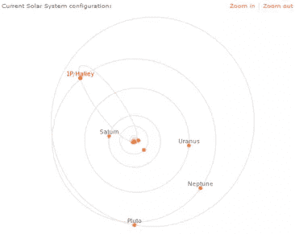
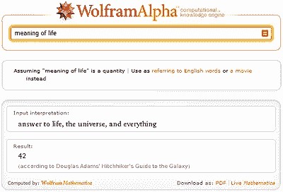

# Wolfram Alpha:帮助还是炒作？

> 原文：<https://www.sitepoint.com/wolfram-alpha-launch/>

Wolfram Alpha 是一个在网络上引起巨大猜测的名字。作为有史以来最重要的网站和谷歌杀手，[wolframalpha.com](http://www.wolframalpha.com/)在周五发起了一场巨大的营销闪电战。和往常一样，在这些备受瞩目的事件中，该网站几乎立刻就倒闭了。它又上线了，但这个周末被重新命名为“测试”发布，预计在 5 月 18 日星期一提供全面服务。

## 沃尔夫拉姆什么？

尽管名字古怪，Wolfram Alpha 是一个有趣的项目。该系统被宣传为“知识引擎”。从表面上看，它和其他搜索引擎没什么两样，但它的目标是展示智能数据，而不是指向其他网站的链接。

该项目的创始人史蒂夫·沃尔夫勒姆对计算机没有达到人们 50 年前期望的技术高峰感到沮丧。你不能问计算机一个自然语言问题，然后让它计算出答案。Wolfram Alpha 可能是实现这一目标的第一步尝试。该系统主要针对技术受众，因此它可以成为学生、研究人员、分析人员和科学家的有用资源。

## 有用吗？

虽然服务仍然有点小故障，但我确实管理了一些测试查询。解析器更喜欢简单的语言，最适合处理确凿的事实。我尝试了*“哈雷彗星下一次什么时候出现”*——那把它搞糊涂了，但是*“哈雷彗星”*返回了更好的结果。奇怪的是，“哈雷彗星”(没有撇号)提供了更多的信息*(点击放大)* …

找到合适的短语有点碰运气。搜索结果有时会提供网络上其他资源的链接，但 Wolfram Alpha 很少显示它还知道什么，或者提供一种深入数据的方法。

## 谷歌应该担心吗？

绝对不行。Wolfram Alpha 永远不会拥有谷歌搜索结果的全球号召力。它可能提供智能和准确的数据，但它不提供意见，评论，或各种信息来源。

该网站将有助于快速找到事实，并获得有吸引力的图形或图表。学生们肯定会受益，我可以看到它与维基百科一起使用。

你试过 wolframalpha.com 吗？它理解你吗？你会用吗？

## 分享这篇文章