# 建立你自己的数字世界:Numble

> 原文：<https://www.sitepoint.com/wordle-for-numbers-numble/>

在 [Wordle](https://www.nytimes.com/games/wordle/index.html) 占领了世界和我的推特之后，我和世界上的其他人一样，变得有些痴迷。我变得如此痴迷，以至于突然想到要做一个类似的应用程序，但重点是数字。两周后， [Numble](https://numble.online/) 诞生了——一个代表数字的单词。

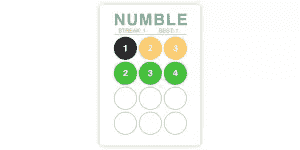

## 数字游戏的规则

这真的很简单:猜三的三位数倍数。

你有四次猜测的机会，每次猜测后，每个数字的颜色会根据它的位置以及它是否在数字中而变化。

*   绿色:数字在正确的位置。
*   黄色:数字在号码中，但在错误的位置。
*   格雷:这个数字根本不在数字里。

如果你在学校已经忘记了，判断一个数字是否是 3 的倍数的规则是，这些数字加起来是否是 3 的倍数。

比如:123 是 3 的倍数，因为 1 + 2 + 3 = 6。

## 保姆国家

为了使构建 Numble 更容易，我使用了一个名为 [Nanny State](https://github.com/daz4126/Nanny-State) 的小型库。它是由达伦·琼斯写的，如果你错过了他写的[一篇介绍它的文章](https://www.sitepoint.com/simple-state-management-nanny-state/)。它将所有应用程序数据存储在一个名为 State 的对象中，然后根据状态的变化自动重新呈现 HTML 视图。由于它的速度和效率，没有新的语法，它非常简单，容易学习。

首先，我们需要导入保姆状态并设置`State`、`View`和`Update`。

要导入它，您只需将这行代码复制到程序的第一行:

```
import { Nanny,html } from 'https://cdn.skypack.dev/nanny-state' 
```

如果你想了解更多关于你正在导入的东西，以及所有东西的结构是如何工作的，一定要看看上面的链接。接下来，我们需要创建视图:

```
const View = state => html` <h1>Numble</h1>` 
```

`View`是一个函数，它返回一个字符串，这个字符串基本上就是将在我们的页面上显示的 HTML。这是一个基本的布局，让我们开始，一旦一切就绪，标题“数字”应该会出现。它将`State`作为一个参数，允许我们访问存储在单个对象中的数据。

现在我们需要创建状态对象，这是存储任何数据的地方，但是现在它需要的唯一属性是`View`，将它们链接在一起。

```
const State = {
  View
} 
```

最后，我们需要调用`Nanny`函数。这将呈现初始视图。我们还将变量`Update`赋给返回值。这将允许我们稍后更新状态。

```
const Update = Nanny(State) 
```

您的页面应该是这样的:

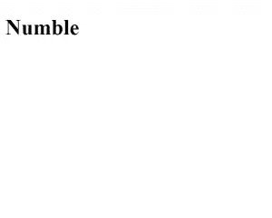

代码看起来应该是这样的:

[https://codepen.io/goldenrod/embed/KKoKJNK?height=300&default-tab=html%2Cresult&slug-hash=KKoKJNK&editable=true&user=goldenrod&name=cp_embed_1](https://codepen.io/goldenrod/embed/KKoKJNK?height=300&default-tab=html%2Cresult&slug-hash=KKoKJNK&editable=true&user=goldenrod&name=cp_embed_1)

现在保姆状态设置好了，我们可以开始制作游戏了，到最后应该是一个全功能的“猜数字”游戏。

## 每一个结束都有一个开始

在我们开始之前，还有一些事情,`View`函数的好处之一是它使用模板文字，这意味着我们可以在 HTML 本身中添加逻辑。当您想要包含基于状态的不同视图时，这非常方便。不幸的是，标准的`if`语句不起作用，取而代之的是我们需要使用三元运算符。

如果您还不熟悉，三元运算符的工作方式与 if else 语句相同:condition？如果是真的怎么办:如果是假的怎么办。简言之，用`if`换一个`?`，用`else`换一个`:`。

例如，有一天我在 Twitter 上看到了一个很棒的例子:

```
const toDo = amIHungry ? "🍰" : "😴" 
```

这相当于:

```
if (amIHungry){
    const toDo = "🍰"
}
else{
    const toDo = "😴"
} 
```

三元运算符将成为你最好的朋友，所以理解它们是如何工作的非常重要。

开始按钮是给游戏增加一些结构的好方法，尤其是像 Numble 这样的游戏，所以为了做到这一点，我们需要给`State`，`started`添加一个属性。`started`的值需要是`false`，因为我们希望用户看到的第一件事是菜单页面(现在，它将由开始按钮和标题组成)。

`State`现在应该是这样的:

```
const State = {
    started: false,
    start, finish,
    View
} 
```

这里变化最大的是`View`,我们可以使用第一个也是主要的三元运算符。

注意，它包括两个变量`start`和`finish`。这些是对我们即将编写的事件处理程序的引用。

在保姆状态下，任何事件处理程序都需要在`State`对象内部被引用。

我们基本上想要两种不同的视图:一种是用户已经开始的视图(换句话说，游戏本身)，另一种是用户还没有开始的视图(可能是菜单页面)。所以我们可以使用我们的布尔属性`started`来做这件事。

```
const View = state => html` <h1>Numble</h1>
${state.started ?
 html`<button onclick=${state.finish}>END</button>`
:
 html`<button onclick=${state.start}>START</button>`
}` 
```

正如你所看到的，标题在三元运算符之上——这意味着它在程序的两个页面上都是可见的。所以对于三元运算符，你可能已经能确切地看到它在做什么，但是如果不能，不要担心，这非常简单。

它遵循与上面蛋糕/饥饿的例子完全相同的逻辑:它检查`state.started`是否是`true`。如果是，将显示一个名为“结束”的按钮。否则，将显示一个名为“开始”的按钮。

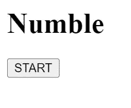

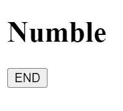

按钮本身有内联事件监听器:“开始”按钮有一个调用函数`start`的监听器,“结束”按钮有一个调用函数`finish`的监听器。显然，这些函数还不存在，这让我们开始下一项工作:创建事件处理程序。

我们将首先执行`start`函数。这非常简单，因为我们需要做的就是将`started`属性更新为`true`。代码应该如下所示:

```
const start = event => Update({started: true}) 
```

这使用了我们之前编写的`Update`函数，并更改了`State`，因此`started`的值现在是`true`。当这种情况发生时，视图将被重新呈现，显示“End”按钮作为三元运算符的结果。

你可能想自己试着写一下`finish`事件处理程序，因为它的工作方式几乎和`start`函数一样，唯一的区别是`Update`函数改变了什么。

下面是`finish`函数的样子:

```
const finish = event => Update({started: false}) 
```

太神奇了！你现在得到了世界上最无聊的游戏！

说真的，你现在可以试着按下开始和结束按钮，与你的游戏互动，即使这不是最引人入胜的体验。

同样，这里有一个代码应该是什么样子的例子:

[https://codepen.io/goldenrod/embed/XWEWORN?height=300&default-tab=html%2Cresult&slug-hash=XWEWORN&editable=true&user=goldenrod&name=cp_embed_2](https://codepen.io/goldenrod/embed/XWEWORN?height=300&default-tab=html%2Cresult&slug-hash=XWEWORN&editable=true&user=goldenrod&name=cp_embed_2)

## 步骤 2:生成随机数

我们现在可以用 Numble 最重要的一个方面让我们的游戏更刺激一点:数字本身。

这一步涉及到一点数学和逻辑，但是一旦你明白了，它真的不会太难。函数本身应该是这样的(我将在下面解释这是怎么回事):

```
const generateNumber = () => (3*Math.ceil(Math.random()*299+34)).toString() 
```

这是一个 arrow 函数，它返回一个三位数，三的倍数的字符串。

具体来看`Math.ceil(Math.random()*299+34)`，它使用`Math.random()`生成一个介于 1 和 299 之间的随机数，并使用`Math.ceil`将其向上舍入。添加 34，然后乘以 3，确保该数字是 102 到 999 之间的 3 的倍数，即 3 的 3 位数倍数，或“numble”。

最后，整个事情被包装在一个`.toString()`函数中，把它变成一个字符串。将一个数字存储为一个字符串可能看起来很奇怪，但是这将使得在游戏的后面给每个数字着色更加容易。

我们的下一个挑战是在用户每次按“开始”时显示一个数字。

最好的方法是给状态对象添加一个名为`number`的属性。然而，我们不需要在最初的`State`中这样做，我们只需要在‘开始’按钮被按下时这样做，所以在`start`事件处理程序中。

这将改变我们的`start`函数，如下所示:

```
const start = event => Update({
    started: true,
    number: generateNumber()
  }) 
```

新属性的值`number`，是我们刚刚创建的函数`generateNumber()`的返回值:随机的三位数，三的倍数。

为了显示这一点，我们需要在`View`中添加一行，特别是在当`state.started`是`true`时的 HTML 部分，使`View`看起来像这样:

```
const View = state => html` <h1>Numble</h1>
${state.started ?
 html`<div id="number">${state.number}</div>
 <button onclick=${state.finish}>END</button>`
:
 html`<button onclick=${state.start}>START</button>`
}` 
```

我们在这里所做的就是添加一个`<div>`和一个`id`的`"number"`，它显示的`state.number`是随机生成的三位数，是三的倍数。

如果您现在测试代码，您将能够在每次单击“开始”按钮时看到不同的数字，如果您将这些数字相加，您会发现这些数字是 3 的倍数！

对照我的 CodePen 演示检查你的代码。

[https://codepen.io/goldenrod/embed/MWVWLoK?height=300&default-tab=html%2Cresult&slug-hash=MWVWLoK&editable=true&user=goldenrod&name=cp_embed_3](https://codepen.io/goldenrod/embed/MWVWLoK?height=300&default-tab=html%2Cresult&slug-hash=MWVWLoK&editable=true&user=goldenrod&name=cp_embed_3)

## 步骤 3:输入和键盘

现在事情开始变得有点棘手，在我们开始之前，检查一下您是否熟悉`Array.map()`函数可能是个好主意。像三元运算符一样，在这一步和下一篇文章中，它们将成为您最好的朋友，因为 Numble 需要大量数组映射来处理状态中的数据。

如果你的技能有些生疏或者你甚至没有听说过，不要担心，它们很容易理解，你可以在这里阅读更多关于它们的内容。

这一步有三个主要部分:

*   创建虚拟键盘
*   显示用户的猜测
*   检查用户的猜测是否正确

尽管它们都是相互依赖的，但是如果你把所有的东西分解成更小的块，就更容易理解了。

首先，我们需要在`State`中添加我们将要使用的函数和另外三个属性:

```
const State = {
  started: false,
  digits: Array(10).fill("grey"),
  guess: Array(3).fill(null),
  count: 0,
  start, finish, remove, check, appear,
  View
} 
```

按照这个顺序处理它们，`digits`的值现在是一个长度为 10 的数组，每个空格都用字符串“grey”填充。这是因为我们将使用它来跟踪游戏中每个数字应该是什么颜色，数组的索引将代表 0-9 之间的每个可能的数字。

`guess`的初始值也是一个长度为 3 的数组，每个空格用`null`填充。

最后，`count`被设置为 0，这将用于记录玩家已经猜到了多少位数。

我们将映射`digits`数组来创建我们的屏幕键盘，所以我们需要给`View`添加一些东西。尽管在我们这么做之前，我们需要去掉显示`number`的`<div>`，否则这就违背了游戏的全部意义。

```
const View = state => html` <h1>Numble</h1>
${state.started ?
 html`<div id="guesses">
${state.guess.map(number => html`<div>${number}</div>`)}
</div>
<div id="keyboard">
 ${state.digits.map((digit,index) => html`<button onclick=${appear(index)}>${index}</button>`)}
 <button onclick=${remove}>DELETE</button>
 <button onclick=${check}>ENTER</button>
</div>
<button onclick=${finish}>END</button>`
:
 html`<button onclick=${start}>START</button>`
}` 
```

代替显示`number`的`<div>`，我们现在有两个`<div>`，一个有`"guesses"`的`id`，一个有`"keyboard"`的`id`。

在“guess”`<div>`中，我们有许多`.map()`函数中的第一个，它映射到长度为 3 的数组，为数组中的每一项创建一个单独的`<div>`，显示该项。这意味着在开始时，当数组中所有项的值都是`null`时，将会显示三个空格。

下面是它应该是什么样子的一个例子(用我的 CSS):

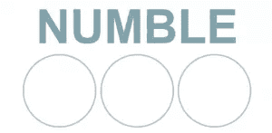

最终，当数组中每一项的值改变时，显示的内容也将随之改变。

而在‘键盘’内`<div>`我们有三样东西:

```
${state.digits.map((digit,index) => html`<button onclick=${state.appear(index)}>${index}</button>`)} 
```

这映射到长度为 10 的数组，为每个项目创建一个按钮并显示每个项目的`index`。换句话说，数字 0 到 9。每个按钮还有一个内联事件监听器，它调用事件处理程序`appear`并提供`index`作为参数。然而，我们将在稍后对此进行全面探讨。

然后，我们有两个按钮，一个叫“删除”，另一个叫“输入”。它们都有调用各自事件处理程序`remove`和`check`的内联事件监听器。同样，我们稍后将全面探讨这些问题。

首先，这是一个你的键盘看起来像什么的例子:

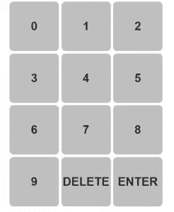

查看`appear`事件处理程序，我们希望这个函数显示玩家点击进入`guess`第一个空格的数字。

```
const appear = guess => event => {
  Update(state => ({
    guess: state.guess.map((digit,index) => index === state.count ? guess : digit),
    count: state.count + 1
  }))
} 
```

首先，这个事件处理程序和我们之前做的唯一区别就是这个函数多了一个参数`guess`。这是作为参数提供的`digits`数组的`index`。换句话说，它是玩家点击的数字。

`Update`函数看起来有点不同。这是因为它需要访问状态，所以为它提供了一个箭头函数，将旧状态映射到新状态(保姆状态将这些称为“转换函数”)

就其实际更新的内容而言，`guess`属性映射到三个`null`的原始数组，如果该项的`index`等于`count`(猜测的位置)，则`null`的值被替换为`guess`(这将是用户单击的按钮的编号)。如果`index`不等于`count`，则该项目的值保持不变:`null`。

然后它将`count`增加 1，允许用户在第二个空格中输入他们的第二个猜测。

这是用户单击几个数字后该行的外观:

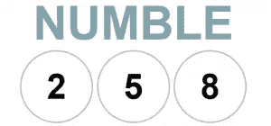

具有讽刺意味的是,`remove`事件处理程序几乎完全相同:

```
const remove = event => {
  Update(state => ({
    guess: state.guess.map((digit,index) => index === state.count - 1 ? null : digit),
    count: state.count - 1
  }))
} 
```

按照`appear`函数的逻辑，您应该能够算出这里发生了什么，但是如果没有也不用担心。它通过映射原始数组来更新`guess`，如果`index`等于之前的猜测次数(即 count–1)，它会用`null`替换该项的值，从而有效地删除猜测。

这一次，它将`count`减 1，允许用户继续猜测。

只需使用`check`功能。

“输入”按钮的事件处理程序称为`check`，我们希望它(意外地)检查用户的猜测是否正确，但我们也希望它重置猜测，以便用户可以再试一次。

该函数如下所示:

```
const check = event => {
  Update(state => {
    const numble = state.guess.join("") === state.number
    return {
      feedback: numble ? "NUMBLE!" : "Wrong!",
      guess: Array(3).fill(null),
      count: 0
    }
  })
} 
```

像以前一样，`Update`使用了一个 transformer 函数，并将`state`作为一个参数，让我们可以直接访问状态中保存的所有应用程序数据。然后它创建一个名为`numble`的布尔常量。它可能看起来不像，但`state.guess.join("") === state.number`实际上是一个条件(检查用户的猜测是否等于我们生成的数字)，如果它满足这个条件，`numble`的值将是`true`，如果不满足，它将是`false`。

然后，它返回状态的三个更新属性:

*   `feedback`获取我们刚刚创建的布尔值，如果它是`true`,它将该值设置为字符串“NUMBLE！”如果是`false`，它将把值设置为字符串“错误！”
*   `guess`变回用`null`填充的长度为 3 的数组。这将有效地重置用户的猜测，允许他们再次猜测
*   `count`也被重置为 0，这意味着程序可以像从头开始一样工作。

我们的最后一步是在`View`中放一些 HTML，这样就可以显示反馈。

一个很好的放置位置是在猜测的下方和键盘的上方。所以，你的最终`View`应该是这样的:

```
const View = state => html` <h1>Numble</h1>
${state.started ?
 html`<div id="guesses">
${state.guess.map(number => html`<div>${number}</div>`)}
</div>
<p id="feedback">${state.feedback}</p>
<div id="keyboard">
${state.digits.map((digit,index) => html`<button onclick=${state.appear(index)}>${index}</button>`)}
  <button onclick=${state.remove}>DELETE</button>
  <button onclick=${state.check}>ENTER</button>
</div>
 <button onclick=${state.finish}>END</button>`
:
 html`<button onclick=${state.start}>START</button>`
}` 
```

如果你愿意，你可以使用`feedback`在游戏开始时设置一条消息，例如在`start`事件处理程序中，你可以添加一个带有字符串值的`feedback`属性(“猜 3 位数”):

```
const start = event => {
  Update({
    started: true,
    number: generateNumber(),
    feedback: "Guess 3 digits"
  })
} 
```

就是这样！你现在有一个全功能的猜数字游戏！

在阅读第二篇文章之前，有一些关于 CSS 和 bug 的注意事项。

如果你想添加你自己的 CSS，那很好，但是如果你只想专注于代码，你可以从最终的 CodePen 演示中复制我的 CSS。

[https://codepen.io/goldenrod/embed/xxWxBYm?height=300&default-tab=html%2Cresult&slug-hash=xxWxBYm&editable=true&user=goldenrod&name=cp_embed_4](https://codepen.io/goldenrod/embed/xxWxBYm?height=300&default-tab=html%2Cresult&slug-hash=xxWxBYm&editable=true&user=goldenrod&name=cp_embed_4)

如果你是一个优秀的程序员，你可能会发现这里的一些错误，例如，如果用户在猜到三位数之前就点击了“回车”该怎么办？如果你开始玩它，你肯定能注意到更多。

它们一点也不难修复，您只需要在适当的时候满足几个条件。例如，为了解决三位数之前的检查问题，在`check`函数中，您可以编写:

```
const check = event => {
  Update(state => {
    const numble = state.guess.join("") === state.number
    return state.count < 3 ? {
      feedback: "too short"
    }
    :
    {
      feedback: numble ? "NUMBLE!" : "Wrong!",
      guess: Array(3).fill(null),
      count: 0
    } 
  })
} 
```

这只是检查猜测的次数是否小于 3，并相应地返回具有不同值的不同属性。

我们现在有了一个全功能的“猜数字”游戏，接下来我们将使它更像完整的数字。

## 四次猜测

我们的第一项工作是允许用户猜 4 次。在 Wordle 中，一个 5 个字母的单词可以猜 6 次，所以对于 Numble，我们将允许一个 3 位数的数字猜 4 次。

为此，我们必须移除`guess`属性，并向`State`对象添加两个属性:

```
const State = {
  started: false,
  digits: Array(10).fill("grey"),
  guesses: Array(4).fill(Array(3).fill(null)),
  guessCount: 0,
  count: 0,
  start, finish, check, appear, remove,
  View
} 
```

如您所见，我们现在有了一个`guesses`属性来代替之前的`guess`。`guesses`的值是一个 2D 数组，有 4 个数组，每个长度为 3，用`null`填充。如果你不熟悉`Array.fill()`函数，这是创建一个数组的捷径，意味着我们不必写出完整的数组。

4 个嵌套数组中的每一个都代表用户将做出的 4 个猜测中的一个。例如，如果第一次猜测是 123，`guesses`数组将如下所示:

```
[[1,2,3], [null, null, null], [null, null, null], [null, null, null]] 
```

每当用户做出一个猜测，这个数组将被更新以匹配他们的猜测，有效地记录他们在游戏中做出的所有猜测。

此外，我们有一个值为 0 的属性`guessCount`。虽然类似于`count`属性，但它将允许我们跟踪用户猜测的次数。

该图将帮助您形象化并完全理解对`count`和`guessCount`属性的需求:

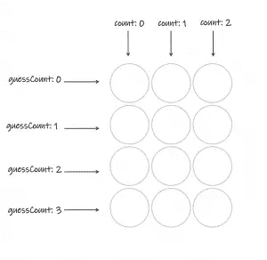

如您所见，`guessCount`是存储猜测的嵌套数组的索引，`count`是每个猜测的每个数字的索引。

现在我们需要对`View`函数做一些修改:

```
const View = state => html` <h1>Numble</h1>
${state.started ?
 html`<div id="guesses">
${state.guesses.map((guess, i) => html`<div class="row">${guess.map((number,j)=> html`<div class="grey">${number}</div>`)}</div>`)}
</div>
<p id="feedback">${state.feedback}</p>
<div id="keyboard">
${state.digits.map((digit,index) => html`<button onclick=${state.appear(index)}>${index}</button>`)}
  <button onclick=${state.remove}>DELETE</button>
  <button onclick=${state.check}>ENTER</button>
</div>
 <button onclick=${state.finish}>END</button>`
:
 html`<button onclick=${state.start}>START</button>`
}` 
```

这与我们之前创建的`View`几乎相同，但是 id 为‘guess’的 div 已经改变。事实上，我们现在使用一个 2D 数组来显示像网格一样的 4 个猜测，我们将需要一个嵌套的地图。

编码提示:当使用嵌套映射时，对于每个映射的索引，我们将使用`i`作为第一个映射，使用`j`作为第二个映射。你可以用任何你认为对你来说最容易的，只要它们不一样！

第一个地图将每个猜测循环为网格的一行。然后，第二个映射循环遍历该猜测的每个数字，并显示相关的 HTML 以显示已被猜测的数字或一个空圆圈。有了这个，你的屏幕应该是这样的:

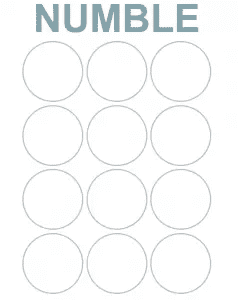

这种新布局意味着我们还必须改变`appear`和`remove`功能。这是相对简单的，但同样需要一个双地图。

```
const appear = guess => event => {
  Update(state => ({
    guesses:  state.guesses.map((array,i) => i === state.guessCount ? array.map((digit,j) => j === state.count ? guess : digit) : array) ,
  count: state.count + 1 
  }))
} 
```

我们在这里更新了`guesses`属性，这就是拥有两个不同的`count`属性变得非常有用的地方。

第一个映射检查要更改哪一行:如果数组的索引与用户的猜测相匹配，则可以进行第二个映射，否则保持值不变。

第二个地图执行与我们在第二篇文章中创建的`appear`完全相同的逻辑。

就像之前一样，`remove`函数的工作方式几乎相同。

```
const remove = event => {
  Update(state => ({
    guesses: state.guesses.map((array,i) => i === state.guessCount ? array.map((digit,j)=> j === state.count - 1 ? null : digit) : array),
    count: state.count - 1
  }))
} 
```

这里的第一个映射也只是识别用户正在进行的猜测，第二个映射遵循与我们最初的`remove`函数相同的逻辑。

然而,`count`属性递减，以确保用户可以重新猜测。

最后，我们需要对`check`函数进行一些修改。这是用户每次提交猜测时运行的函数。

```
const check = event => {
  Update(state => {
    const numble = state.guesses[state.guessCount].join("") === state.number
    return {
      feedback: numble ? "NUMBLE!" : state.guessCount < 3 ? "Keep going..." : `Nope! It was ${state.number}`,
      guessCount: state.guessCount + 1,
      count: 0
    }
  })
} 
```

这里只改变了两件事，而且都在返回的对象中。属性增加了一些逻辑，使应用程序更具动态性。反馈现在将显示一条消息，让用户知道他们进展如何。

在这种情况下，我们有:如果`numble`是`true`，换句话说，如果用户的猜测是正确的，反馈变成“NUMBLE”；如果`numble`是`false`，检查猜测是否少于三个(这实质上是检查用户是否已经做出了最后的猜测)。如果是，反馈是“继续下去……”，否则是“不！那是(答案)”。

第一部分到此为止！你可以在下面的 CodePen 演示中看到完整的代码。

[https://codepen.io/goldenrod/embed/QWQRWLZ?height=300&default-tab=html%2Cresult&slug-hash=QWQRWLZ&editable=true&user=goldenrod&name=cp_embed_1](https://codepen.io/goldenrod/embed/QWQRWLZ?height=300&default-tab=html%2Cresult&slug-hash=QWQRWLZ&editable=true&user=goldenrod&name=cp_embed_1)

## 颜色逻辑

正如文章开头所概述的，颜色是 Wordle 的主要焦点，因此也是 Numble 的焦点。如果你还没有玩过 [Numble](https://numble.online/) 或 [Wordle](https://www.nytimes.com/games/wordle/index.html) 会强烈建议你去玩，以便正确理解颜色的工作方式。

这是 Numble 使用的着色系统的示例:

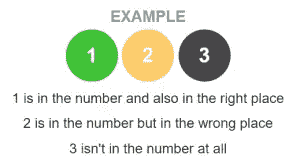

在用户做出猜测后，颜色在两个地方更新:实际的猜测和键盘上。两者的逻辑完全相同，因此我们可以创建一个名为`getColors`的箭头函数，它将猜测值和实际数字作为参数。

```
const getColors = (guess,number) => guess.map((digit,index) => number.includes(digit) ? digit.toString() === number[index] ? "green" : "yellow": "black") 
```

我们映射“guess”数组并使用“String.includes(item)”方法，首先检查答案是否包含猜测的数字。如果是，那么我们检查数字是否在正确的位置。如果是，则颜色被指定为“绿色”。如果没有，颜色为“黄色”。否则，该数字根本不在答案中，因此颜色为“黑色”。

这个箭头函数应该返回一个数组，其中有三个项目，分别是“绿色”、“黄色”或“黑色”，对应于“猜测”中的每个数字。

例如，如果我们使用`getColors([1,2,3], "327")`调用函数，那么我们应该返回的数组是`["black", "green", "yellow"]`

你可能注意到我们不得不把数字转换成一个字符串。这是因为我们需要将它与存储为字符串的答案进行比较，如果两个元素属于不同的类型，就不能对它们进行比较。你可以尝试，但是要准备好进入一个 JavaScript 类型的强制痛苦的世界。

注意:Wordle 处理重复的方式不同，所以如果你想让这个变得更难，你可以试着模仿 Wordle 的方法。

对于下一部分，我们不需要对`State`做任何修改或添加任何东西，但是`View`确实变得有点复杂。正如在第一篇文章中简要提到的，我们将使用 CSS 类来允许我们改变颜色。

```
const View = state => html` <h1>Numble</h1>
${state.started ?
 html`<div id="guesses">
${state.guesses.map((guess, i) => html`<div class="row">${guess.map((number,j)=> html`<div class=${state.guessCount > i ? getColors(guess,state.number)[j] : "grey"}">${number}</div>`)}</div>`)}
</div>
<p id="feedback">${state.feedback}</p>
<div id="keyboard">
${state.digits.map((digit,index) => html`<button class=${digit} onclick=${state.appear(index)}>${index}</button>`)}
  <button onclick=${state.remove}>DELETE</button>
  <button onclick=${state.check}>ENTER</button>
</div>
 <button onclick=${state.finish}>END</button>`
:
 html`<button onclick=${state.start}>START</button>`
}` 
```

如您所见，仅有两处发生了变化，即键盘按钮和每一行的单个部分的 CSS 类。

从“guess”div 开始，我们有以下逻辑:

```
state.guessCount > i ? getColors(guess,state.number)[j] : "grey" 
```

首先检查`guessCount`是否高于索引，这是为了确保每次页面被重新渲染时，所有先前的猜测都被重新着色。如果需要一种颜色，我们调用`getColors`函数，将用户的猜测和答案作为参数，并获取每个数字索引处的项目，`j`。

下面是用户猜完一次后你的屏幕应该是什么样子:

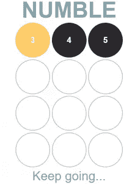

来自`getColors`函数的数组是:

```
["yellow", "black", "black"] 
```

因此，用户现在将知道 3 在数字中但在错误的位置，4 和 5 根本不在数字中。

键盘逻辑要简单得多，但它仍然使用我们之前编写的相同的`getColor`函数。还记得之前我们是如何用“灰色”填充`digits`数组的吗？这就是我们这么做的原因。

当键盘被绘制在屏幕上时，这个类就是键在`digits`数组中的索引值。稍后，我们将介绍如何改变颜色，但是使用上面的例子，在第一次猜测之后,`digits`数组应该是这样的:

```
["grey", "grey", "grey", "yellow", "black", "black", "grey", "grey", "grey", "grey"] 
```

我们就快到了！我们最后的工作是改变`check`函数。

```
const check = event => {
  Update(state => {
    const guess = state.guesses[state.guessCount]
    const numble = guess.join`` === state.number
    const colors = getColors(guess,state.number)
    return {
      feedback: numble ? "NUMBLE!" : state.guessCount < 3 ? "Keep going..." : `Nope! It was ${state.number}`,
      digits: state.digits.map((colour,digit) => guess.includes(digit) ? colors[guess.indexOf(digit)] : colour),
      guessCount: state.guessCount + 1,
      count: 0
    }
  })
} 
```

在`Update`函数中，还有两个常量。这只是使返回对象中的逻辑变得容易。

我们有`guess`，它是用户刚刚猜到的三个数字的数组(因此使用了`state.guessCount`)。我们也有以前的`numble`，但是这次使用我们刚刚创建的`guess`常量。这有助于代码更加清晰，避免重复。最后，我们有`colors`,它是当使用用户当前的猜测和答案运行`getColors`函数时返回的数组。

这将更新数字数组，并确保键盘上的数字在每次猜测后都正确着色。

现在，返回对象与上面的相同，但是我们也更新了`digits`属性。

```
state.digits.map((color,digit) => guess.includes(digit) ? colors[guess.indexOf(digit)] : color) 
```

这是我们最后的映射函数！它主要检查键盘上的数字(即`digit`)是否在猜测中。如果是当前颜色，应该用从`getColors`函数生成的颜色替换，否则颜色应该保持不变。

使用与上面相同的猜测，我们可以看到键盘应该是什么样子:

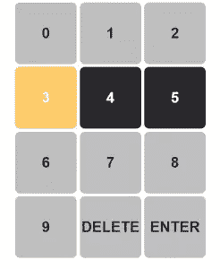

就是这样！Numble 的全功能版本！

同样，完整的代码应该是这样的:

[https://codepen.io/goldenrod/embed/XWZwWyN?height=300&default-tab=html%2Cresult&slug-hash=XWZwWyN&editable=true&user=goldenrod&name=cp_embed_2](https://codepen.io/goldenrod/embed/XWZwWyN?height=300&default-tab=html%2Cresult&slug-hash=XWZwWyN&editable=true&user=goldenrod&name=cp_embed_2)

在 Numble 的实际版本中，我添加了一些功能，只是为了让游戏更加动态。如果你想挑战自己，增加一些额外的功能，这里有一些来自我的 Numble 最终版本的建议:

*   再玩一次——允许用户想玩多少次就玩多少次，或者每天只进行一次挑战
*   streak——记录你一行中有多少个正确答案
*   最佳连胜——用户保持的最长连胜
*   黑暗模式——更像是一个 css 挑战，但也很有趣
*   显示统计数据——每场游戏用户猜了多少次的分类
*   分享功能–让用户分享他们的最佳记录

我真的希望你和我一样在做 Numble 的时候玩得开心！

## 分享这篇文章