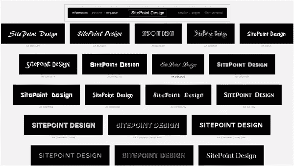
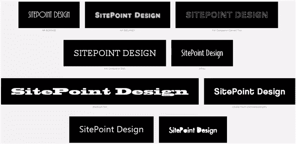

# 它可以帮助你选择字体

> 原文：<https://www.sitepoint.com/wordmark-it-helps-you-pick-your-fonts/>

如果你是一个字体爱好者，你可能会从浏览你电脑上的大量字体中得到极大的乐趣。现在有这么多可用的字体，很容易随意下载(官方图形设计术语)并用字体填满一个驱动器。当然，这样做的问题是，当你需要的时候，很难找到合适的。无论你使用的是 Photoshop、Illustrator 还是 Microsoft Word，在你的电脑上尝试每种字体都会非常耗时。这就是 [Wordmark.it](http://wordmark.it/) 成为你的设计资源工具包的一部分的原因。

这是一个免费的网络应用程序，它可以扫描你的电脑，并使用你电脑上安装的字体显示你选择的文本。文本显示在一个可视的网格中，这样可以很容易地看到文本在任何特定字体下的外观。这款应用由自由职业视觉传达设计师 fah ri zkaramanl 开发。他开发了这个应用程序来帮助自己的设计过程，“在开始寻找新字体之前，快速预览我电脑上安装的字体的文字标记。”它也是一个非常有用的工具。

它是如何工作的？

使用这个应用程序真是再简单不过了。在屏幕的顶部，您键入一些示例文本。按下回车键，应用程序会自动关闭并找到你电脑上的所有字体，并显示一个预览网格。

您可以将文本反过来，看看是黑底白字更好看，还是白底黑字更好看。你也可以增加和减少字体大小，而另一个非常好的功能是能够选择一些预览，并相互比较。

最终，为你的标志、网站或印刷项目选择合适的字体取决于你，设计师，但 Wordmark 至少可以大大加快这个过程。

你使用过 Wordmark.it 或任何你会推荐给设计师的类似应用吗？

## 分享这篇文章