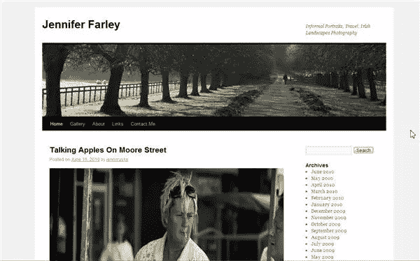

# WordPress 3.0 提升了游戏

> 原文：<https://www.sitepoint.com/wordpress-3-0-ups-the-game/>

在平台上工作的许多志愿者六个月的辛勤工作之后，WordPress 版本。(又名 Thelonious”)现在[可以下载](http://wordpress.org/download/)或者如果你已经是 WordPress 用户的话可以通过仪表盘升级。WordPress 是最受欢迎的博客应用之一，随着新版本的发布，开源社区增加了更多的内容管理工具。

升级中最大的变化之一是多站点功能，这将允许用户在多个网站上使用一个 WordPress 安装。用户可以通过手动编辑 wp-config.php 文件来启用多站点功能，但仅限于向安装了 WordPress 3 的站点的主域提供站点地址。用户必须在使用子域或子目录之间进行选择，这意味着您网络中的每个附加站点都将被创建为一个新的虚拟子域或子目录，除非您重新配置您的安装，否则您无法对此进行更改。

*   子域名——比如 site1.example.com 和 site2.example.com
*   子目录—如 example.com/site1 和 example.com/site2

**新的默认主题设计**

此次升级还有一个新的社区开发的默认主题，名为 Twenty Ten。直到版本 2.9.2，默认主题是 Kubrick 主题，Twenty Ten 主题现在是 WordPress 发行版中唯一的主题。Twenty Ten 旨在展示一些基于主题的新功能。主题设计者和开发者有了新的 API，允许他们实现自定义背景、标题、短链接、菜单(没有文件编辑)、文章类型和分类。

其他新功能包括一次升级多个插件的省时能力和一个新的自定义帖子类型。根据 WordPress Codex Help 的说法，“自定义帖子类型允许用户轻松创建和管理诸如投资组合、项目、视频库、播客、报价、聊天以及用户或开发者可以想象的任何东西。”

WordPress 用户你已经升级到第三版了吗？

## 分享这篇文章