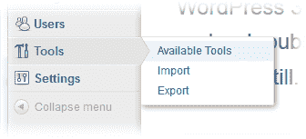
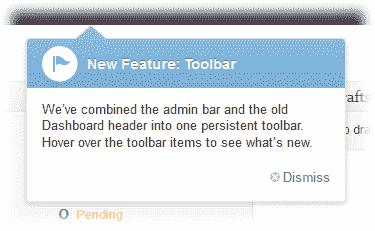

# WordPress 3.3 的新功能

> 原文：<https://www.sitepoint.com/wordpress-33-whats-new/>

*这篇文章已经过时了，[点击](https://www.sitepoint.com/whats-new-in-wordpress-4-6/)查看 WordPress 4.6 的新功能。*

[WordPress 3.3](http://wordpress.org/) 已经发布。世界上最受欢迎的 CMS 和博客工具已经被进一步整理和完善，使网络发布更加容易。自 3.0 版发布以来，它已经被下载了 6500 万次，估计运行在所有网站的 15%(或所有新网站的 22%)。

现有用户可以通过单击进行升级。我很少遇到这样的问题，但这仍然让我紧张。继续之前，请备份您的文件和数据库。

让我们看看 WordPress 3.3 提供了什么好东西…

## 改进的界面

HTML5 响应式设计技术已经实现，以帮助 WordPress 在平板电脑等小屏幕设备上工作。当您缩小屏幕尺寸时，侧边菜单等功能会自动折叠。

如果你手指疼痛，3.3 版新的弹出子菜单可以让你通过点击进入任何管理界面。

(之前可选的)管理栏和标题被合并成一个工具栏。它节省空间，不那么突兀，并提供快速访问帮助，评论快速添加链接和您的个人资料。也就是说，我怀疑它可能会导致一些插件的兼容性问题——这绝对是一个您应该在上线之前测试的特性。

最后，WordPress 通过第一次看到的指针帮助你发现新功能:

## 拖放媒体上传

假设你已经有了一个不错的 HTML5 浏览器，你再也不需要使用笨重的“浏览文件”对话框了。可以将一个或多个图像或其他媒体拖入媒体上传框。

此外，现在所有媒体都有一个上传面板，无论您想添加什么类型的文件。WordPress 也支持 RAR 和 7z 存档格式。

## 新 Tumblr 导入程序

WordPress 现在可以直接从 Tumblr 导入内容。Tumblog 帖子可以转换成匹配的 WordPress 帖子格式。

## 更好的合作

如果你曾经收到过*“警告:Bob 目前正在编辑这篇文章”*的消息，你会很高兴听到共同编辑活动滞后应该成为过去的事情。

## 还有更多…

3.3 版还提供:

*   全新安装的全新仪表板欢迎屏幕
*   新的更新后变更日志屏幕
*   更灵活、更快速的永久链接
*   编辑器 API 的全面改进
*   一个新的用于管理面板的 WP_Screen API
*   一个新的`is_main_query()`用于确定你是否在主循环中

## 是时候升级了？

很少有人会遇到问题，但他们不可避免地会遇到新的软件版本。如果你的整个业务都依赖于 WordPress，让其他人发现问题并等待 3.3.1 版本可能是明智的。如果过去的经验是可靠的，那将在几周内可用。

你升级到 WordPress 3.3 了吗？这是有史以来最好的版本还是你的安装爆炸了？

从 wordpress.org/download 下载 WordPress 3.3

## 分享这篇文章