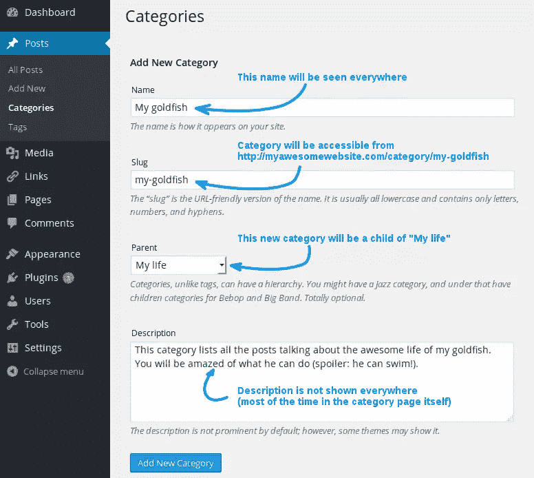
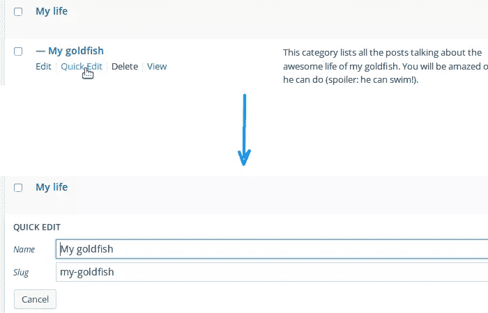
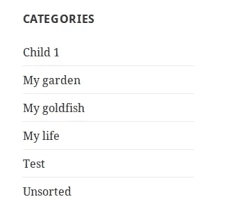
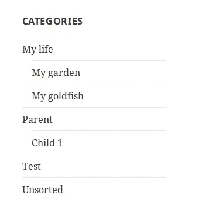
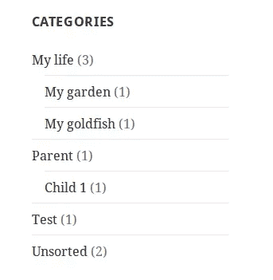
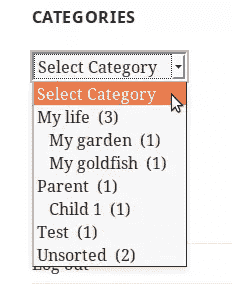

# WordPress 类别解释

> 原文：<https://www.sitepoint.com/wordpress-categories-explained/>

如果你有很多帖子，将 WordPress 的帖子组织成不同的类别是很重要的。这样，你的访客(和你！)可以很容易地搜索和排序你的文章，只看到他们想要的。

在这篇文章中，我们将看看如何管理 WordPress 类别。我们将从添加、编辑或删除类别的一些基本内容的描述开始。

然后，我们将看看如何显示我们的类别列表，以及如何使用 WordPress 提供的默认小部件定制这个列表。

## 管理类别

WordPress 为我们提供了一个管理类别的专用页面，可以在管理面板的菜单中找到。更准确地说，这个页面可以从“文章”子菜单访问，并被命名为“类别”。

### 添加类别的两种方法

如果您访问这个页面，您可以在左侧看到一个名为“添加新类别”的表单。这个表单中的第一个字段被标为“Name ”,顾名思义，这个名称将出现在你在网站上显示文章类别或类别列表的任何地方。其他字段的用途不一定很明显。

首先是“鼻涕虫”。正如该字段下面所描述的，当您激活 URL 重写以使您的网站页面具有可读的 URL 时，该字符串非常有用。例如，让我们假设你在“类别库”永久链接设置中设置了“类别”(从设置->永久链接菜单)。然后，如果你将“我的生活”输入到你的新类别的 slug 中，访问者可以通过使用 URL `http://example.com/category/my-life`访问列出该类别中所有帖子的页面。

请注意，由于这个字符串是在 URL 中使用的，所以必须遵守一些规则，但实际上你可以指明你想要的任何内容，因为 WordPress 会自动清理你的字符串，使其“URL 友好”。

就在这个字段之后，我们找到一个标记为“Parent”的列表。此列表允许您选择一个现有类别作为新类别的父类别。这样，你可以建立自己的层次结构，当你有几个类别时，这是一件好事。例如，如果您添加了“我的生活”类别，并且如果您想将关于您的金鱼的精彩生活的帖子放在一个类别中，那么您可以创建以“我的生活”为父类别的“我的金鱼”类别。就像你电脑上的目录和子目录一样。

最后，您可以在最后一个字段中输入您的类别的描述。不是所有的主题都使用这个字段，所以在花时间填写之前，请确定你的主题使用了这个字段。

最后，我们可以注意到还有另外一种添加类别的方法:当你写一篇新文章时(或者当你编辑一篇现有文章时)。事实上，当你选择你的文章所在的类别时，你可以找到一个“添加新类别”的链接，它允许你通过简单地指出它的名称和父类别(如果需要的话)来添加一个新的类别。然后，slug 将成为其干净的名称，其描述将为空。但是，您仍然可以编辑该类别，并在以后进行更改。

### 编辑类别

总是可以编辑一个类别，更新它的信息。编辑一个类别可以在同一个页面上完成，在“文章”菜单的“类别”子菜单中。

您将在该页面的右侧看到您的类别列表，类似于相应页面中的帖子列表。通过单击类别名称，您将被重定向到另一个包含表单的页面，该页面已经预先填充了当前信息。你所要做的就是修改你想要的类别，完成后提交表单。

如果你只想改变一个类别的名称或标签，你也可以选择当你的鼠标在一个类别上时出现的“快速编辑”选项。

### 删除类别

在“快速编辑”选项的右边，我们找到了“删除”选项。如果你想删除一个类别，点击这个链接，确认你的选择，你就完成了。您也可以选择您想要删除的所有类别，然后在“批量操作”列表中选择“删除”。请注意:删除类别不是一个可以撤销的操作。

请注意，删除类别不会删除使用该类别的帖子。如果这些帖子使用其他类别，被删除的类别将会从他们使用的类别列表中消失。如果他们不使用任何其他类别，那么他们将属于默认类别，名为“未分类”。注意这就是这个类别不能删除的原因(但是你还是可以编辑的)。

## 显示类别的小部件

至于[链接管理器](https://www.sitepoint.com/wordpress-links-manager/ "Mastering the WordPress Links Manager")，WordPress 为我们提供了一个默认的小部件，在主题中我们想要的任何地方显示我们的类别列表。让我们通过从“外观”菜单访问小部件管理器来测试它。

这个小部件简单地命名为“Categories ”,它允许我们用四种设置定制它的显示。默认情况下，这个小部件的标题设置为“类别”，但是您可以通过在“标题”字段中输入您选择的标题来更改它。

其他三个设置是复选框，允许您自定义类别列表。请注意，无论您在这些选项中选择什么，都只会显示至少包含一篇文章的类别(如果我们忘记了下面解释的“父效应”)。

为了解释“父效应”，我们从最后一个选项开始:“显示层次”。如果你设置了一些类别作为其他类别的父母，这个选项是有用的(见上面你的生活和你的金鱼的光荣例子)。正如你所猜测的，通过激活这个选项，WordPress 将显示你的类别的精确层次结构。

如果没有此选项，所有类别都显示在一列中，它们之间没有任何关系。

激活此选项后，将显示带有嵌套列表的层次结构。

当你激活这个选项时，你必须考虑一个效果:父母被显示，即使他们本身不包含任何帖子。举个例子，上面两张截图是用同样的配置，同样的帖子和类别拍摄的。“父”类别本身不包含任何文章，但其子类别包含，所以 WordPress 在列表中显示它，以显示层次结构。这是一个预期的效果，但看看它是如何工作的总是一件好事。

第二个选项，标签为“显示文章数量”，相对清晰:它在括号之间添加了每个类别中包含的文章数量。

请再次注意“父效应”:父类别显示其所有子类别计数的总和。

最后，第一个选项:“显示为下拉列表”，它允许您将类别列表显示为下拉列表。如果您有很多类别，这个选项特别有用。你的访问者必须打开列表，选择他们想看的类别。然后，WordPress 会自动将他们重定向到正确的页面。

请注意，这个选项与其他两个选项兼容:层级和文章计数仍然可以显示在下拉列表中。

## 最后

类别对于组织你的网站很重要。现在我们已经看到了如何添加、编辑和删除一个类别，你没有理由不对你的文章进行排序！

如果知道如何管理类别很重要，作为一名开发人员，最重要的部分来自于这个问题:如何检索这些类别？如何列出它们？如何显示一个特定类别的信息？

这个问题的答案可以在使用 WordPress Categories API 中找到，这是一个将一些功能组合在一起的 API，这些功能可以做我们刚刚列出的事情。好消息是类别 API 是我们下一篇文章的主题！

## 分享这篇文章