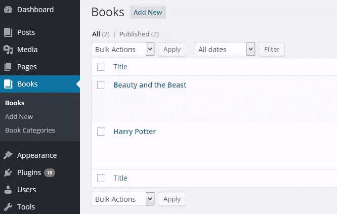
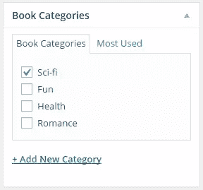

# WordPress 自定义帖子类型——通知和分类

> 原文：<https://www.sitepoint.com/wordpress-custom-post-types-notices-taxonomies/>

在我之前的文章中，我介绍了自定义文章类型(CPT)以及如何为你的 WordPress 网站创建一个。

我们还看了如何定制一个定制文章类型的各种 UI 标签，使其与本地的*文章*和*页面*文章类型截然不同。然而，我们没有介绍如何定制由它们生成的管理通知。

在本教程中，我将介绍如何定制这些通知，以及如何为定制的帖子类型注册新的分类法。

## 自定义 CPT 管理通知

你熟悉显示在管理页面顶部的警告信息吗？例如，当一篇文章被保存为草稿，发布，甚至当你保存一个插件的设置时？该消息被称为**管理通知**。

默认情况下，处理自定义帖子时显示的管理通知假定您正在处理一个`post`帖子类型，因此，当例如一个`book`帖子类型被更新时，会显示以下通知:`Post updated. View post`。

您可以像这样使用`post_updated_messages`挂钩来轻松更改这些消息的文本:

```
add_filter( 'post_updated_messages', 'book_cpt_messages' );

/**
 * Book CPT updates messages.
 *
 * @param array $messages Existing post update messages.
 *
 * @return array Amended book CPT notices
 */
function book_cpt_messages( $messages ) {
    $post             = get_post();
    $post_type        = get_post_type( $post );
    $post_type_object = get_post_type_object( $post_type );

    $messages['book'] = array(
        0  => '', // Unused. Messages start at index 1.
        1  => __( 'Book updated.', 'textdomain' ),
        2  => __( 'Custom field updated.', 'textdomain' ),
        3  => __( 'Custom field deleted.', 'textdomain' ),
        4  => __( 'Book updated.', 'textdomain' ),
        5  => isset( $_GET['revision'] ) ? sprintf( __( 'Book restored to revision from %s', 'textdomain' ), wp_post_revision_title( (int) $_GET['revision'], false ) ) : false,
        6  => __( 'Book published.', 'textdomain' ),
        7  => __( 'Book saved.', 'textdomain' ),
        8  => __( 'Book submitted.', 'textdomain' ),
        9  => sprintf(
            __( 'Book scheduled for: <strong>%1$s</strong>.', 'textdomain' ),
            date_i18n( __( 'M j, Y @ G:i', 'textdomain' ), strtotime( $post->post_date ) )
        ),
        10 => __( 'Book draft updated.', 'textdomain' )
    );

    if ( $post_type_object->publicly_queryable ) {
        $permalink = get_permalink( $post->ID );

        $view_link = sprintf( ' <a href="%s">%s</a>', esc_url( $permalink ), __( 'View book', 'textdomain' ) );
        $messages[ $post_type ][1] .= $view_link;
        $messages[ $post_type ][6] .= $view_link;
        $messages[ $post_type ][9] .= $view_link;

        $preview_permalink = add_query_arg( 'preview', 'true', $permalink );
        $preview_link      = sprintf( ' <a target="_blank" href="%s">%s</a>', esc_url( $preview_permalink ), __( 'Preview book', 'textdomain' ) );
        $messages[ $post_type ][8] .= $preview_link;
        $messages[ $post_type ][10] .= $preview_link;
    }

    return $messages;
} 
```

**代码解释:**上面的代码定制由`book`定制帖子类型生成的管理通知。

`$messages`多维数组控制任何帖子类型显示的管理员通知。

为了定制一个`book`定制文章类型的消息，创建一个包含各种消息的索引数组作为`$messages['book']`的值。

`if`语句检查定制的 post 类型是否可公开查询。即在[注册自定义帖子类型](https://www.sitepoint.com/definitive-guide-to-wordpress-custom-post-types/)时，是否将`public`参数设置为`true`。

如果为真，则在更新、发布或计划发布帖子时，查看属于 CPT 的帖子的链接会添加到显示的管理通知中，而在提交帖子进行审核或更新草稿时，会添加预览帖子的链接。

## 自定义分类法

在 WordPress 中，分类法是对任何类型的文章进行分组的机制。

分类法的例子包括用于对与给定类别相关的帖子进行分组的`Category`和与类别非常相似但形式更自由的`Tag`。关于[分类法的更多信息可以在 WordPress Codex](https://codex.wordpress.org/Taxonomies) 获得。

也就是说，我们将讨论如何创建定制分类法。让我们以创建一个`book`文章类型为例，使用与博客文章相同的类别对书籍条目进行分类并不理想。

一个真实的例子是 [Easy Digital Downloads](https://wordpress.org/plugins/easy-digital-downloads/) 插件，它使用`download`自定义文章类型作为数字产品条目，使用`download_category`分类法作为产品分类。

要创建一个自定义分类，使用`register_taxonomy()`函数并将其与`init`动作挂钩，如下所示:

```
add_action( 'init', 'book_category_taxonomy' );

function book_category_taxonomy() {
    register_taxonomy(
        'book_category',
        'book',
        array(
            'label'        => __( 'Book Categories' ),
            'rewrite'      => array( 'slug' => 'book_category' ),
            'hierarchical' => true,
        )
    );
} 
```

如果你已经有了一个`book`自定义文章类型，你应该会看到类别分类被添加到管理菜单和文章编辑屏幕。





您还可以使用`register_post_type()`来注册定制的文章类型，`register_taxonomy()`函数也接受一组参数来定制标签和定制分类的配置。

我不会解释这些论点，因为它们与`register_post_type()`的论点非常相似。在这里有一个参数和描述的列表。

## 结论

自定义帖子类型是 WordPress 的一个强大功能，在将不适合`post`和`page`类型的数据或帖子条目分组时非常有用。锦上添花的是，通过注册一个自定义分类，可以进一步对**自定义帖子类型**的帖子进行分类。

你有问题或意见吗？请通过评论让我们知道。

## 分享这篇文章