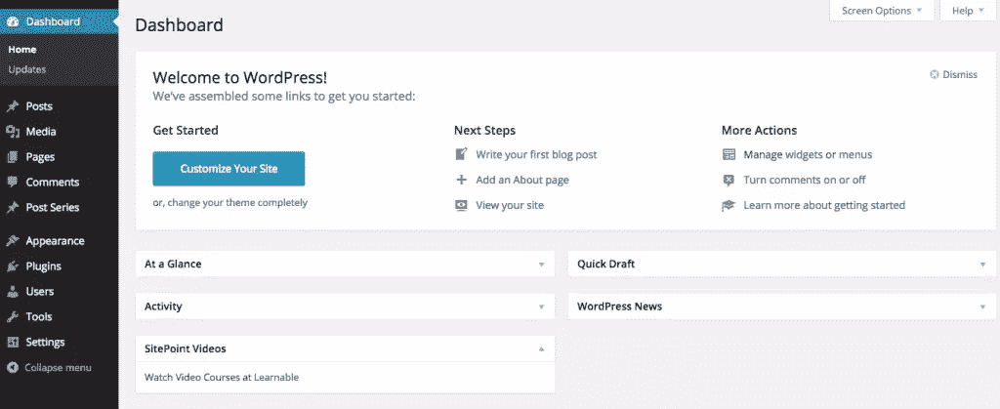
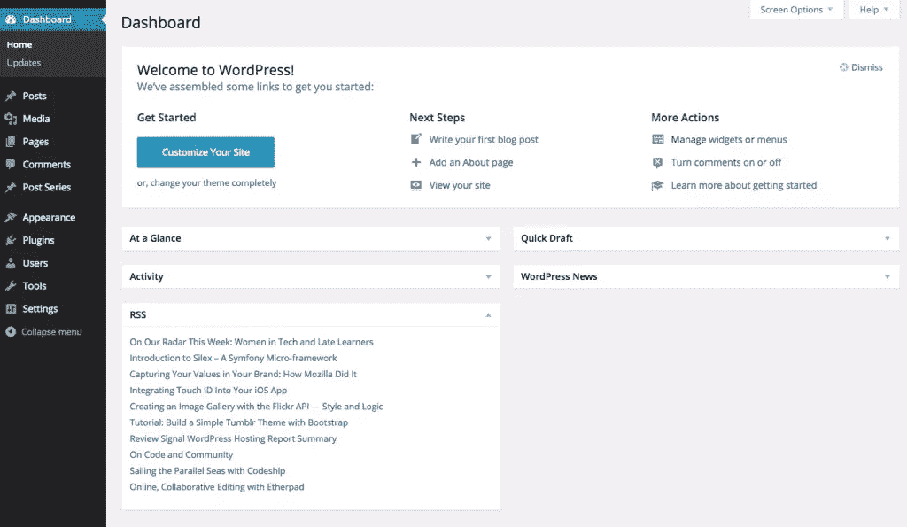

# WordPress 仪表盘小部件 API 简介

> 原文：<https://www.sitepoint.com/wordpress-dashboard-widgets-api/>

WordPress Dashboard Widgets API 允许主题和插件添加、删除或重新放置 WordPress Dashboard Widgets。当我们登录到 WordPress 管理界面时，首先看到的是 WordPress 仪表盘。从 WordPress 2.7 开始，WordPress Dashboard Widget API 已经可用。

在本教程中，我们将看看 API 提供的不同动作和功能。以及如何使用这个 API 添加、删除和定位仪表板小部件。

## WordPress Dashboard 窗口小部件的幕后

在内部，WordPress dashboard 窗口小部件是 [WordPress 元框](https://www.sitepoint.com/adding-custom-meta-boxes-to-wordpress/)。仪表板小部件 API 使用 WordPress meta box API 来添加、删除和定位仪表板小部件。

## 添加仪表板小部件

我们可以使用`wp_add_dashboard_widget`函数向 WordPress 仪表盘添加一个小部件。我们需要将这个函数包装在`wp_dashboard_setup`钩子中。

下面是一些关于如何使用`wp_add_dashboard_widget`的示例代码:

```
function add_dashboard_widget()
{
wp_add_dashboard_widget("sitepoint", "SitePoint Videos", "display_sitepoint_dashboard_widget");
}

function display_sitepoint_dashboard_widget()
{
echo "Watch Video Courses at <a href='http://learnable.com'>Learnable</a>";
}

add_action("wp_dashboard_setup", "add_dashboard_widget");
```

这里，我们在`add_dashboard_widget`内部调用`wp_add_dashboard_widget`，它是由`wp_dashboard_setup`钩子触发的。

`wp_add_dashboard_widget`需要三个参数。以下是论点:

1.  **$id** :每个仪表板小部件必须有一个唯一的 id。确保你用你的插件或者主题名称作为前缀，以避免覆盖。
2.  **$title** :要显示的小工具的标题。
3.  **$callback** :显示小部件内容的回调。

以下是小部件的外观:



## 移除仪表板小部件

我们可以使用`remove_meta_box`函数移除默认或定制的仪表板小部件。我们需要将这个函数包装在`wp_dashboard_setup`函数中。

下面是我们如何使用`remove_meta_box`:

```
function remove_dashboard_widget()
{
remove_meta_box("sitepoint", "dashboard", "normal");
}

add_action("wp_dashboard_setup", "remove_dashboard_widget");
```

这里，我们在`remove_dashboard_widget`函数中调用`remove_meta_box`函数，它实际上是由`wp_dashboard_setup`动作触发的。

`remove_meta_box`需要三个论证，它们是:

1.  **$id** :小工具的唯一 id。下面是默认窗口小部件的 id 列表: *dashboard_activity* ， *dashboard_right_now* ，*dashboard _ recent _ comments*， *dashboard_recent_drafts* ， *dashboard_primary* ， *dashboard_quick_press* ， *dashboard_secondary* ， *dashboard_primary* 和*dashboard _ incoming _ links*
2.  **$location** :在移除一个仪表板时，它的值总是“仪表板”。
3.  **$position** :如果你正在移除一个由 WordPress core 默认创建的或者使用`wp_add_dashboard_widget`创建的小部件，那么它的值是“正常”。

## 在仪表板中定位小部件

默认情况下，新的小部件被添加到仪表板页面的左下方。WordPress Dashboard Widgets API 没有提供改变小部件位置的方法。然而，我们可以破解 WordPress core `$wp_meta_box`变量作为解决方法。

下面是一个如何将小部件移动到顶部的例子:

```
function add_dashboard_widget()
{
wp_add_dashboard_widget("sitepoint", "SitePoint Videos", "display_sitepoint_dashboard_widget");

global $wp_meta_boxes;

// Get reference to the list of dashboard widgets
$dashboard_widgets = $wp_meta_boxes["dashboard"]["normal"]["core"];

//Create a backup of the dashboard widgets list
$dashboard_widgets_backup = array("sitepoint" => $dashboard_widgets["example_dashboard_widget"] );

//remove our widget from the end
unset($dashboard_widgets["example_dashboard_widget"]);

//Merge the backedup and original arrays
$sorted_dashboard = array_merge($dashboard_widgets_backup, $dashboard_widgets);

//save the new sorted widgets array
$wp_meta_boxes["dashboard"]["normal"]["core"] = $sorted_dashboard;
}

function display_sitepoint_dashboard_widget()
{
echo "Watch Video Courses at <a href='http://learnable.com'>Learnable</a>";
}

add_action("wp_dashboard_setup", "add_dashboard_widget");
```

您可以改变这个数组，并根据需要更改小部件的位置。

## 在仪表板小部件中显示 RSS 提要

让我们创建一个仪表板小部件，它检索 SitePoint 的 RSS 提要，然后显示它。我们将使用 WordPress 的 API 来获取和解析 RSS 提要。

下面是我们的小部件的代码:

```
function add_dashboard_widget()
{
wp_add_dashboard_widget("rss-feed", "RSS", "display_rss_dashboard_widget");
}

function display_rss_dashboard_widget()
{

include_once( ABSPATH . WPINC . "/feed.php");

$rss = fetch_feed("https://www.sitepoint.com/feed/");
$maxitems = $rss->get_item_quantity(10);
$rss_items = $rss->get_items(0, $maxitems);

?>

<ul>
<?php
if($maxitems == 0)
{
echo "<li>No items</li>";
}
else
{
foreach($rss_items as $item)
{
?>
<li>
<a href="<?php echo esc_url($item->get_permalink()); ?>">
<?php echo esc_html($item->get_title()); ?>
</a>
</li>
<?php
}
}
?>
</ul>

<?php
}

add_action("wp_dashboard_setup", "add_dashboard_widget");
```

这里，我们包含了文件“feed.php ”,它公开了在 WordPress 中使用 RSS 所需的所有 API。然后，我们使用`fetch_feed`下载并解析 RSS 提要，最后我们显示 10 个 RSS 条目。

下面是我们的 RSS 仪表板小部件的外观:



## 结论

许多 WordPress 插件，如分析、WooCommerce 插件和各种监控扩展都使用 Dashboard Widgets API。WordPress Dashboard Widgets API 对于 WordPress 开发者来说是最重要的 API 之一，在这个例子中，我们已经向你展示了一些基本的例子。请随意评论您对以下 API 的体验。

## 分享这篇文章