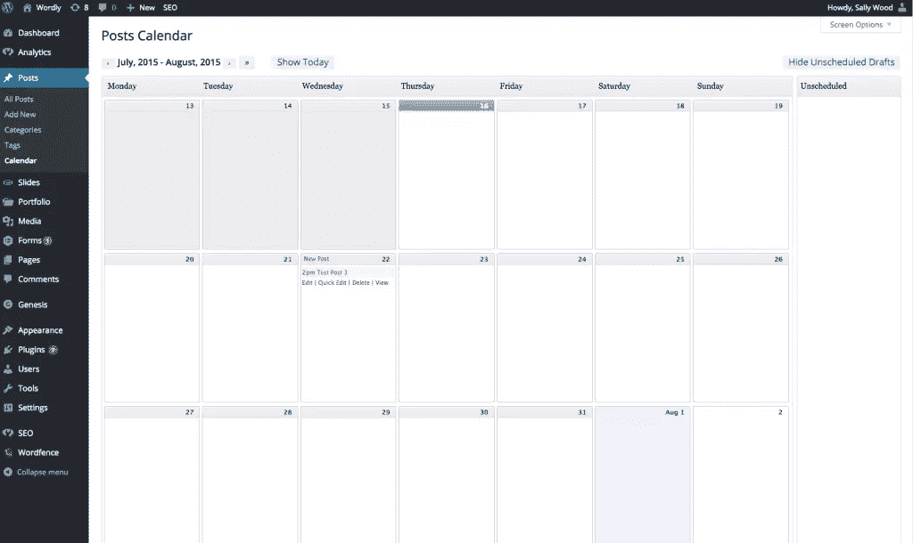
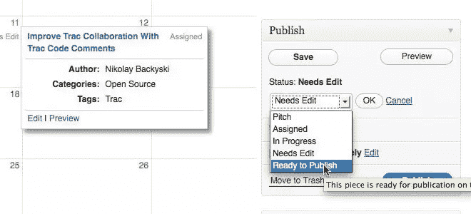
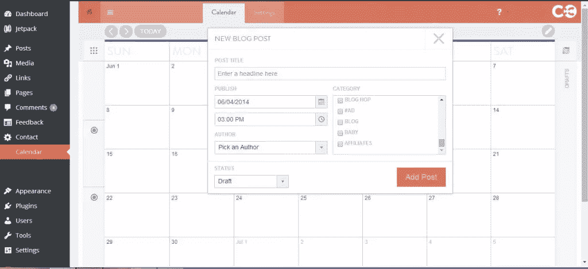

# 选择正确的 WordPress 编辑日历插件

> 原文：<https://www.sitepoint.com/wordpress-editorial-calendar-plugins/>

## 什么是编辑日历？

编辑日历是战略性博客的基础。它能让你提前计划，如果实施得当，在吸引你的观众和扩大你的用户群方面会有惊人的进步。

## 你真的需要吗？

实际上，归根结底，编辑日历只不过是一个时间表。把它想象成一个计划，或者一个时间表，或者一个博客文章的程序。你可以用它来规划你下个月的博客帖子可能会是什么样子。它可以帮助你确定你需要写什么，你需要写多少，以及你的编辑计划中的漏洞或空白可能在哪里。

使用编辑日历可以让您:

*   磨练你的前瞻性规划:你一眼就能看出你应该写些什么，以及你的差距可能在哪里。这可以让你轻松地在日记中安排写作时间。
*   避开写作瓶颈:我不知道你怎么想，但对我来说，写作最难的部分往往是想出一个相关的、有意义的、吸引人的话题。如果你已经坐下来，做了这件事，提前写好你的编辑日历，那么到了写作的时候，你可以做的就是:写作。
*   **深入研究**:创建一个编辑日历让你后退一步，从更全面的角度来看待你的博客。它让你把你的内容作为一个整体来考虑，而不是独立的、分割的、单独的帖子。它允许你分阶段地接近一个主题，构建一系列的文章来更深入地覆盖一个特定的主题；最终，它允许你为你的读者提供更多的价值。
*   **利用 SEO 的好处**:与其随意挑选一个话题，匆匆写一篇文章来跟上你的周/日/月发帖时间表，不如创建一个编辑日历，让你慢下来，选择更多深思熟虑的话题来写。关键词研究应该在任何编辑计划过程中扮演重要角色。在你的博客标题、标题、文案和元描述中使用人们正在搜索的关键词。

## WordPress 编辑日历插件

### [编辑日历](https://wordpress.org/plugins/editorial-calendar/)

拥有超过 50，000 个活跃安装，编辑日历是最受欢迎的编辑日历 WordPress 插件。这个插件是用 JavaScript 编写的，它通过联系你的博客(当它滚动时)来整理关于你的文章的数据——它的工作方式和谷歌地图一样。

它允许您:

*   在一个面板中查看您的所有预定帖子，以及这些帖子预定的日期和时间。它为你的预定帖子提供了一个非常有用的整体鸟瞰图。
*   使用拖放功能来更改发布日期。因此，只需轻轻一点鼠标，你就可以将整篇文章从一个日期移到另一个日期。
*   访问帖子内容、标题和预定时间的“快速编辑”功能。
*   手动发布帖子和管理草稿帖子。
*   快速方便地查看您的每个帖子的状态。在屏幕的右边甚至有一栏显示任何已起草但尚未安排的帖子。
*   管理由多个作者(或 WordPress 用户)安排的帖子，如果你管理一个大型的编辑或内容营销团队，这可能特别方便。

编辑日历插件的一个非常棒的特性是，你可以根据用户权限级别设置不同的功能。用于:

*   管理员和编辑可以使用日历的所有功能。
*   作者可以发布、编辑和重新安排自己的帖子，但其他人的帖子仍然完全被锁定。
*   投稿人可以保存草稿并移动他们自己的帖子。
*   订阅者甚至可以看到日历。

尽管编辑日历插件有一些限制。当前版本只支持帖子，不支持页面。并且不能用于移动或编辑已经发布的帖子；它没有追溯功能。

### [编辑流程](https://wordpress.org/plugins/edit-flow/)

当[编辑日历](https://wordpress.org/plugins/editorial-calendar/)非常适合小团队或个人用户时，[编辑流](http://editflow.org/)应该是拥有无数成员的大型编辑部的首选插件。

编辑流程使编辑团队在 WordPress 内协作变得容易，提供了如下功能:

*   **日历**:这个特性的工作方式与编辑日历插件本身非常相似。它可以按月或按周查看您的所有内容。您可以使用拖放功能来移动和重新安排未发布的帖子，甚至可以按状态、类别、用户或帖子类型过滤未发布的帖子。
*   **自定义状态**:您可以为您的帖子设置自定义状态，这是延长编辑周期和同行评审流程的团队的完美选择。开箱即用，WordPress 只有“草稿”、“待审核”和“已发布”。“编辑流”插件允许您根据自己的工作流程设置任意多的流。你可能有“进行中”、“同行评审”、“最终编辑”等等。您可以拖放这些状态的顺序，并根据您的工作流程在日历中进行筛选。
*   编辑评论:这一功能将大大减少你的收件箱超载。它允许作者和编辑在你的 WordPress 网站的管理区域内进行线程评论(看起来有点像普通博客文章末尾的评论)。
*   编辑元数据(Editorial Metadata):类似于简报表格，它允许你记录关于你的博客文章的所有重要信息:草稿何时到期、预期字数、主题概述、联系方式等等。您可以设置哪些字段将显示在哪些帖子上。
*   **通知**:设置与您参与的编辑内容相关的电子邮件通知。例如，如果你写了一篇博客，你可以设置一个通知，这样你就知道你的编辑什么时候留下了反馈。
*   **用户组**:将你的网站用户分成特定的组，按职位或部门分类。然后，只要一次点击，您就可以在帖子状态改变或编辑审核完成时向整个用户组发送电子邮件。

此外，编辑流插件背后的智能 cookies 已经编写了它，使它具有模块化的架构，并且有几十个钩子和过滤器可用。这意味着，在 HTML 的帮助下，你可以以任何你想要的方式修改插件。

### [按今天制定的协同日程](https://wordpress.org/plugins/coschedule-by-todaymade/)

好的。所以这个插件相当独特。根据它的 WordPress 插件目录列表，这是第一个也是唯一一个 WordPress 社交媒体编辑日历。那满嘴是什么意思？嗯，这意味着你不仅可以快速轻松地安排你的帖子，还可以从同一个拖放式日历中更新你的社交媒体。

基本上，你可以随心所欲地起草和排列尽可能多的社交媒体更新，这些更新会在你的博客文章发表后立即自动发布。此外，如果你决定更改帖子的发布日期(使用拖放日历)，那么你所有的社交媒体更新都会随之改变。该插件集成了所有主要的社交媒体平台，包括 Twitter、脸书、LinkedIn、Google+、Buffer 和 Tmblr。

此外，CoSchedule 还提供了编辑日历和编辑流中内置的所有功能，包括拖放日历和团队协作功能，例如向特定用户分配特定任务的能力，以及评论。

请看他们的视频，了解更深入的解释:

[https://www.youtube.com/embed/iwVtxem_A1A?feature=oembed](https://www.youtube.com/embed/iwVtxem_A1A?feature=oembed)

CoSchedule 的工作方式与大多数 WordPress 插件略有不同。考虑到它提供的所有额外功能，每月都有费用。你需要在[约定的时间](http://coschedule.com/)注册一个账户。这将要求您选择一个他们的付费月计划，范围从每月 17 美元(最多 15 个用户和 25 个社交简档)到每月 299 美元(最多 80 个用户和 100 个社交简档)。一旦完成，你就可以将你的 WordPress 网站连接到你的 CoSchedule 账户，这样你就可以访问编辑日历、社交媒体日程安排和所有的团队功能。

## 结论

归根结底，没有一个最好的 WordPress 编辑日历插件。

最好的插件将是最适合您的需求和您的业务需求的插件。如果你是一个人创业，那么[编辑日历](https://wordpress.org/plugins/editorial-calendar/)可能足以满足你的博客或内容营销需求。如果你正在管理一个大型的编辑团队，那么一个更注重协作和团队合作的插件，比如[编辑流](https://wordpress.org/plugins/edit-flow/)可能是一条不错的路。或者，如果你有更多的预算，想要一个一体化的编辑日历和社交媒体管理系统，并内置协作功能， [CoSchedule by Todaymade](https://wordpress.org/plugins/coschedule-by-todaymade/) 可能会成为你的梦想。

## 分享这篇文章