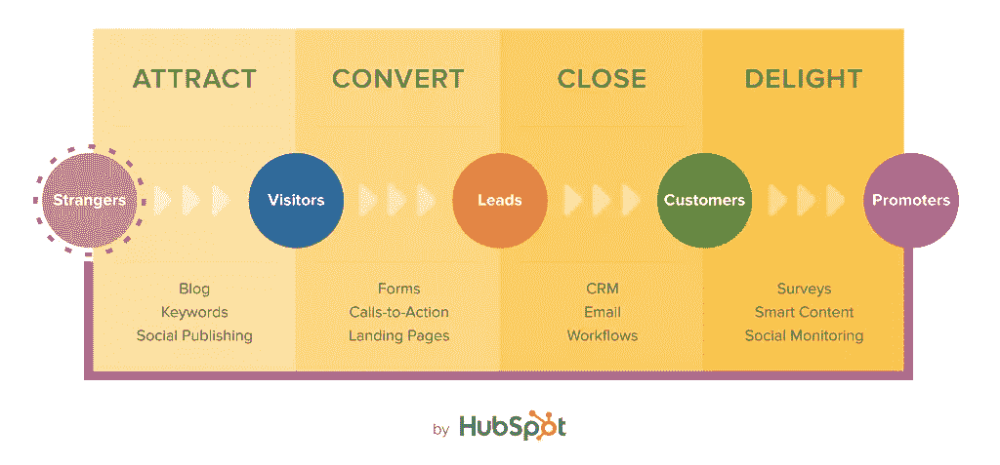
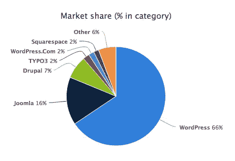
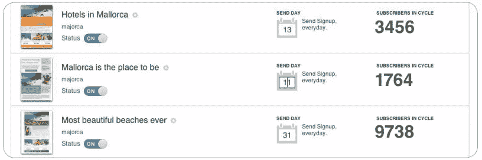

# 把你的 WordPress 站点变成一台电子邮件营销机器

> 原文：<https://www.sitepoint.com/wordpress-email-marketing/>

有了超过 35，000 个可用的插件，你几乎可以用 WordPress 做任何事情。

对于许多网站建设者来说，最终目标是达到尽可能多的观众。电子邮件列表是扩大受众的关键，在这篇文章中，我将向你展示如何将你的 WordPress 网站变成一台电子邮件营销机器。

*贷方:http://www.hubspot.com/inbound-marketing*

2003 年春天发布的 WordPress 已经成为世界领先的内容管理系统。今天， [WordPress 每秒钟产生大约 17 个新发布的页面，每月产生 147 亿的浏览量。它是商业网站的首选平台，](http://torquemag.io/13-surprising-wordpress-statistics/) [22%的注册域名](https://managewp.com/14-surprising-statistics-about-wordpress-usage)安装了 CMS。

*贷方:https://wappalyzer.com/categories/cms*

营销成功取决于你接触最有可能从你的产品中受益的潜在客户的能力，因此你可以向他们介绍你的方法，并逐渐建立信任，直到他们愿意与你做生意。

今天的消费者在考虑你的网站提供的产品之前通常会做大量的研究。通过优化你的网站来捕捉线索，你可以让这个过程对你的观众来说尽可能的吸引人和流畅。

随着优质插件列表的不断增长，WordPress 可以为线索捕捉量身定制。虽然有很多令人难以置信的高级选项，但在本指南中，我尽可能坚持免费选项。

另外，建立一个电子邮件营销系统不需要花一整天的时间。每个插件都可以在几分钟内下载、安装和配置。

## 1.吸引流量

线索捕捉始于为你的网站带来流量。

今天，有两个主要来源，任何人都可以用来产生流量。

1.  搜索引擎
2.  社交网络
    谷歌和其他搜索引擎是一个强大的受众获取渠道。当你的内容得到适当的优化后，你的网站就会出现在相关的搜索结果中。为了确保你的网站得到适当的优化，一个好的开始是安装由 Yoast 开发的 [WordPress SEO 插件](https://yoast.com/wordpress/plugins/seo/)。这将有助于你优化你的页面内容，图片标题和元描述，使你更容易被搜索引擎发现。

社交网络是你的下一个目标。像 NextScripts 的[Social Networks Auto-Poster](https://wordpress.org/plugins/social-networks-auto-poster-facebook-twitter-g/)这样的插件可以让你在主要的社交网络上自动发布你网站内容的链接。

*Credit:http://www . nextscripts . com/blog/upcoming-version-4-features-auto-reposting/# more-334050*

## 2.将流量转化为电子邮件订户

一旦有人访问你的网站，看到你提供有用的信息，你希望能够与他们保持联系，这样你就可以继续建立关系。为此，你需要他们的电子邮件。

SumoMe 的免费工具套件旨在将您的受众转化为订户。这些工具在一个插件上作为应用程序运行，所以你只需要下载一次。

SumoMe 的 [List Builder](http://sumome.com/app/list-builder) 应用程序允许你通过几种类型的电子邮件选择表单来转化访问者。选择加入表单可以放在侧边栏中，或者形成弹出窗口，邀请用户在你的网站上停留预设的时间后进行订阅。

虽然大多数人不喜欢弹出窗口的想法，但它们无疑是捕捉电子邮件线索的有效工具。

你好栏是吸引读者注意力的另一种方式。这是一个设计精美、功能多样、位置固定的水平栏，横跨网站顶部。它也是[非常强大的](http://diythemes.com/thesis/hello-bar-email-subscribers/)用于捕获电子邮件地址。

*贷方:http://www.jeffbullas.com*

当你构思你的信息时，记住仅仅要求一个电子邮件地址是不够的。为了有效地使用任何线索捕捉工具，你必须给读者一个诱人的“奖励”，以换取给你他们的联系信息。有时仅仅是加入品牌社区或接收即时博客内容更新的承诺就足够了，但富媒体产品通常转换得更好。

## 3.通过获取更多细节进行更多转换

WordPress 很容易提供可下载的电子书或特别报告，为你网站的访问者提供有价值的、相关的行业见解。当你提供更多时，你也可以要求更多，所以利用你的数字下载挤压页作为一个机会，捕捉额外的领域，可以帮助你更多地了解你的潜在客户，让你有针对性地为他们提供个性化的信息。

像 freemium [WP Lead Plus](http://wpleadplus.com/) 这样的 WordPress 插件甚至可以让 WordPress 初学者创建高质量的登陆页面。有了 20 多个高质量的模板，您应该能够找到适合您的设计。

获取潜在客户详细信息的另一个选择是使用类似于[快速安全联系表单](http://www.fastsecurecontactform.com/)的插件为您的网站创建表单。这些表单使网站访问者能够通过电子邮件向您发送问题，或者发送电话会议请求，并且您可以将表单嵌入到您的页脚、侧栏甚至文章的底部。

此外，您可以简单地将感兴趣的人重定向到您的电子邮件平台托管的注册表单，如 [GetResponse](http://www.getresponse.com/) 。你可以要求顾客在这些表格上填写你想要的任何信息。请记住，更多的信息可能会导致较低的注册率。从名字、电子邮件地址和一个附加字段开始可能会更好。

## 4.关闭并享受销售线索培养自动回复器

既然您已经设置了购买漏斗入口点，那么是时候开始通过电子邮件培养销售线索了。大量的免费服务允许你向所有的订阅者联系人发送相同的电子邮件内容，但要真正留下印象，你需要选择一个支持自动回复的高级平台。

你可以根据时机或客户行动(或缺乏行动)发送跟进邮件！)、生日和周年纪念电子邮件(如果收集了这些信息)、一系列电子邮件、定制优惠等。最好的工具可以让你在最完美的时刻，以最完美的方式，创造出符合用户兴趣的信息。例如， [Get Response 的 Autoresponders 2.0](http://www.getresponse.com/features/autoresponder.html) 产品具有用户特定的跟踪功能，允许您发送由现场浏览模式触发的定制电子邮件。

*Credit:http://support . getresponse . com/manuals/autoresponders-2-0-guide？serv = landing _ ar2&camp = auto responders 2&kw = pdf _ guide*

尽管触发式电子邮件是自动化的，但如果你精心制作信息，并明智地设置你的触发器，这些电子邮件仍然会感觉像是一对一的交流。虽然把你的客户和潜在客户作为个体来对待是非常重要的，但这并不意味着你不能利用自动回复等工具来实现可伸缩性。

像 GetResponse 这样的平台使用精心设计的 API 来轻松集成 WordPress。就像下载插件和输入你的 API 密匙一样简单。

## 把你的 WordPress 站点变成一台电子邮件营销机器

维护一个有效的数字销售渠道可能会很耗时，但设置它却并非如此。

以下是这篇文章中提到的所有工具和插件的列表:

1.  [WordPress SEO 插件](https://yoast.com/wordpress/plugins/seo/)
2.  [社交网络自动海报](https://wordpress.org/plugins/social-networks-auto-poster-facebook-twitter-g/)
3.  [SumoMe](http://sumome.com/instructions#wordpress)
4.  [你好吧](https://www.hellobar.com/)
5.  [WP Lead Plus](http://wpleadplus.com/)
6.  [快速安全接触](http://www.fastsecurecontactform.com/)
7.  [获取回复的自动回复器](http://www.getresponse.com/features/autoresponder.html)

如果你使用正确的 WordPress 集成工具来配置你的管道，初始设置应该是相对容易和便宜的，并且你将会很好地把你的业务带到下一个层次。自动化销售漏斗是想要扩大规模的企业的终极武器。

## 分享这篇文章