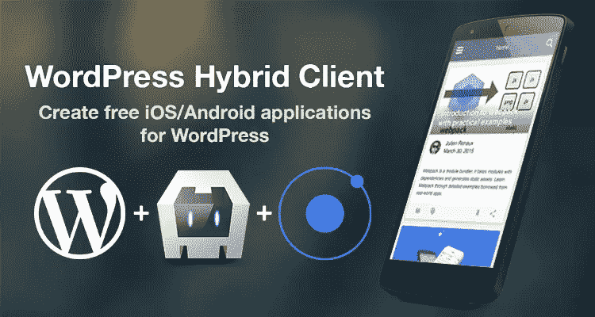
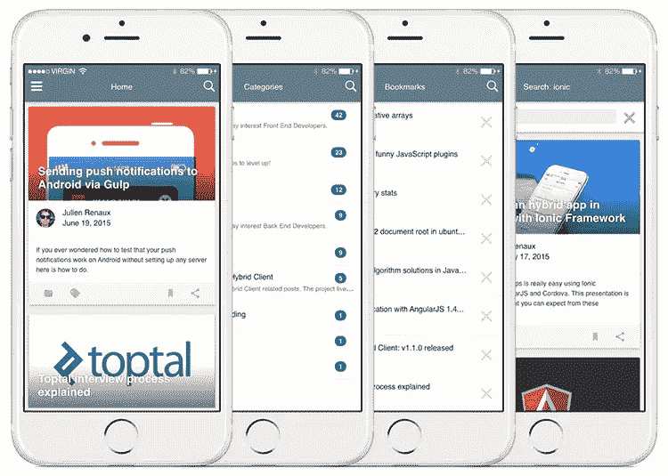

# WordPress 混合客户端:WordPress 支持的 iOS/Android 应用程序

> 原文：<https://www.sitepoint.com/wordpress-hybrid-client-wordpress-powered-ios-android-apps/>



[WordPress 混合客户端(WPHC)](http://wphc.julienrenaux.fr/) 是 GitHub 上的一个开源项目[，可以让你轻松地免费创建你的 WordPress 网站的 iOS 和 Android 版本。](https://github.com/shprink/wordpress-hybrid-client)

WPHC 基于开源混合栈 [Ionic SDK](http://ionicframework.com/) 、 [Cordova](https://cordova.apache.org/) 、 [Crosswalk](https://crosswalk-project.org/) 。



### 特征

*   推送通知
*   书签(离线模式)
*   谷歌分析支持
*   自动内容更新
*   社交按钮
*   可访问性(文章字体大小)
*   多种语言(英语、法语、中文)
*   无限卷轴
*   技术博客的语法高亮显示
*   图像缓存
*   appdata

### 与 WPHC 一起建造

以下是一些使用 WPHC 构建的项目示例:

*   [https://play.google.com/store/apps/details?id = com . shprinkinc . WordPress hybrid client](https://play.google.com/store/apps/details?id=com.shprinkinc.wordpresshybridclient)
*   [http://hiwaldorf.com/app/](http://hiwaldorf.com/app/)

## 装置

警告:这个安装可以在 OS X 和 Linux 上运行。尚不支持 Windows。

首先你需要克隆这个项目(不需要派生它):

```
$ git clone https://github.com/shprink/wordpress-hybrid-client.git

# Open the project folder
$ cd wordpress-hybrid-client

# List all tags
$ git tag
v1.0.0
v1.1.0
v1.2.0
v1.3.0
v1.3.1
v1.4.2

# checkout the latest version available
$ git checkout v1.4.2
```

然后，您需要做的就是运行以下脚本并等待:

```
sh ./install.sh
```

你可以在这里找到更多关于安装的信息。

## 配置

现在安装已经完成，您将在项目根目录下创建两个配置文件:

*   `config.json`为应用程序配置
*   `config.scss`为样式配置。

### 应用

大多数应用程序行为都可以通过`config.json`文件进行配置。下面是您可以配置的内容的简单视图:

*   标题
*   美国石油学会(American Petroleum Institute)
    *   baseUrl
    *   超时
    *   maxAttempt
*   菜单
    *   曝光时间
    *   目录
*   设置
*   隐藏物
    *   视图
    *   向前
    *   img
    *   数据
*   书签
*   邮政
*   语法高亮显示
*   分类学
*   邮件
*   翻译
    *   有空的
    *   首选的
*   分析学
*   科多巴
    *   状态栏
    *   评估
    *   推进小说

你可以在这里找到更多信息。

### 风格

您可以覆盖`config.scss`文件中的任何离子或 WPHC Sass 变量。这也是添加您可能需要的任何特定样式的地方。

你可以在这里找到更多信息。

### 网络服务

安装[https://wordpress.org/plugins/json-rest-api/](https://wordpress.org/plugins/json-rest-api/)插件并激活，然后修改`config.json`:

```
"api": {
    "baseUrl": "http://YourDomain.com/wp-json"
},
```

现在，您的 web 服务可以被查询了。

### 推送通知

安装 https://wordpress.org/plugins/push-notifications-for-wp/的[插件并激活它，然后相应修改`config.json`。如果您不想启用推送通知，请设置`"enabled": false`并跳过这一部分。](https://wordpress.org/plugins/push-notifications-for-wp/)

```
"pushNotifications": {
    "enabled": true,
    "baseUrl" : "http://yourDomain.com/pnfw",
    "android": {
        "senderID": ""
    },
    "ios": {
        "badge": true,
        "sound": true,
        "alert": true
    }
}
```

#### 机器人

如果您还没有这样做，您将需要设置一个 Google API 项目来生成您的 senderID。[按照这些步骤](http://developer.android.com/guide/google/gcm/gs.html)来做。

在[https://developers.google.com/mobile/add](https://developers.google.com/mobile/add)按照云消息步骤获取 senderID。

提示:sender id 是一个 12 位数字。

打开你的 WordPress 管理页面，进入`Push Notifications > Settings`检查以下复选框:

*   基本选项>发布新帖时发送推送通知
*   基本选项> Android 设备
*   发送>帖子的推送通知
*   在 Android 通知有效负载中添加消息字段

然后转到“Android 推送通知(通过 GMC)”部分，输入您的 Google API 密钥。

别忘了保存。

#### ios

打开你的 WordPress 管理页面，进入`Push Notifications > Settings`检查以下复选框:

*   基本选项>发布新帖时发送推送通知
*   基本选项> iOS 设备
*   发送>帖子的推送通知

[Get。烫发文件](http://stackoverflow.com/questions/21250510/generate-pem-file-used-to-setup-apple-push-notification)并上传到`iOS Push Notifications`区。

你可以在这里找到[更多关于推送通知的信息。](https://github.com/shprink/wordpress-hybrid-client/blob/v1.4.2/PUSHNOTIFICATIONS.md)

## 开发(网络)

现在安装已经完成，确保项目正常运行。为此，请运行以下命令:

```
npm run devserver
```

然后打开[http://localhost:8080/web pack-dev-server/](http://localhost:8080/webpack-dev-server/)检查一切是否按预期运行。每次源代码修改(或配置)都会自动构建项目并实时重新加载应用程序。你会立即看到结果。

## 构建(本机)

### 安装 Cordova 的平台和插件

你需要做的就是运行一个命令并回答问题:`npm run installCordova`

```
$ npm run installCordova

> wordpress-hybrid-client@1.4.0 installCordova /Users/shprink/Sites/demos/wphc-1.4
> sh ./install_cordova.sh

Which platforms do you want to build? (android ios):
```

一旦你选择了你想要构建的平台，这个脚本将会安装所有必要的 Cordova 插件。

### 机器人

#### 先决条件

*   Android SDK
*   蚂蚁

#### 构建并运行开发版本(非缩小并调试)

如果你有设备的话，插入你的设备(通过运行:`$ adb devices`确保你的设备被列出)或者让 Android 模拟器处理它。

```
# Dump dev files within the www folder
npm run dumpdev

npm run runAndroid
```

**Pro 提示**:如果你想测试缩小版，你也可以使用`npm run dumpprod`而不是`npm run dumpdev`在调试模式下运行 prod 版本

### ios

#### 先决条件

*   OS X
*   Xcode
*   预配配置文件
*   iOS 模拟器

```
sudo npm install -g ios-sim npm install ios-deploy
```

#### 构建并运行开发版本(非缩小并调试)

如果您有设备，请插入设备或让 iOS 模拟器处理它。

```
# Dump dev files within the www folder
npm run dumpdev

npm run runIOS
```

**Pro 提示**:如果你想测试缩小版，你也可以使用`npm run dumpprod`而不是`npm run dumpdev`在调试模式下运行 prod 版本

你可以在这里找到更多信息。

## 释放；排放；发布

确保您安装了 iOS 和/或 Android 平台。如果你正确运行了`npm run installCordova`，应该没问题。

### 机器人

#### 获取并保存许可证密钥

[https://support . Google . com/Google play/Android-developer/answer/186113？hl=en](https://support.google.com/googleplay/android-developer/answer/186113?hl=en)

将密钥复制并粘贴到名为`android_wphc.keystore`的`~/.ssh`文件夹中

**NB** :你可以把钥匙放在任何你想放的地方，甚至可以改名。但是如果你这样做，你将需要相应地修改`release.sh`。

#### 构建产品 apk

```
npm run build
```

然后，按照提示进行操作。

### ios

#### 证明文件

如果您没有先阅读以下文档，那么构建 iOS 可能会很痛苦:

[https://developer.apple.com/programs/ios/gettingstarted/](https://developer.apple.com/programs/ios/gettingstarted/)

[https://developer . apple . com/library/MAC/documentation/LanguagesUtilities/Conceptual/itunes connect _ Guide/Chapters/creating tunes connect record . html #//apple _ ref/doc/uid/TP 40011225-CH13](https://developer.apple.com/library/mac/documentation/LanguagesUtilities/Conceptual/iTunesConnect_Guide/Chapters/CreatingiTunesConnectRecord.html#//apple_ref/doc/uid/TP40011225-CH13)

[http://codewithchris.com/submit-your-app-to-the-app-store/](http://codewithchris.com/submit-your-app-to-the-app-store/)

#### 安装叹息

“叹息”允许我们签名。通过终端使用配置文件的应用程序。

```
# https://github.com/KrauseFx/sigh
sudo gem install sigh
```

#### 构建产品 IPA

```
npm run build
```

同样，按照提示操作。

你可以在这里找到更多信息。

## 结论

到现在为止，你应该已经有了一个运行中的 WordPress 网站应用程序。如果你喜欢这个项目，你可以[贡献](https://github.com/shprink/wordpress-hybrid-client)(有很多很棒的功能即将推出)[关注博客](http://julienrenaux.fr/category/wphc/)甚至[和我们聊天](https://gitter.im/shprink/wordpress-hybrid-client)！

此外，如果您的应用程序在商店中有售，请随时与我们分享，我们将在我们的[“与 WPHC 一同打造”](https://github.com/shprink/wordpress-hybrid-client#built-with-wphc)版块中进行推广！

如果 WPHC 不完全是你想要的，这里有一个我最喜欢的付费服务列表:

*   [http://reactorapps.io](http://reactorapps.io)
*   [http://www.mobiloud.com](http://www.mobiloud.com)
*   [http://ideapress.me/](http://ideapress.me/)

## 分享这篇文章