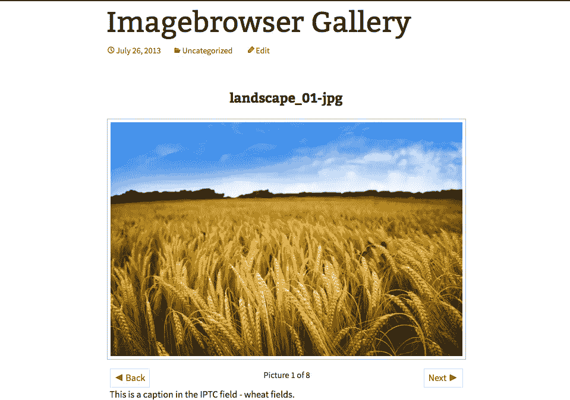
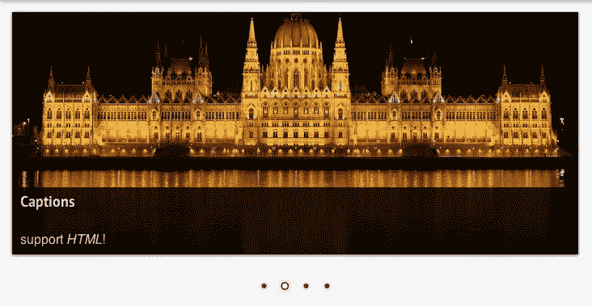
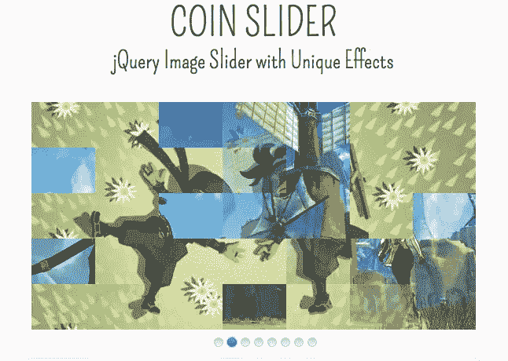
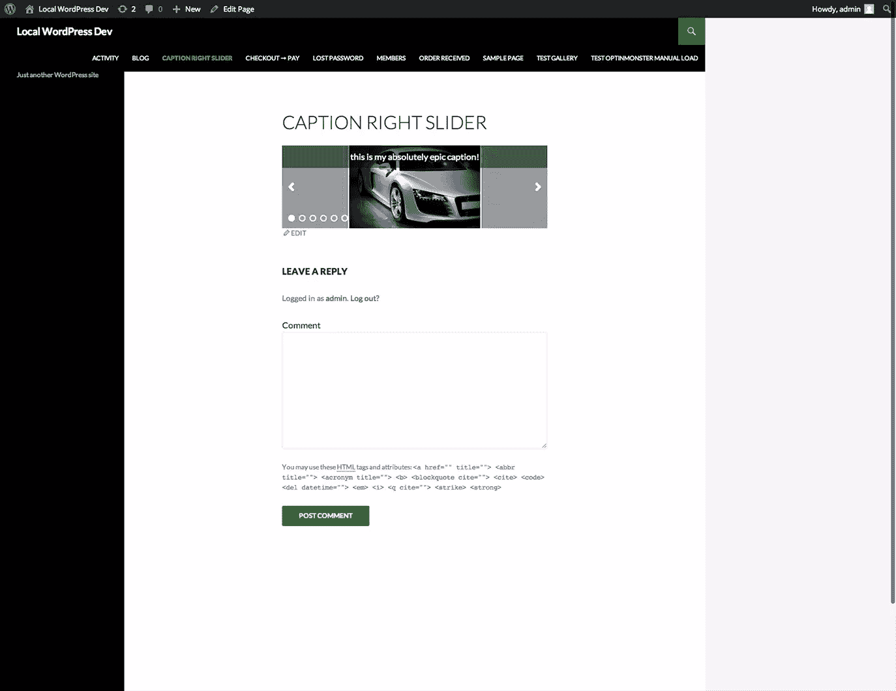
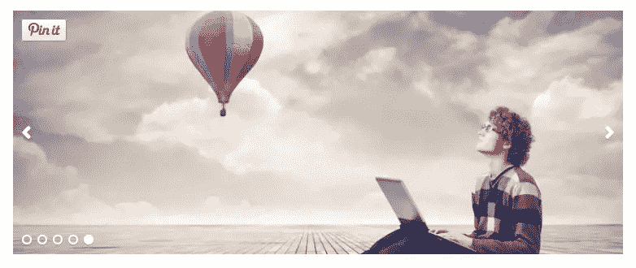
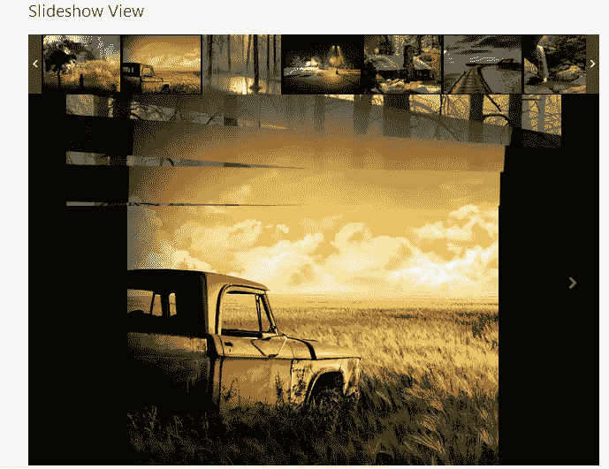

# 图片滑块:滑动还是不滑动？

> 原文：<https://www.sitepoint.com/wordpress-image-sliders/>

图像滑块(也称为图像转盘或幻灯片显示)可以方便地在网站上显示多个图像、视频或图形。大，美丽，浮华的形象展示的想法可能是相当诱人的。引人注目的图片可以吸引新的访问者进入你的网站，立即抓住他们的注意力。而且，市场上有大量的 WordPress 图片滑块和图片轮播插件，只等着给你的主页添加一点点活力，一点点它一直缺少的闪光。

问题是，当涉及到网站图像显示时，滑块可能并不总是最佳选择。业内专家认为，滑块会造成混乱，冲淡你的关键信息，并对搜索引擎优化、网站加载时间，甚至点击率和转化率产生负面影响。

所以，在你安装和激活下面提到的图片滑块之前，仔细考虑你是否需要一个滑块。

## 图像滑块总是最好的选择吗？

在我开始介绍当今市场上最流行的图片滑块之前，我想我应该花点时间讨论一下图片滑块是否总是网站的最佳选择。

当你决定在你的网站中加入任何类型的功能时，首先批判性地评估该功能的影响总是一个好主意。在你考虑一个特性如何影响用户体验、SEO、转换和加载时间之前，不要开始设计或构建。你认为图片滑块看起来很酷的事实并不足以成为在你网站的每一页都包含一个图片滑块的理由。

有无数的行业研究表明，当涉及到客户转化时，滑块的表现尤其糟糕。滑块很少产生高点击率，网站访问者更倾向于将其视为垃圾广告；一种被称为“盲症”的疾病。鉴于如此令人失望的转换率，在你的网站主页主菜单栏的正下方放置一个图片滑动条，可能并不是利用这些宝贵资源的最佳方式。

Yoast 那边的团队甚至说 [**滑块吸**](https://yoast.com/opinion-on-sliders/) 。他们的论点(以及支持他们的统计数据)非常有说服力:

*   只有 1%的人真正点击过滑块或转盘中的图片(通常是第一张)。
*   图像滑块往往会降低网站的速度，从而导致负面的搜索引擎优化影响，以及降低转化率和点击率。如果你的网站是一个电子商务平台，这有可能影响你的销售数字和业务底线。
*   图像滑块在移动设备上很少像预期的那样工作(而且，随着移动使用率的不断上升，这是一个巨大的问题)。
*   很自然地，由于它们的位置，图像滑块会把网页上的内容往下压。事实上，图像滑块通常很大，占据了整个屏幕。因此，在折叠之前，网页上没有实际内容。根据全能的谷歌，这绝对不是一个好主意。
*   图像滑块会给你的网站访问者造成混乱，冲淡你的关键信息，因为突然之间，有多条信息都在争夺同一个领域。如果你不知道你的网站主页上最重要的信息是什么，你的网站访问者怎么会知道呢？

## 在图像滑块插件中寻找什么

所以，如果我没有吓到你，而你仍然热衷于在你的网站上包含一个图片滑块，那么我建议你留意以下几个功能:

*   确保您选择的图像滑块具有一流的可用性。
*   确保你选择了一个反应灵敏的滑块(很多滑块不是！).
*   确保您有能力更改图像滑块的设置，包括速度和外观。

除了滑块本身的内置功能，这些策略也可以很好地发挥作用:

*   坚持一个提议，一条信息，一段文字内容。因此，你可能有三个或四个不同的图像旋转，但覆盖在每个图像上的信息应该完全相同，并放在完全相同的位置。至少这样，你克服了在同一空间内多个信息争夺注意力的问题。
*   让用户能够完全控制你的滑块。所以，你的滑块可能根本不会滑动，除非你的网站访问者希望它滑动。在你的滑块中的每个图片的边上包括左箭头和右箭头，这样网站访问者可以在他们空闲的时候点击进入。
*   确保你的图像滑块不是很大。它不应该占据折叠线以上的整个区域。在你的网页顶部的某个地方，应该总是有一些书面的内容。

最重要的是，测试。跟踪与滑块相关的统计数据。看看人们是否真的点击了。如果是，他们点击了哪些滑块？你甚至可以试着在几周或一个月内移除滑块，看看那时的流量和点击率如何。用静态图像替换图像滑块，然后再次测试。在一天结束的时候，对你的网站和你的观众最有用的东西是最重要的。

## WordPress 图片滑块插件

所以，如果你决定冒险在你的网站上加入一个图片滑块，这里有一些市场上最流行的图片滑块插件。

### [次世代画廊](https://www.imagely.com/wordpress-gallery-plugin/)

市场上最受欢迎的 WordPress 图片库和滑块插件(可以说是有史以来最受欢迎的 WordPress 插件之一)，NextGen Gallery 已经被下载了惊人的 1100 万次。

WordPress 用户发现这个特殊的插件并不奇怪。它是多样化的，在功能性领域有很强的影响力。使用 NextGen Gallery，只需一次点击即可上传成批照片，自动导入所有图像元数据，编辑单个图像，并轻松添加水印。谈到图片库，NextGen 提供了两种格式，要么是幻灯片，要么是缩略图，你的网站访问者实际上可以在这两种视图之间切换(注意上面提到的可用性问题)。此外，如果你选择了幻灯片视图，有很多容易定制的设置，包括幻灯片大小，图像之间的过渡速度和类型，甚至导航设置。

NextGen 有一个“Plus”版本(每年定价 49 美元)，包括额外的画廊显示器、全屏灯箱、完全响应的设计以及社交分享和评论选项。甚至还有 NextGEN 的“专业”版(每年定价 79 美元)，它具有完整的电子商务功能，可以销售印刷品，甚至可以进行数字下载。

欲了解更多信息，请访问:

### [Meta Slider](https://wordpress.org/plugins/ml-slider/)

Meta Slider 由英国的 Matcha Labs 创建，是 WordPress 的一个非常流行的图片滑动插件。Meta Slider 拥有超过 120 万的下载量和 4.8 星的评级，使创建幻灯片变得非常容易。创建一个幻灯片只需几分钟:从媒体库中拖放图像，然后在一个地方创建标题和链接并完成 SEO 字段。没错:SEO 领域。这个特殊的图像滑块插件生成 SEO 优化的幻灯片，以某种方式克服了至少一个我们之前提到的陷阱。其他功能包括智能图像裁剪，拖放幻灯片重新排序，广泛的开发者 API(包括钩子和过滤器)，最重要的是，它很快，在你的网站页面上只包括最少的 CSS。它还有 15 种不同的语言版本。

Meta Slider 拥有四个不同的选项，以及大量易于配置的可用性功能:

*   Flex Slider 2:一个响应式图像滑块，带有两种不同的过渡效果和旋转模式。
*   Nivo Slider:另一个具有惊人的 16 种不同过渡效果的响应图像滑块(他们怎么会想到这么多？！)和四个不同的主题。
*   响应式滑动条:响应式图像滑动条，重量轻得令人难以置信(而且不太可能减缓网站的加载时间(克服了上面提到的另一个缺点)。
*   硬币滑块:包括四种独特的过渡效果。

很像 NextGen Gallery，Meta Slider 也有一个“专业”版本，据[网站](http://www.metaslider.com/upgrade/)称，它将增强你的幻灯片显示。“专业版”的价格从 19 美元(单一网站个人许可)到 99 美元(开发者许可)不等，具有幻灯片分层、缩略图导航以及嵌入 YouTube 和 Vimeo 幻灯片的功能。

欲了解更多信息，请访问:[metaslider.com](http://www.metaslider.com/upgrade/)

### [独白](https://wordpress.org/plugins/soliloquy-lite/)

虽然这个插件没有 NextGen 或 Meta Slider 那么受欢迎，但它的名声是因为 Mark Jaquith(WordPress 本身的主要开发者)审计了它的代码。因此，你可以确定这个插件是安全的，并且驱动它的代码尽可能的优化。自言自语的工作方式与其他图像滑块插件略有不同，它依靠自定义的文章类型来创建滑块。

自言自语允许你创建无限数量的滑块，并为搜索引擎优化优化，允许你输入所有图像的标题，HTML 标题和 alt 标签。它也是完全移动响应的，只在安装了滑块的页面上添加 CSS，并且有无数的钩子和过滤器，可以方便地操作滑块的外观和感觉。

与所有这些插件一样，有多个付费选项，提供额外的功能，包括个人(每年 19 美元)、多人(每年 49 美元)、开发者(每年 99 美元)和大师(249 美元，包括终身支持和更新)。这些额外的功能包括一系列的插件，扩展了滑块插件的功能。其中一个“插件”引起了我的注意。在图片滑动插件市场上，这是一个看似独特的功能:通过名副其实的“Pinterest Addon ”,可以轻松地将“锁定”按钮添加到滑块中的图片上。

其他独白“插件”包括主题、Lightbox、Instagram(使您能够从 Instagram feed 中包含的照片创建幻灯片)、裁剪、专题内容、缩略图、滤镜(超过 25 个滤镜，您不需要成为专业摄影师就可以让您的图像看起来很棒)和 Carousel。

欲了解更多信息，请访问:[soliloquywp.com](http://soliloquywp.com/)

### [照片库](https://wordpress.org/plugins/photo-gallery/)

如果你正在寻找一个更全面的图片插件，那么看看[图片库](https://wordpress.org/plugins/photo-gallery/)。该网站定期更新，星级为 4.7，下载量约为 35 万次。照片库提供的图像幻灯片特性和功能非常好。使用这个插件，你可以将你的幻灯片视图编程为包括自动播放和随机播放功能，并且可以为你的幻灯片安装一个音轨。此外，还有一个单独的幻灯片画廊小部件，您可以将它添加到网站的任何 widgetted 区域，它的 lightbox 有 15 种不同的效果。

此外，照片库还有一系列其他图像功能。它可以处理无限数量的照片、图库和相册，支持一系列文件类型，100%响应，允许同时标记多张照片，甚至具有评论和社交共享功能。

## 那么…滑还是不滑？

在你的网站上安装图片滑块显然有一些陷阱:网站访问者往往会被多种信息所迷惑，不愿意点击滑块上的图片，对 SEO 的负面影响相当广泛。

但是，看起来主要的图片滑块插件已经开始对抗这些主要的陷阱了。Meta Slider 和 Sililioquy 都有一些内置的 SEO 功能，并且所有的插件都有易于配置的可用性特征。

在一天结束的时候，最重要的事情是你的网站以最好、最有效的方式为你的网站访问者服务。因此，做一些测试，以确保图像滑块真的是你的网站的最佳选择。除了使用滑块，还有很多其他方法可以给你的 WordPress 站点添加图片和效果，看看 [8 个 WordPress 插件来创建令人惊叹的图片效果](https://www.sitepoint.com/8-wordpress-plugins-create-awe-inspiring-image-effects/)。

## 分享这篇文章