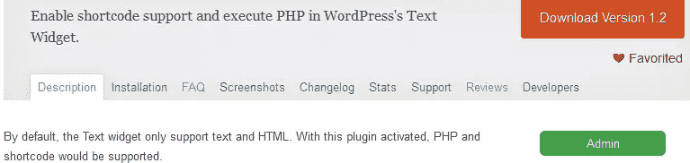
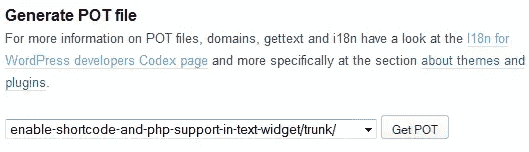
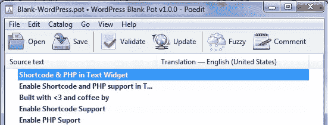
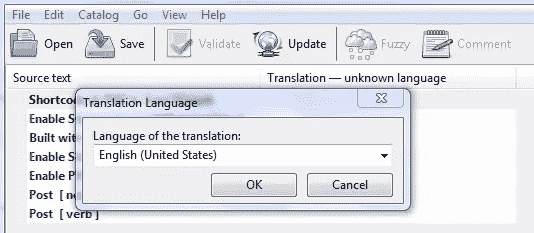
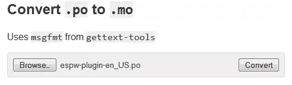

# 如何翻译你的插件

> 原文：<https://www.sitepoint.com/wordpress-l10n-translate-your-plugin/>

在这个关于 WordPress 插件 **i18n 和 l10n** 的系列的第一部分中，我们学习了[如何国际化一个 WordPress 插件](https://www.sitepoint.com/wordpress-i18n-make-your-plugin-translation-ready/)。

第二部分(也是最后一部分)将演练如何准备好翻译插件，以及学习如何将插件本地化或翻译成一种新语言。

为翻译准备插件的过程相当简单。首先，您需要生成一个`.pot`文件。翻译人员使用这个文件将你的插件翻译成一种新的语言。

这个`.pot`文件包含插件的原始字符串(英文)。

以下是 POT 文件条目的示例:

```
#: plugin-name.php:123
msgid "Welcome to SitePoint"
msgstr "" 
```

想要将文本`Welcome to SitePoint`(在你的插件文件的第`123`行)翻译成德语的翻译人员会在引号之间添加译文。

```
#: plugin-name.php:123
msgid "Welcome to SitePoint"
msgstr "Willkommen auf SitePoint" 
```

### 生成 POT 文件

**如前所述，**POT 文件是交给翻译人员的文件，以便他们能够完成工作。

注意:在生成你的插件 POT 文件之前，确保你已经国际化了你的插件。

有几种方法可以为你的插件生成一个 POT 文件。

#### 插件库管理工具

官方 WordPress 插件库有一个生成插件 POT 文件的工具，位于每个插件列表的管理页面。

要访问你的插件的管理页面，登录到[插件库](http://wordpress.org/plugins/)，点击工具条上的绿色`Admin`按钮。



按照下面的简短指南，看看使用管理工具生成 POT 文件是多么容易。

*   点击`Generate POT file`部分的`Continue`。
    
*   然后点击`Get POT`下载 POT 文件。



#### Poedit

有许多 Gettext 翻译编辑，但是 Poedit 在 WordPress 忠实用户中很受欢迎。

专业版允许您一键创建 PO/POT 文件。

如果你没有专业版，你可以很容易地得到这个[空白锅](https://github.com/fxbenard/Blank-WordPress-Pot)，并使用它作为你的锅文件的基础。

一旦你将空白花盆放入插件的`languages`文件夹，双击它并用 Poedit 打开它。

点击 Poedit 中的`Update`用你的插件字符串更新 POT 文件。



最后，点击 **`File > Save`** 或`Ctrl + S`保存修改。

如果您拥有该工具的 [Pro 版本](http://poedit.net/pro)，生成 POT 文件就像下面的步骤一样简单。

*   点击 **`File > New WordPress translation`** ，选择你的插件文件夹。
*   Poedit 将浏览你的插件文件并提取可翻译的字符串。
*   从弹出的对话框中选择翻译的语言。
*   `Ctrl + S`并将文件显式保存为`.pot`。
*   您可以将文件保存为`.po`，然后将其重命名为`.POT`。



PO 和 POT 文件的相似之处在于它们具有相同的内容格式。它们之间的细微差别是:

*   翻译者使用的是`.pot`文件，而不是 PO 文件。
*   从产生的`.po`翻译文件中编译出`.mo`文件。

把 POT 文件和你的插件一起提供是个好主意，这样翻译人员就不必特别询问你了。

## 插件 L10n

本地化描述了将国际化插件翻译成新语言的后续过程。

### 如何本地化一个插件

要本地化一个插件，获取插件`POT`文件，在文本编辑器中打开它，并在引号之间的各个`msgstr`部分输入每个字符串的翻译。

以此格式`my-plugin-{locale}.po`保存文件，其中`{locale}`是您在文件`wp-config.php`的常量`WPLANG`中定义的语言代码和/或国家代码。例如，德语的地区是`de_DE`。`my-plugin`是插件的*文本域*。

记住，正是从`.po`文件生成了结果`.mo`文件(WordPress 在翻译插件时使用)。

让我们看看如何从 PO 文件生成 MO 文件。

#### 在线采购订单到生产订单转换工具

有几个[在线](http://po2mo.net/) [工具](http://tools.konstruktors.com/)可以将`.po`文件转换成`.mo`文件。就个人而言，我在[tools.konstruktors.com](http://tools.konstruktors.com/)使用这个工具。



要从 PO 文件生成阿莫，上传`.pot`文件。该工具会自动转换文件，并提供一个`.mo`文件供您下载。

### 为 L10n 使用 Poedit

Poedit 提供了一个简单的接口来翻译插件字符串或文本，也可以从 PO 文件生成所需的 MO 文件。

要使用 Poedit 将插件本地化或翻译成一种新语言，请遵循以下指南。

1.  用 Poedit 打开插件`.pot`文件。
2.  点击可翻译的字符串，并在标记为 **Translation** 的文本区域输入它们各自的翻译。
    
3.  翻译完成后，将文件保存为以下格式`my-plugin-{locale}.po`。例如，`espw-plugin-de_DE.po`其中`espw-plugin`是文本域，`de_DE`是地区。

保存采购订单文件时，会自动生成生产订单文件。

如果翻译人员将您的插件翻译文件(MO 和 PO 文件)发送给您，请复制 MO(。mo)文件到你的插件`language`文件夹中，供 WordPress 使用。

当运行 WordPress 本地化版本的用户使用你的插件时，插件将会使用他们的语言。

## 包裹

如果你想让你的插件获得尽可能多的受众，就要把它国际化，并做好翻译准备。

尽管你可能只精通一种语言，但是如果你让你的插件准备好翻译，这就为人们自愿翻译你的插件提供了可能性。

如果你有任何问题、建议或贡献，我很乐意在评论中听到。

## 分享这篇文章