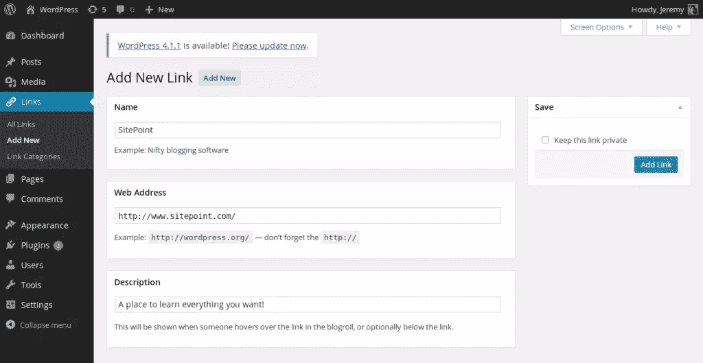

# 掌握 WordPress 链接管理器

> 原文：<https://www.sitepoint.com/wordpress-links-manager/>

在一个网站上找到一个链接列表并不是一件罕见的事情。例如，许多博客都有自己的 blogroll 来传播他们朋友的博客，或者以旋转木马的形式显示其他网站来突出一些链接，无论是内部的还是外部的。

要创建这些列表，只需将它们添加到 HTML 代码中，并对链接进行硬编码。问题是这种方法不太实用:要修改、删除或添加链接，必须修改源代码。

这就是 WordPress 链接管理器存在的原因。

## 什么是 WordPress 链接管理器，为什么使用它？

### 管理链接的有用工具

顾名思义，链接管理器允许你管理一个按类别排序的链接列表。这些链接可从管理面板访问，因此您可以轻松地添加新链接或修改和删除现有链接。

要显示和使用链接管理器中添加的链接，我们有几个选择。默认情况下，WordPress 为我们提供了一个添加到侧边栏的小部件，它将显示你的链接。但是由于专用的 API，你也可以建立你自己的列表。

### WordPress 链接管理器在哪？

链接管理器是 WordPress 早期版本中默认提供的。但是，到了 3.5 版本就消失了；从这个版本开始，你不能在一个全新的 WordPress 安装上找到链接管理器。此外，如果您使用比 3.5 更早的版本并升级了您的安装，那么链接管理器将被删除，除非您使用它。

如果你使用的是 3.5 之前的 WordPress 版本，并且在升级之前有链接，那么你应该有链接管理器。如果你还没有，可以通过下载[链接管理器插件](https://wordpress.org/plugins/link-manager/)找到，这是官方找回旧工具的方式。你可以像安装其他插件一样安装它，或者如果你认为它应该是 WordPress 的一部分，你可以把它安装成[阿木插件](https://www.sitepoint.com/wordpress-mu-plugins/ "What are WordPress MU-Plugins?")。

请注意，这个插件非常短:实际上它只有一行，只是添加了一个过滤器来激活链接管理器。这意味着你可以通过在主题的`functions.php`文件中添加下面一行来激活链接管理器。

```
add_filter('pre_option_link_manager_enabled', '__return_true');
```

这也意味着，如果您为其他用户开发主题，并希望在这些主题中使用链接管理器，您可以用这行代码激活它。这样，你的用户就不必下载插件来正确使用你的主题。

无论是默认出现在你的 WordPress 安装中，还是用插件或过滤器激活，链接管理器都可以在管理面板的侧边栏中找到，有它自己的部分:"*链接*"。

## 添加新链接

通过访问“*链接*”部分，您将默认进入您的链接列表。与你的文章列表相似，这个列表也在页面标题旁边提供了一个“*添加新的*按钮。点击此按钮添加一个新的链接感谢一个完整的表格。

这份表格包含许多不同的选项。根据您对所添加链接的使用情况，这些选项中的一些将完全没有用，但是不要担心:唯一的必填字段是“*网址*”，您可以在其中指定链接的 URL。所有其他字段都是可选的，所以只有在您要使用它们时才填写它们。

### 描述您的链接

显示链接是一件事，但如果你想让这些链接有用，那么你需要描述它们。在“*名称*”字段中，您可以为您的链接指定一个名称。名称应该简短，但也要有描述性:链接的名称应该和文章的标题一样。

在“*网址*字段下面，可以找到“*描述*字段。在这个领域，你真的可以描述你的链接；你可以说明你为什么选择它，为什么你认为它有用，或者简单地说明它是什么。

例如，让我们创建一个指向 SitePoint 的链接。



### 关于您的链接的更多详细信息

您可以选择通过指明关系来为您的链接添加更多细节:如果该链接指向特定的人(例如，如果该地址是您朋友的个人网页)，则您可以指明您与此人的关系。有几个选项，你肯定不会使用所有的选项，但是如果你需要它们，你应该知道它们的存在。

“*链接关系*”部分是当链接显示出来后，您填写链接的`rel` HTML 属性的地方。如果您使用这个部分，请确保显示您的链接的脚本能够阅读它！

“ *Advanced* ”部分可以用来添加一些关于链接的附加信息。“*图像地址*字段不包括图像的 URL。例如，如果您想在一个转盘中显示您的链接，此字段是指示说明该链接的图像的最佳位置。

如果您的链接指向一个使用 RSS 源的网站，您可以在“ *RSS 地址*”字段中指明。例如，由于前面的字段，您的 carousel 可以显示背景图像，并添加一个小的 RSS 按钮来指示您的用户可以跟踪网站的位置。

一个标有“*注释*的大文本区域允许你添加任何你想要的关于你的链接的内容。它可以是你的主题所使用(并最终显示)的信息，也可以是一个个人笔记，告诉你的未来你为什么添加这个链接。

如果你想给你的链接打分，这要感谢“*高级*”部分的最后一个字段:一个允许你在 0 到 10 之间给链接打分的列表。

最后，通过在“*目标*”部分中选择正确的选项，您可以选择是否在新的选项卡中打开链接。请再次注意，确保用于显示链接的脚本正确填充了`target` HTML 属性。

### 私人链接

在提交按钮的正上方，您可以找到一个标记为“*保持此链接私有*”的复选框。正如您所猜测的，这允许您创建链接而不发布它们，无论是暂时的还是不发布的。

只需取消选中该框，就可以随时发布私有链接，并且在编辑链接信息时，可以通过选中该框来隐藏公共链接。

WordPress 不会显示私人链接:我们将在下面看到的小部件会简单地忽略它们，你的访问者将看不到它们。他们甚至不会知道这些联系的存在。

私有链接对于模拟草稿很有用:如果你需要更多的时间来准备一个链接的描述，但又不想删除你已经输入的所有信息，那么私有链接是一个不错的选择。

## 组织您的链接

填写完所有需要的字段后，只需点击“*添加链接*”按钮即可添加链接。但是，有一部分我们还没有发现:“*类别*”。

相反，如果你在提交之前没有做出选择，你的文章会被归入“*未分类的*”类别，你的链接不需要类别。如果你不选择一个类别，那么这个链接将不会包含在任何类别中。

然而，如果你在几个地方使用链接，组织它们可能是一个好主意。例如，一个轮播将只显示在“*轮播*”类别中排序的链接，而你侧边栏中的一个小部件将显示在“*侧边栏*”类别中的所有链接。

链接类别列表类似于文章类别列表，因为你可以通过简单地选择正确的类别来为你的链接选择你想要的类别，但是你也可以添加一个新的类别，这要感谢列表下面的链接。

请注意，您可以选择几个类别，如果您有很多类别，您可以通过只显示最常用的类别来过滤列表。

您可以通过访问管理面板侧边栏中“*链接*”部分的“*链接类别*”子部分来管理您的链接类别。此页面列出了您的类别，并允许您添加描述或修改它们的标题。一个表单允许你用这些信息直接添加一个新的类别(与我们上面谈到的链接相反，它只允许你选择新类别的名称)。

最后，你可以删除所有未使用的类别:由于“*链接*”列显示了链接的数量，使用相应的类别，很容易找到它们。

## 编辑或删除链接

正如我们上面所说的，链接列表和文章列表相似，所以你不会因为编辑或删除链接的方式而迷失方向。

事实上，将鼠标悬停在一个链接的行上，你会看到两个链接出现:“*编辑*和“*删除*”。点击“*删除*，将显示一条信息提示，要求您确认您的选择。注意:链接管理器中没有垃圾箱，所以删除链接是一个明确的操作。

注意，和在文章列表中一样，点击链接名称或“ *Edit* ”链接将会产生同样的效果，将你重定向到正确的页面。这个页面和你可以添加链接的页面几乎一样。区别在于页面的标题和一些按钮的标签。此外，表单预填充了您可以修改的当前值。

最后，链接列表可以按类别过滤，复选框允许您同时删除几个链接。

## 使用小部件显示链接

如果你的主题允许你自定义一个地方，比如侧边栏或者页脚，那么你可以很容易地在这个地方显示你的链接，因为 WordPress 在链接管理器中提供了一个小部件。

像任何其他小部件一样，要添加链接管理器小部件，您必须进入管理面板的“*外观*”部分的“*小部件*”子部分。您将在这里看到可用小工具的列表，在这里您可以找到“*链接*”一个。将链接小部件拖放到您希望它出现的任何位置。这将打开一个菜单，使您能够个性化小部件。

从这里，您可以在这里显示您想要显示的链接类别(例如，侧边栏中的“ *Blogroll* ”类别)。如果没有很多链接，或者因为只在一个地方使用链接而没有设置任何类别，也可以选择显示所有类别。

一旦你选择了你想要使用的类别，你就可以从链接的排序方式开始自定义显示。您有四种选择:按标题、按等级、按 ID 排序链接，或者以随机顺序显示链接。

在这两个下拉列表下面，您可以看到四个复选框。这将允许你选择你想要显示的内容:你可以显示链接的名称、描述，甚至是它的等级和相关的图片。

最后，您可以限制要显示的链接数量。例如，假设你有一个类别，你把你在网上找到的一些文章放在那里。在你的侧边栏中显示它们是分享你的发现的好主意，但是，根据你在这个类别中的链接数量，结果可能会很长。一种解决方法是在添加新链接时删除一些链接，但也可以保留所有链接，只显示最后五个链接。

不要忘记点击“*保存*按钮来确认您的选择，并在您的网站上享受结果！

## 最后

分享链接是互联网的一个重要组成部分，所以在你的网站上分享链接是个好主意。感谢 WordPress 的链接管理器，你可以通过管理面板添加、编辑、删除和排序链接来轻松管理链接列表。

用小部件显示我们的链接是有用的，但有时，我们想更进一步，定制更多的东西。一个解决方案是编写我们自己的脚本来显示我们的链接。

好消息是，由于一个专用的 API，这是可能的，它允许你检索存储在数据库中的链接，以你想要的方式，在你想要的 HTML 元素中显示它们。链接管理器 API 将是未来文章的主题。

## 分享这篇文章