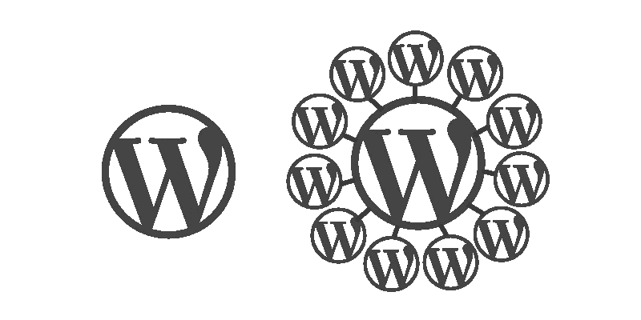

# 多站点去神秘化

> 原文：<https://www.sitepoint.com/wordpress-multisite-demystified/>

在这篇文章中，我将讨论一个不太受欢迎的话题——**WordPress multisite**。

我最近参加了 WordPress Meetup 的一个会议，会上发言人分享了他们使用 multisite 的经验。特别要提到的是迪·蒂尔( [@thewebprincess](https://twitter.com/thewebprincess) )和詹姆斯·邦迪([@詹姆斯·邦迪](https://twitter.com/jamesbundey))，他们提出了这个话题，激发了本文的灵感。

我将在下面提供什么是 WordPress multisite 的概述，一些目前使用它的网站的例子，以及一些有用的插件和资源来帮助你入门。

## 什么是 WordPress Multisite

WordPress Codex 将 Multisite 描述为“非常类似于你自己的 WordPress.com 个人版本”。它允许您创建一个共享单一安装的站点网络。你还会听到被称为 WordPress 网络的 multisite。

### 谁使用多站点

WordPress multisite 被一些非常大的网站使用，最大的是 WordPress.com**，它拥有数百万个网站**。没有比这更大的了。其他受欢迎的网站包括 BBC US(每个节目都有一个子网站)，路透社博客，纽约时报博客，以及大量的大学网站。

您还可以[浏览 WordPress.org](https://wordpress.org/showcase/flavor/wordpress-ms/)的多站点展示，了解更多示例。

### 关键的区别是

当您希望在站点网络中共享用户时，Multisite 是理想的选择。共享用户有一些含义，主要围绕安全性和访问控制。例如，如果您希望一个站点的用户能够访问文件系统，那么他们将能够访问包括所有其他站点在内的整个站点。在引擎盖下，WordPress 表对于每个站点都是独立的，重要的例外是用户表。

如果你只是在寻找看起来有点不同的网站，你可以通过使用类别、标签、自定义帖子类型和不同的模板，而不用走多网站的道路，实现很多。

### 插件兼容性

几年前，插件兼容性是使用 multisite 时的一个常见限制。从那时起，它已经走过了很长的路，但是在你开始一个项目之前，如果你需要的插件支持 multisite，仍然值得检查一下。偶尔您会发现一些插件在多站点安装中不受支持。

## WordPress 多站点插件

如果你已经在使用 multisite，或者有一天决定使用它，下面是一些你可能会觉得方便的插件列表:

### [登录安全解决方案](https://wordpress.org/plugins/login-security-solution/)

**主动安装:** 20，000+
**评级:**4.4(5 颗星中的 4 颗)
**描述:**此插件用于多站点，具有无数的安全功能，包括阻止暴力攻击、要求强密码、登录监控和通知管理员安全问题。

### [WordPress MU 域映射](https://wordpress.org/plugins/wordpress-mu-domain-mapping/)

**活跃安装:** 8，000+
**评分:**4.6(5 颗星之外)
**描述:**该插件将帮助您将多站点安装上的个人博客或网站映射到另一个域。

### [多站点语言切换器](https://wordpress.org/plugins/multisite-language-switcher/)

**活跃安装:** 8，000+
**评分:** 4.9 分(5 颗星之内)
**描述:**轻松管理跨多站点网络的站点内容翻译(例如，如果您使用子域)。

### [未确认](https://wordpress.org/plugins/unconfirmed/)

**主动安装:** 2，000+
**评级:**4.5(5 颗星之外)
**描述:**邮件送达率可能是一个大问题，也是一个令人头疼的管理问题。这个插件为多站点用户提供了一个仪表板，显示未激活的 WordPress 用户注册，帮助你轻松管理它们。

### [多站点克隆复印机](https://wordpress.org/plugins/multisite-clone-duplicator/)

**活跃安装:** 1，000+
**评分:** 4.9 分(5 颗星)
**描述:**想在您的多站点安装中复制一个站点吗？这个插件已经覆盖了你，允许你克隆你的 WordPress 多站点网络上的任何站点，包括数据、文件和用户。

### [网络共享媒体](https://wordpress.org/plugins/network-shared-media/)

**主动安装:** 900+
**评分:** 4.1 分(5 颗星之内)
**描述:**此插件为您创建了一个中央位置来管理您的多站点网络中的所有媒体。

### [多站点用户管理](https://wordpress.org/plugins/multisite-user-management/)

**活跃安装:** 400+
**评级:**4.1(5 颗星之内)
**描述:**此插件帮助您避免在多站点网络上手动将用户添加到您的每个博客或站点。它使您能够在每个站点上为用户分配角色。

### [多站点邮政复印机](https://wordpress.org/plugins/multisite-post-duplicator/)

**活跃安装:** 200+
**评分:** 5 颗星中的 5 颗
**描述:**这是一个非常简单的工具，可以很容易地将一篇博文、页面或自定义文章类型从你的一个博客或网站复制到你网络中的另一个博客或网站。

## 其他多站点资源

如果你渴望了解更多关于 multisite 的信息，请查看 WordPress Codex 文档。

值得向 WPMU Dev 喊一声，他们是多站点空间的长期贡献者。

## 包扎

我希望这篇文章能帮助你决定 multisite 是否适合你的下一个项目。

如果你有使用 multisite 的经验，好的和坏的，我很想听听下面的内容，因为我相信它会帮助其他读者决定 multisite 是否是他们下一个项目的正确方法。

*最初发表在 SitePoint WordPress 时事通讯上，如果你感兴趣，你可以[在这里](https://www.sitepoint.com/newsletter/)订阅。*

## 分享这篇文章