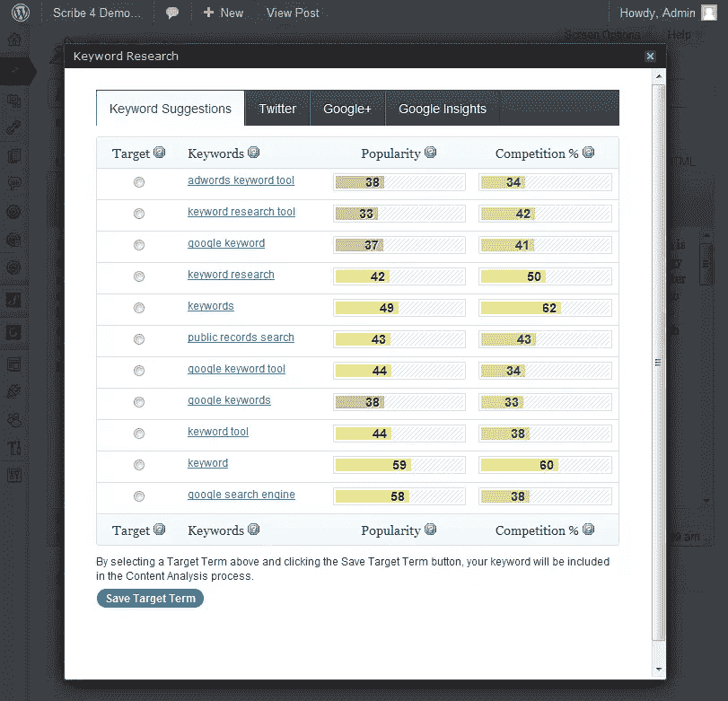
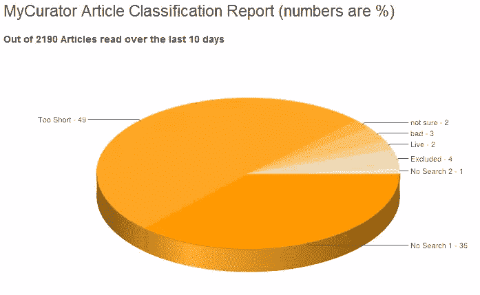
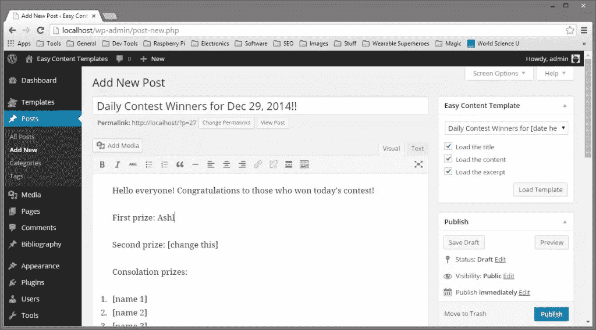
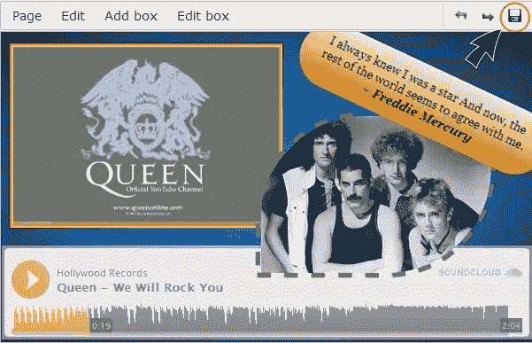
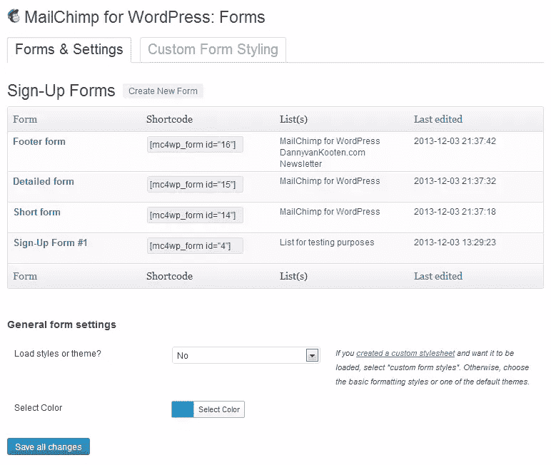
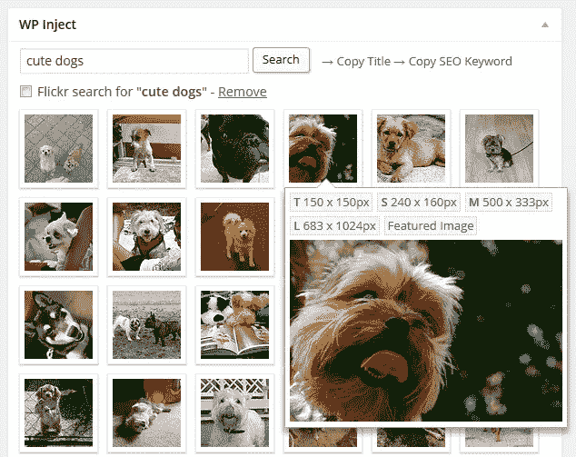
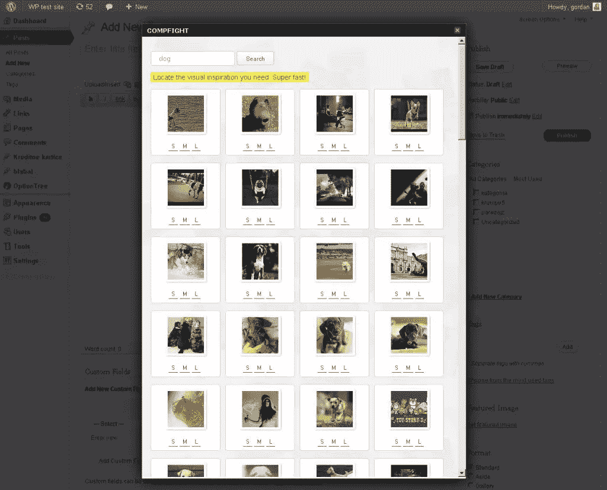

# 成功内容营销的 WordPress 插件

> 原文：<https://www.sitepoint.com/wordpress-plugins-for-successful-content-marketing/>

随着内容营销的兴起，预计 2015 年将达到新的高度，营销人员今年比以往任何时候都更有可能使用 WordPress 作为不可或缺的内容营销工具。如果你不相信我，看看这些数据:

*   93%的营销人员经常使用内容营销
*   57%的营销人员认为内容营销是他们的首要任务
*   76%的 B2B 营销人员定期写博客(其中很大一部分可能使用 WordPress)
*   最重要的是，与内容营销相关的价格标签比传统营销策略低 62%,并产生三倍多的销售线索。

随着 WordPress 在内容营销方面的迅速发展，有一整套成功的内容营销插件来帮助你的程序更顺利地运行并带来更大的投资回报也就不足为奇了。

## 用于内容营销策略、规划和组织的插件

任何成功的内容营销策略的最重要的租户之一是一致性。必须定期制作和传播高质量、引人入胜或有教育意义的内容，从长远来看，内容营销才能带来可观的投资回报。这使得旨在简化时间安排和组织的插件成为任何 WordPress 内容营销项目最重要的方面之一。

### [编辑日历](https://wordpress.org/plugins/editorial-calendar/)

编辑日历插件在安排内容营销计划时非常有用。开箱即用的 WordPress 并没有让日程安排变得简单——用户界面当然没有让日程安排变得简单明了。编辑日历有。你可以使用这个插件来浏览你的预定文章，拖放文章，甚至直接从日历中编辑预定文章。显然这是一个流行的插件，有超过 50 万的下载量和 4.8 星的评分。而且，它还会定期更新。

### [抄写员](https://wordpress.org/plugins/scribe/)

Scribe 由 Copyblogger Media 开发，是所有 WordPress 内容营销插件中名副其实的“大爹”。使用 Scribe，您可以对内容营销机会以及社交媒体线索和流量进行深入研究。它可以让你的写作风格与你的内容营销计划目标相一致，这样你就可以确保所有页面上的内容都是为搜索引擎优化的。你甚至可以用它来定位相似的社交媒体档案和网站。该插件遵循一个简单的成功内容营销公式:研究，优化，连接。Scribe 有几个限制:你的网站必须运行一个兼容的主题，并且只能分析英语。超过 83，000 名内容营销人员下载了该插件，该插件似乎会定期更新。

### [我的馆长](https://wordpress.org/plugins/mycurator/)

如果你把策划内容作为你内容营销计划的一部分，那么我的策划插件就是为你设计的。它在后台不停地搅动，每天全天提供引人入胜的、受欢迎的以及(最重要的)有用的内容。它搜索与你的网站相关的文章，基于已有的内容。它甚至为你分类文章，并且足够直观地过滤掉垃圾邮件。这个插件不仅提供文章本身，还包括属性链接和图片，所有这些都可以通过点击鼠标插入到一篇博客文章中。我的馆长有内置的笔记本，你可以用来做研究，也可以保存文章(或者是我的馆长找到的，或者是你自己找到的)。通过其便捷的“拇指向上/拇指向下”系统，您可以对每篇文章进行评级，以帮助改进未来的搜索。虽然这个强大的插件有一个价格标签。你可以免费策划一个主题，但任何其他主题都要收费:专业计划每月 10 美元，商业计划每月 30 美元。这个插件已经有大约 20，000 次下载，并且有 4.6 星的评级。

### [编辑流程](https://wordpress.org/plugins/edit-flow/)

编辑流插件是一个协作工具，适用于那些有幸拥有完整内容营销团队的公司。它使得内容营销工作流程(显然在 WordPress 中)更加简化。该插件被设计成具有模块化功能。因此，你可以为你的团队定制，选择(或拒绝)你需要的模块。这些模块包括一个日历、自定义状态，以便您可以定义工作流中的特定阶段，进行评论，以便团队成员可以对帖子、编辑元数据、通知、故事预算和用户组提供反馈。拥有近 100，000 的下载量和 4.7 星的评级，Edit Flow 肯定做了一些正确的事情。

## 用于内容营销创作和受众参与的 WordPress 插件

显然，每一个内容营销计划都必须包括内容创作。您必须制作博客帖子、信息图表或图像，然后您的目标受众可以消费和共享这些内容。所以，我现在来谈谈可以帮助内容创作的插件。如果你花了很多时间写内容，那么一定要看看我最近的一篇文章([作家和写作的最佳 WordPress 插件](https://www.sitepoint.com/the-best-wordpress-plugins-for-writers-and-writing/))。

### [简易内容模板](https://wordpress.org/plugins/easy-content-templates/)

如果你的内容营销程序由多个使用相同格式的博客帖子组成，那么进一步研究这个插件可能是值得的。使用简易内容模板插件，您可以定义模板，然后快速轻松地将它们应用到新的和现有的帖子和页面。这个插件可以真正节省时间。它仅被下载了 16000 次，但定期更新，得分为 4.7 星。

### [Zedity](https://wordpress.org/plugins/zedity/)

Zedity 是一个创新的编辑器，可以让你创建更好的内容，它的用户界面比标准的 WordPress 可视化编辑器更加灵活。最棒的是，你根本不需要知道任何代码。它依赖于拖放功能，允许您在页面上快速方便地移动内容。如果您有大量的图形内容(图像、信息图、视频)，这将非常有用。创造者设计的界面就像在纸上画画一样简单易用。它给你更多的设计自由。它的下载量接近 20 万次，星级为 4.6。

### [Listly](https://wordpress.org/plugins/listly/)

在研究这篇文章之前，我从未见过 Listly 插件。现在，它引起了我的兴趣。Listly 的整个目的是鼓励你的读者积极参与你的列表帖子。众所周知，列表帖子是一种有效的内容营销工具:因为人们可以很容易地浏览列表帖子文章，所以他们会更经常地被分享。但是有了这个插件，你的列表文章可以更进一步；他们可以成为实时的，观众排名编号列表帖子。Listly 鼓励你从一个不完美的清单开始。留下空白，鼓励你的观众发表评论，添加建议。然后，最重要的是，请你的读者投票。让他们在你的清单上排列他们最喜欢的项目，让你的清单随着时间的推移变得更加有用。Listly 允许你让你的听众加入对话。通过 Listly，您还可以快速轻松地审核评论。Listly 还有助于为您的网站生成新的、不断发展的内容，我们都知道这可以提高您的 SEO。该插件下载量刚刚超过 13，000 次，定期更新，星级为 4.9。

### [验证码](https://wordpress.org/plugins/captcha/)

如果你打算让你的读者评论你的内容营销工作，那么你可能会有兴趣在你所有的表单上安装验证码插件。像所有其他验证码界面一样，它通过使用真实人类容易理解的数学逻辑来保护你的网站(自动化机器人不太理解)。这个小插件使用基本的加法、减法或乘法，生成一个非常简单的总和，你的网站访问者必须在他们的评论被提交之前完成。它甚至兼容流行的 Contact Form 7 插件。它已经有 250 万次下载，并拥有 4.6 星的评级。

### MailChimp 插件

许多内容营销计划的最大目标之一是让潜在客户离开社交媒体，进入你自己的沟通平台，如电子邮件(在这里你不必付费来增加帖子，以确保影响力和参与度)。谈到电子营销，我更喜欢 MailChimp。我喜欢的一个原因是，有许多不同的 MailChimp WordPress 插件可供使用，这取决于你正在寻找的功能，包括:

*   WordPress 的 MailChimp
*   [MailChimp 由 MailMunch 形成](https://wordpress.org/plugins/mailchimp-forms-by-mailmunch/)
*   [MailChimp 列表订阅表单](https://wordpress.org/plugins/mailchimp/)
*   [简易 MailChimp 表单](https://wordpress.org/plugins/yikes-inc-easy-mailchimp-extender/)

## 满足内容营销形象需求的插件

内容营销的一个主要目标是尽可能多的接触到更多的人。做到这一点的最好方法之一是通过令人敬畏、引人注目的图像。试想:你是更愿意分享一段鼓舞人心的引言，覆盖在一张令人惊叹的照片上，还是一大块灰色的、看起来单调的文字？

### [WP 注入](https://wordpress.org/plugins/wp-inject/)

WP Inject 插件就像它的名字所暗示的那样:将图片注入到你的 WordPress 博客文章中，又快又容易。通过这个插件，你可以搜索一个包含数千张免费图片的数据库(都有知识共享许可)，然后插入你选择的图片作为你帖子的特色图片。WP Inject 搜索 Flickr 和 Pixabay，自动添加任何需要的照片属性，上传图片到你的 WordPress 媒体库，并插入所有的 title 和 alt 标签。考虑到它的所有功能，我惊讶地发现它只有 23，500 次下载。不过，它的星级是 4.9。

### [竞争](https://wordpress.org/plugins/compfight/)

类似于 WP Inject，Compfight 插件是一种快速简单的方式来使用 creative commons 许可的照片来伴随你的 WordPress 帖子。这个插件还会自动添加照片的相关属性，但似乎没有 WP Inject 那么广泛的功能，也没有那么高的星级(3.8 星)，但下载次数大致相同(22，955)。这两个插件真的归结为个人喜好。

毫不奇怪，有大量的 WordPress 插件可以帮助任何内容营销者。事实上，似乎每个内容营销活动的每个阶段都有一个插件。到目前为止，我已经讲述了战略、规划和组织阶段，以及内容创建阶段。下次，当我看到为内容分享和放大阶段设计的插件，以及内容营销监控和评估时，请继续收听。

如果你认为我错过了前两个内容营销阶段必不可少的插件，请在下面的评论中加入它们；越多越开心！

来源:
*[http://written . com/blog/59-killer-content-marketing-stats-2014-edition](http://writtent.com/blog/59-killer-content-marketing-stats-2014-edition)*

## 分享这篇文章