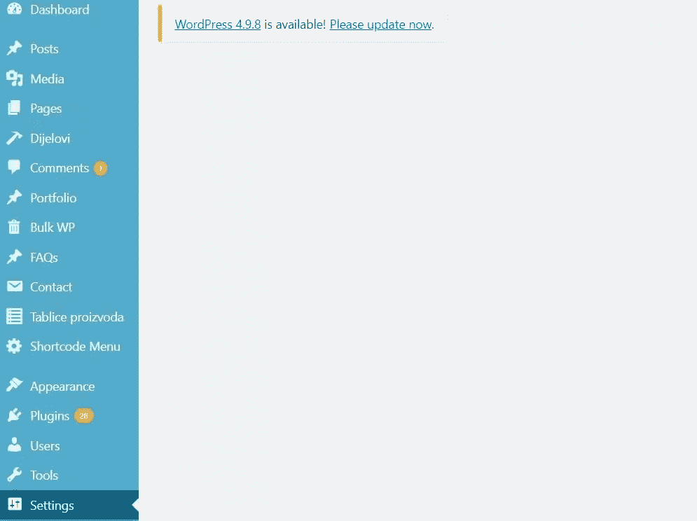
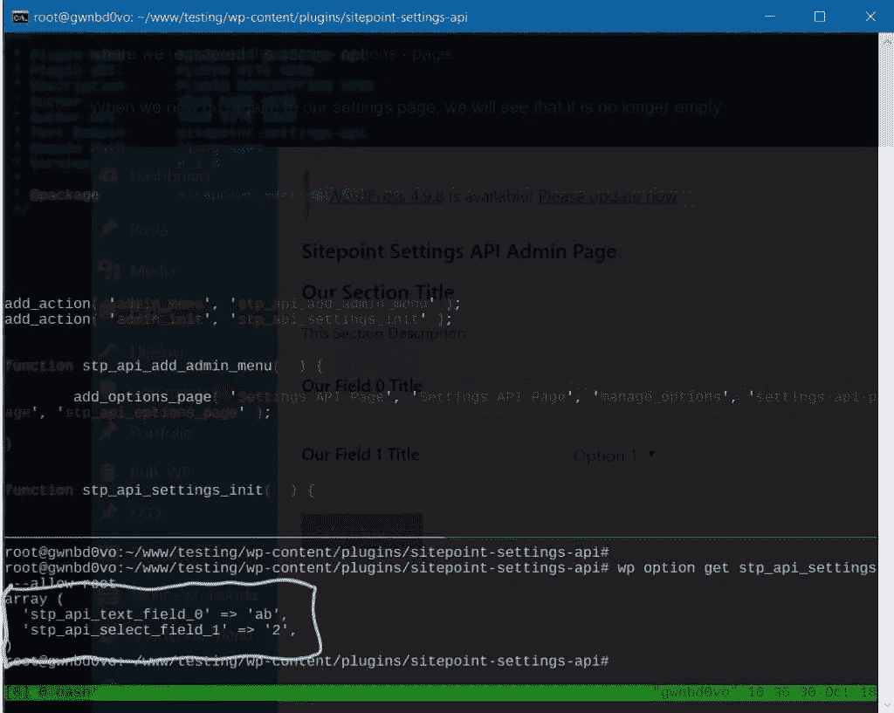
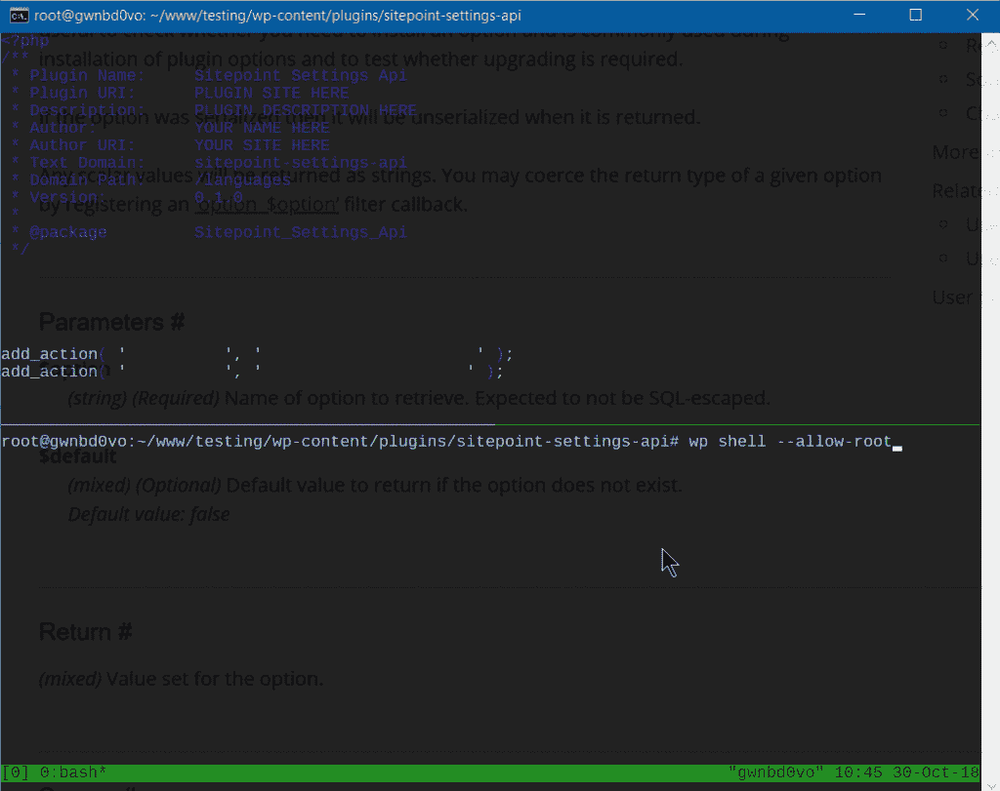

# 使用 WordPress 设置 API 来构建一个定制的管理页面

> 原文：<https://www.sitepoint.com/wordpress-settings-api-build-custom-admin-page/>

在本指南中，我们将介绍 WordPress 设置 API，并创建一个 WordPress 管理页面来演示该 API 的使用。

出于本教程的目的，我们将把这个功能包装到一个插件中，但是这也可以是 WordPress 主题的一部分。

正如 WordPress Codex 所说，设置 API 是在 WordPress 2.7 中添加的，以简化在管理页面中添加不同的设置字段和部分。

## 创建插件

首先，我们将创建并激活一个插件来封装我们的选项页面。我们将使用 WP CLI 来简化创建，尽管这会给我们留下比本指南所需更多的文件。

<video class="wp-video-shortcode" id="video-169922-6" width="822" height="352" preload="metadata" controls=""><source type="video/mp4" src="https://uploads.sitepoint.com/wp-content/uploads/2018/11/1541423763plug.mp4?_=6">[https://uploads.sitepoint.com/wp-content/uploads/2018/11/1541423763plug.mp4](https://uploads.sitepoint.com/wp-content/uploads/2018/11/1541423763plug.mp4)</video>

正如我们所见，我们使用`wp scaffold plugin pluginname`来创建插件。一旦创建了它，我们就激活它——也可以选择使用 WP CLI 和`wp plugin activate pluginname`。

一旦它被激活，我们打开主插件文件——在本例中是`sitepoint-settings-api.php`。

## 创建管理页面

这个插件没有必要使用 WP CLI。我们可以简单地用插件的名称创建一个目录，并在其中创建同名的 PHP 文件。总之，插件的创建给我们留下了一个`sitepoint-settings-api.php`,看起来像这样:

```
<?php
/**
 * Plugin Name:     Sitepoint Settings Api
 * Plugin URI:      PLUGIN SITE HERE
 * Description:     PLUGIN DESCRIPTION HERE
 * Author:          YOUR NAME HERE
 * Author URI:      YOUR SITE HERE
 * Text Domain:     sitepoint-settings-api
 * Domain Path:     /languages
 * Version:         0.1.0
 *
 * @package         Sitepoint_Settings_Api
 */
~ 
```

现在我们可以简单地在注释结束后添加代码。

为了添加我们的选项页面，我们将使用`add_options_page()`(关于它的更多细节[在这里](https://developer.wordpress.org/reference/functions/add_options_page/))。该函数采用如下参数:

```
add_options_page( $page_title, $menu_title, $capability,
    $menu_slug, $function ); 
```

所有的论点都是不言自明的。`$menu_slug`必须是 WordPress 内部使用的唯一字符串，但也会反映在 URL 中。`$function`是一个字符串，带有为我们的管理页面提供 HTML 输出的函数名。

因此，我们将在插件文件中添加以下代码:

```
add_action( 'admin_menu', 'sitepoint_settings_page' );

function sitepoint_settings_page() {
    add_options_page( 'Settings API Page', 'Settings API Page', 'manage_options', 'settings-api-page', 'settings_api_page' );
} 
```

在我们保存文件后(假设我们激活了插件)，我们将打开我们的管理仪表板，我们将在左侧菜单的**设置**下找到我们的**设置 API 页面**。

在某种程度上，我们可以通过向我们的`add_action()`函数添加一个优先级参数来控制子菜单项的顺序或位置:

```
add_action( 'admin_menu', 'sitepoint_settings_page', 1 ); 
```

如果我们想让我们的菜单项在根菜单中——而不是在**设置**子菜单中——我们将使用`add_menu_page()`，它[采用类似的参数](https://developer.wordpress.org/reference/functions/add_menu_page/)。

现在，如果我们在浏览器中打开页面，我们将会看到一个空白页面，因为我们还没有创建我们指定的`settings_api_page()`函数:



## 设置 API

WordPress 设置 API 是一个复杂的机制，试图为开发者提供一个简单的方法来创建设置页面。

在我们进入设置页面显示和保存设置到 WordPress 数据库的完整例子之前，我们将解释 WordPress 作为其[设置 API](https://codex.wordpress.org/Settings_API) 的一部分提供的几个关键功能。

**[register _ setting()](https://developer.wordpress.org/reference/functions/register_setting/)**是我们用来注册一个设置的函数，它等于`wp_options`表中的一行。在我们可以创建实际字段(或者字段，因为设置可以是一个值数组)之前，我们需要注册它。这样我们将利用 WordPress [CRUD](https://en.wikipedia.org/wiki/Create,_read,_update_and_delete) 机制进行设置。函数参数如下:

```
register_setting( string $option_group, string $option_name, array $args = array() ) 
```

前两个参数是强制的，第一个允许我们给它分配字段，正如我们将看到的，`$option_name`是 WordPress 数据库中实际的选项名称。

**[add _ settings _ section()](https://developer.wordpress.org/reference/functions/add_settings_section/)**为管理页面定义/添加一个部分。其论点如下:

```
add_settings_section( string $id, string $title, callable $callback, string $page ) 
```

`$callback`是一个输出该部分的 HTL 标题的函数(它可以是空的)，而`$page`是我们将在上面显示的管理页面的 slug。

**[add _ settings _ field()](https://developer.wordpress.org/reference/functions/add_settings_field/)**在管理选项页面的设置部分定义一个设置字段。它的论据是:

```
add_settings_field( string $id, string $title, callable $callback, string $page, string $section = 'default', array $args = array() 
```

其中，`$id`、`$title`、`$callback`和`$page`为必填项。函数`$callback`应该输出输入字段的 HTML。

设置 API 为`add_settings_section`和`add_settings_field`提供了`$page`参数，作为向现有设置页面添加部分和字段的一种方式。我们将把`stpPlugin`用于我们的选项组——在`register_setting()`中——以及在`add_settings_section()`和`add_settings_field()`函数中将设置部分和设置字段附加到‘stpPlugin’页面。然后，我们将在示例中的下两个函数中“引用它”,以输出相关的 HTML。

**[settings _ fields()](https://developer.wordpress.org/reference/functions/settings_fields/)**输出*“设置页面的 nonce、action 和 option_page 字段”。*它接受在`register_setting()`中使用的`$option_group`参数。

**[do _ settings _ sections()](https://developer.wordpress.org/reference/functions/do_settings_sections/)**输出所有的节，用它们各自的字段，注册为一个特定的$页面。

`$page`是这里唯一的论点。

解释完这些函数后，我们现在来看一些实际的代码。我们将之前添加到`sitepoint-settings-api.php`文件中的 PHP 代码替换为以下代码:

```
add_action( 'admin_menu', 'stp_api_add_admin_menu' );
add_action( 'admin_init', 'stp_api_settings_init' );

function stp_api_add_admin_menu(  ) {
    add_options_page( 'Settings API Page', 'Settings API Page', 'manage_options', 'settings-api-page', 'stp_api_options_page' );
}

function stp_api_settings_init(  ) {
    register_setting( 'stpPlugin', 'stp_api_settings' );
    add_settings_section(
        'stp_api_stpPlugin_section',
        __( 'Our Section Title', 'wordpress' ),
        'stp_api_settings_section_callback',
        'stpPlugin'
    );

    add_settings_field(
        'stp_api_text_field_0',
        __( 'Our Field 0 Title', 'wordpress' ),
        'stp_api_text_field_0_render',
        'stpPlugin',
        'stp_api_stpPlugin_section'
    );

    add_settings_field(
        'stp_api_select_field_1',
        __( 'Our Field 1 Title', 'wordpress' ),
        'stp_api_select_field_1_render',
        'stpPlugin',
        'stp_api_stpPlugin_section'
    );
}

function stp_api_text_field_0_render(  ) {
    $options = get_option( 'stp_api_settings' );
    ?>
    <input type='text' name='stp_api_settings[stp_api_text_field_0]' value='<?php echo $options['stp_api_text_field_0']; ?>'>
    <?php
}

function stp_api_select_field_1_render(  ) {
    $options = get_option( 'stp_api_settings' );
    ?>
    <select name='stp_api_settings[stp_api_select_field_1]'>
        <option value='1' <?php selected( $options['stp_api_select_field_1'], 1 ); ?>>Option 1</option>
        <option value='2' <?php selected( $options['stp_api_select_field_1'], 2 ); ?>>Option 2</option>
    </select>

<?php
}

function stp_api_settings_section_callback(  ) {
    echo __( 'This Section Description', 'wordpress' );
}

function stp_api_options_page(  ) {
    ?>
    <form action='options.php' method='post'>

        <h2>Sitepoint Settings API Admin Page</h2>

        <?php
        settings_fields( 'stpPlugin' );
        do_settings_sections( 'stpPlugin' );
        submit_button();
        ?>

    </form>
    <?php
} 
```

这里我们将`stp_api_settings_init()`函数与`admin_init`挂钩。在这里，我们定义并注册我们的设置、部分和字段。

`stp_api_text_field_0_render()`和`stp_api_select_field_1_render()`定义了我们的两个字段，文本和选择字段的 HTML 输出，这两个字段属于数据库中`wp_options`表中的同一个`stpPlugin`组和`stp_api_settings`选项-或设置。

最后，我们定义了`stp_api_options_page()`，它为我们的管理选项页面输出 HTML。我们将设置部分和字段合并到其中。我们在文件顶部的`stp_api_add_admin_menu()`函数中引用了这个函数，我们在这里注册了 admin (options)页面。

当我们再次转到我们的设置页面时，我们会看到它不再是空的:


如果我们尝试更改并保存这些字段，我们将在刷新时看到它起作用了！WordPress 为我们抽象出了数据库事务、随机数等。

我们可以进一步添加一些验证功能，进一步设计这个页面的样式，等等。

如果我们转到 WP CLI 并尝试运行`wp option get stp_api_settings`——在我们更改了这两个字段的一些值之后——我们将得到这样的结果:



这向我们展示了这两个字段作为数组的字段保存在我们的`wp_options`数据库中，作为`stp_api_settings`设置。

如果我们现在转到 WP CLI shell，我们可以尝试在插件或主题文件中获取这些选项的代码:



## 结论

WordPress 因其易用性和对开发者温和的学习曲线而在网络行业中变得突出。设置 API 就是这种用户友好性的一个例子。

在本指南中，我们介绍了 WordPress 设置 API。关于这个话题还有更多的话可以说，但是我们在这里介绍的内容应该能够揭开这个话题的神秘面纱，让足智多谋的黑客们能够以此为起点构建他们自己的解决方案。

## 分享这篇文章