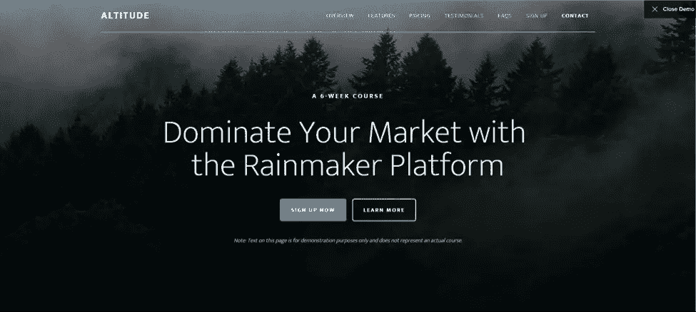
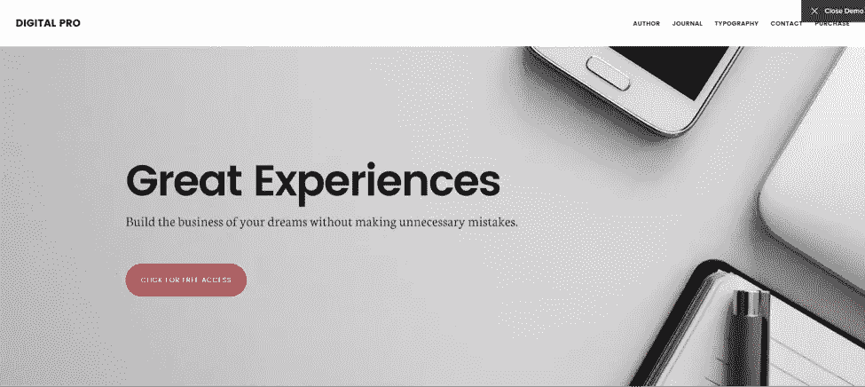
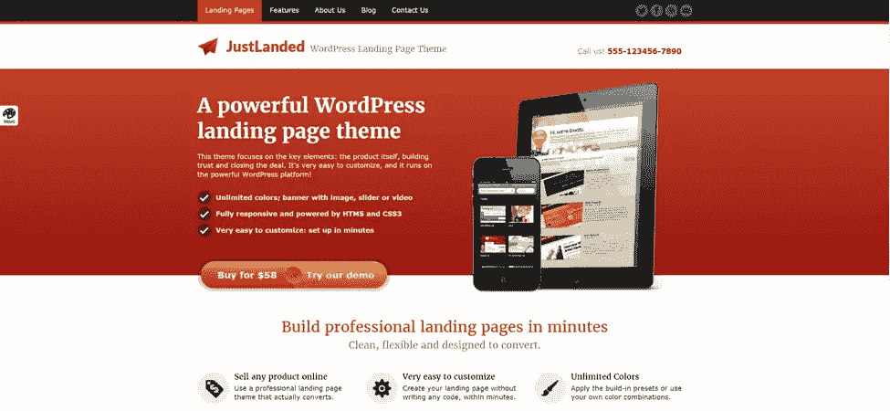
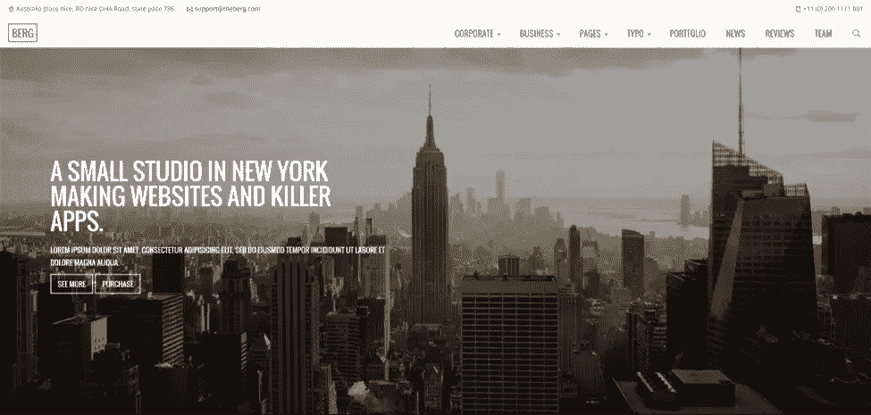
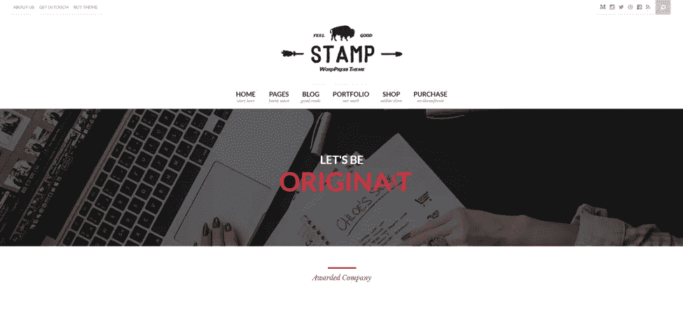
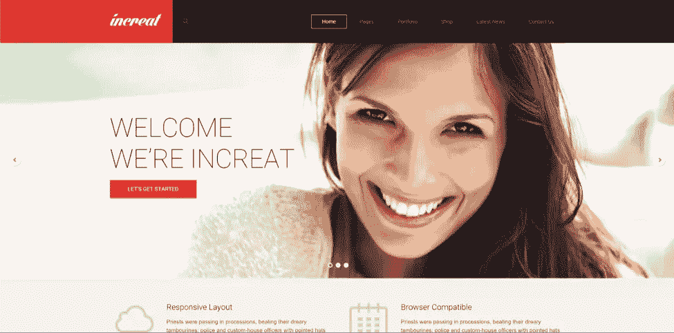
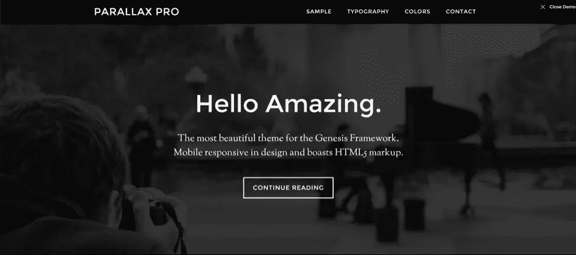

# 8 个引人注目的 WordPress 主题和销售就绪登陆页面

> 原文：<https://www.sitepoint.com/wordpress-themes-with-sales-ready-landing-pages/>

我们都知道 WordPress 是 DIY 网站的最佳解决方案。几乎任何小企业都可以利用该软件在短时间内建立并运行一个功能齐全的网站。

然而，如果你走的是 DIY 路线，你可能是在寻求成本最小化。你并不希望附加一堆每月 50 美元的服务。你现在需要结果。

在我看来，相信我，我不会使用免费的 WordPress 主题。如果你有兴趣从你的网站赚钱，50-100 美元的一次性付款与你从下面列出的主题中获得的价值相比是微不足道的。另外，如果你不是一个开发者，你将得到的高级主题的支持本身就很容易超过 100 美元。

如果你的目标是立即转化，你需要一个 WordPress 主题和一个设计良好的内置登陆页面。这将允许您“开箱即用”地开始销售，而不需要设计和设置自定义或第三方登录页面，这将花费您 50 多美元。

下面的 WordPress 主题将会给你开始用你的网站赚钱所需要的一切。每个都包括一个可定制的主页，旨在转换。我为我的大多数客户以及我自己的个人网站使用这些主题。

我们开始吧！

## [创世纪高空专业主题由 StudioPress](http://my.studiopress.com/themes/altitude/)

如果你想要伟大简单的主题，StudioPress 上关于创世纪框架的任何东西都是很好的选择。然而，他们最近的几个主题，为一个更完整的主题添加了恒星转换聚焦的主页。

高原专业允许您创建一个惊人的英雄镜头，就像你在上面看到的。它是销售在线课程的理想选择，并预先定制了更深、更朴实的配色方案。

## [2。StudioPress 的 Genesis Digital Pro 主题](http://my.studiopress.com/themes/digital/)

Digital Pro 是另一个看起来很神奇的创世纪主题。与 Altitude Pro 相比，Digital Pro 提供了一个时尚、现代的模板，非常适合技术领域的企业。

这个主题要求你按照 StudioPress 的文档进行正确设置，但是如果你能够阅读并按照指示操作，你将不会有任何问题。StudioPress 文档是首屈一指的。

## [3。克里西的 Enfold 多功能(启动)主题](http://themeforest.net/item/enfold-responsive-multipurpose-theme/4519990)

Enfold 多功能主题可以配置成多种多样的布局和外观。有了现有的最先进的构建器之一，设置它就像点击一样简单。

Enfold 已经从 ThemeForest.net 下载了令人难以置信的 83，000+次，对于一个希望在有限的时间内获得一个专业网站的 WordPress 新手来说，它是一个完美的主题。

## [4。ShapingRain 的公正主题](http://themeforest.net/item/justlanded-wordpress-landing-page/3804089)

虽然如今许多品牌都在寻找更时尚、更现代的外观，但这种设计风格往往会带来更具创意的氛围。

JustLanded 是希望向新访客展示更线性专业精神的企业的完美主题。它拥有“专业服务”的风格，但针对现代世界进行了更新——非常适合职业领域的企业或与老年人打交道的企业。

## [5。马斯坎的伯格多用途(创意)主题](http://themeforest.net/item/berg-multipurpose-responsive-theme/13210984)

另一个干净的，现代的，多用途的主题，Berg 允许即使是 WordPress 的初学者也能得到一个高端网站的外观。Berg 的许多主题和布局选项使它成为设计任何数量的网站外观的一站式商店。

## [6。Pirenko 的邮票(公司)主题](http://themeforest.net/item/stamp-vibrant-wordpress-theme/10889581)

Stamp 旨在帮助品牌发表声明。它提供了许多特别的主页布局，其中“公司”是我个人最喜欢的。无论你是想进入一个电子商务商店还是一系列的服务登录页面，Stamp 都是市场上最好的转换主题之一。

## [7。渐进主题研究](http://themeforest.net/item/increat-responsive-multipurpose-theme/6533618)

大多数好的 WordPress 主题都有相似的外观。毕竟，你只能在登陆页面上做这么多事情。

Increat 打破了这一规则，提供了为数不多的真正独特的外观。很大胆。它是多彩的。它被设计用来转换。虽然最适合展示一些时尚的品牌，但这种多才多艺的主题可以在几乎任何流派中引起轰动。

## [8。创世纪视差 Pro 主题由创世纪](http://my.studiopress.com/themes/parallax/)

Parallax Pro 主题的大胆程度不亚于它们的出现。它的股票排版集是我个人的最爱之一，主题的每一寸都在呐喊“权威”。

如果你正在寻找一个简单，精简的设计，突出你的文案，并把人们带到你想要他们去的地方，没有比 Parallax Pro 更好的了。当然，它伴随着作为创世纪框架中的一个研究主题的所有额外好处。

## 为销售线索捕获设置您的主题

一旦你用上面的一个主题创建了你的网站和主页，你需要建立一个线索捕获系统。

我在以前的文章中介绍了线索捕捉和电子邮件营销，您可以在这里查看:

*   [把你的 WordPress 网站变成一台电子邮件营销机器](https://www.sitepoint.com/wordpress-email-marketing/)
*   8 个热门的 WordPress 弹出式插件以及为什么你应该尝试它们

这将使你加快速度，这样你就可以用高转化率的弹出窗口来补充你的直接报价，并开始捕捉线索和访客。

有了这个组合，你可以用不到 100 美元就可以建立一个高转化率的网站。

## 分享这篇文章