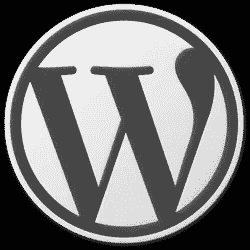

# WordPress 商标转让给 WordPress 基金会

> 原文：<https://www.sitepoint.com/wordpress-trademark-transferred-to-wordpress-foundation/>

上周，[automatic](http://automattic.com/)和 WordPress 的创始人马特·莫楞威格在他的博客上宣布， [WordPress 商标已经转让给 WordPress 基金会](http://ma.tt/2010/09/wordpress-trademark/)。这是什么意思？这意味着 WordPress 的身份——它的名字——现在完全独立于任何公司。

WordPress 基金会是一个非盈利组织"*促进并确保永久访问 WordPress 和相关开源项目"。作为对声明的回应，WordPress 基金会表示*

> 一家公司放弃价值数百万的商标是非常不寻常的(至少可以这么说)，Automattic 的这一举动非常慷慨，也非常有社区意识。

WordPress 商标最早是由 Automattic 在 2006 年注册的，当时它还是一家小公司。该公司发展迅速，毫无疑问，WordPress 是最常用的在线博客平台之一。Mullenweg 说，他的目标是将非营利性和营利性服务结合在一起。WordPress 这个词现在被保护为“开源自由的灯塔”。

那么 WordPress 的商标政策是什么？

1.  我们希望让任何人都可以方便地使用 WordPress 的名称或标志，以面向社区的方式帮助推广和改进 WordPress。
2.  我们想弄清楚与 WordPress 相关的企业和项目如何能够(和不能够)使用 WordPress 的名称和标志。
3.  我们想让任何人都难以使用 WordPress 的名称和标志来不公平地获利，欺骗或迷惑那些正在寻找官方 WordPress 资源的人。

在任何项目、产品、服务、域名或公司名称中使用 WordPress 的名称或标志需要得到 WordPress 基金会的许可。你可以也应该在 [WordPress Foundation 商标使用政策](http://wordpressfoundation.org/trademark-policy/)上阅读使用标志和名称的全部条款和条件。

## 分享这篇文章