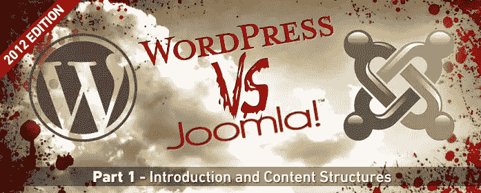
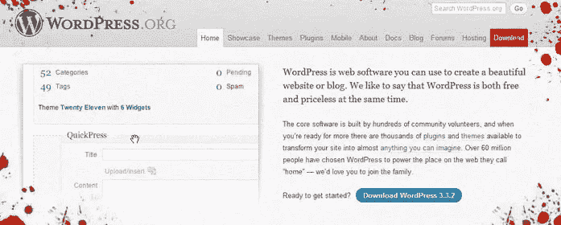
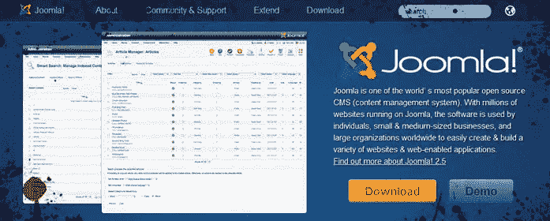

# WordPress v Joomla:简介和内容结构

> 原文：<https://www.sitepoint.com/wordpress-v-joomla-introduction-and-content-structures/>

WordPress 和 Joomla 的争论已经持续了很多年，不，是一场全面的战争。这场 CMS 巨头之战的问题是，它主要是由有偏见的个人进行的，而不是从客观的角度进行辩论。

我不是第一个讨论这个话题的人，当然也不会是最后一个。然而，我觉得最近 Joomla 和 WordPress 之间没有真正好的比较。因此，SitePoint 将为您带来一系列文章，讨论 WordPress 和 Joomla 在 2012 年的主要比较领域。这是你在六篇博文中可以看到的:

*   WordPress 和 Joomla 简介
*   Joomla 模板 v WordPress 主题/模板
*   WordPress 和 Joomla 的定制潜力——插件、扩展等
*   WordPress SEO v Joomla SEO
*   支持部门 Joomla 好还是 WordPress 好？
*   *冠军*揭晓！

## **WordPress 简介**

WordPress 确实不需要介绍，因为它是目前世界上使用最广泛的内容管理系统。但是，我想提请您注意以下信息:

### **技术资料**

WordPress CMS 基于 PHP，像大多数内容管理系统一样，使用 MySQL 进行数据库管理。出于这些原因，你需要确保你使用的 Apache (Linux)主机启用了 mod_rewrite(用于 URL 重写),因为它*将*使你的生活变得更加容易。

WordPress 是在 GNU GPL 下授权的，GNU GPL 概述了 CMS 如何被公众使用。

### **单机 v 托管**

值得注意的一点是，WordPress 在[wordpress.com](http://wordpress.com/ "Wordpress")提供了独立的 CMS 和托管的 WordPress 工具——所以即使你没有自己的域名，也不意味着你不能运行自己的网站。

值得注意的是，如果你使用 wordpress.com 来托管一个网站，你的网站地址将类似于 yoursitename.wordpress.com。出于这个原因，我总是建议投资一个便宜的托管账户，注册你自己的域名，这样你就可以使用 WordPress CMS 的独立版本，它可以从[wordpress.org](http://wordpress.org/ "Wordpress")获得。

WordPress 的 wordpress.com 版本也比自托管版本有更多的限制。

### **从那时到现在**

WordPress 创建于 2003 年，是 b2/cafelog 的继任者，当时显然有 2000 名用户。这个系统是由马特·莫楞威格和迈克·利特尔以及 b2/cafelog 的开发者米歇尔·瓦尔迪里奇共同创建的。

自成立以来，WordPress 已经发展成为互联网上最受欢迎的内容管理系统，目前托管着大约 25%的顶级网站和大约 15%的 Alexa 互联网“前 100 万”网站。【[来源](http://techcrunch.com/2011/08/19/wordpress-now-powers-22-percent-of-new-active-websites-in-the-us/)。它目前的版本是 3.4，路线图建议版本 3.5 到 3.6 应该在 2012 年发布。

WordPress 有数以千计的知名品牌作为其 CMS 的活跃推荐。目前使用 WordPress 的一些比较流行的网站是:

*   [Mashable](http://mashable.com/)
*   [探测器](http://problogger.net/)
*   [Techcrunch](http://www.techcrunch.com/)
*   [福特的故事](http://social.ford.com/)

当然，SitePoint 本身是使用 WordPress 创建的！

### **WordPress CMS 的内容结构**

WordPress 的内容结构基本上分为页面和文章。页面通常用于静态内容(例如关于我们的页面)，而文章是你的定期更新(例如博客文章)。每个页面/帖子可以分配到一个菜单，这将形成你的网站的基础。

文章被分成不同的类别，并通过使用标签来进一步定义。

然后可以使用小部件在基本内容中或周围添加附加内容。小部件可以放在页面的几个地方，你可以定义你不希望显示每个小部件的页面。有许多本地可用的小部件，包括标签云、最近文章小部件、文章类别和一大堆其他的小部件。

可以通过下载和安装插件来增加 WordPress 的功能。有数以千计的插件可以执行几乎所有你能想到的功能。你可以使用插件将你的网站变成一个电子商务商店，一个下载库，一个体育统计网站和许多其他怪异而奇妙的应用程序。

现在我们来看看 Joomla CMS。

## **Joomla 简介**

虽然 Joomla 很容易被认为是第二受欢迎的 CMS(抱歉，Drupal 的粉丝)，但公平地说，对于许多不熟悉网页设计/博客或者甚至不确定 CMS 是什么的人来说，它仍然是相对陌生的。

### **技术细节**

Joomla 和 WordPress 一样，是基于 PHP 和 MySQL 的，这意味着你也应该考虑在这里使用 Apache 主机。

我觉得 Joomla 的文件结构比 WordPress 的文件/内容结构更加混乱。我们花在破解 Joomla 面向对象代码上的时间比我们花在 WordPress 上的时间要多得多。然而，对于普通用户来说，这不是什么大问题。

与 WordPress 不同，Joomla 没有托管设施。这意味着你需要拥有自己的 Joomla 网站和自己的域名来使用 CMS。

### **从那时到现在**

Joomla 创建于 2005 年，部分是作为 Mambo 的继承者。J！开发团队创建了 Joomla 项目，以回应 Mambo 创始人的一个有争议的举动，他们将该项目变成了一个非营利组织。开发团队还发起了一场名为“OpenSourceMatters.org”的运动，几个小时内就有数百名粉丝表达了他们的支持。

Joomla 创建的目的是创建一个免费的开源 CMS，以及一个以 CMS 为中心的伟大的在线社区。

Joomla 刚刚发布了 2.5 版本，似乎正在有意识地定期发布新功能的更新。这很好:我们终于开始看到 Joomla 集成了一些从一开始就应该有的功能。缺点是，频繁的更新通常意味着我们需要等待扩展开发者更新他们的组件，然后才能成功更新到 Joomla 的最新版本。

虽然 Joomla 不像 WordPress 那样大张旗鼓，但仍然有一些大公司选择 Joomla 作为他们的 CMS。

Linux.com 是在其网站上使用 Joomla 的最大品牌之一，并且已经成功使用了多年。有趣的是，阿拉伯半岛的麦当劳[也选择 Joomla](http://community.joomla.org/blogs/community/1272-mcdonalds-uses-joomla.html) 支持他们的网站。

另一个使用 Joomla 的名人是 ebay.com 的易贝。易贝使用 Joomla 来管理他们 16，000 多名员工的内部网。这个应用程序特别强调了 Joomla 的强大。

### **Joomla 内容结构**

起初，Joomla 似乎比 WordPress 稍微复杂一些。我的观点是，这仅仅是因为它对不同内容项的命名，以及实现某些目标的一些稍微不太明显的方式。出于这个原因，大多数开始使用 Joomla 的人发现弄清楚内容结构有点像学习曲线，这通常会导致他们完全放弃 Joomla。

这些人最初不明白的是，Joomla 的内容结构与 WordPress 非常相似。

文章或组件生成页面的主要内容。使用菜单项将内容链接到菜单，菜单项基本上为特定内容的显示提供了载体。菜单项可以是许多不同的东西——例如，一个菜单项可以设置为显示一篇文章、一整类项目、已安装的扩展/组件的输出(例如联系表单组件),甚至是一个外部 URL。

这与 WordPress 的功能略有不同，在 WordPress 中，功能通常是通过嵌入相关插件提供的一小段代码(Shortcode)来添加到页面中的。

模块相当于 Joomla 的小部件。模块显示在主要内容的周围，通常用于添加一些外围内容；例如天气模块、登录模块或最新新闻模块。

Joomla 的菜单也需要使用模块来创建，否则它们不会出现在任何地方！这也正是 WordPress 菜单的功能。需要创建一个菜单小部件，它将被设置为在特定位置显示特定的菜单。

Joomla 可以通过使用组件、模块和插件来扩展，所有这些都可以从 Joomla 扩展目录中下载。WordPress 使用术语“插件”来包含它的所有扩展，Joomla 试图通过按照扩展执行的功能对扩展进行分组来缩小范围。不幸的是，我认为这是让第一次使用的用户有点困惑的地方之一。

## **结论**

很明显，WordPress 是两个系统中更受欢迎的。也就是说，WordPress 也比 Joomla 大几岁。

WordPress 的创建是为了让内容创建者能够轻松发布内容。它目前被用作博客平台的选择。我的观点是，这正是博客/内容监管的优势所在，但在其他部门可能没有这么灵活。

Joomla 通常用于稍微静态的网站，也用于更高级的用途，如易贝内部网。这并不意味着它不能驱动博客或面向内容的网站，但我倾向于发现它不是每个人的首选。

WordPress 的内容结构对新手来说更容易掌握，而 Joomla 的第一次用户往往很难掌握某些功能的术语和应用。

在下一篇文章中，我们将讨论 Joomla 和 WordPress 的模板。在此期间，你更喜欢哪个 CMS？请在评论中告诉我！

## 分享这篇文章