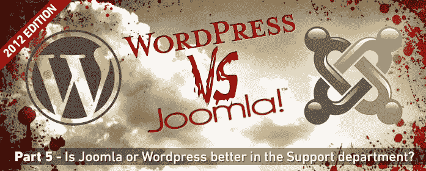
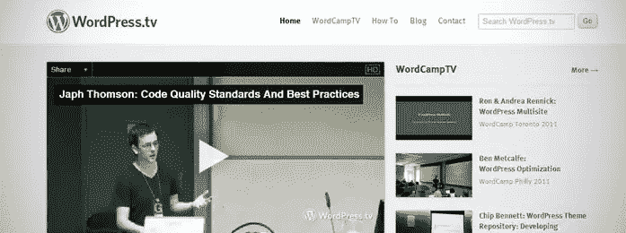

# WordPress v Joomla:支持和社区

> 原文：<https://www.sitepoint.com/wordpress-v-joomla-support-and-community/>

让我们面对现实吧，一个没有彻底的用户基础、支持系统和社区的开源内容管理系统是注定要失败的。我们在这里比较 CMS 游戏中的两个巨头，所以我们已经知道他们在这些部门做了很多正确的事情。在我们系列的这一部分中，我们将详细介绍 Joomla 和 WordPress 在支持社区方面所提供的内容。

## WordPress.org 诉 Joomla.org

还有什么地方比每个 CMS 的“家”更适合开始关于支持和社区的帖子呢？WordPress 和 Joomla 的所有文档、论坛和社区参与都来自它们的网站。

每个 CMS 似乎有一个非常不同的方法，当谈到他们的网站。WordPress 选择了极简的方式，而 Joomla 似乎在设计和功能上下了很大功夫。

在最近的设计更新后，我不得不说 Joomla 网站比 WordPress.org 网站更有吸引力和用户友好，后者给人的印象是平淡无奇，似乎没有任何重点和方向。

就我个人而言，我觉得 WordPress 正在固步自封。Joomla 背后的人，另一方面，似乎意识到他们是弱者，并通过他们的网站和各种组件有意识地努力发展社区和支持他们的 CMS 的基础。

## 支持基础和社区

说到开源系统，支持是至关重要的。WordPress 和 Joomla 都有足够的文档，所以我不打算关注这个领域。支持基础的主要焦点应该是 CMS 的社区支持。在支持社区这个更广泛的主题中，有几个方面值得关注。

### 支持论坛

每当我为一个特定的问题寻找支持时，我首先会求助于支持论坛。一个论坛可以给你一个很好的指示社区是多么活跃和支持。WordPress 和 Joomla 都有非常活跃的支持论坛。

然而，我还是觉得 Joomla 在论坛方面做得比 WordPress 好得多。作为两个论坛的参与者，我在 Joomla 论坛上看到了更多来自社区的参与和投入。WordPress 给人的感觉非常乏味，论坛几乎是一种事后的想法。

Joomla 利用流行的论坛组件 phpBB 来运行它的论坛。它通过排名系统奖励积极参与的会员。因此，Joomla 的专业人士似乎更愿意去帮助那些碰巧遇到麻烦的人。

我在 WordPress.org 论坛上有几个问题没有得到回答，而我在 Joomla 支持论坛上的每个问题都得到了出乎我意料的回答。我认为这说明了 Joomla 社区的一些问题。

### 资源目录

有时候你只是不想自己开发你的 CMS 网站。有时候你会遇到一些困难，需要专业人士来帮助你。WordPress 和 Joomla 对此都有解决方案。

WordPress 有个东西叫[WordPress Jobs](http://jobs.wordpress.net/)；它允许你发布问题/工作，然后专业人士可以接手。

Joomla 以 [Joomla 资源目录](http://resources.joomla.org/)的形式提供了一个稍微不同的解决方案。资源目录允许专业人员为他们自己或他们的企业创建列表。然后，您可以找到您所在地区的专业人士，直接联系他们来帮助您解决问题。

我喜欢 Joomla 的资源目录，因为只有当你是 Joomla 社区的积极参与者——无论是论坛、Joomla 杂志还是任何其他 Joomla 社区倡议——你的列表才会被批准。这对让支持社区成为一个对所有人都更好的社区来说是一个奇迹。

就 WordPress 乔布斯版块而言，我发现自己只是在使用像 Elance 这样的自由职业者网站。

### 其他举措

WordPress 和 Joomla 都有一些其他的计划来帮助支持和社区部门。

WordPress 有一个很棒的项目叫做[WordPress . TV](http://wordpress.tv/)——基本上是一个视频博客/目录，展示来自 WordPress 世界的教程和新闻。

Joomla 真的全力以赴加强社区倡议。我认为最棒的两个是 Joomla 杂志和 Joomla Connect。Joomla 杂志以在线和印刷出版物的形式出版，展示所有最棒的 Joomla 新闻和故事。它背后的人邀请任何愿意并能够写文章的人，分享他们的经验，并有可能在杂志上发表。

Joomla Connect 证明了它对改善社区的关注。Joomla Connect 旨在以多种不同的语言汇集来自世界各地的新闻。我认为认识到这一点非常重要，作为最受欢迎的内容管理系统之一，你的用户群远远超出了美国和英国。许多不同国家的人，说着数百种不同的语言，将会使用你的系统。通过将他们纳入社区，它获得了更多的多样性和体验，通常会带来更快乐、更投入的用户群。

Joomla 也有一个在线商店，你可以在那里购买 Joomla 商品。我不确定这是否至关重要，但有些人可能认为这很酷。

我试图寻找 WordPress 的更多举措，但老实说，我找不到其他值得评论的内容。

## 结论

我认为在这里哪个 CMS 在社区部门做得更好是相当明显的。Joomla 通过确保创建一个真正令人敬畏的、积极参与的社区来弥补其相对较小的用户群。Joomla 的网站更加完善，它积极鼓励人们参与它的许多社区网点。

坦白说，在写这篇文章之前，我认为两个 CMS 巨头在这个部门会更加势均力敌。然而，在做了几个小时的额外研究后，我可以肯定地说，WordPress 在社区方面做得还不够。也许 WordPress 的观点是不需要，因为它已经有了这么好的声誉。

话虽如此，我绝不建议固步自封。一旦你到达顶峰，要保持领先地位需要付出艰苦的努力，而且你可以相当肯定你的竞争对手正在加班加点试图击败你。

不过，请在这里得出你自己的结论。如果你不是一个喜欢社交的人，这可能对你来说并不重要。你可能会从 WordPress 和 Joomla 支持论坛上得到足够的答案…可能。

你认为下周谁会成为内容管理系统之王？请在评论中告诉我！

## 分享这篇文章