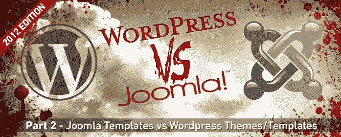
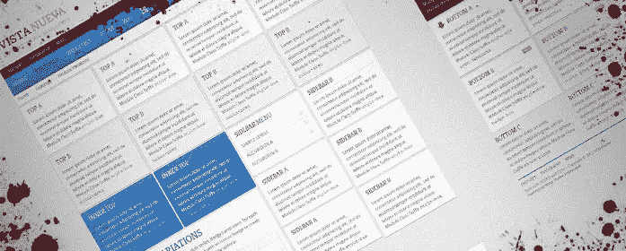

# 模板和主题

> 原文：<https://www.sitepoint.com/wordpress-v-joomla-templates-and-themes/>

欢迎来到我们系列的第 2 部分，涵盖 WordPress vs Joomla 争论的所有主要方面。今天我们将讨论 Joomla 和 WordPress 的模板、框架和主题。

## Joomla 模板和 WordPress 主题

从表面上看，Joomla 模板和 WordPress 主题似乎很相似。但是，有几个小细节需要注意，它们可能会影响您在这两个内容管理系统之间进行选择的决定。

### 模板/主题目的

我注意到主题和模板的一个趋势是，Joomla 模板的设计和开发似乎考虑到了通用性，而 WordPress 主题的设计考虑到了特定的目的——通常是面向内容的。

Joomla 的高级模板将包含所有的铃铛和哨子，这将有助于您为特定目的定制您的网站。另一方面，WordPress 主题似乎大多局限于一个单一的目的。如果你不是一个网页设计师，这使得定制主题来适应一些不是你想要的东西有点困难。

两种方式都有缺陷，但我不得不说我更喜欢这个部门的 Joomla。我宁愿有太多的选择，也不愿被设计所限制。

### 多个模板

我认为重要的是在一个网站内对多个模板的本地支持——换句话说，为网站上的不同页面选择特定模板/主题的能力。Joomla 提供了这个功能，而 WordPress 没有。我相信在 WordPress 中通过使用插件和定制可以做到这一点——但老实说，当 Joomla 能够在本地做到这一点时，我不会感到困扰。

这是值得考虑的规划你的网站。如果您需要使某个页面看起来与其他页面不同——不同的模板是您的最佳选择——您可能希望考虑为该网站使用 Joomla。

编辑:当我写这篇文章的时候，即使我做了一些调查，我认为 WordPress 没有提供多主题功能。事实证明确实如此，使用了一种叫做页面模板的东西。这允许您为不同的页面选择不同的模板。然而，我要说的是，我仍然觉得 Joomla 的多模板功能对最终用户来说更友好。对于开发者来说，可能就不是这样了。

### 开发自定义模板

对于那些想要构建自定义模板和主题的人，我无法报告 Joomla 和 WordPress 之间的主要区别。如果你花一些时间阅读这两种语言的文档，并掌握一些 HTML、PHP 和 CSS 的工作知识，你应该不会遇到什么大的困难。

尽管如此，我还是觉得 WordPress 在开发定制模板方面受到了限制。这可能是因为我是从 Joomla 开始的，并且已经知道在创建模板时我几乎没有任何限制。

如果你是一个经验丰富的网页设计师，你应该没有问题为任何一个 CMS 创建好看的模板/主题。如果你刚刚开始使用内容管理系统，我建议你购买一个优质的模板/主题，并根据你的需要进行调整。这将为你学习 Joomla 和/或 WordPress 的模板提供一个很好的起点。

## 模板框架

当设计一个 WordPress 站点时，我喜欢把它建立在 CMS 众多优秀框架中的一个之上。偶尔我也为 Joomla 网站这样做，但我倾向于发现 WordPress 可用的框架比 Joomla 可用的框架更好，事实上我更喜欢为 Joomla 编写定制模板，而不是 WordPress 主题。

### 什么是框架？

框架可以帮助你事半功倍地构建一个伟大的模板/主题，因为它提供了模板中应该有的非视觉元素和调整，否则就需要你自己添加。

诸如模块位置、IE6 警告消息(希望永远不会再看到)、后端控制面板和简单的排版控制是框架通常提供的一些东西。

一个好的框架将实现普遍接受的设计和开发实践。例如，许多框架都是基于 960 网格系统，这仍然是许多网页设计师的首选。他们还会通过压缩 CSS 和 JavaScript 来确保你的模板/主题为良好的页面加载时间而优化。最近我注意到一些框架包含了 Ajax 支持，并为其他插件提供了使用 Ajax 的接口。

一些更流行的框架已经被转换成完整的 HTML5 和 CSS3 框架，这对于构建一个符合现代技术的网站来说是非常棒的。2012 年的另一个重要特性是针对移动设备的优化。一个好的框架通常会提供选项来显示你的网站的移动友好版本。

### 我应该使用什么框架？

目前我推荐三个框架。其中两个有 Joomla 和 WordPress 的版本，另一个只有 WordPress 框架。

#### 扭曲框架由 [YooTheme](http://yootheme.com/themes/warp-framework)

WARP 框架可能是我目前最喜欢的，也是我在自己的网站上使用的。WARP 有 Joomla 和 WordPress 的版本。它完全兼容 HTML5 和 CSS3，并且包含了你期望从一个好的框架中得到的几乎所有的功能。

我最喜欢的是它有多轻便。它通过实现常见的页面速度优化(如 Javascript、CSS 和 HTML 压缩)来帮助您控制加载时间。

WARP 绝对是一个很好的选择，不管你选择哪个 CMS。

#### 龙门框架由 [RocketTheme](http://gantry-framework.org/)

龙门框架也适用于 Joomla 和 WordPress。它类似于 WARP 框架，但包含更多的定制选项。这使得它比 YooTheme 的选项要大一点，但是它仍然是一个很棒的使用框架。

它利用了 960 网格系统，并为您的网站定制和简化提供了看似无穷无尽的选项。

如果你在寻找曲速无法提供给你的东西，Gantry 是值得研究的。

#### 创世纪由[工作室制作](http://www.studiopress.com/themes/genesis)

Genesis 是与 Copyblogger 的一些人合作创建的一个框架，这意味着它很棒。

它是专为 WordPress 打造的，被一些互联网名人使用和推荐，包括马特·莫楞威格(WordPress 的创始人)、来自 Problogger 的 Darren Rowse 和 Chris Brogan。Genesis 的主要卖点是它为你的 WordPress 站点提供了一个搜索优化框架。

这个框架非常适合博客和内容驱动的网站，尽管它不是免费的，但如果你选择 WordPress 作为你的 CMS，它绝对值得一看。

## 结论

说到 WordPress 和 Joomla 的模板，这完全取决于你的个人喜好。如果你不是一个有经验的网页设计师，也不熟悉 HTML，CSS 和 PHP，你可能会找到一个很好的主题来满足你的需求。如果你是一个开发人员，你可能不会有任何系统的问题。选择你最熟悉的或者最符合你目的的。

我觉得 Joomla 是相当多才多艺的，对于熟悉 Joomla CMS 的人来说，真的没有设计上的限制。然而，如果你不想做太花哨的东西，WordPress 主题可能会很适合你——它们有利于极简设计。

在下面的评论中告诉我们你对 Joomla 模板、WordPress 主题和框架的体验。

## 分享这篇文章