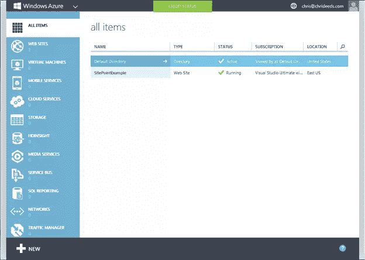
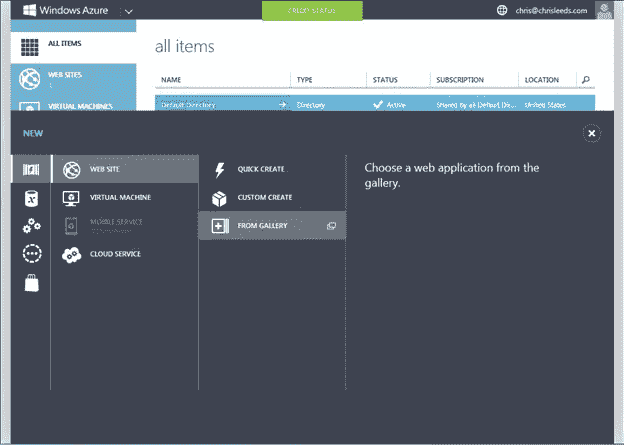
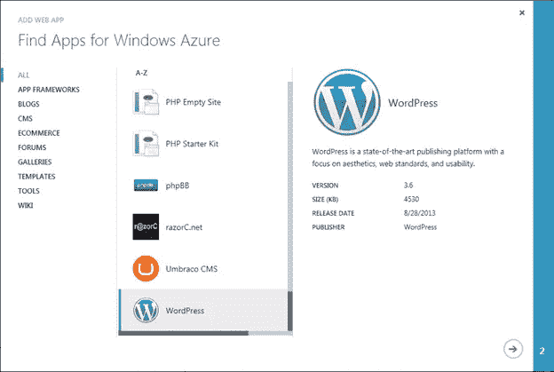
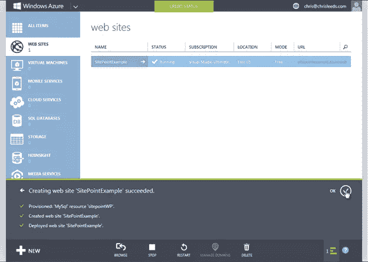
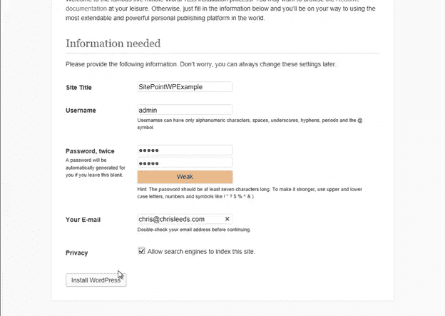
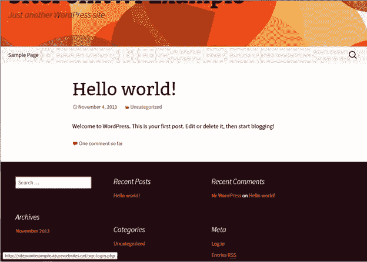

# 在 2 分钟或更短的时间内

> 原文：<https://www.sitepoint.com/wordpress-windows-azure-2-minutes-less/>

## 推动网络向前发展

SitePoint 与 Windows Azure 合作，通过“推动网络前进，赢得胜利！”活动送出 16，000 美元的现金奖励竞争。

比赛有三个不同的挑战:

*   将一个简单的 WordPress 站点部署到 Windows Azure，并写一个关于这个过程的简短条目，以赢得高达 500 美元的现金
*   将新的或现有的网站或应用程序部署到 Windows Azure，有机会获得 3000 美元现金
*   构建你一直在考虑的酷网站或应用程序，将其部署到 Windows Azure，你可能会赢得 5000 美元的现金

你说总共只有 8500 美元？还有第二名和第三名的现金奖励。

点击这里查看:[https://www . site point . com/community/t/push-the-web-forward-and-win/36018](https://www.sitepoint.com/community/t/push-the-web-forward-and-win/36018)

## 关于 Windows Azure

Windows Azure 于 2008 年在 PDC 上推出，是微软在云领域的广泛尝试。我第一次遇到它是在 2009 年的 MVP 全球峰会上。我立刻想到它对我这个典型的设计师/开发人员有什么用。

在高可靠性和高质量的服务器上发布网站的能力是我最感兴趣的，但这还远远不是服务的极限。这里有一个到 Windows Azure 文档的链接。

## 在 Windows Azure 上部署 WordPress

在接下来的步骤中，你将学习部署一个 WordPress 网站、数据库和域名，这样你将在两分钟或更短的时间内拥有一个面向公众的可运行的网站。

这将要求你在 Windows Azure 上拥有一个帐户，因此你必须在开始之前这样做。Windows Azure 帐户可以是完全免费的，也可以是预付费订阅或现收现付。你可以在这里找到他们[，也可以在这里](http://windowsazure.com/)注册免费试用[。](http://www.windowsazure.com/en-us/pricing/free-trial/) 

### 按照这些步骤，在不到 2 分钟的时间内在 Windows Azure 上建立并运行一个面向公众的 WordPress 站点！

1.  Log into the [Windows Azure Management Portal](https://manage.windowsazure.com/).

    

    在管理门户的“所有项目”视图中，您几乎可以做任何您能想到的事情。例如，你可以创建一个虚拟机，运行 Ubuntu(真的)，或者为移动设备创建一个基于云的应用程序，设置 VPN，媒体服务等等。你可以[在这里](http://www.windowsazure.com/en-us/documentation/)了解所有关于 Windows Azure 的功能。

2.  Click the **Web Sites** tab on the left side of the screen and at the bottom left of the screen click the **+New** button.

    

3.  指向**网站**，然后点击图库中的**。您将看到添加 Web 应用程序对话框。
    
    Windows Azure 应用程序库包含各种开源站点和应用程序，您只需点击几下鼠标即可快速部署。Windows Azure 应用程序库的 MSDN 博客是熟悉它的一个极好的资源。**
4.  向下滚动列表到 WordPress 应用程序。选择它，然后点击对话框底部的**继续**箭头。
    
5.  在站点设置对话框中，为新站点分配一个 **URL** ，确保在数据库字段中选择了**创建一个新的 MySQL 数据库**，并且**区域**条目反映了您选择的地理位置，然后单击**下一步**按钮。
    
    您的选择将开始 Windows Azure 上的设置和创建过程。如果您点击屏幕右下方的**运行任务**按钮，您可以看到发生的单个任务。在视图的内容区域中，您还会看到刚刚创建的新网站的一个条目。
6.  点击 URL 字段下方新网站的**链接**。
    
    你的新网站在浏览器中打开，WordPress 安装过程提示你填写剩余的必需信息。
7.  在站点标题字段中输入描述性的**标题**，然后在各自的字段中输入**用户名**、**密码**和**密码确认**以及您的**电子邮件地址**。在**隐私**栏旁边选择是否让搜索引擎索引该网站，然后点击**安装 WordPress** 按钮。
    
    Windows Azure 的安装现已完成，并且在您在第 5 步中配置的域中进行了内部安装。
8.  滚动到新网站默认页面的底部，点击**登录**链接。使用您在步骤 7 中创建的**用户名**和**密码**登录。你可以配置无数的选项，也可以执行各种开发任务，比如从 WordPress 仪表盘添加插件等等。WordPress 是一个社区开发的平台，于 2003 年首次发布，现在服务于超过 6000 万个网站。有数以千计的[插件](http://wordpress.org/plugins/)和[主题](http://wordpress.org/themes/)可以将你的网站改造成几乎[你能想象的任何东西](http://wordpress.org/showcase/)。

## 更进一步

从逻辑上来说，下一步你可能会想从 Windows Azure 服务器下载一份站点文件到你的本地计算机，这样你就可以继续开发和定制了。

你可以很容易地为你的 Windows Azure 站点设置 FTP 来做到这一点。如果你在 windows 机器上，你可能想检查一下 Windows Azure 管理门户网站视图右下角的 **WebMatrix** 按钮。

Web Matrix 按钮会把整个网站复制到你的本地机器上，在你的个人电脑上产生一个功能齐全的 WordPress 网站。然后，您可以将本地副本中的更改发布到云，只需在 Web Matrix 中单击 **Publish** ，它就会将其部署回 Windows Azure。

这就是你两分钟内将 WordPress 部署到 Windows Azure 的情况。你现在应该已经准备好参加我们的[推动网络前进](https://www.sitepoint.com/community/t/push-the-web-forward-and-win/36018)比赛了。

在不久的将来，在 SitePoint 上可以看到我对 Web Matrix 进行深入研究的教程。

## 分享这篇文章