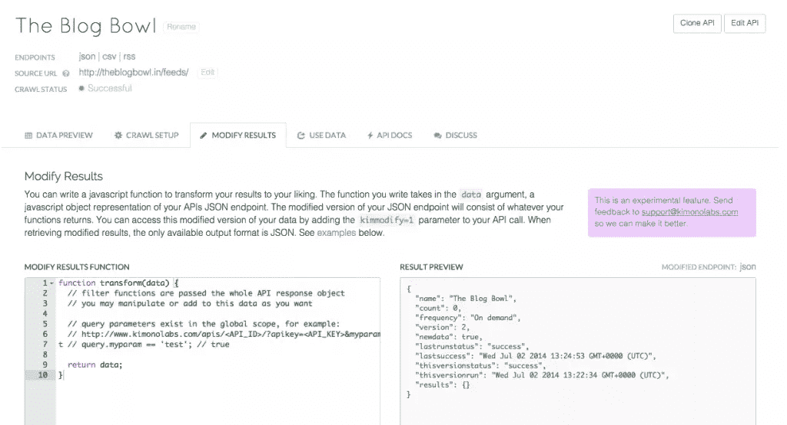
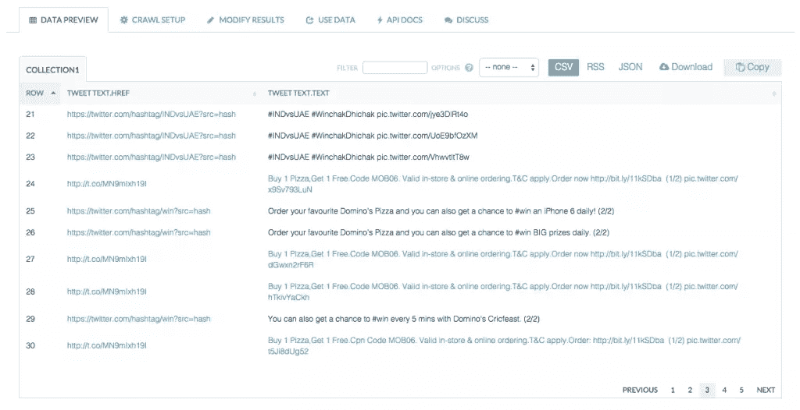
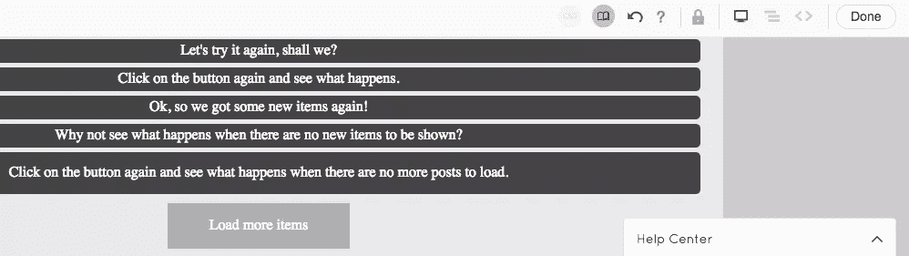
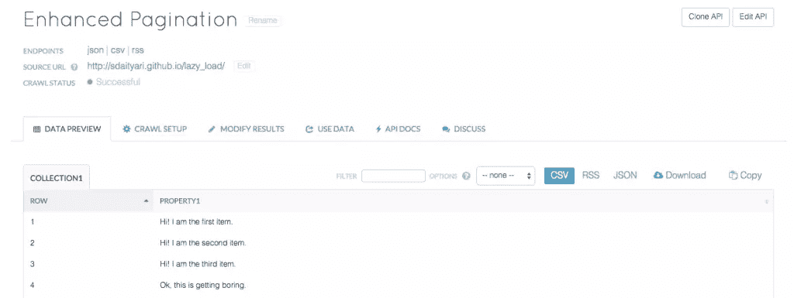

# 在和服中使用分页、无限滚动和 JavaScript

> 原文：<https://www.sitepoint.com/working-pagination-infinite-scroll-javascript-kimono/>

回到 2014 年 7 月，我发表了 [Web Scraper 的和服指南](https://www.sitepoint.com/web-scrapers-guide-kimono/)。作为一名网页抓取者，我得出结论，YC 资助的和服确实做了值得称赞的工作，但我也批评它的缺点——最重要的是分页的局限性。从那以后，我一直密切关注着和服实验室的发展。

特别是在过去的一个月里，他们发布了相当多的新特性，其中一些着重于我在之前的文章中提出的分页问题。因此，我决定重温和服，看看这些新的改进。

## 对 API 结果的 JavaScript 修改

我们要看的第一个特性是添加了一个 JavaScript API。它是最近作为一个实验性特性添加的，允许您在通过您创建的 API 提取结果后对其进行修改。

它有很多潜在的应用。通常，我们从网页中提取的数据不是我们想要的格式，需要后期处理来润色数据。通过使我们能够创建修改提取的数据的 JavaScript 函数，和服使我们能够通过消除对数据的任何微调的需要来使过程更快。

为了演示这样一个特性，让我们从登录到您的帐户后可用的 API 列表中选择我们创建的旧 API。在修改结果选项卡中，您可以看到一个文本框，您可以在其中输入将应用于结果的 JavaScript 函数。



提供的迷你编辑器非常有用，因为它会实时告诉您代码中是否有错误。让我们试着附加结果的总数

```
function transform(data) {    
  var total_count = 0,
    length = data.results.length;

  for (var i = 0; i &lt; length; i++) {
    total_count += data.results[i].length;
  }

  data.totalCount = total_count;

  return data;
}
```

这种增强的最大好处是，它不会在每次调用 API 时自动应用于您的数据。要对端点应用修改函数，您需要修改 API 调用。例如，如果您的 API 调用如下—

```
https://kimonolabs.com/api/[API_URL]?apikey=[yourAPIkey]
```

你需要添加一个 GET 参数`kimmodify`并将其设置为`1`。修改后的 URL 看起来像这样。

```
https://kimonolabs.com/api/[API_URL]?apikey=[yourAPIkey]&amp;kimmodify=1
```

和服还允许您使用 GET variables 向该函数发送自定义变量。例如，如果您需要发送带有值`test`的参数`myVar`，您应该如下修改您的 URL

```
http://www.kimonolabs.com/apis/&lt;API_ID&gt;/?apikey=&lt;API_KEY&gt;&amp;myVar=test
```

此变量在函数的全局范围内可用。可以如下图所示进行访问。

```
query.myVar == 'test'; // true
```

关于 JavaScript API 的详细文章，你可以参考来自和服的[博客文章。](https://help.kimonolabs.com/hc/en-us/articles/203744354-Modify-your-API-results-with-a-javascript-function-experimental-)

## 无限卷轴

我最后一次评测和服时，它根本无法用无限滚动从页面上抹去数据。然而，和服最近宣布了[一个新的功能，正是这样做的](https://help.kimonolabs.com/hc/en-us/articles/204176020-Crawling-pages-with-Infinte-Scroll)。让我们看看如何通过抓取 [Domino's India](https://twitter.com/dominos_india) 的 Twitter feed 来利用这个特性。

当您通过交互式 Kimonofy bookmarklet 创建 API 时，请注意右上角按钮面板上带有无限符号的按钮。


如果你点击无限滚动按钮，和服让你指定在完成之前需要遇到多少个项目。我们将只带 50 件商品。


保存 API 后，我们运行它来查看结果。



看起来数据提取得很完美。无限滚动功能的加入是一个非常重要的功能，因为现在很多网站都在使用这个功能。

## 增强分页

另一种类型的无限滚动约定是提供“查看更多”按钮，以便向页面添加更多结果。谢天谢地，和服已经想出了另一种方法来从这样的网站上提取数据。

在创建 API 时，通常在选择顶部和服的分页按钮后高亮显示下一页链接。为了增强分页，您需要选择“查看更多”按钮来加载新帖子。



保存并运行 API 后，结果似乎令人满意，因为它们从 web 页面中获得了所需的数据。



## 最后的想法

早在 7 月，和服是相对较新的，和服展示中唯一的项目是报道 FIFA 世界杯比分的简单页面。随着人们使用和服来管理他们幻想中的足球联赛球队，这无疑已经有了很大的进步。

和服也被 MonkeyLearn [用来执行情感分析](http://blog.kimonolabs.com/2014/12/17/guest-blog-sentiment-analysis-on-web-scraped-data-with-kimono-and-monkeylearn/)，目的是理解和分析酒店评论。此外，通过和服生成的数据也被用于[可视化一年的自行车骑行](http://blog.kimonolabs.com/2015/01/08/visualize-a-year-of-bike-rides-with-kimono-and-cartodb/)。

底线非常清楚——鉴于和服在过去几个月里取得的进步以及人们对它的反应，它肯定是下一件大事。问题是，你会用它做什么？

你试过和服吗？你如何使用它？


## 分享这篇文章