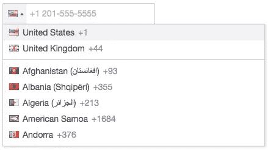

# 在 JavaScript 中使用电话号码

> 原文：<https://www.sitepoint.com/working-phone-numbers-javascript/>

当你从用户那里收集数据时，有两个关键的挑战；收集信息，并验证它。有些类型的信息很简单——例如，某人的年龄，收集和验证起来再简单不过了。名字并不像听起来那么简单，但是如果你考虑到边缘情况和国际差异——例如父名、单名，或者甚至只是姓氏有连字符的人——你就不会错得太离谱(尽管很多应用程序和服务都是这样！).虽然理论上电子邮件地址很容易验证，但它们也有自己的挑战——然而，在现实生活中有很多不太正确的正则表达式。

然后还有电话号码。这些很难。真的很难。在本文中，我将讨论一些关于收集、验证和显示电话号码的挑战。

## 为什么电话号码不同

也许你在想，既然电话号码倾向于遵循一种非常严格的格式，比如:

```
202-456-1111
```

…构造一个简单的正则表达式来验证它们应该很简单。事实上，这里有一个:

```
^(\([0-9]{3}\)|[0-9]{3}-)[0-9]{3}-[0-9]{4}$
```

好吧，就此打住。首先，这里有一些上述数字的变体，它们都是完全有效的:

```
202 456 1111
(202) 456 1111
2024561111
1-202-456-1111
1-202-456-1111 x1234
1-202-456-1111 ext1234
1 (202) 456-1111
1.202.456.1111
1/202/456/1111
12024561111
+1 202 456 1111
```

基于此，我们知道正则表达式 apparoach 并不像我们最初想的那么简单——但这只是一半。这些示例仅适用于美国的号码。当然，如果你知道你要收集的数字是特定国家的，你可以使用正则表达式。否则，这种方法不能解决问题。

让我们看看围绕电话号码的其他一些问题，以及为什么它们使我们的工作更加困难。

### 数字会变

各种外部因素都会对电话号码产生影响。整个国家来来去去，引入新的国家前缀。新的号码分类引入了新的编号系统——高级费率、本地费率、免费等等。当运营商用完一组号码时——可悲的是，就像保费率——他们只需引入一个新的前缀。

一些变化有着巨大的影响；例如，几年前在英国，整个区域编号系统经历了巨大的变化，几乎每个区号都多加了一个“1”。即使在那时，首都也有一个微妙不同的系统。大概过了 10 年，全国各地的标牌才发生了变化，以反映这些变化。

当然，接下来是移动领域前所未有的巨大增长。所需电话号码的数量不再局限于家庭数量，而是增加了许多倍。现有人数的持续紧张只会增加进一步变化的可能性。

### 国际拨号代码

获取一个号码的国际拨号代码通常很重要。在某些情况下，上下文可能意味着它们不是必需的。例如，如果您在一个国家运营，并且电话号码被人工操作员捕获使用，您可能不需要它们。但是对于任何远程自动化的事情——比如发送 SMS 消息——或者为了有效地验证它们，您需要捕获国家前缀。

[国家](https://github.com/mledoze/countries)库包含一系列地理信息，其中包括国际拨号代码。这是从图书馆里摘录的一段话:

```
{
"name": {
"common": "Austria",
"official": "Republic of Austria",
// ... //
},
// ... //
"callingCode": ["43"],
// ... //
},
```

如您所见，这表明奥地利使用国际拨号代码 43。

那么我们该如何利用这些信息呢？嗯，使用 Lodash(或下划线)的魔力，有几种方法可以查询与拨号代码相关的信息。

例如，要确定给定的拨号代码是否有效:

```
var _ = require('lodash')
, data = require('world-countries')

module.exports = {
/**
* Determines whether a given international dialing code is valid
*
* @param string code
* @return bool
*/
isValid : function(code) {

var codes = _.flatten(_.pluck(data, 'callingCode'));

return _.contains(codes, code);

}
// ...
}
```

当然，有更有效的方法可以做到这一点，所以这个例子和下面的例子不一定是为生产而优化的。

我们可以查找使用特定拨号代码的国家:

```
/**
* Gets a list of countries with the specified dialing code
*
* @param string code
* @return array An array of two-character country codes
*/
getCountries : function(code) {

var countryEntries = _.filter(data, function(country){
return (_.contains(country.callingCode, code));
})

return _.pluck(countryEntries, 'cca2');

}
```

最后，我们可以得到给定国家的拨号码:

```
/**
* Gets the dialing codes for a given country
*
* @param string country The two-character country code
* @return array An array of strings representing the dialing codes
*/
getCodes : function(country) {

// Get the country entry
var countryData = _.find(data, function(entry) {
return (entry.cca2 == country);
});

// Return the code(s)
return countryData.callingCode;

}
```

在文章附带的资源库[中，您会发现这些函数与单元测试一起打包成一个模块。](https://github.com/jsprodotcom/telephones-js)

然而，即使是国际拨号代码也不像你想象的那么简单。格式可以不同-1，43，962 1868 都是有效的代码。不一定是一对一的映射；例如，44 不仅用于联合王国，而且用于马恩岛、根西岛和泽西岛。

号码也必须根据您的拨号位置进行更改。从国外打电话到英国，你需要去掉开头的零，以拨号码 44 为前缀:

```
020 7925 0918
```

…变成了…

```
+44 20 7925 0918
```

您也可以用双零替换“+”:

```
0044 20 7925 0918
```

更复杂的是，从国外拨打电话时，一些号码会有所不同，这取决于你从拨打的是哪个国家的*。例如，在美国，数字还必须以美国退出代码`011`为前缀，所以上面的例子变成了:*

```
011 44 20 7925 0918
```

谢天谢地，我们可以使用一种格式来避开这些变化。

## E.164

对开发人员来说幸运的是，世界上任何地方的电话号码都有一个明确的、国际公认的标准，称为 E.164。其格式如下:

*   电话号码最多可以有 15 位数字
*   电话号码的第一部分是国家代码
*   第二部分是国家目的地代码(NDC)
*   最后一部分是用户号码(SN)
*   NDC 和 SN 一起统称为国家(有效)号码

( [*来源*](http://electronics.howstuffworks.com/telephone-country-codes3.htm) )

这是之前 E.164 格式的数字:

```
+12024561111
```

例如，我们可以将相同的格式用于伦敦的英国号码:

```
+442079250918
```

我们可以使用 E.164 格式表示任何有效的电话号码。我们知道它指的是哪个国家，而且它是不可移动的，这使它成为存储的理想选择。它也常用于基于电话的服务，如 SMS 提供商，我们稍后会看到。

当然，这里面有一个陷阱。E.164 标准对存储来说可能很棒，但有两点很糟糕。首先，实际上没有人会以这种格式输入或读出他们的数字。第二，就可读性而言，它是没有希望的。稍后，当我们看`libphonenumber`的时候，我们会发现有很多方法可以为人类格式化数字。

## 收集电话号码

首先，让我们看看收集电话号码的问题。

### HTML5 和“电话”输入

HTML5 引入了新的“tel”输入类型。然而，由于格式变化方面的问题，它实际上并没有对用户可以输入的内容进行任何限制，也没有像 email 元素那样执行任何验证。尽管如此，还是有一些优势的——当在移动网站上使用时，通常会显示用户的电话键盘，而不是传统的键盘布局。

您可以使用单个元素来收集一个数字:

```
<input type="tel" name="number">
```

或者，您可以将一个数字分解成单独的元素:

```
<!-- area code and number -->
<input type="tel" name="number">

<!-- country code, area code and number -->
<input type="tel" name="country" size="4"> <input type="tel" name="area" size="6"> <input type="tel" name="number" size="8">

<!-- US-style -->
(<input type="tel" size="3">) <input type="tel" size="3"> - <input type="tel" size="4">
```

浏览器支持非常好(例如 Chrome 6+，Firefox 4+，Safari 5+，IE 10+)，但即使在较旧的浏览器中，它也会简单地退回到普通的旧文本字段。

如果我们决定一个正则表达式就足够了——请记住，这是有问题的——那么我们可以使用`pattern`属性来添加一些验证:

```
<input type="tel" name="number" pattern="^(?:\(\d{3}\)|\d{3})[- ]?\d{3}[- ]?\d{4}$">
```

### 屏蔽输入

屏蔽输入是限制用户输入或提供预期格式提示的常用技术。但是，除非你能确信这些数字总是针对某个特定的国家，否则很难迎合国际差异。然而，通过假设来惹恼用户是一回事——要求非美国用户提供州名和邮政编码。让一个表格完全不可用是另一回事，例如强迫人们以某个国家的格式提供数字。

然而，如果你知道某些数字将在一个特定的范围内，它们可能是有效的。这是一个美国电话号码的[屏蔽输入](https://jsfiddle.net/dKRGE/3/)的例子。

### 更好的方法

有一种更好、更灵活的收集电话号码的方式，它就是一个优秀的 jQuery 插件。如下图所示。



你也可以在这里玩现场演示。

用法很简单——确保已经包含了 jQuery、库和 CSS 文件，并且 flag sprite 是可用的，并且可以从 CSS 中正确引用——您可以在`build/img/flags.png`中找到它。

接下来，创建一个元素:

```
<input type="tel" id="number">
```

最后，将其初始化如下:

```
$("#number").intlTelInput();
```

关于配置选项的完整列表，[请查阅文档](https://github.com/Bluefieldscom/intl-tel-input)。稍后，我们将查看`utilsScript`选项，但是首先，我们需要深入研究另一个有用的库。

## 介绍 libphonenumber

幸运的是，我们的许多验证和格式化难题有了解决方案。Google 的 libphonenumber 库最初是为 Android 操作系统开发的，它提供了各种处理电话号码的方法和工具。更好的是，它已经从 Java 移植到 Javascript，所以我们可以在 web 或 Node.js 应用程序中使用它。

### 装置

你可以从 Google Code 上的[项目主页](https://code.google.com/p/libphonenumber/)下载这个库。

也可以通过 npm 获得。这里是[项目页面](https://www.npmjs.org/package/google-libphonenumber)，从命令行安装:

```
npm install google-libphonenumber
```

您也可以使用 Bower 安装它:

```
bower install libphonenumber
```

如果你想在一个前端项目中使用它，请注意——即使缩小和压缩，它也会超过 200Kb。

### 解析数字

为了演示该库的关键特性，我将假设您正在编写 Node.js 应用程序。您可以在[资源库中找到一些示例代码，作为本文](https://github.com/jsprodotcom/telephones-js)的补充。

首先，导入`phoneUtil`:

```
var phoneUtil = require('google-libphonenumber').phoneUtil;
```

现在您可以使用它的`parse()`方法来解释电话号码:

```
var tel = phoneUtil.parse('+12024561111');
```

我们可以用这个做很多事情。我们先从库中导入一些常量。将您的`require`声明更改为以下内容:

```
var phoneUtil = require('google-libphonenumber').phoneUtil
, PNF = require('google-libphonenumber').PhoneNumberFormat
, PNT = require('google-libphonenumber').PhoneNumberType;
```

现在，我们可以执行以下操作:

```
var tel = phoneUtil.parse('+12024561111');

console.log(phoneUtil.format(tel, PNF.INTERNATIONAL));
console.log(phoneUtil.format(tel, PNF.NATIONAL));
console.log(phoneUtil.format(tel, PNF.E164));
```

输出如下所示:

```
+1 202-456-1111
(202) 456-1111
+12024561111
```

现在尝试解析不带国际拨号代码的号码:

```
var tel = phoneUtil.parse('2024561111');
```

这将引发以下异常:

```
Error: Invalid country calling code
```

这是因为如果不明确告诉它这个数字是哪个国家的，就不可能解释。`parse()`方法采用可选的第二个参数，即 ISO 3166-1 alpha-2(即两个字符)国家代码。

如果您再次尝试这一行，但是这次将“US”作为第二个参数传递，您会发现结果和以前一样:

```
var tel = phoneUtil.parse('2024561111', 'US');
```

您还可以尝试各种格式；所有这些都可以:

```
var tel = phoneUtil.parse('202-456-1111', 'US');
var tel = phoneUtil.parse('(202) 456 1111', 'US');
```

要解释英国号码，请执行以下操作:

```
var tel = phoneUtil.parse('(0) 20 7925 0918', 'GB');
console.log(phoneUtil.format(tel, PNF.INTERNATIONAL));
console.log(phoneUtil.format(tel, PNF.NATIONAL));
console.log(phoneUtil.format(tel, PNF.E164));
```

这将输出以下内容:

```
+44 20 7925 0918
020 7925 0918
+442079250918
```

一旦您解析了一个数字，您就可以验证它了——我们将在下一节中看到。

### 验证数字

验证遵循类似的模式；同样，还有第二个可选参数，但是如果国家没有被隐含地陈述，你就需要这个参数。

以下是一些有效数字的示例，其中国家代码要么作为第二个参数提供，要么包含在第一个参数中:

```
console.log(phoneUtil.isValidNumber(phoneUtil.parse('+12024561111')));
// => outputs true

console.log(phoneUtil.isValidNumber(phoneUtil.parse('202-456-1111', 'US')));
// => outputs true

console.log(phoneUtil.isValidNumber(phoneUtil.parse('(0) 20 7925 0918', 'GB')));
// => outputs true
```

如果您没有提供国家代码，或者没有暗示，您将得到与前面相同的错误:

```
console.log(phoneUtil.isValidNumber(phoneUtil.parse('(0) 20 7925 0918')));
// => throws exception "Error: Invalid country calling code"

console.log(phoneUtil.isValidNumber(phoneUtil.parse('2024561111')));
// => throws exception "Error: Invalid country calling code"
```

下面是一些验证失败的例子，返回`false`:

```
console.log(phoneUtil.isValidNumber(phoneUtil.parse('573 1234 1234', 'US')));
// => outputs false

console.log(phoneUtil.isValidNumber(phoneUtil.parse('555-555-5555', 'US')));
// => outputs false (this is often used as a placeholder, but it's not a valid number)

console.log(phoneUtil.isValidNumber(phoneUtil.parse('295-123-1234', 'US')));
// => outputs false (there is no 295 area code in the US)
```

但是，请注意，无效的数字可能会引发异常:

```
console.log(phoneUtil.isValidNumber(phoneUtil.parse('NOT-A-NUMBER', 'US')));
// => throws exception "Error: The string supplied did not seem to be a phone number"
```

### 确定数字的类型

有时，知道电话号码的*类型*很有用。例如，您可能希望确保已为您提供了一个手机号码——例如，您可能计划发送 SMS 消息以实现双因素身份验证——或者尝试清除高级费率号码。

这个库的`getNumberType()`函数就是这么做的。让我们来看看。

该函数将解析的电话号码作为其参数:

```
var tel = phoneUtil.parse('(0) 20 7925 0918', 'GB');
var type = phoneUtil.getNumberType(tel)
```

返回值是 PhoneNumberType 子模块中定义的一个常量——您会记得我们已经在 PNF 中对此进行了`require`处理。

例如，我们来查询一下这个号码是移动电话还是固定电话:

```
if (type === PNT.MOBILE) {
console.log("It's a mobile number");
} else if (type === PNT.FIXED_LINE) {
console.log("It's a fixed line");
}
```

这似乎是这个话题的主题，自然有一个陷阱。有时候，连 libphonenumber 库都不能确定。例如，美国数字就不容易区分；于是有了常数`PNT.FIXED_LINE_OR_MOBILE`。

我们只需修改示例代码来反映这种不确定性:

```
if (type === PNT.MOBILE) {
console.log("It's a mobile number");
} else if (type === PNT.FIXED_LINE) {
console.log("It's a fixed line");
} else if (type === PNT.FIXED_LINE_OR_MOBILE) {
console.log("Your guess is as good as mine");
}
```

还有许多其他的可能性。以下是目前的完整列表:

*   `PNT.FIXED_LINE`
*   `PNT.MOBILE`
*   `PNT.FIXED_LINE_OR_MOBILE`
*   `PNT.TOLL_FREE`
*   `PNT.PREMIUM_RATE`
*   `PNT.SHARED_COST`
*   `PNT.VOIP`
*   `PNT.PERSONAL_NUMBER`
*   `PNT.PAGER`
*   `PNT.UAN`
*   `PNT.UNKNOWN`

如你所见，`PNT.UNKNOWN`反映了这样一个事实:我们不一定能以任何确定的方式收集到任何信息。总之，虽然这个特性可以作为快速的初始检查，但是我们不能依赖它。

## 这个号码在服务区吗？

有大量的电话号码是有效的，但是没有被使用。它们可能已经断开连接，尚未分配，或者可能是 SIM 卡掉进了马桶里。

如果您需要确保一个数字不仅是有效的，而且是活动的，那么您有许多选择。

一种方法是要求用户确认他们的号码，就像你可能要求用户确认他们的电子邮件地址一样。你可以使用一项服务，如 [Twilio](https://www.twilio.com/) 给[发短信](https://www.twilio.com/docs/api/rest/sending-messages)，甚至[打电话](https://www.twilio.com/docs/api/rest/making-calls)。

下面是一个非常简单的代码片段，用于使用 Twilio 通过 SMS 生成和发送确认码:

```
// You'll need to install the Twilio library with "npm install twilio"
var client = require('twilio')('YOUR-SID', 'YOUR-AUTH-TOKEN');

// Generate a random four-digit code
var code = Math.floor(Math.random()*8999+1000);

// Send the SMS
client.sendMessage({
to: phoneUtil.format(tel, PNF.E164), // using libphonenumber to convert to E.164
from: 'YOUR-NUMBER',
body: 'Your confirmation code is ' + code
}, function(err, respons) {
// ...do something
});
```

然后，要求用户在你的 web 应用程序的表单中输入代码来验证它是一个很简单的练习——或者你甚至可以允许人们通过回复消息来验证他们的号码。

还有一些(付费)服务会实时检查一个号码是否在为你服务，比如来自 Byteplant 的[这个。](http://www.phone-validator.net/phone-number-online-validation-api.html)

## 其他问题

### 合法的

与任何个人信息一样，也有许多法律问题需要注意。例如，在英国，[电话偏好服务(TPS)](http://www.tpsonline.org.uk/tps/index.html) 是一个全国性的电话号码注册中心，明确地由不希望接收营销通信的人注册。有一些付费服务提供 API 来根据这个寄存器检查一个数字，比如[这个](http://t2a.co/services/telephone_numbers/tps_check_a_telephone_number)。

### 可用性考虑

在一个表单中请求多达三个不同的电话号码是很常见的；例如白天、晚上和移动。

还值得记住的是，在互联网上询问电话号码可能会给人以相当侵扰的印象。如果有人不愿意提供该信息，尽管您已将其设为必填字段，他们可能会采取以下两种措施之一:

*   试图“愚弄”验证。根据不同的方法，他们可能会键入类似“ex directory”的内容，或者输入一个无效的号码，例如只包含数字的号码。
*   走开。

## 将 jQuery 插件与 libphonenumber 结合使用

您可能还记得 jQuery 插件有一个名字相当神秘的选项，叫做`utilsScript`。

这个选项允许我们利用`libphonenumber`的验证和格式化特性。选择一个国家后——使用下拉框或通过输入拨号代码——它会将文本字段转换为反映该国家编号格式的屏蔽输入。

该插件包含 libphonenumber 的打包版本；将该文件的路径传递给构造函数，如下所示:

```
$("#number").intlTelInput(
{
utilsScript : '/bower_components/intl-tel-input/lib/libphonenumber/build/utils.js'
}
);
```

正如我之前提到的，请记住，由于`libphonenumber`库的文件大小，应该谨慎使用这种方法。然而，在构造函数中引用它意味着它可以按需加载。

## 显示电话号码

我们已经了解了如何使用`PNF.INTERNATIONAL`和`PNF.NATIONAL`这样的格式来格式化数字，使其显示起来更加“友好”。

我们还可以使用`tel`和`callto`协议给电话号码添加超链接，这在移动网站上特别有用——允许用户从网页上直接拨号。

为此，我们需要链接本身的 E.164 格式，例如:

```
<a href="tel:+12024561111">+1 202-456-1111</a>
```

当然，您可以使用`libphonenumber`库的`format()`方法来呈现 E.164 版本(`PNF.E164`)和更加用户友好的显示版本。

## 微观数据

我们也可以使用微数据在语义上标记电话号码。这里有一个例子:注意使用`itemprop="telephone"`来标记链接:

```
<div itemscope itemtype="http://schema.org/LocalBusiness">
<h1 itemprop="name">Acme Corp, Inc.</h1>
Phone: <span itemprop="telephone"><a href="tel:+12024561111">202-456-1111</a></span>
</div>
```

## 摘要

在这篇文章中，我们打开了电话号码的蜂巢。现在应该很明显，如果你需要收集、验证和展示它们，你需要知道各种各样的复杂性、微妙之处和陷阱。

我们已经看了一些收集数字的方法——“tel”输入类型、屏蔽输入和最后的`intl-tel-input` jQuery 插件。

然后，我们看了一些关于验证的问题，以及为什么像正则表达式这样的常用方法通常是不够的，特别是当你走向国际化的时候。

我们看了看谷歌的`libphonenumber`图书馆；使用它来解析、验证、显示和确定电话号码的类型。

我们将`intl-tel-input`插件与`libphonenumber`结合起来，以获得更好的用户体验，尽管这是以性能为代价的。

最后，我们看看如何在 HTML 中标记电话号码。

对于如何处理电话号码，我有一些建议:

*   除非你只在一个国家经营，否则要注意国际差异。
*   小心使用屏蔽输入。
*   对基于正则表达式的验证要非常小心。
*   如果可能，使用 E.164 进行存储。
*   使用谷歌的 libphonenumber 库。
*   显示数字时，尽可能格式化，使用电话:或电话:链接类型，并使用微数据。

## 分享这篇文章