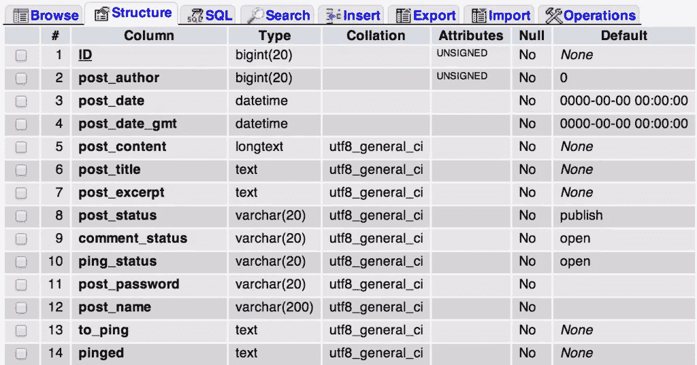

# 在 WordPress 中使用数据库

> 原文：<https://www.sitepoint.com/working-with-databases-in-wordpress/>

开箱即用，WordPress 提供了大量可以用来与数据库交互的功能。在大多数情况下，`WP_Query`类和相关函数如`wp_insert_post`、`update_post_meta`、`get_posts`将足以完成工作。然而，有时候我们需要做一些 WordPress 本身没有提供的事情，尤其是当我们需要处理自定义表格的时候。



在本教程中，我们将浏览 WordPress 中处理数据库的最重要的类—`wpdb`,包括一些稍后可以在我们的开发工作流程中实现的技巧和诀窍。我们还会谈到`dbDelta`，它可以用来在我们的插件中创建自定义表格。我们不会在本教程中讨论创建你的原始 WordPress 数据库的基础知识，但是你可以随意查看这篇关于[从 cPanel](https://www.sitepoint.com/how-to-create-wordpress-mysql-databases-on-cpanel/) 创建数据库的教程

## 使用`wpdb`类

`wpdb`可能是我们需要直接处理数据库时使用的最重要的类。它是基于 Justin Vincent 编写的 [`ezSQL`](http://justinvincent.com/ezsql) 类，经过修改后可用于 WordPress。

在 [WordPress Codex 页面](https://codex.wordpress.org/Class_Reference/wpdb)上已经很好地解释了`wpdb`类的基本方法和属性，所以没有必要在这里重复。相反，我们将讨论 WordPress 开发者可能犯的一些常见错误，如何纠正它们，以及在使用`wpdb`类时可以应用的最佳实践。

### 不要将表名硬编码到 SQL 查询中

一些开发人员通常假设表前缀不变，并使用默认值`wp_`。下面的代码片段展示了一个错误做法的基本示例:

```
global $wpdb;
$result = $wpdb->get_results('SELECT * FROM wp_posts LIMIT 10');
```

这当然是对一个插件实际要做的事情的过度简化，但是这个例子显示了事情出错的速度有多快。如果我们的用户把表前缀改成别的什么会怎么样？这可以很容易地通过用使用`prefix`提供的实际属性替换`wp_`字符串来解决。

通过应用如下更改，上述代码可以变得可移植:

```
global $wpdb;
$result = $wpdb->get_results('SELECT * FROM ' . $wpdb->prefix . 'posts LIMIT 10');
```

更好的是，如果你正在处理 WordPress 的默认表格，你可以跳过前缀部分，直接在`wpdb`中将它们作为属性。每一个默认的 WordPress 表格都由一个自定义属性在`wpdb`类中表示，该属性与没有前缀的表格同名。

例如，假设表格前缀是`wp_`:

*   `$wpdb->posts`将对应于`wp_posts`表
*   `$wpdb->postmeta`将对应于`wp_postmeta`表
*   `$wpdb->users`将对应于`wp_users`表

诸如此类。上面的代码可以进一步改进，因为我们是通过以下方式查询 posts 表的:

```
global $wpdb;
$result = $wpdb->get_results('SELECT * FROM ' . $wpdb->posts . ' LIMIT 10');
```

### 对数据库操作使用特定的助手方法

虽然`query`方法是为处理任何 SQL 查询而设计的，但是最好使用更合适的助手方法。这通常通过`insert`、`update`、`get_row`等方法提供。除了它对我们的用例更具体之外，它也更安全，因为转义和其他繁重的工作都被处理了。

让我们来看看这个例子:

```
$global wpdb;

$post_id    = $_POST['post_id'];
$meta_key   = $_POST['meta_key'];
$meta_value = $_POST['meta_value'];

$wpdb->query("INSERT INTO  $wpdb->postmeta
                ( post_id, meta_key, meta_value )
                VALUES ( $post_id, $meta_key, $meta_value )"
            );
```

除了这个代码片段的不安全本质，它应该在适当的值下运行得很好。然而，这个代码片段可以通过使用`insert`方法来进一步改进。上面的代码可以更改为如下所示:

```
$global wpdb;

$post_id    = $_POST['post_id'];
$meta_key   = $_POST['meta_key'];
$meta_value = $_POST['meta_value'];

$wpdb->insert(
            $wpdb->postmeta,
            array(
                'post_id'    => $_POST['post_id'],
                'meta_key'   => $_POST['meta_key'],
                'meta_value' => $_POST['meta_value']
            )
        );
```

如果我们没有将格式作为第三个参数提供给`insert`方法，那么第二个参数中提供的所有数据都将作为字符串进行转义。另外，我们一眼就能知道这段代码做了什么，因为方法名更清楚了。

### 正确调试数据库查询

默认情况下，错误报告是关闭的。然而，`wpdb`提供了两种方法来切换错误报告的状态。

要打开错误报告功能，只需运行以下代码。

```
$wpdb->show_errors();
```

要关闭它:

```
$wpdb->hide_errors();
```

另一件需要注意的事情是，如果我们将`WP_DEBUG`和`WP_DEBUG_DISPLAY`都设置为`true`，那么`show_errors`方法将被自动调用。还有另一种有用的方法可以用来处理错误，即`print_error`:

```
$wpdb->print_error();
```

顾名思义，它将只显示最近查询的错误，而不考虑错误报告的状态。

另一个巧妙的技巧是在`wp-config.php`中启用`SAVEQUERIES`。这将把运行的所有数据库查询、花费的时间以及最初从哪里调用这些查询存储到`wpdb`类中一个名为`queries`的属性中。

要检索这些数据，我们可以执行以下操作:

```
print_r( $wpdb->queries );
```

请注意，这将对我们的网站的性能产生影响，所以只在必要时使用它。

大多数时候，这些函数足以调试我们代码中的问题。然而，对于更广泛的调试和报告，总有一个[查询监视器](https://wordpress.org/plugins/query-monitor/)插件可以帮助调试更多的数据库查询。

### 保护查询免受潜在攻击

为了完全保护我们的代码免受 SQL 注入攻击，`wpdb`还提供了另一个叫做`prepare`的有用方法，它将接受一个 SQL 语句字符串和需要转义的数据。每当我们处理像`query`或`get_results`这样的方法时，这都是相关的。

```
$wpdb->prepare( $sql, $format... );
```

`prepare`方法支持`sprintf`和`vsprintf`的语法。第一个参数`$sql`是一个用占位符填充的 SQL 语句。这些占位符可以有三种不同的格式:

*   `%s`为字符串
*   `%d`为整数
*   `%f`为浮动

`$format`可以是一系列用于`sprintf`的参数，比如语法，或者是一个用于替换`$sql`中占位符的参数数组。该方法将返回带有正确转义数据的 SQL。

让我们来看看，对于一个特定的帖子 ID，我们如何实现删除`wp_postmeta`中的`meta_key`的过程:

```
$global wpdb;

$post_id = $_POST['post_id'];
$key     = $_POST['meta_key'];

$wpdb->query(
                "DELETE FROM $wpdb->postmeta
                WHERE post_id = $post_id
                AND meta_key = $key"
        );
```

注意，这不是使用`wpdb`删除数据库中记录的推荐方式。这是因为我们把代码留给了 SQL 注入，因为用户输入没有被正确地转义并直接在`DELETE`语句中使用。

但是，这很容易解决！我们只是在进行实际查询之前引入了`prepare`方法，这样生成的 SQL 就可以安全使用了。下面的代码片段可以说明这一点:

```
$global wpdb;

$post_id = $_POST['post_id'];
$key     = $_POST['meta_key'];

$wpdb->query(
            $wpdb->prepare(
                "DELETE FROM $wpdb->postmeta
                WHERE post_id = %d
                AND meta_key = %s",
                $post_id,
                $key
            )
        );
```

### 连接到单独的数据库

默认情况下，`$wpdb`变量是连接到在`wp-config.php`中定义的 WordPress 数据库的`wpdb`类的一个实例。如果想和其他数据库交互，可以实例化另一个`wpdb`类的实例。这让我们受益匪浅，因为像`insert`、`update`和`get_results`这样的方法都是可用的。

`wpdb`类接受 construct 中的四个参数，依次是用户名、密码、数据库名和数据库主机。这里有一个例子:

```
$mydb = new wpdb( 'username', 'password', 'my_database', 'localhost' );

// At this point, $mydb has access to the database and all methods
// can be used as usual

// Example query
$mydb->query('DELETE FROM external_table WHERE id = 1');
```

如果我们使用相同的用户名、密码和数据库主机，但只需要更改所选的数据库，那么有一个方便的方法叫做全局`$wpdb`变量上的`select`。这是通过使用`mysql_select_db` / `mysqli_select_db`功能在内部实现的。

```
$wpdb->select('my_database');
```

当我们想切换到另一个 WordPress 数据库，但仍然想保留像`get_post_custom`和其他功能的功能时，这也特别有用。

## 使用自定义数据库表

WordPress 的默认表格通常足以处理最复杂的操作。利用带有帖子元数据的定制帖子类型、定制分类法和术语元数据，我们几乎可以做任何事情，而不需要使用定制表格。

然而，当我们想要更好地控制插件可以处理的数据时，定制表格可能会很有用。使用自定义表格的好处包括:

*   **数据结构的完全控制**–并非所有类型的数据都适合一个`post`的结构，所以当我们想要存储作为自定义 post 类型没有任何意义的数据时，自定义表可能是一个更好的选择。
*   **关注点分离**——由于我们的数据存储在一个定制的表中，它不会干扰`wp_posts`或`wp_postmeta`表，与我们使用定制的帖子类型相反。将我们的数据迁移到另一个平台更容易，因为它不受限于 WordPress 如何构建它的数据。
*   **效率**——从我们特定的表中查询数据肯定会比搜索包含与我们插件无关的数据的`wp_posts`表快得多。当使用定制的 post 类型存储大量元数据时，这是一个明显的问题，会使`wp_postmeta`表膨胀。

### dbDelta 来救援了

不要使用`wpdb`来创建定制的数据库表，建议使用 [dbDelta](https://developer.wordpress.org/reference/functions/dbdelta/) 来处理所有的初始表创建以及表模式更新。它是可靠的，因为 WordPress core 也使用这个函数来处理任何版本之间的数据库模式更新，如果有的话。

为了在插件安装时创建一个自定义表，我们需要将我们的函数与`register_activation_hook`函数挂钩。假设我们的主插件文件是在一个`plugin-name`目录中的`plugin-name.php`，我们可以将这一行直接放入其中:

```
register_activation_hook( __FILE__, 'prefix_create_table' );
```

接下来，我们需要创建函数`prefix_create_table`，它在插件激活时创建实际的表。例如，我们可以创建一个名为`my_custom_table`的定制表，用于存储简单的客户数据，如名字、姓氏和他们的电子邮件地址。

```
 function prefix_create_table() {
        global $wpdb;

        $charset_collate = $wpdb->get_charset_collate();

        $sql = "CREATE TABLE my_custom_table (
            id mediumint(9) NOT NULL AUTO_INCREMENT,
            first_name varchar(55) NOT NULL,
            last_name varchar(55) NOT NULL,
            email varchar(55) NOT NULL,
            UNIQUE KEY id (id)
        ) $charset_collate;";

        if ( ! function_exists('dbDelta') ) {
            require_once( ABSPATH . 'wp-admin/includes/upgrade.php' );
        }

        dbDelta( $sql );
    }
```

为了最大化兼容性，我们从`wpdb`中检索数据库字符集 collate。另外，SQL 语句需要遵守一些规则，以确保它按预期工作。这是直接从[用插件](http://codex.wordpress.org/Creating_Tables_with_Plugins)创建表格的抄本页面上截取的:

*   您必须在 SQL 语句中将每个字段放在自己的行上。
*   在单词 PRIMARY KEY 和主键的定义之间必须有两个空格。
*   您必须使用关键字 key 而不是它的同义词索引，并且必须至少包含一个关键字。
*   您不能在字段名周围使用任何撇号或反勾号。
*   字段类型必须全部小写。
*   SQL 关键字，如 CREATE TABLE 和 UPDATE，必须是大写的。
*   您必须指定所有接受长度参数的字段的长度。例如 int(11)。

将数据库版本存储到选项表中通常也是一个好主意，这样我们可以在插件更新期间比较它们，以防我们的自定义表需要更新。为此，我们只需在使用`dbDelta`函数创建表格后添加这一行:

```
add_option( 'prefix_my_plugin_db_version', '1.0' );
```

### 更新表模式

使用与上面相同的例子，假设在开发期间，我们改变了主意，我们还想在表中存储我们的客户电话号码。我们能做的是在插件更新期间触发一个表模式更新。由于`register_activation_hook`在插件更新过程中不会被触发，我们可以转而使用`plugin_loaded`动作，进行数据库版本检查，并在必要时更新表模式。

首先，我们将自定义升级功能添加到`plugin_loaded`挂钩中:

```
add_action( 'plugin_loaded', 'prefix_update_table' );
```

实际的功能需要做几件事:

1.  我们需要获取存储的数据库版本。
2.  将它们与我们当前的数据库版本进行比较。
3.  如果是新的，我们再次运行`dbDelta`函数。
4.  最后，我们将更新后的数据库版本存储到选项表中。

在大多数情况下，我们实际上可以像上面一样重用`prefix_create_table`函数，只需做一些小的修改:

```
function prefix_update_table() {
    // Assuming we have our current database version in a global variable
    global $prefix_my_db_version;

    // If database version is not the same
    if ( $prefix_my_db_version != get_option('prefix_my_plugin_db_version' ) {
        global $wpdb;

        $charset_collate = $wpdb->get_charset_collate();

        $sql = "CREATE TABLE my_custom_table (
            id mediumint(9) NOT NULL AUTO_INCREMENT,
            first_name varchar(55) NOT NULL,
            last_name varchar(55) NOT NULL,
            phone varchar(32) DEFAULT '' NOT NULL, //new column
            email varchar(55) NOT NULL,
            UNIQUE KEY id (id)
        ) $charset_collate;";

        if ( ! function_exists('dbDelta') ) {
            require_once( ABSPATH . 'wp-admin/includes/upgrade.php' );
        }

        dbDelta( $sql );

        update_option( 'prefix_my_plugin_db_version', $prefix_my_db_version );
    }
}
```

注意，我们不需要使用`ALTER`语句，因为`dbDelta`将获取我们的 SQL 语句，将其与现有的表进行比较，并做出相应的修改。非常方便！

## 结论

WordPress 并不局限于创建简单的网站，因为它正在迅速向成熟的应用框架发展。通过定制文章类型和定制分类法来扩展 WordPress 应该是我们的首要任务。然而，当我们需要更好地控制我们的数据时，知道 WordPress 本身提供了各种功能和类(如`wpdb`)供开发人员使用是令人放心的。这就是 WordPress 成为成熟解决方案的原因。

## 分享这篇文章