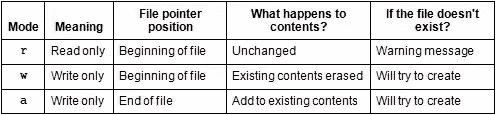
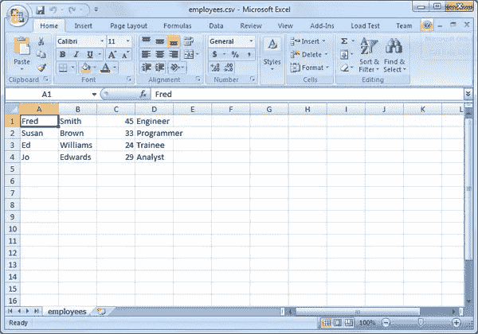
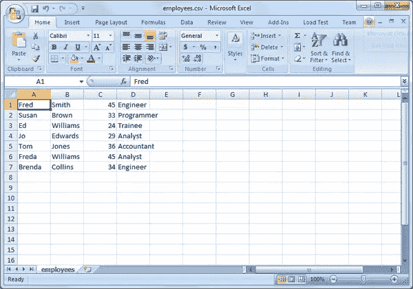

# 在 PHP 中使用文件

> 原文：<https://www.sitepoint.com/working-with-files-in-php/>

您可能很熟悉 MySQL 和 Access 等数据库，它们是越来越常见的数据存储方式。但是数据也存储在文件中，如 Word 文档、事件日志、电子表格、图像文件等等。数据库通常需要一种特殊的查询语言来检索信息，而文件是“平面”的，通常以文本流的形式出现。

最常见的情况是，在处理文件时，您会对它们进行读写操作。当你想阅读一个文件的内容时，你首先要打开它，然后尽可能多地阅读你想阅读的内容，当你读完时，关闭文件。当写入一个文件时，它也需要被打开(或者如果它不存在的话可能被创建)，然后你将数据写入其中，完成后关闭文件。在 PHP5 中有一些内置的包装函数可以为你自动处理打开和关闭，但这仍然发生在幕后。

您可能还会发现，在开始处理文件之前，通过检查其属性来了解文件的更多信息是非常有用的。例如，文件是否存在？最后一次更新是什么时候？它是什么时候创建的？

PHP 提供了一系列允许你处理文件的函数，在这篇文章中我将为你演示其中的一些。

## 文件属性

文件属性是文件的属性，例如文件大小、上次访问时间、所有者等。让我们来看看您如何找到更多关于您正在处理的文件的信息。

### 文件大小

函数`filesize()`以字节为单位获取文件的大小。

```
<?php
$f = "C:\Windows\win.ini";
$size = filesize($f);
echo $f . " is " . $size . " bytes.";
```

执行时，示例代码显示:

```
C:Windowswin.ini is 510 bytes.
```

这里在 Windows 系统上使用文件突出了一个重要的点；因为反斜杠在字符串中作为转义字符有特殊的含义，所以您需要通过添加另一个反斜杠来转义它。

如果文件不存在，`filesize()`函数将返回 false 并发出一个`E_WARNING`，所以最好先用`file_exists()`函数检查文件是否存在:

```
<?php
$f = "C:\Windows\win.ini";
if (file_exists($f))  {
    $size = filesize($f);
    echo $f . " is " . $size . " bytes.";
}
else  {
    echo $f . " does not exist.";
}
```

事实上，本节中介绍的许多函数具有相同的行为，即发出警告。为了简洁起见，我没有在其余的例子中包含对`file_exists()`的检查，但是当您编写自己的代码时，您会想要使用它。

### 文件历史记录

要确定文件最后一次被访问、修改或更改的时间，可以分别使用以下函数:`fileatime()`、`filemtime()`和`filectime()`。

```
<?php
$dateFormat = "D d M Y g:i A";

$atime = fileatime($f);
$mtime = filemtime($f);
$ctime = filectime($f);

echo $f . " was accessed on " . date($dateFormat, $atime) . ".<br>";
echo $f . " was modified on " . date($dateFormat, $mtime) . ".<br>";
echo $f . " was changed on " . date($dateFormat, $ctime) . ".";
```

这里的代码检索最后一次访问、修改和更改日期的时间戳，并显示它们，

```
C:Windowswin.ini was accessed on Tue 14 Jul 2009 4:34 AM.
C:Windowswin.ini was modified on Fri 08 Jul 2011 2:03 PM.
C:Windowswin.ini was changed on Tue 14 Jul 2009 4:34 AM.
```

为了澄清起见，`filemtime()`返回文件内容最后一次被修改的时间，而`filectime()`返回与文件相关的信息(如访问权限或文件所有权)被修改的时间。

`date()`函数用于格式化由`file*time()`函数返回的 Unix 时间戳。更多格式化选项，请参考`date()`功能的[文档。](http://php.net/manual/en/function.date.php)

### 文件权限

在处理一个文件之前，你可能想检查它对于进程是可读的还是可写的。为此，您将使用函数`is_readable()`和`is_writeable()`:

```
<?php
echo $f . (is_readable($f) ? " is" : " is not") . " readable.<br>";
echo $f . (is_writable($f) ? " is" : " is not") . " writeable.";
```

这两个函数都返回一个布尔值，表明操作是否可以在文件上执行。使用三元运算符，您可以定制显示，以适当地说明文件是否可访问。

```
C:Windowswin.ini is readable.
C:Windowswin.ini is not writeable.
```

### 存档还是不存档？

为了绝对确定你正在处理一个文件，你可以使用`is_file()`函数。`is_dir()`是对方检查是否是目录。

```
<?php
echo $f . (is_file($f) ? " is" : " is not") . " a file.<br>";
echo $f . (is_dir($f) ? " is" : " is not") . " a directory.";
```

示例代码输出:

```
C:Windowswin.ini is a file.
C:Windowswin.ini is not a directory.
```

## 读取文件

上一节展示了在开始读写文件之前，如何对正在处理的文件有更多的了解。现在让我们看看如何读取文件的内容。

便利函数`file_get_contents()`会将文件的全部内容读入一个变量，而不需要自己打开或关闭文件。当文件相对较小时，这是很方便的，因为您不希望一次将 1GB 的数据读入内存！

```
<?php
$f = "c:\windows\win.ini";
$f1 = file_get_contents($f);
echo $f1;
```

对于较大的文件，或者只是根据脚本的需要，自己处理细节可能更明智。这是因为一旦一个文件被打开，你就可以在其中寻找一个特定的偏移量，一次读取你想要的或多或少的数据。

函数`fopen()`用于打开文件:

```
<?php
$f = "c:\windows\win.ini";
$f1 = fopen($f, "r");
```

使用函数`fopen()`，需要两个参数——我想要打开的文件和模式，在本例中是“r”表示读取。该函数返回文件的句柄或流，存储在变量`$f1`中，当处理文件时，您将在所有后续命令中使用该变量。

最常见的模式值有:



关于其他值，请参考 [PHP 的`fopen()`页面](http://php.net/manual/en/function.fopen.php)中的列表。

要从打开的文件中一次读取一行，使用函数`fgets()`:

```
<?php
$f = "c:\windows\win.ini";
$f1 = fopen($f, "r");
do {
    echo fgets($f1) . "<br>";
}
while (!feof($f1));
fclose($f1);
```

使用`do`–`while`循环是一个很好的选择，因为您可能不知道文件中有多少行。函数`feof()`检查文件是否已经到达其结尾——循环继续，直到到达文件结尾条件。

为了在我读完文件后进行整理，函数`fclose()`用于关闭文件。

## 写文件

使用函数`fwrite()`写入文件时，两种常用的模式是“w”和“a”——“w”表示您想要写入文件，但它会预先删除任何现有的文件内容，而“a”表示您会将任何新数据追加到文件中已经存在的内容。您需要确保您使用了正确的选项！

在本例中，我将使用“a”来附加:

```
<?php
$file = "add_emp.txt";
$f1 = fopen($file, "a");
$output = "banana" . PHP_EOL;
fwrite($f1, $output);
$output = "cheese" . PHP_EOL;
fwrite($f1, $output);
fclose($f1);
```

首先将文件名赋给一个变量，然后以模式“a”打开文件进行追加。要写入的数据被分配给一个变量`$output`，然后`fwrite()`将数据添加到文件中。重复该过程以添加另一行，然后使用`fclose()`关闭文件。预定义的常量`PHP_EOL`添加特定于 PHP 运行平台的换行符。

执行上述代码后的文件内容应该如下所示:

```
banana
cheese
```

便利功能`file_put_contents()`也可以写入文件。它接受文件名、要写入文件的数据以及常量`FILE_APPEND`(如果它应该追加数据的话)(默认情况下，它将覆盖文件的内容)。

下面是与上面相同的例子，但是这次使用了`file_put_contents()`:

```
<?php
$file = "add_emp.txt";
file_put_contents($file, "banana" . PHP_EOL);
file_put_contents($file, "cheese" . PHP_EOL, FILE_APPEND);
```

## 使用 CSV 文件

CSV 代表逗号分隔变量，表示文件包含用逗号分隔的数据。每行是一条记录，每条记录由字段组成，非常像电子表格。事实上，Excel 等软件提供了以这种格式保存文件的方法。下面是一个在 Excel 2007 中显示的示例(没有显示逗号):



在包含名、姓、年龄和职位的文件中有 4 行数据或记录。要读取文件并提取各个字段，首先以读取模式打开文件:

```
<?php
$file = "employees.csv";
$f = fopen($file, "r");
```

现在我需要用一个函数专门读取 CSV 格式的文件，`fgetcsv()`；while 循环用于满足记录数量预计会变化的事实:

```
<?php
$file = "employees.csv";
$f = fopen($file, "r");
while ($record = fgetcsv($f)) {
    foreach($record as $field) {
        echo $field . "<br>";
    }
}
fclose($f);
```

这将产生每行有一个字段的输出:

```
Fred
Smith
45
Engineer
Susan 
Brown
33
Programmer
Ed
Williams
24
Trainee
Jo
Edwards
29
Analyst
```

让我们检查一下这个循环。首先，`fgetcsv()`只有一个参数——文件句柄；假定使用逗号分隔符。`fgetcsv()`返回数组中的数据，然后使用`foreach`循环对其进行处理。读取完所有记录后，使用`fclose()`关闭文件。

现在让我们看看如何更新或写入一个 CSV 文件，这次使用函数`fputcsv()`。因为我使用的是上面使用的同一个文件，所以我将以 append 模式打开它，并且要添加到文件中的数据已经在数组中定义了。

```
<?php
$file = "employees.csv";
$f = fopen($file, "a");

$newFields = array(
    array('Tom', 'Jones', 36, 'Accountant'),
    array('Freda', 'Williams', 45, 'Analyst'),
    array('Brenda', 'Collins', 34, 'Engineer'));

foreach($newFields as $fields)  {
	fputcsv($f, $fields);
}
fclose($f);
```

Excel 中显示的文件内容现在如下所示:



## 摘要

本文向您介绍了如何使用文件，并展示了如何查找关于文件的信息、读取和写入文件。在处理文件时，您还可以使用许多其他函数——本文已经介绍了一些最常用的函数。你可以在 PHP 的[文件系统函数页面](http://php.net/manual/en/ref.filesystem.php)找到更多信息。

<small>图片 via[Marco Rullkoetter](http://www.shutterstock.com/gallery-172795p1.html)/[Shutterstock](http://www.shutterstock.com)</small>

## 分享这篇文章