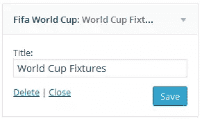

# 创建 2014 世界杯 WordPress 小工具

> 原文：<https://www.sitepoint.com/world-cup-2014-wordpress-widget/>

足球无疑是世界上最受欢迎和最有声望的体育运动。它在全球范围内由国际足球联合会(FIFA)管理，这是这项运动的国际管理机构。

国际足联世界杯，通常简称为世界杯，每四年举办一次，由合格国家的高级男子国家队参加。今年在巴西举办的锦标赛正在进行中。


在阅读《黑客新闻》时，我偶然发现了一个用于世界杯的 [API，它抓取当前的比赛结果并将比赛数据输出为 JSON。](http://worldcup.sfg.io/)

从这个 API 可以得到以下世界杯数据:

*   所有匹配数据，每分钟更新一次
*   今天的比赛
*   明天的比赛
*   通过输入他们的国际足联代码匹配任何国家
*   如果匹配正在发生，则为当前匹配，否则为空。
*   小组赛结果(胜、负、平、进球数、进球数)

我热爱足球，我知道我们很多人也是如此。由于我繁忙的日程安排，我经常向朋友询问比赛日程。

为了消除这个障碍，我决定为 WordPress 构建一个比赛日程小部件，显示今天和明天将要进行的比赛列表，由世界杯 API 提供支持。

如果你想跳过下面的教程，你可以[在这里观看 Fifa fixtures widget 的演示](http://fifa-wc.tk/)和[在这里下载 widget 插件](https://uploads.sitepoint.com/wp-content/uploads/2014/06/1403820326fifa-world-cup-widget.zip)文件。

## 构建夹具小部件

本教程结束时要开发的 Fixture 小部件将是一个选项卡式小部件；第一个选项卡显示今天的比赛，第二个选项卡显示第二天的比赛。


让我们开始小部件插件开发。

首先，我们需要包含插件头。如果没有标题，WordPress 将无法识别 widget 插件。

```
<?php
/*
  Plugin Name: FIFA World Cup Widget
  Plugin URI: http://tech4sky.com
  Description: Fifa World Cup Widget
  Version: 1.0
  Author: Agbonghama Collins
  Author URI: http://tech4sky.com
 */
```

在 WordPress 中构建小部件既简单又直接。扩展标准的`WP_Widget`类并包含所需的小部件类方法，最后注册小部件。

创建一个子类来扩展`WP_Widget`类。

```
class Fifa_WC_Fixtures extends WP_Widget {
// ...
```

使用`__construct()`魔术方法给小部件命名和描述。

```
function __construct() {
    parent::__construct(
        'fifa', // Base ID
        __('Fifa World Cup', 'text_domain'), // Name
        array('description' => __('World Cup Fixtures for Today and Tomorrow\'s Games', 'text_domain'),) 
    );
}
```

下面显示的类方法`matches_today()`查询世界杯 API，检索今天要进行的比赛，并显示比赛时间。

如果当天没有安排比赛，将显示一条`No match for today`消息。

```
public function matches_today() {
    $today_matches = file_get_contents('http://worldcup.sfg.io/matches/today');
    $today_matches_data = json_decode($today_matches);

    echo ' <div><ul class="orange">';
    if (Count($today_matches_data) > 0) {

        foreach ($today_matches_data as $match) {
            echo '<li>';
            echo '<a class="widget-list-link"><strong>';
            echo $match->home_team->country;
            echo '</strong><span>vs</span><strong>' . $match->away_team->country;
            echo '</strong><span>' . (substr($match->datetime, 11, 2) + 5) . ':00' . '</span>';
            echo '</a>';
            echo '</li>';
        }
    } else {
        echo '<li>';
        echo 'No match for today';
        echo '</li>';
    }
    echo '</ul></div>';
}
```

类似于上面的`matches_today()`类方法，`matches_tomorrow()`方法显示第二天要进行的比赛:

```
public function matches_tomorrow() {
    $tomorrow_matches = file_get_contents('http://worldcup.sfg.io/matches/tomorrow/');
    $tomorrow_matches_data = json_decode($tomorrow_matches);

    echo ' <div><ul class="green">';
    if (Count($tomorrow_matches_data) > 0) {
        foreach ($tomorrow_matches_data as $match) {
            echo '<li>';
            echo '<a class="widget-list-link"><strong>';
            echo $match->home_team->country;
            echo '</strong><span>vs</span><strong>' . $match->away_team->country;
            echo '</strong><span>' . (substr($match->datetime, 11, 2) + 5) . ':00' . '</span>';
            echo '</a>';
            echo '</li>';
        }
    } else {
        echo '<li>';
        echo 'No match for today';
        echo '</li>';
    }

    echo '</ul></div>';
}
```

后端小部件设置表单使用`form()`方法创建。fixture 小部件将由一个包含小部件标题的表单字段组成。

```
public function form($instance) {
   if (isset($instance['title'])) {
        $title = $instance['title'];
    } else {
        $title = __('World Cup Fixtures', 'text_domain');
    }
    ?>
    <p>
        <label for="<?php echo $this->get_field_id('title'); ?>"><?php _e('Title:'); ?></label> 
        <input class="widefat" id="<?php echo $this->get_field_id('title'); ?>" 
               name="<?php echo $this->get_field_name('title'); ?>" 
               type="text" value="<?php echo esc_attr($title); ?>">
    </p>
    <?php
}
```



当数据输入到表单小部件字段中时，需要保存到数据库中以便重用。`update()`方法将数据清理并保存到数据库中。

```
public function update($new_instance, $old_instance) {
    $instance = array();
        $instance['title'] = (!empty($new_instance['title']) ) ? strip_tags($new_instance['title']) : '';

    return $instance;
}
```

接下来是在 WordPress 前端显示**比赛夹具**的`widget()`方法。

```
public function widget($args, $instance) {
    ?>
    <script type="text/javascript" > $('document').ready(function(){
        $('#flip-container').quickFlip();

        $('#flip-navigation li a').each(function(){
            $(this).click(function(e){
                $('#flip-navigation li').each(function(){
                    $(this).removeClass('selected');
                });
                $(this).parent().addClass('selected');
                var flipid=$(this).attr('id').substr(4);
                $('#flip-container').quickFlipper({ }, flipid, 1);

                e.preventDefault();
            });
        });
    }); </script>

    <?php
    $title = apply_filters('widget_title', $instance['title']);

    echo $args['before_widget'];
    if (!empty($title))
        echo $args['before_title'] . $title . $args['after_title'];

    echo '<div id="flip-tabs" >
    <ul id="flip-navigation" >
        <li class="selected"><a href="#" id="tab-0" >Today</a></li>
        <li><a href="#" id="tab-1">Tomorrow</a></li>
    </ul>
    <div id="flip-container" >';
    $this->matches_today();
    $this->matches_tomorrow();

    echo '</div>';
    echo '</div>';
    echo '</div>';

    echo $args['after_widget'];
}
```

让我简单解释一下`widget()`中的代码是做什么的。JavaScript 代码为小部件添加了跳转和翻转效果。返回今天和明天的匹配结果的`matches_today()`和`matches_tomorrow()`方法也会显示在 WordPress 前端。

我们的 fixture widget 类`Fifa_WC_Fixtures`需要使用`widgets_init`钩子注册，这样 WordPress 才能识别它。

```
function register_fifa_widget() {
    register_widget('Fifa_WC_Fixtures');
}

add_action('widgets_init', 'register_fifa_widget');
```

我们仍然需要包含 jQuery 和 [QuickFlip](http://jonraasch.com/blog/quickflip-2-jquery-plugin) 库，以便在小部件和小部件 CSS 中获得标签和翻转效果。

```
function fifa_widget_lib() {
    wp_enqueue_style('fifa-widget', plugins_url('styles.css', __FILE__));
    wp_enqueue_script('fifa-widgets', plugins_url('js/jquery.js', __FILE__));
    wp_enqueue_script('fifa-widget-js', plugins_url('js/jquery.quickflip.js', __FILE__));
}

add_action('wp_enqueue_scripts', 'fifa_widget_lib');
```

[**查看 Fifa fixtures widget**](http://fifa-wc.tk/) 的演示。

## 结论

我们已经完成了世界杯装置小部件的编码。为了进一步理解小部件是如何构建的，以及如何在你的 WordPress 站点上实现它， [**下载小部件插件**](https://uploads.sitepoint.com/wp-content/uploads/2014/06/1403820326fifa-world-cup-widget.zip) ，它包括 jQuery、Quickflip 和样式表文件。

我希望这能帮助你们中的一些人学习如何构建 WordPress 小部件，享受今年的世界杯。请在评论中告诉我你的想法。

## 分享这篇文章