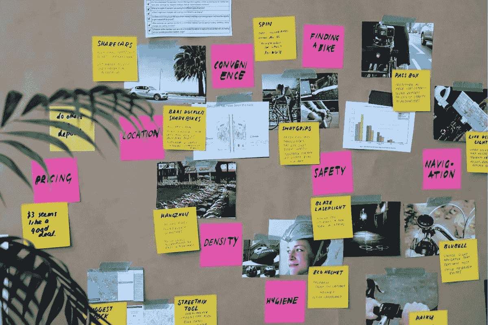
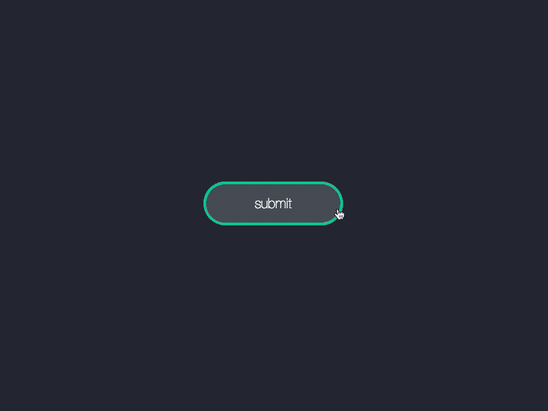
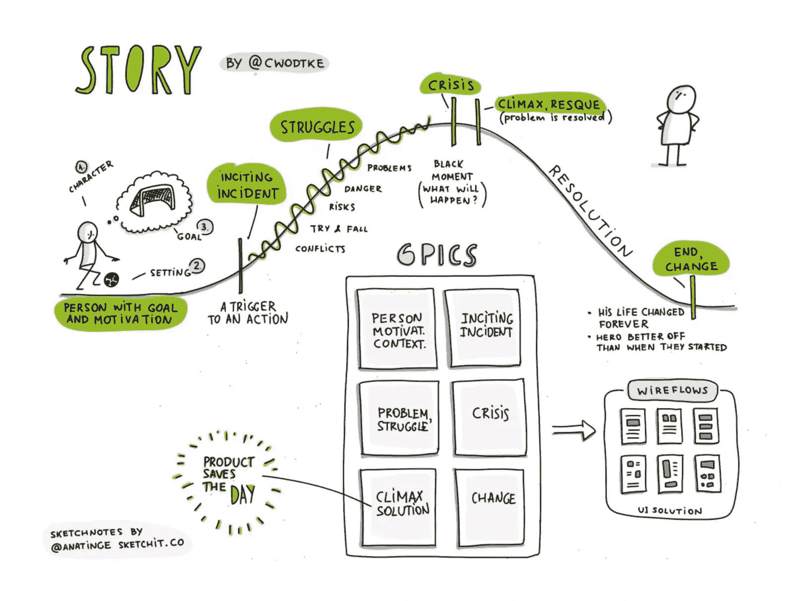

# 限制你成长的 7 个最糟糕的 UX 错误

> 原文：<https://www.sitepoint.com/worst-ux-mistakes/>

成长。成长！成长！

对于那些“有所作为”的企业来说，增长往往是重中之重他们已经找到了让顾客心动的东西，他们的特殊配方，现在他们准备好向全世界展示了。

然而，扩展并不*只*扩展成功。

如果 UX 中有摩擦、缺陷、技术限制或任何其他类型的 UX 缺陷，这些缺陷会随着产品规模的扩大而被放大，这就是为什么最成功的企业是那些从容不迫、尽量不快速增长的企业。

这就是为什么软件团队一次只为一个平台开发，也是为什么 MVP 和 betas 只对一部分用户开放。

让我们来看看在试图“扩大”我们的业务时，我们真的真的想避免的一些最糟糕的 UX 错误。

## 1.浪费时间

大多数设计决策只会产生*很小的*影响。当然，总的来说，这些决定可能相当于改善了 UX，但只有几分之一会对增长产生不利影响。

还有，UX 设计是**而不是**一个任务。UX 设计是一项持续的工作，试图一次解决所有问题会导致压力、焦虑、强迫症，并最终导致严重的倦怠。

完美主义是严重的成长障碍。

事实是，一些设计变更会使转化率飙升，而另一些则不那么有效，但是 T2 真的很容易被这些微小的细节所困扰。实现这一点的一个绝妙方法是使用众所周知的设计方法，如[设计冲刺](https://www.gv.com/sprint/)，在短时间内集中解决设计问题。设计冲刺有助于识别*问题*，将它们重新定义为*机会*，然后决定哪些问题如果解决了，可能会产生最好的结果。

简而言之，不要在小事上浪费太多时间，首先关注高增长的机会。这确保了我们在处理更大的问题的同时不会产生太多的错误和缺陷，因为太多的错误和缺陷会成为严重的障碍。

## 2.关注像素

性能，也就是应用程序或网站的感觉和加载速度，是用户体验的一个重要方面。虽然这是通常分配给开发人员的任务，但设计人员应该记住，是 T2 他们将设计要实现的东西，这就是为什么我们建议在工作流程中使用设计移交工具。

通过这种方式，开发者(和其他利益相关者)可以利用美国设计师不一定具备的专业知识进行权衡。

在这种情况下，忽视性能将是一个巨大的 UX 错误，因为缓慢的应用程序和网站比任何东西都更快地流失用户(*讽刺，对吗？*)。然而，最重要的是，性能问题占产品评论中投诉的大多数，而产品评论对于社会认可至关重要，因此会产生巨大的连锁效应，限制未来的增长。

设计师们，把你们的开发者带入设计过程！

## 3.跳过 UX 研究

因为时间就是金钱，所以最好尽可能快地验证设计想法，而不是不知疲倦地争论它们。我们可以通过分析、A/B 测试或直接用户测试来做到这一点。

数据摆在那里，我们只需要分析它。

浪费宝贵的时间去争论设计的方向是一个容易陷入的陷阱。相反，在你的工作流程中加入 [UX 研究](https://www.sitepoint.com/premium/books/researching-ux-analytics/)，让定量和定性的数据决定设计的命运。当决策得到数据和见解的支持时，就很难对其提出异议了。

如果你不衡量成长，你怎么知道你已经成长了呢？

## 4.排除可访问性

*   “投资回报不值得”
*   “额外工作太多了”
*   “反正那些都不是我们的用户”

在大多数情况下，这些都不是真的。事实是，我们已经为移动用户设计了响应性网站，为网速较慢的用户设计了快速网站，因为我们知道这会影响我们的有机搜索排名。那么，为什么不通过[无障碍设计](https://uxtricks.design/blogs/ux-design/accessibility-standards/)来努力将每个人都包括进来呢？

此外，如果你已经在设计高可用性的产品，那么你已经在可访问性方面走了一半，因为可访问性设计几乎不需要任何额外的工作。

[19%的用户以某种方式残疾](https://census.gov/newsroom/releases/archives/miscellaneous/cb12-134.html)。虽然我承认投资回报率可能会因业务性质而异，但考虑到包容性设计有多容易，增加受众的机会是值得的。另外，如果你的竞争对手*不这么做*，还有额外的奖励。

## 5.遵守规则

曾经有一段时间我们认为地球是平的，所以我倾向于认为事实不应该总是被当作真理。就这一点而言，最佳实践归根结底只是建议。我们没有*去跟随他们。*

例如:

*   移动优先设计
*   [x]现在很流行
*   简约就是一切

但是最好的设计师知道什么时候不要喋喋不休，做出正确的决定，即使这个决定有点不正统。毕竟，并非所有行业都是手机主导的，设计趋势随着一周中的每一天而变化，极简主义实际上意味着“不超过所需”，而不是“脱得只剩骨头”当然也不是指“苹果在做什么。”

千篇一律的设计通常无法脱颖而出，所以如果其他人以我们提供的方式提供我们提供的东西，这将使增长变得更加困难。

## 6.为快乐而优化

*   "动画很慢"
*   “UX 才是真正重要的”

近年来，我们多少翻开了新的一页，最终承认设计不应该死盯着设计“漂亮”的用户界面。它们应该是直观的，不一定是扁平的和最小的。但是我们做了一个*完整的* 180 吗？

动画、色彩和视觉设计在吸引用户情感方面发挥着巨大的作用，超出了通常出于品牌原因而实施的常见提示和技巧——例如，这里一句有趣的俏皮话，那里一句友好的话，或者一个令人眼花缭乱但微妙的动画，使微交互看起来更令人印象深刻。

所有这些都增加了愉悦度，虽然产品的实用性和直观性(即需求)肯定比愉悦度(即需求)更重要，但有意义的交互仍然有助于整体体验，并将自然地增加用户保留率和参与度，这两个属性对长期增长有很大贡献。

## 7.编造一个易被遗忘的故事

设计和艺术被认为是两回事，但事实并非总是如此。在这篇文章中，我们已经谈了很多关于从整体上衡量 UX 的重要性，这当然在很大程度上依赖于洞察力和数据，但仍然有很大的创造力空间，其中一个例子就是讲故事。

在语言课上，我们被告知一个史诗般的故事应该有一个迷人的开头和结尾，这同样适用于 UX。例如，让用户在请求他们注册之前完成一些事情，在他们*已经*注册之后制作一封杀手级的感谢邮件，这将是吸引用户并以一种令人难忘的方式结束这个故事的绝妙方法。

从心理学上来说，这是因为用户经常会忘记他们做了什么，但他们永远不会忘记他们做这件事时的感受，这尤其适用于开始和结束。如果我们希望用户回来，从而促进我们的长期增长，这些时刻必须比其他任何时刻都好。

这个概念也适用于微观互动。如果用户一开始是失败者，那么微交互应该以用户在获得超能力并完成他们设定的任务后被欢呼为英雄而结束。愉悦也可以在其中发挥作用，其中用户如何完成任务也可以影响用户如何记住他们的体验。

想想看:如果超人的对手死于猝死，而不是激光眼，超人会变得不那么酷，对吗？

## 结论

UX 包含了各种各样的东西，不幸的是，没有太多的地方可以放下这个球。如果我们想促进健康成长的话，就不会。设计 UX 经常感觉像在空中抛接多个球，但如果我们采取缓慢但稳妥的方法，我们可以降低阻碍增长的风险。

在评论中分享你的成长秘诀吧！

## 分享这篇文章