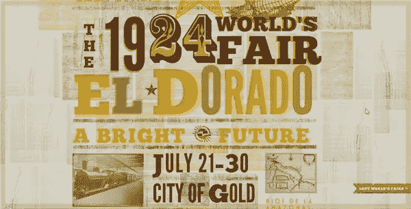
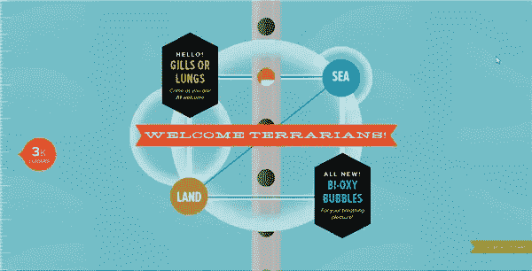
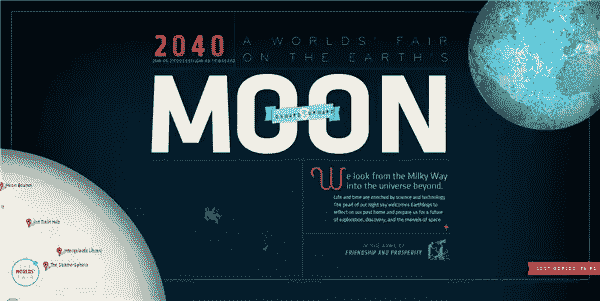

# 哇！看看你能用 WOFF 字体做些什么

> 原文：<https://www.sitepoint.com/wow-look-what-you-can-do-with-woff-typography/>

[失落的世界博览会](http://lostworldsfairs.com/)是一系列 CSS 字体实验，旨在为虚构的世界博览会做广告。如果我是最后一个知道这件事的人，我很抱歉，这些华丽的排版设计是旧闻，但我今天才看到它们，觉得它们非常漂亮(亚特兰蒂斯是我特别喜欢的)。这些网站旨在展示 Internet Explorer 9 对 WOFF 的支持。

WOFF 是什么？

WOFF(即[网络开放字体格式](http://en.wikipedia.org/wiki/Web_Open_Font_Format))是一种重要的**标准化格式**，用于在网络上使用字体，这些设计说明了网络排版正越来越接近印刷工作的能力。还有很长的路要走，但这是令人鼓舞和鼓舞的。

WOFF 允许在网页中嵌入 TrueType、OpenType 或 Open Font 格式的字体。微软、Mozilla 和 Opera 支持该项目，并且已经在 Firefox 3.6 和更高版本、Chrome 5 和更高版本、Internet Explorer 9 和 Safari 的下一版本中建立了支持。

失落世界博览会的实验场地由弗兰克·奇梅罗、纳兹·哈米德、特伦特·沃尔顿、戴夫·鲁伯特和杰森·圣玛丽亚设计开发，他们被统称为“[强大之友](http://madebymighty.com/)”。这些站点将 WOFF 与 Typekit 结合使用。杰森在他的[博客](http://jasonsantamaria.com/articles/ie9-and-the-lost-worlds-fairs)上说:

> 从一开始，我们就同意分三个部分做一些事情(每个设计师一个)，更重要的是，一些看起来不像文章或博客的事情。除了 WOFF 格式提供的一些技术优势，它在美学上与其他格式没有什么不同。所以我们决定找点乐子，设计一些以强有力的字体为核心的东西。

纳兹·哈米德于 1924 年拍摄的《黄金国》。你可以看到这个设计中使用的字体[这里](http://typekit.com/colophons/ovl0wbn)。

弗兰克·奇梅罗于 1962 年拍摄的《亚特兰蒂斯》。你可以看到这个设计中使用的字体[这里](http://typekit.com/colophons/ips3zdt)。

杰森·圣玛丽亚拍摄的 2040 年的月亮。你可以看到这个设计中使用的字体[这里](http://typekit.com/colophons/atn8ubh)。

参见 [Jason 的博客](http://jasonsantamaria.com/articles/ie9-and-the-lost-worlds-fairs)了解更多关于这个项目是如何产生的，以及设计师是如何完成他们的设计的。失落的世界博览会是一个有趣和鼓舞人心的项目，我期待着看到更多的设计师用印刷术打破网络界限。

你认为这些网站的设计、排版和布局怎么样？

## 分享这篇文章