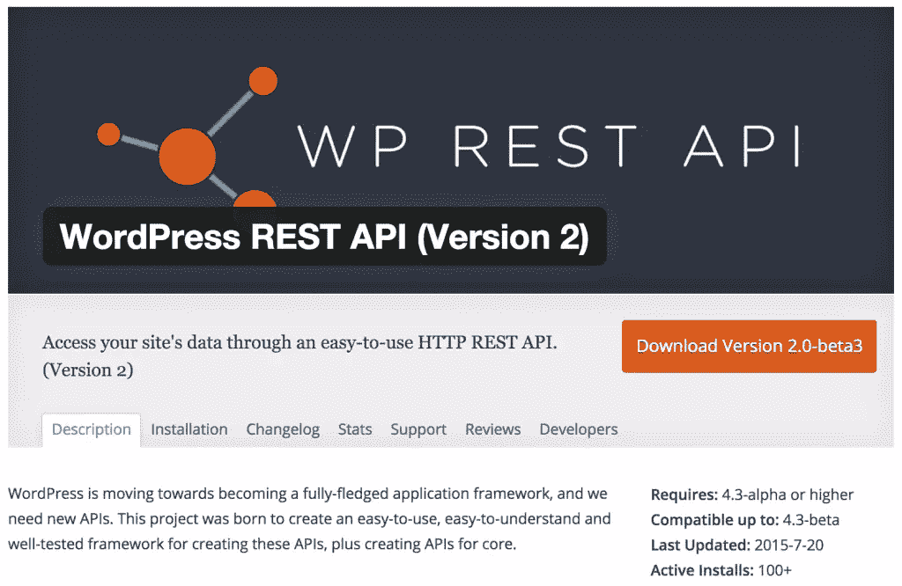
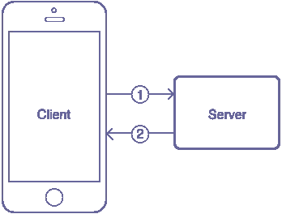
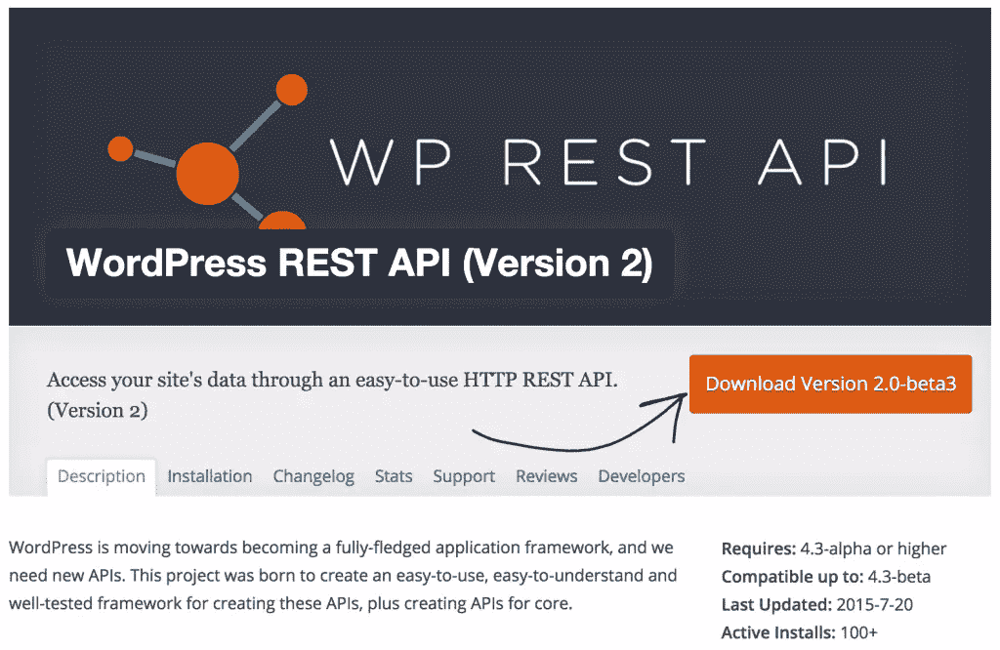
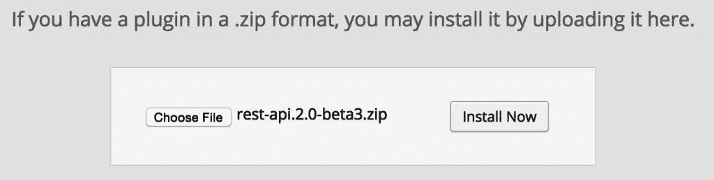
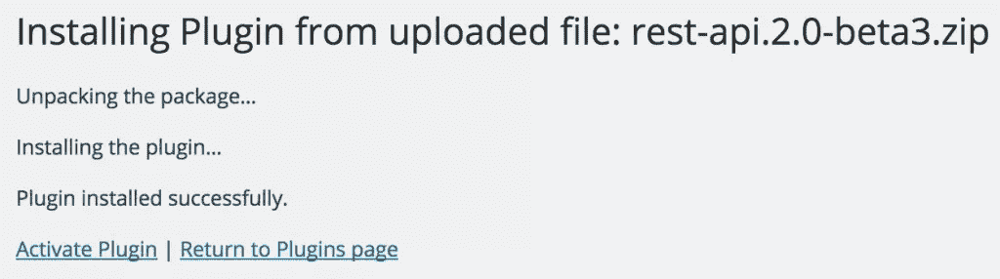
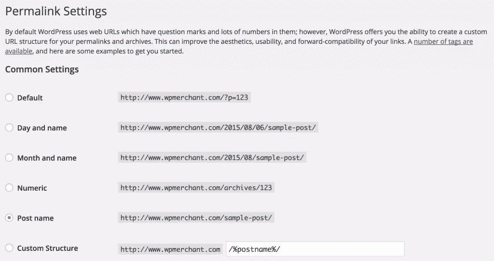
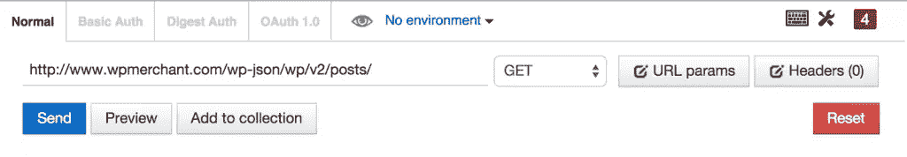
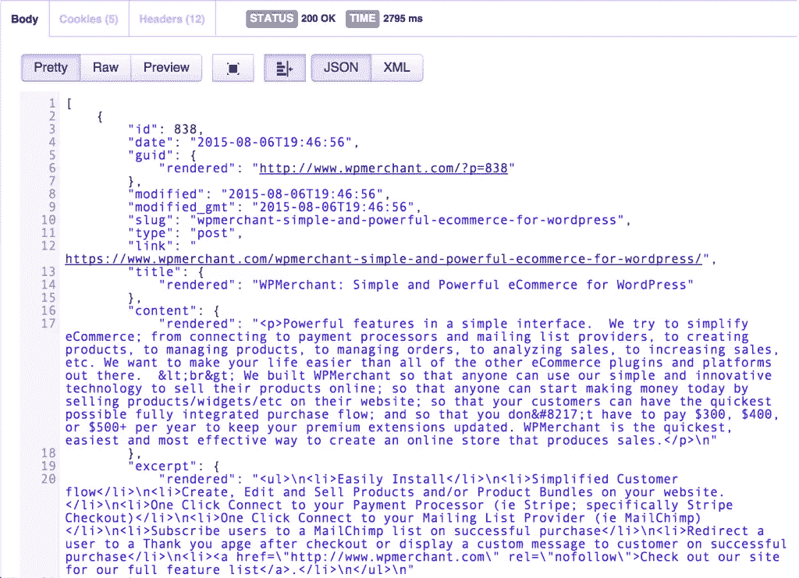
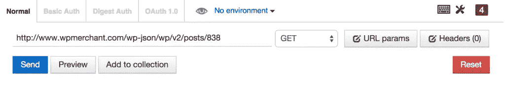
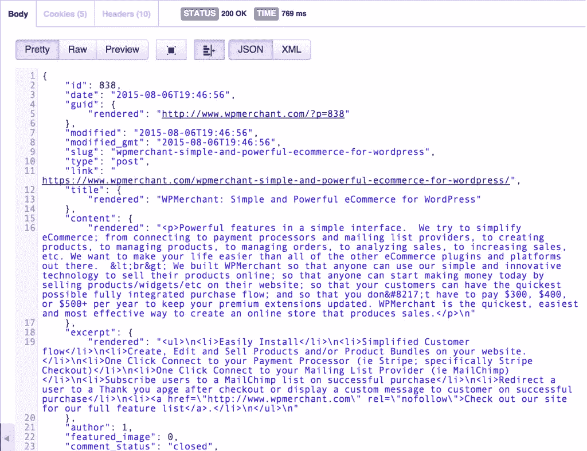

# WP API–使用 WordPress REST API

> 原文：<https://www.sitepoint.com/wp-api/>



在我们讨论 WP REST API 之前，理解一些术语和背景信息是很重要的。缩写 API 代表应用程序编程接口。API 是一种与应用程序数据交互的编程方式。例如，脸书的 API 让开发者能够获得与某个用户相关的所有朋友。API 通常包括一组称为文档的特定指令；让任何开发人员都能轻松使用它。

REST 意味着具象状态转移。如果一个 API 的设计/架构符合一组特定的约束，那么它可以被认为是 RESTful 的。你可以在这里查找这些约束是什么。

HTTP 请求通常是您与 RESTful API 交互的方式(HTTP 请求也是通过互联网传输数据的主要方式)。HTTP 的意思是超文本传输协议。该协议允许在客户端(手机、平板电脑、笔记本电脑、台式机等)之间共享信息。)和请求-响应协议中的 web 可访问服务器。例如，为了向用户的脸书时间表发布一个状态，一个代表该用户的针对该动作的 HTTP 请求将从我们的 JavaScript 代码发送到脸书的 API(即脸书服务器)。客户端(JavaScript 代码)将收到来自脸书服务器的响应，表明用户的状态已成功发布。



*1。客户端向服务器发出 HTTP 请求，2。服务器用 HTTP 响应来响应。*

在 HTTP 请求中，您需要定义想要对资源执行的操作类型。与任何 HTTP 请求相关的主要操作有四种(通常称为 CRUD):

1.  发布(创建)
2.  获取(检索)
3.  上传(更新)
4.  删除(删除)

资源是可以通过 HTTP 请求访问的数据对象。WP REST API 允许你“通过一个易于使用的 HTTP REST API 访问你的 WordPress 站点的数据(资源)”。在 WP API 的最新版本(版本 2)的情况下，资源包括以下 9 个 WordPress 对象:

1.  邮件
2.  页
3.  媒体
4.  Post meta
5.  发布修订
6.  评论
7.  分类学
8.  条款
9.  用户

有了 WP API，你可以对上面列出的任何 WordPress 站点资源执行四个 CRUD 操作中的任何一个。例如，你可以使用 WP API 创建一篇文章，检索一篇文章，更新一篇文章或者删除一篇与你的 WordPress 网站相关的文章。

要知道有些 HTTP 请求不需要认证(任何人都可以发出请求和相应的响应)，这一点很重要。例如，在 WP API 中，某些 GET 请求(如获取帖子和获取媒体)不需要认证。但是其他 GET 请求确实需要认证。例如，获取帖子修订、获取用户和获取帖子元数据都需要身份验证。此外，所有 POST、PUT 和 DELETE WP API 操作都需要认证。

在 WP API 的例子中，对站点动作(安装在站点上的插件或主题)的认证是由 cookies 处理的。然而，如果你不在站点上，认证是由 OAuth 处理的(你需要下载 OAuth 插件到你的 WordPress 站点，然后任何外部站点都需要通过正常的 OAuth 流程来获得访问权。你也可以使用一个基本的认证插件。

> 创建、检索、更新或删除 WordPress 站点数据”就像发送一个 HTTP 请求一样简单

现在你有望更好地理解 WP API 是什么，我们将探索可能的用例以及 API 的可扩展性、局限性、安装说明，并进行几个示例 API 调用。

## WP API 的用例

在 2014 年旧金山 WordCamp 的一次演讲中，Sam Hotchkiss 说 WP API 可能会导致“插件单独运行在 REST API 上；而无需在该网站的服务器上安装任何 PHP。”他认为 WP API 可能为插件打开了“第三方应用商店”的大门。

在 2015 年 5 月 27 日的 WordPress 周刊上，WordPress 的联合创始人之一马特·莫楞威格说 WP REST API 将会“对开发者来说是巨大的和革命性的”。开发者将能够“以一种分离的方式构建应用程序”。

Matt 确保强调“当它与其他东西结合在一起时，真的会变得很棒。想象一下未来版本的 HappyTables…他们根本不修改 WP admin。它只是创建了一个自定义接口，该接口纯粹通过 REST API 进行交流。而不是试图黑掉 WP admin 里的一切。”

Matt 继续说道,“我认为 REST API 是 WP admin 成为众多管理 WordPress 客户端之一的开始。把 WP admin 想象成 PHP，加上 HTML，再加上 JavaScript 客户端。我认为你会看到本地客户。我想你会看到纯 JavaScript 客户端。我想你会看到其他的 PHP，HTML，JS 客户端；或许是在快乐桌面或其他一些围绕 WordPress 兴起的垂直领域。他认为这可能会“让管理(仪表板)变得像替换主题一样容易。”

## 高度可扩展

WP API 远程访问和操作 WordPress 站点资源的能力本身就足够酷了，但是它的可扩展性使它更加令人兴奋。WP API 提供了向资源添加附加字段和向 API 添加端点的方法。

### 向资源添加域

使用 register_api_field 函数，您可以在向某些 WP API 资源发出请求时添加要更新或检索的附加字段。您首先需要运行 add_action 函数并使用 rest_api_init 作为钩子(您可能会通过 WordPress 插件添加这些代码)。第二个参数是遇到钩子时运行的函数名。这个实例中的函数名是 register_post_custom_field。custom_field 是字段名，post 是资源，get_custom_field 是在 post 资源上调用 get 请求时运行的回调函数。

```
function register_post_custom_field() {
        register_api_field( 'post',
            'custom_field',
            array(
                'get_callback'    => 'get_custom_field',
                'update_callback' => null,
                'schema'          => null,
            )
        );
    }
```

然后需要将 get_custom_field 回调函数添加到同一个文件中。在这个函数中(如下所示)，您可以获得 post 资源的“custom_field”的值，并将其返回。这是为了当调用获取自定义字段值时，您将收到自定义字段值作为响应。

```
function get_custom_field( $object, $field_name, $request ) {
        return get_post_meta( $object[ 'id' ], $field_name, true );
    }
```

### 添加端点

根据 wp-api.org 的说法，“端点是通过 API 可用的函数。这可以是更新帖子或删除评论之类的事情。端点执行特定的功能，接受一些参数并将数据返回给客户端。路由是用于访问端点的“名称”，在 URL 中使用。一个路由可以有多个与之相关联的端点，使用哪个端点取决于 HTTP 动词。

除了向默认资源添加字段之外，您还可以注册自定义端点，以便与 WP API 一起使用。为了注册自定义端点，您需要调用 add_action 函数，并使用 rest_api_init 钩子和 register_rest_route 函数(同样，您可能会将此代码添加到 WordPress 插件中)。在下面的示例中，注册了 author/{author_id}路由，并定义了该路由的 GET 端点(回调函数是 get_post_title_by_author)。

```
add_action( 'rest_api_init', function () {
            register_rest_route( 'myplugin/v1', '/author/(?P\d+)', array(
                'methods' => 'GET',
                'callback' => 'get_post_title_by_author'
            ) );
        } );
```

下面是通过 WP API 访问 GET 端点时调用的回调函数。仅供参考，在这个函数中，通过文章的作者 id 来检索文章，并返回最新的文章标题。

```
function get_post_title_by_author( $data ) {
            $posts = get_posts( array(
                'author' => $data['id'],
            ) );

            if ( empty( $posts ) ) {
                return null;
            }

            return $posts[0]->post_title;
        }
```

将端点和字段添加到默认 WP API 功能的能力使得开发者更容易在许多不同类型的 WordPress 站点上使用 WP API，并在未来提供更多迭代的机会。

## 限制

在开始使用 WP API 之前，您需要记住一些重要的限制。首先，不允许使用 WP API 读取或存储任何形式的序列化元数据。API 的创建者说，这是因为“JSON 不能保存 PHP 中存储的所有格式的数据”(例如，自定义 PHP 对象不能被表示)，序列化数据也可能暴露私有数据，序列化数据存在安全问题(特别是远程代码执行漏洞)。

此外，受保护的元不能通过 WP API 访问或保存。受保护的元是任何具有以 _(下划线)字符开头的键的元字段。这些元字段不能通过 API 公开。

所有其他元数据只有在“被授权编辑附加了元数据的帖子”时才可用。这是因为任何用户都可以通过自定义字段元框输入元值，并且他们希望保护用户隐私。

同样重要的是要注意，当前的版本二测试版“不保证与未来的测试版向前兼容。”他们继续说“虽然我们相信 API 现在已经足够稳定，可以进行公开测试，但在未来我们进一步改进 API 时，我们可能会继续破坏它。只在开发中使用 API，不要在生产环境中使用版本 2。”你可以使用 WP API 的第 1 版，但是我们建议坚持使用第 2 版，等到他们说可以生产的时候再在生产中使用。

最后，在之前提到的同一期 WordPress 周刊中(5 月 27 日)，马特·莫楞威格谈到了 WP REST API 认证流程的局限性。他说，“开箱即用的第三方集成仍然不会像你习惯的那样顺利，比如登录脸书或登录 Twitter 来集成某些东西。这仍然是一个多步骤的过程，或者需要网站所有者经历一些额外的步骤。

## 安装说明

你应该对 WP API 的能力和局限性有一个很好的了解。让我们向您展示使用它的步骤。首先，你需要添加 WP API 插件到你的 WordPress 站点。

去 https://wordpress.org/plugins/rest-api.点击红色的下载按钮。这将下载最新版本的 WP API 插件作为一个 zip 文件。



然后，登录你的 WordPress 站点(your-site-name . com/WP-log in . PHP)。将鼠标悬停在左侧栏中的插件上，然后单击添加新插件。点击上传插件按钮，点击选择文件并选择 WP API 插件的压缩版本，然后点击立即安装。



现在它已经安装好了，点击“激活插件”链接。



将永久链接更改为非默认值；我们将我们的设置为 Post name 选项。



这就是配置 WP REST API 所涉及的一切。现在，我们可以使用 WP API 从你的 WordPress 网站获取一些有趣的东西和数据。

## 示例 WP REST API 请求

我们将向您展示一些未经认证的 WP API GET 请求的示例。因此，没有必要担心任何认证插件或设置。

从添加 [Postman Chrome 扩展](https://chrome.google.com/webstore/detail/postman/fhbjgbiflinjbdggehcddcbncdddomop?hl=en)开始。如果你使用 Firefox，你也可以安装 [REST Easy 插件](https://addons.mozilla.org/en-us/firefox/addon/rest-easy/)。

### 获取帖子

我们将向你展示如何获取你的 WordPress 站点上现有的所有帖子。为此，请复制以下 URL(路由):

```
http://www.your-web-site.com/wp-json/wp/v2/posts
```

将该路线粘贴到 Postman 的 *Enter request URL here* 字段中(您也可以通过在 web 浏览器中简单地键入上面的路线来完成此操作，但是数据不会被格式化(因此更难看到模式))。将“your-web-site.com”替换为你安装 WP API 插件的网站(在我们的例子中是 wpmerchant.com 网站；从下图可以看出)。从下拉列表中选择“获取”，然后单击“发送”。



这是向你的 WordPress 站点的服务器发送一个 GET 请求，服务器根据路由和设置的 HTTP 动作发送回一个响应。您应该会看到类似下面的 JSON 响应。



正如您所看到的，这个响应是以某种方式构造的，因此您可以轻松地、可预测地访问其中的数据；这就是所谓的模式。这种结构非常重要，因为知道了它，您就可以有计划地筛选数据。响应以[(左方括号)开始。这将响应标识为一个 JSON 数组。如果您更详细地查看响应，您会发现，除了其他信息之外，数组中的第一个帖子具有帖子 ID*838*，帖子标题*WP merchant:WordPress 的简单而强大的电子商务*，以及以*开始的帖子内容< p >简单界面中的强大功能。*)。在响应中返回的所有其他帖子中都执行这种结构。

### 得到一个职位

现在你知道了如何在你的站点上获得一个帖子列表，我们将向你展示如何从安装了 WP API 插件的 WordPress 站点上获得一个特定的帖子。复制下面的路线。

```
http://www.your-web-site.com/wp-json/wp/v2/posts/{id}
```

粘贴到 Postman *在这里输入请求 URL 字段*。同样，确保从下拉列表中选择 GET。将 your-web-site.com 替换为你安装 WP API 插件的网站，将{id}替换为你知道存在于 WordPress 网站上的文章 id。



点击蓝色的发送按钮。您应该会看到类似以下的响应:



如您所见，没有左方括号来开始响应。这意味着这个响应是一个对象，而不是一个对象数组。具体来说，这个响应包括与帖子 ID 为 838 的帖子相关的所有帖子数据。单个帖子数据的格式与上面的帖子列表相同。您可以再次解析响应，查看帖子 id、帖子标题、帖子内容、帖子摘录和许多其他帖子详细信息。

玩得开心，并测试一些其他未经验证的 HTTP 请求！

## 结论

正如你所知道的，我们对使用 WP API 以及 WP REST API 的含义和使用它所带来的不同功能感到非常兴奋(并希望最终整合到 WordPress 核心中)。

在随后的文章中，我们将创建一个外部站点，使用 WP REST API 创建、检索、更新和删除 WordPress 帖子。因此，请查看我们的 Twitter feed，继续关注！

### 继续对话

你打算如何使用 WP API？你如何预见它被使用？我们很想听听你的想法！

## 分享这篇文章