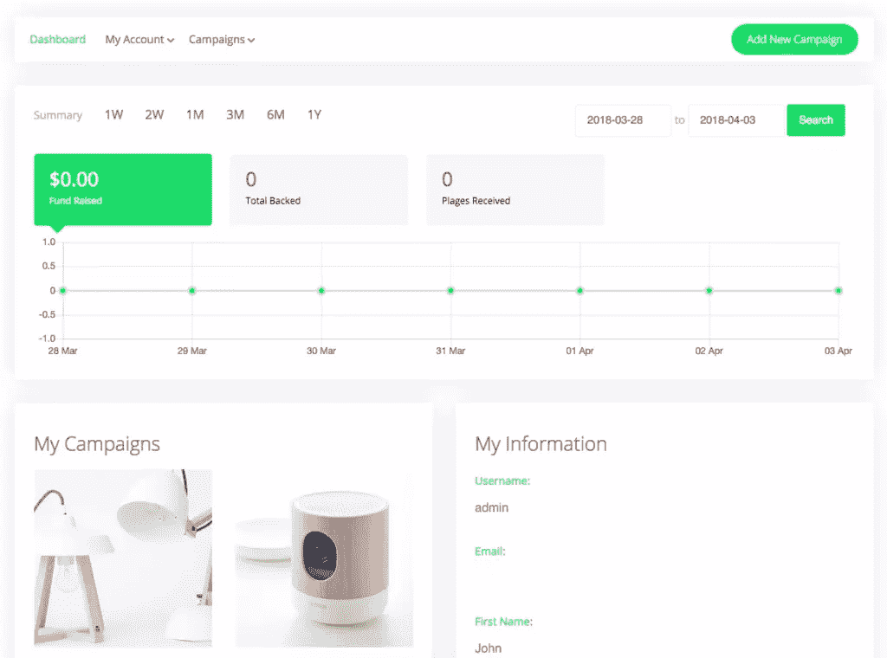
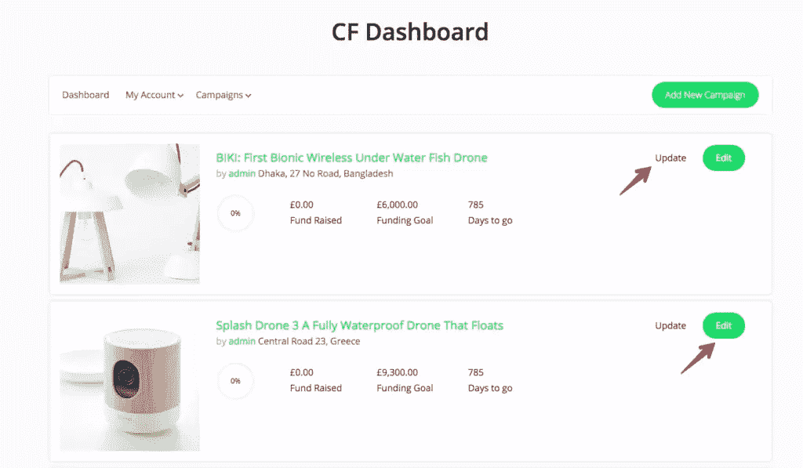
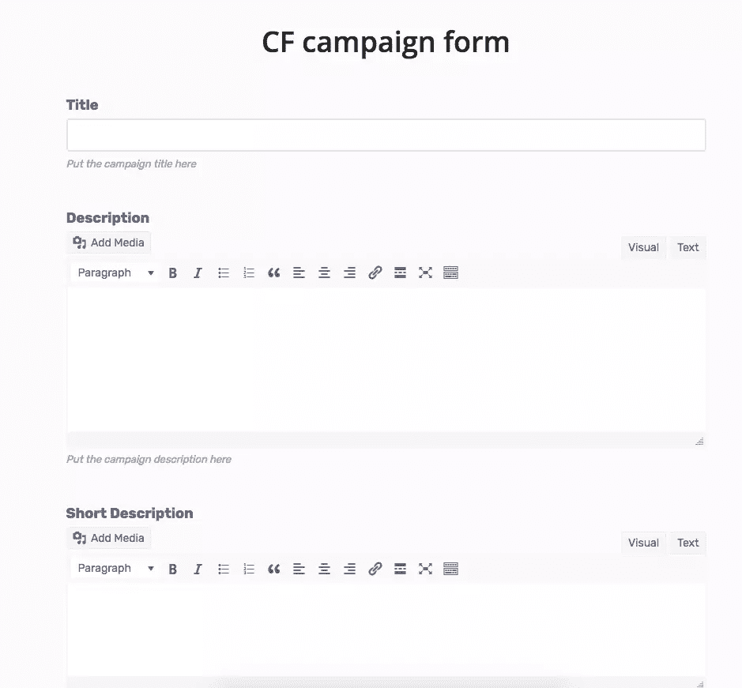
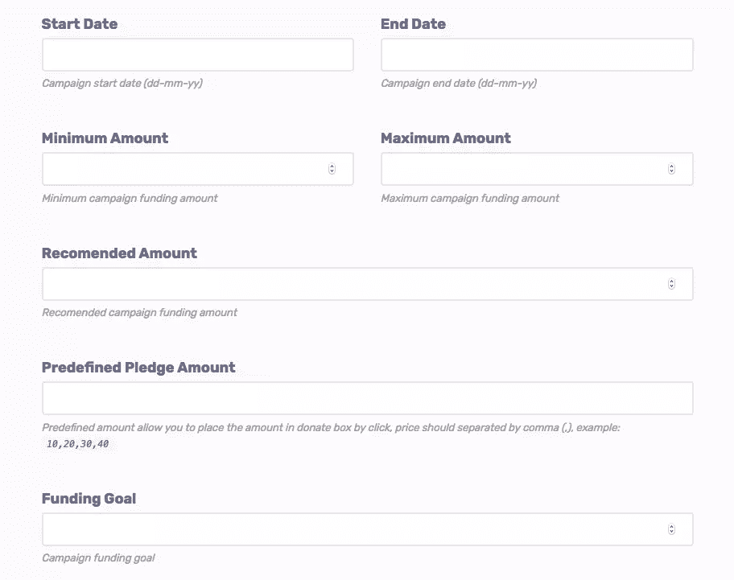
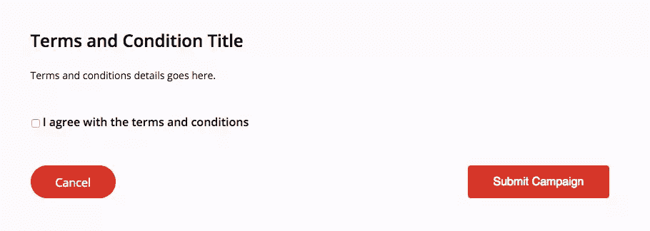
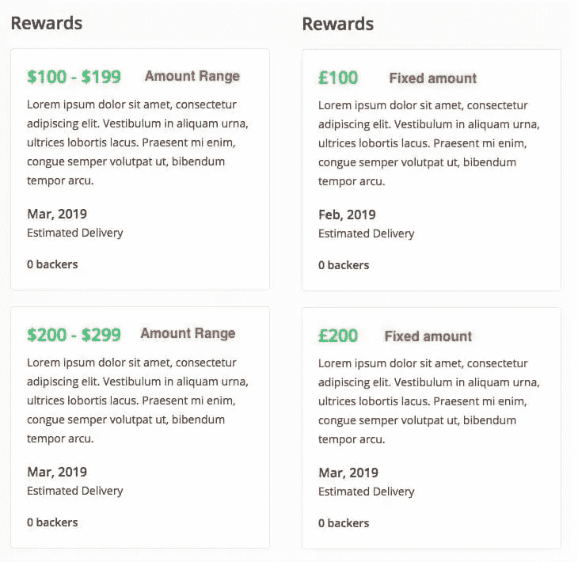
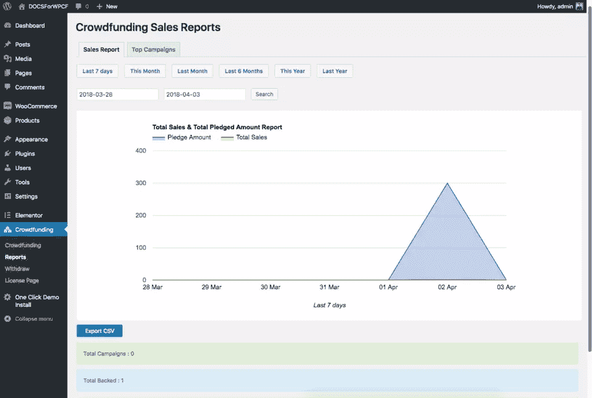
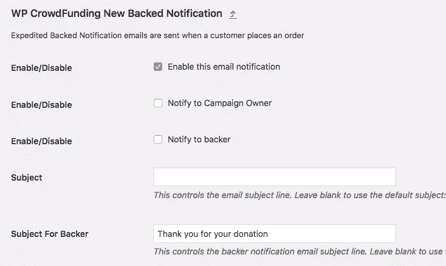

# WP 众筹:筹款网站的完整解决方案

> 原文：<https://www.sitepoint.com/wp-crowdfunding-the-complete-solution-for-fundraising-websites/>

*本文是与 [Themeum](https://www.themeum.com/) 合作创作的。感谢您对使 SitePoint 成为可能的合作伙伴的支持。*

还记得那些你认为创建一个像 Kickstarter 或 Indiegogo 这样的众筹平台会花掉你一大笔钱的日子吗？等等，你还记得吗？难怪人们叫你老派！让我告诉你:现在做一个众筹网站非常容易。

你可以用 WordPress 做到这一点——只需添加一个 WordPress 众筹插件，就可以提供足够的功能，在一个小时内创建一个成熟的众筹网站。有很多众筹插件，但由于你是一个大忙人，独自研究将非常耗时，我将向你推荐我最喜欢的一个: [WP 众筹](https://www.themeum.com/product/wp-crowdfunding-plugin/)，这是其类别中最畅销的 WordPress 插件。

### WP 众筹插件对于一个筹款网站来说里面有什么？

WP 众筹完全基于 WooCommerce，可以让你在后台使用你熟悉的 WooCommerce 界面。你的活动所有者不需要担心在仪表板上漫游，因为这个 WordPress 众筹插件附带了一个前端提交表单来提交他们的活动，以及许多其他前端设施来正常运行他们的活动。

让我们来看看 WP 众筹插件的关键特性。

*   为众筹网站设计的主题

*   基于 WooCommerce，提供一个熟悉而稳固的平台

*   每场战役的无限奖励

*   原生钱包、条纹连接、PayPal 自适应支持

*   Google reCAPTCHA，电子邮件通知，分析报告

*   最低、最高和推荐价格选项

*   用于开发者的模板覆盖系统

*   结束活动的多种方法——货币目标、日期或无限制

现在，让我们更深入地了解一些核心特性。

### 对平台的完全控制

作为平台的所有者，您可能希望完全控制平台。这将有助于防止滥用，发生的一切都将是可见的。这个 WordPress 众筹插件可以让你控制注册过程、项目发布、撤销请求等等。您可以从后端配置这些设置。

我喜欢项目批准设置，因为它允许您手动批准所有活动，因此您可以完全控制您想要在您的筹款平台上运行的活动类型。您也可以从后端设置最小和最大取款请求的限制。

### 专用 WordPress 主题

你可以在任何 WordPress 主题上使用这个 WordPress 众筹插件，但是为了享受更流畅的体验和拥有友好的用户界面，这个插件的付费版本在包内提供了一个特殊的众筹主题。插件与主题很好地结合在一起，所以你不必担心购买其他主题。

### 模板覆盖

WP 众筹插件支持模板覆盖，所以如果你想改变什么，你可以非常容易地定制页面或元素的样式。即使将插件更新到新版本，您的增强功能仍将保留。如果你想知道更多关于如何改变模板风格的信息，你可以查看这个[链接](https://www.themeum.com/docs/wp-crowdfunding-theme-customization/)。

### 管理个人资料和活动详细信息的用户控制面板

为了让你的筹款平台脱颖而出，你必须为你的用户提供一个超级友好的前端环境。这个 WordPress 众筹插件提供了一些预定义的页面，这些页面将负责你所有的前端操作。仪表板、我的帐户、活动列表和添加新活动是前端操作的关键页面。您可以使用短代码创建其他重要页面。在这个[链接](https://www.themeum.com/docs/wp-crowdfunding-shortcodes/)查看这些方便的短代码。

我们来详细看看前端的操作。

### 仪表盘

**Summary:** 这是你肯定想在仪表板页面上看到的东西之一，它会让你看到你所有活动的概览。您可以看到筹集的资金总额和收到的认捐总数的摘要。有几个预定义的范围，但是您可以选择日期范围来获得特定的摘要。

**我的活动:**您的所有活动都将列在我的活动下。为了让您快速访问所有活动，仪表板页面上提供了该列表。您可以从这里进入活动详情主页。让我们看看营销活动概述页面。

活动详情页面提供四个部分:活动故事、支持者列表、更新和评论。所有这些都是不言自明的——竞选故事显示了竞选的细节，支持者列表显示了到目前为止为这次竞选做出贡献的支持者的列表。如果你想让支持者匿名，你也可以这样做。

**活动部分:**该下拉菜单提供了五个子部分——我的活动、支持的活动、承诺活动、书签和付款。您的所有活动都将显示在“我的活动”下，您可以对其进行修改。有一个“更新”按钮，您可以使用它发布关于任何特定活动的公告。“编辑”按钮将允许您对您的活动进行更改。收到的支持活动和承诺将让您看到所有信息，包括订单、日期、状态、总数、奖励和行动。书签子部分包含您在活动单页中添加书签的活动列表。付款子部分显示筹集和应收款项的总额。

**添加新活动**

您可以在此页面创建新的活动。这一页中的所有选项都是不言自明的，但我将重点介绍关键特性。前端编辑器提供了与默认 WordPress 编辑器相同的视觉和文本编辑器。

### 项目定制

这个 WordPress 众筹插件的项目定制让活动创建者定制他们的活动。它提供了有趣的功能，如推荐金额和预定义的抵押金额。用户可以选择他们的项目目标，从而选择项目结束方法。

这个 WordPress 众筹插件里其实有四种项目结束方式——目标目标、目标日期、目标目标&日期、运动永不结束。

如前所述，如果活动所有者不想在网站上显示支持者信息，他们需要在“添加新活动”页面启用“贡献者匿名”。

在“添加新活动”页面的末尾，网站管理员可以自由设置自己的条款和条件。这有助于避免任何法律问题。除了条款和条件之外，您还可以添加其他详细信息。

### 货币管理

在这个 WordPress 众筹插件中，你将拥有 WooCommerce 提供的所有资金管理系统，除此之外，你还将拥有一个原生钱包系统、PayPal 自适应支付、Stripe Connect 和 Authorize.net AIM 支持。这些支付方式提供了一个独特的功能，允许您从您网站上的所有活动中自动扣除佣金。

### 本地钱包系统

所有这些特殊的支付方式都会对你网站上的每笔交易收取一定比例的费用。如果你不想支付 Stripe/PayPal/AIM 或任何其他第三方支付系统提供商的费用，那么你可以使用原生钱包系统。在 WP 众筹中有一个非常有用的选项，名为“接收者百分比”，它将让你(管理员)决定你想从活动所有者那里获得的佣金百分比。启用此功能后，您将自动将您的共享存储在您的帐户中。

### 条纹连接支付

WP 众筹提供 Stripe Connect 支付功能，使网站管理员可以自动将认捐款项分配给多个接收者。例如，假设网站管理员想对众筹网站上的任何活动收取佣金。在这种情况下，管理员可以使用条带连接。

### Authorize.net AIM

Authorize.net 的 AIM 版本是最受欢迎的支付网关之一，因为它们提供了一个安全简单的信用卡处理系统。这种先进的网关在结账时提供最大限度的控制，这使它非常受欢迎。Authorize.net AIM 将给予你从你的用户活动中自动扣除佣金的自由。

### 每场战役的无限奖励

在筹款的世界里，项目奖励是一个非常有用的概念，它包含了你的项目和项目成果的额外收益。有了这个 WordPress 众筹插件，你的用户可以宣布每个活动的无限奖励。这个插件可以让你设定一个固定的奖励金额或范围。此外，你可以选择不同风格的奖励设计。

### 详细的分析报告

分析报告是 WP 众筹的一项高级功能，可以根据你网站上发布的众筹项目生成各种统计报告。此功能有两个选项卡:销售报告和热门活动。

*   “销售报告”可以让你看到网站上所有交易的报告。它有 6 个预定义的按钮(过去 7 天，本月，上个月，过去 6 个月，今年，去年)来查看不同时间段的报告。您也可以选择执行自定义搜索。
*   “热门活动”将让您看到您网站上的热门活动。它还有 6 个预定义的按钮(过去 7 天，本月，上个月，过去 6 个月，今年，去年)作为自定义搜索选项。当您觉得需要导出这些报告时，您可以使用 CSV 格式。

### 电子邮件通知

邮件通知是 WP 众筹的高级功能之一。安装了这个 WordPress 众筹插件的专业版后，你会得到四个电子邮件模板。所有的电子邮件都是由 WooCommerce 提供的，所以你可以获得任何 WooCommerce 网站提供的所有功能。您可以自行定制电子邮件模板。您甚至可以设置通知设置。

总之，你可以从免费版开始，但是如果你真的热衷于用 WordPress 创建一个筹款网站，我会鼓励你选择高级版。你肯定希望你的所有活动都有一个无限制的奖励选项，像 Stripe Connect/PayPal Adaptive 或 Authorize.net AIM 这样的支付网关，详细的报告，等等。付费版本还带有一个特别的主题，非常适合众筹平台。

你可以从主题网站查看 WP 众筹的演示版。你也可以通过点击“尝试后端”按钮来玩玩后端，所以在购买之前一定要检查所有的东西。WP 众筹拥有你创建世界级筹款网站所需的一切。

[立即下载 WP 众筹！](https://www.themeum.com/product/wp-crowdfunding-plugin/)

## 分享这篇文章