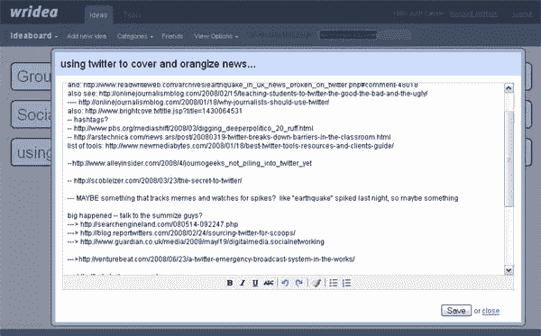

# Wridea:在线想法管理应用

> 原文：<https://www.sitepoint.com/wridea-online-idea-management-application/>

对任何博客作者来说，保持条理的能力都是一大财富。当你在追踪多个故事的线索、收集链接和做研究时，记录这一切可能意味着成为第一个热门独家新闻或浪费宝贵时间试图记住你在哪里写下这个重要统计数据的区别。可悲的是，有几次糟糕的组织完全改变或扼杀了我正在创作的故事，因为我对内容方向的想法被放错了地方。这就是为什么我对 Wridea(T2)和在线想法管理应用程序感到如此兴奋，该应用程序上周发布了第二版。

在 SitePoint，我们使用来自 37signals、email、即时消息和 Skype 的 [Basecamp](http://www.basecamphq.com/) 群件工具来保持组织有序，并就内容问题相互聊天。但就个人而言，我的电脑上到处都是文本文件，我的桌子上到处都是碎纸片，上面有故事构思、研究和电话采访笔记，以及我给谁发了电子邮件或与谁交谈过以及何时交谈的记录。简单地说，这不是一个很好的系统。

Wridea 是一个非常简单的应用程序，旨在将您的想法和笔记保存在一个地方。每个想法都作为一个大的、高度可见的文本标题添加到页面上，可以用颜色编码以映射到用户定义的类别。每个想法下面都有一个“细节”框——基本上是一个简单的文本编辑器，你可以在上面输入关于你的想法的更多注释，并且可以用简单的控件格式化，如粗体、斜体、下划线、文本颜色和项目符号列表。

你可以创建多个创意页面，这样你就可以按主题对它们进行分组，例如，一个页面用于你的应用程序的功能创意，另一个页面用于你的新公寓的家居装修创意。任何页面都可以与朋友分享，他们可以对你的想法发表评论并提供反馈。

Wridea 非常简单，它的创建者希望它可以用于会议期间的实时笔记。不过，它也有一些缺点。首先是想法的组织。Wridea 应该帮助你“组织和改进[你的]想法”，但实际上它在组织方面相当欠缺。我发现我的页面上的想法是以一种看似随机的方式列出的——我添加的第三个想法列在第一位，第二个列在第三位，第一个列在第二位。它们似乎没有按字母顺序或我定义的类别排列，也没有办法重新排序(如果我想按优先级排列呢？)或者给他们贴标签。

Wridea 的第二个缺点是，尽管它很简单，但可能有点笨重。例如，为意见更改或添加类别包括单击意见，然后单击“选择”链接，再从顶部导航栏的“类别”下拉菜单中选择类别，然后取消选择意见条目。太多步骤了。

这也将是伟大的，能够在你的网页上的主要想法下添加子想法，每个都有自己的细节框，这将有助于能够导出想法到其他格式(txt，pdf，doc，html 等。).

## 结论

最后，很难看出 Wridea 比 Basecamp 中的列表和一些写字板，或者 Google Docs 中的共享文档好多少。我喜欢超级简单的共享想法管理器的概念，但是当前的实现与已经可用的工具没有足够的区别，所以它真的值得。在我看来，这里肯定有一个有用的应用程序的潜力，但它还没有完全达到目标。

你如何记录你的头脑风暴会议？请在评论中告诉我们。

## 分享这篇文章