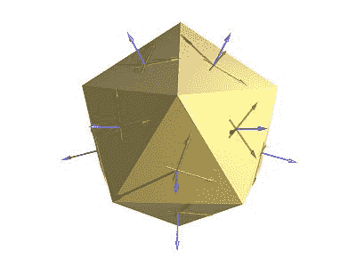
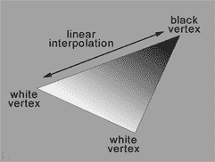

# 从头开始编写 3D 软引擎:第 5 部分

> 原文：<https://www.sitepoint.com/write-3d-soft-engine-scratch-part-5/>

我们现在将发现这个系列最精彩的部分:如何**处理闪电**！

在[上一部分](https://www.sitepoint.com/write-3d-soft-engine-scratch-part-4/)中，我们为每个面固定了一个随机颜色，以便能够看到网格。我们现在要把它改成**计算灯光和每个面之间的角度**以获得更好的照明。回顾的第一个算法被命名为**平面阴影**。它使用了**每面法线**。使用这种方法，我们仍然可以看到多边形。但多亏了 **Gouraud Shading** ，我们将更进一步。这个使用每顶点法线。然后，它将使用 3 条法线对每个像素的颜色进行插值。

在本教程结束时，你应该有这个非常酷的渲染:

[https://david.blob.core.windows.net/softengine3d/part5/index.html](https://david.blob.core.windows.net/softengine3d/part5/index.html)

## 平面阴影

### 概念

为了能够应用平面阴影算法，我们首先需要计算人脸的法向量。一旦我们得到了它，我们需要知道这个法向量和光向量之间的角度。更准确地说，我们将使用一个[点积](https://en.wikipedia.org/wiki/Dot_product)，它将给出这两个向量之间角度的余弦值。由于这个值可能是-1 和 1，我们将把它截在 0 和 1 之间。这个最终值将用于根据当前颜色应用到我们脸上的光量。总之，我们脸的最终颜色将会是= **颜色*数学。Max(0，cos(角度)**)。

让我们从法向量开始。维基百科的定义[【几何】](https://en.wikipedia.org/wiki/Normal_of_the_plane "https://en.wikipedia.org/wiki/Normal_of_the_plane")中说:“*为一个* [*凸*](https://en.wikipedia.org/wiki/Convex_set) [*多边形*](https://en.wikipedia.org/wiki/Polygon) *(如一个* [*三角形*](https://en.wikipedia.org/wiki/Triangle) *)，一个曲面的法线可以计算为矢量***的两条(非平行)边的叉积**

 *为了说明这一点，您可以从 Blender 文档中看到一个有趣的图形:[Blender 3D:Noob to Pro–Normal _ coordinates](https://en.wikibooks.org/wiki/Blender_3D:_Noob_to_Pro/Printable_Version#Normal_coordinates "https://en.wikibooks.org/wiki/Blender_3D:_Noob_to_Pro/Printable_Version#Normal_coordinates")

[](https://commons.wikimedia.org/wiki/File:Blender3d_NormalKoordinates.jpg)

蓝色箭头是面的法线。绿色和红色箭头可以是面部的任何边缘向量。如果你想更好地理解这些法向量在哪里，让我们以苏珊娜·搅拌机模型作为第二个例子。

打开搅拌机，加载 Suzanne 网格，切换到*编辑模式*:

[](https://blogs.msdn.com/cfs-file.ashx/__key/communityserver-blogs-components-weblogfiles/00-00-01-10-46-metablogapi/0066.image_5F00_7C989ED6.png)

通过单击网格并按“N”打开网格的属性。在“*网格显示*下，你会发现 2 个法线按钮。点击显示“*显示面法线为线*”的图标:

[](https://blogs.msdn.com/cfs-file.ashx/__key/communityserver-blogs-components-weblogfiles/00-00-01-10-46-metablogapi/7762.image_5F00_2E92D012.png)

您将获得类似这样的内容:

[](https://blogs.msdn.com/cfs-file.ashx/__key/communityserver-blogs-components-weblogfiles/00-00-01-10-46-metablogapi/8484.image_5F00_2B80721D.png)

之后我们需要定义一个灯。我们这些教程的灯光将是最简单的:一个**点光源**。点光源就是一个 3D 点(矢量 3)。无论距离光源有多远，我们的脸接收到的光量都是一样的。然后，我们将简单地根据法线向量和由点光源和我们脸的中心组成的向量之间的角度来改变强度。

因此光线方向将是:**光线位置–中心面位置**–>这将给出**光线方向矢量**。为了计算这个光线矢量和法向矢量之间的**角，我们将使用一个**点** **乘积:[https://en.wikipedia.org/wiki/Dot_product](https://en.wikipedia.org/wiki/Dot_product "https://en.wikipedia.org/wiki/Dot_product")****


图摘自:[每像素照明](https://www.john-chapman.net/content.php?id=3 "https://www.john-chapman.net/content.php?id=3")(约翰·查普曼的文章)

### 代码

通常，我们需要首先计算法向量。幸运的是，Blender 正在为我们计算这些法线。更好的是，它导出了我们将在第二部分使用的逐顶点法线。因此，要计算我们的法向量，我们只需要取 3 个顶点的法线，将它们相加，然后除以 3。

我们需要对代码执行几项重构任务，以便能够处理前面描述的概念。到目前为止，我们只对顶点使用了 Vector3 数组。这已经不够了。我们需要嵌入更多的数据:与顶点相关的法线(用于 Gouraud 着色)和 3D 投影坐标。事实上，目前只有 2D 在进行这种预测。我们需要将 3D 坐标投影到 3D 世界中，以便能够计算各种向量。

然后我们将创建一个包含 3 Vector3 的结构:我们目前使用的当前坐标，顶点的法线和世界坐标。

*ProcessScanLine* 方法也将不得不插入更多的数据(例如 Gouraud 着色中的每顶点法线)。所以我们正在为此创建一个*扫描线数据*结构。

*   [C#](#sample1csharp)
*   [打字稿](#sample1ts)
*   [JavaScript](#sample1js)

```
public class Mesh { public string Name { get; set; } public Vertex[] Vertices { get; private set; } public Face[] Faces { get; set; } public Vector3 Position { get; set; } public Vector3 Rotation { get; set; } public Mesh(string name, int verticesCount, int facesCount)
   {
       Vertices = new Vertex[verticesCount];
       Faces = new Face[facesCount];
       Name = name;
   } public struct Vertex { public Vector3 Normal; public Vector3 Coordinates; public Vector3 WorldCoordinates; 
```

```
public struct ScanLineData { public int currentY; public float ndotla; public float ndotlb; public float ndotlc; public float ndotld; 
```

```
export interface Vertex {
   Normal: BABYLON.Vector3;
   Coordinates: BABYLON.Vector3;
   WorldCoordinates: BABYLON.Vector3; export class Mesh {
   Position: BABYLON.Vector3;
   Rotation: BABYLON.Vector3;
   Vertices: Vertex[];
   Faces: Face[]; constructor(public name: string, verticesCount: number, facesCount: number) { this.Vertices = new Array(verticesCount); this.Faces = new Array(facesCount); this.Rotation = new BABYLON.Vector3(0, 0, 0); this.Position = new BABYLON.Vector3(0, 0, 0);
   } export interface ScanLineData {
   currentY?: number;
   ndotla?: number;
   ndotlb?: number;
   ndotlc?: number;
   ndotld?: number; 
```

*No changes from the previous tutorial’s code in JS as we don’t have typed values*

这会对代码产生各种细微的修改。第一个是加载 Blender 导出的 JSON 文件的方法。我们现在需要加载逐顶点法线，并在顶点数组中构建顶点对象，而不是 Vector3 对象:

*   [C#](#sample2csharp)
*   [打字稿](#sample2ts)
*   [JavaScript](#sample2js)

```
// Filling the Vertices array of our mesh first for (var index = 0; index < verticesCount; index++) var x = (float)verticesArray[index * verticesStep].Value; var y = (float)verticesArray[index * verticesStep + 1].Value; var z = (float)verticesArray[index * verticesStep + 2].Value; // Loading the vertex normal exported by Blender var nx = (float)verticesArray[index * verticesStep + 3].Value; var ny = (float)verticesArray[index * verticesStep + 4].Value; var nz = (float)verticesArray[index * verticesStep + 5].Value;
   mesh.Vertices[index] = new Vertex{ Coordinates= new Vector3(x, y, z), Normal= new Vector3(nx, ny, nz) }; 
```

```
// Filling the Vertices array of our mesh first for (var index = 0; index < verticesCount; index++) { var x = verticesArray[index * verticesStep]; var y = verticesArray[index * verticesStep + 1]; var z = verticesArray[index * verticesStep + 2]; // Loading the vertex normal exported by Blender var nx = verticesArray[index * verticesStep + 3]; var ny = verticesArray[index * verticesStep + 4]; var nz = verticesArray[index * verticesStep + 5];
   mesh.Vertices[index] = {
       Coordinates: new BABYLON.Vector3(x, y, z),
       Normal: new BABYLON.Vector3(nx, ny, nz),
       WorldCoordinates: null }; 
```

```
// Filling the Vertices array of our mesh first for (var index = 0; index < verticesCount; index++) { var x = verticesArray[index * verticesStep]; var y = verticesArray[index * verticesStep + 1]; var z = verticesArray[index * verticesStep + 2]; // Loading the vertex normal exported by Blender var nx = verticesArray[index * verticesStep + 3]; var ny = verticesArray[index * verticesStep + 4]; var nz = verticesArray[index * verticesStep + 5];
   mesh.Vertices[index] = {
       Coordinates: new BABYLON.Vector3(x, y, z),
       Normal: new BABYLON.Vector3(nx, ny, nz),
       WorldCoordinates: null }; 
```

以下是所有已更新的方法/函数:

–***Project()***现在正在处理顶点结构，并在 3D 中投影顶点坐标(使用世界矩阵)以及投影每个顶点的法线。

–***draw triangle()***现在获取一些顶点结构作为输入，使用 compute ntl 方法计算 NDotL，并使用这些数据调用 ProcessScanLine

–***compute ntl()***计算法线和光线方向之间的夹角的余弦值

–***ProcessScanLine()***现在使用 DrawTriangle 发送的 NDotL 值改变颜色。我们目前每个三角形只有一种颜色，因为我们使用的是平面阴影。

如果您已经能够理解前面的教程和本文开头解释的概念，只需阅读下面的代码，您现在应该理解修改了:

*   [C#](#sample3csharp)
*   [打字稿](#sample3ts)
*   [JavaScript](#sample3js)

```
// Project takes some 3D coordinates and transform them
/ in 2D coordinates using the transformation matrix
/ It also transform the same coordinates and the norma to the vertex 
/ in the 3D world public Vertex Project(Vertex vertex, Matrix transMat, Matrix world) // transforming the coordinates into 2D space var point2d = Vector3.TransformCoordinate(vertex.Coordinates, transMat); // transforming the coordinates & the normal to the vertex in the 3D world var point3dWorld = Vector3.TransformCoordinate(vertex.Coordinates, world); var normal3dWorld = Vector3.TransformCoordinate(vertex.Normal, world); // The transformed coordinates will be based on coordinate system
   // starting on the center of the screen. But drawing on screen normally starts
   // from top left. We then need to transform them again to have x:0, y:0 on top left. var x = point2d.X * renderWidth + renderWidth / 2.0f; var y = -point2d.Y * renderHeight + renderHeight / 2.0f; return new Vertex {
       Coordinates = new Vector3(x, y, point2d.Z),
       Normal = normal3dWorld,
       WorldCoordinates = point3dWorld
   }; // drawing line between 2 points from left to right
/ papb -> pcpd
/ pa, pb, pc, pd must then be sorted before void ProcessScanLine(ScanLineData data, Vertex va, Vertex vb, Vertex vc, Vertex vd, Color4 color) Vector3 pa = va.Coordinates; Vector3 pb = vb.Coordinates; Vector3 pc = vc.Coordinates; Vector3 pd = vd.Coordinates; // Thanks to current Y, we can compute the gradient to compute others values like
   // the starting X (sx) and ending X (ex) to draw between
   // if pa.Y == pb.Y or pc.Y == pd.Y, gradient is forced to 1 var gradient1 = pa.Y != pb.Y ? (data.currentY - pa.Y) / (pb.Y - pa.Y) : 1; var gradient2 = pc.Y != pd.Y ? (data.currentY - pc.Y) / (pd.Y - pc.Y) : 1; int sx = (int)Interpolate(pa.X, pb.X, gradient1); int ex = (int)Interpolate(pc.X, pd.X, gradient2); // starting Z & ending Z float z1 = Interpolate(pa.Z, pb.Z, gradient1); float z2 = Interpolate(pc.Z, pd.Z, gradient2); // drawing a line from left (sx) to right (ex) for (var x = sx; x < ex; x++)
   { float gradient = (x - sx) / (float)(ex - sx); var z = Interpolate(z1, z2, gradient); var ndotl = data.ndotla; // changing the color value using the cosine of the angle
       // between the light vector and the normal vector DrawPoint(new Vector3(x, data.currentY, z), color * ndotl);
   } // Compute the cosine of the angle between the light vector and the normal vector
/ Returns a value between 0 and 1 float ComputeNDotL(Vector3 vertex, Vector3 normal, Vector3 lightPosition) var lightDirection = lightPosition - vertex;
    normal.Normalize();
   lightDirection.Normalize(); return Math.Max(0, Vector3.Dot(normal, lightDirection)); public void DrawTriangle(Vertex v1, Vertex v2, Vertex v3, Color4 color) // Sorting the points in order to always have this order on screen p1, p2 & p3
   // with p1 always up (thus having the Y the lowest possible to be near the top screen)
   // then p2 between p1 & p3 if (v1.Coordinates.Y > v2.Coordinates.Y)
   { var temp = v2;
       v2 = v1;
       v1 = temp;
   } if (v2.Coordinates.Y > v3.Coordinates.Y)
   { var temp = v2;
       v2 = v3;
       v3 = temp;
   } if (v1.Coordinates.Y > v2.Coordinates.Y)
   { var temp = v2;
       v2 = v1;
       v1 = temp;
   } Vector3 p1 = v1.Coordinates; Vector3 p2 = v2.Coordinates; Vector3 p3 = v3.Coordinates; // normal face's vector is the average normal between each vertex's normal
   // computing also the center point of the face Vector3 vnFace = (v1.Normal + v2.Normal + v3.Normal) / 3; Vector3 centerPoint = (v1.WorldCoordinates + v2.WorldCoordinates + v3.WorldCoordinates) / 3; // Light position Vector3 lightPos = new Vector3(0, 10, 10); // computing the cos of the angle between the light vector and the normal vector
   // it will return a value between 0 and 1 that will be used as the intensity of the color float ndotl = ComputeNDotL(centerPoint, vnFace, lightPos); var data = new ScanLineData { ndotla = ndotl }; // computing lines' directions float dP1P2, dP1P3; // https://en.wikipedia.org/wiki/Slope
   // Computing slopes if (p2.Y - p1.Y > 0)
       dP1P2 = (p2.X - p1.X) / (p2.Y - p1.Y); else dP1P2 = 0; if (p3.Y - p1.Y > 0)
       dP1P3 = (p3.X - p1.X) / (p3.Y - p1.Y); else dP1P3 = 0; // First case where triangles are like that:
   // P1
   // -
   // -- 
   // - -
   // -  -
   // -   - P2
   // -  -
   // - -
   // -
   // P3 if (dP1P2 > dP1P3)
   { for (var y = (int)p1.Y; y <= (int)p3.Y; y++)
       {
           data.currentY = y; if (y < p2.Y)
           {
               ProcessScanLine(data, v1, v3, v1, v2, color);
           } else {
               ProcessScanLine(data, v1, v3, v2, v3, color);
           }
       }
   } // First case where triangles are like that:
   //       P1
   //        -
   //       -- 
   //      - -
   //     -  -
   // P2 -   - 
   //     -  -
   //      - -
   //        -
   //       P3 else { for (var y = (int)p1.Y; y <= (int)p3.Y; y++)
       {
           data.currentY = y; if (y < p2.Y)
           {
               ProcessScanLine(data, v1, v2, v1, v3, color);
           } else {
               ProcessScanLine(data, v2, v3, v1, v3, color);
           }
       }
   } 
```

```
// Project takes some 3D coordinates and transform them
/ in 2D coordinates using the transformation matrix
/ It also transform the same coordinates and the normal to the vertex 
/ in the 3D world public project(vertex: Vertex, transMat: BABYLON.Matrix, world: BABYLON.Matrix): Vertex { // transforming the coordinates into 2D space var point2d = BABYLON.Vector3.TransformCoordinates(vertex.Coordinates, transMat); // transforming the coordinates & the normal to the vertex in the 3D world var point3DWorld = BABYLON.Vector3.TransformCoordinates(vertex.Coordinates, world); var normal3DWorld = BABYLON.Vector3.TransformCoordinates(vertex.Normal, world); // The transformed coordinates will be based on coordinate system
   // starting on the center of the screen. But drawing on screen normally starts
   // from top left. We then need to transform them again to have x:0, y:0 on top left. var x = point2d.x * this.workingWidth + this.workingWidth / 2.0; var y = -point2d.y * this.workingHeight + this.workingHeight / 2.0; return ({
       Coordinates: new BABYLON.Vector3(x, y, point2d.z),
       Normal: normal3DWorld,
       WorldCoordinates: point3DWorld
   }); // drawing line between 2 points from left to right
/ papb -> pcpd
/ pa, pb, pc, pd must then be sorted before public processScanLine(data: ScanLineData, va: Vertex, vb: Vertex, 
                                           vc: Vertex, vd: Vertex, color: BABYLON.Color4): void { var pa = va.Coordinates; var pb = vb.Coordinates; var pc = vc.Coordinates; var pd = vd.Coordinates; // Thanks to current Y, we can compute the gradient to compute others values like
   // the starting X (sx) and ending X (ex) to draw between
   // if pa.Y == pb.Y or pc.Y == pd.Y, gradient is forced to 1 var gradient1 = pa.y != pb.y ? (data.currentY - pa.y) / (pb.y - pa.y) : 1; var gradient2 = pc.y != pd.y ? (data.currentY - pc.y) / (pd.y - pc.y) : 1; var sx = this.interpolate(pa.x, pb.x, gradient1) >> 0; var ex = this.interpolate(pc.x, pd.x, gradient2) >> 0; // starting Z & ending Z var z1: number = this.interpolate(pa.z, pb.z, gradient1); var z2: number = this.interpolate(pc.z, pd.z, gradient2); // drawing a line from left (sx) to right (ex) for (var x = sx; x < ex; x++) { var gradient: number = (x - sx) / (ex - sx); var z = this.interpolate(z1, z2, gradient); var ndotl = data.ndotla; // changing the color value using the cosine of the angle
       // between the light vector and the normal vector this.drawPoint(new BABYLON.Vector3(x, data.currentY, z), new BABYLON.Color4(color.r * ndotl, color.g * ndotl, color.b * ndotl, 1));
   } // Compute the cosine of the angle between the light vector and the normal vector
/ Returns a value between 0 and 1 public computeNDotL(vertex: BABYLON.Vector3, normal: BABYLON.Vector3, 
                    lightPosition: BABYLON.Vector3): number { var lightDirection = lightPosition.subtract(vertex);
    normal.normalize();
   lightDirection.normalize(); return Math.max(0, BABYLON.Vector3.Dot(normal, lightDirection)); public drawTriangle(v1: Vertex, v2: Vertex, v3: Vertex, color: BABYLON.Color4): void { // Sorting the points in order to always have this order on screen p1, p2 & p3
   // with p1 always up (thus having the Y the lowest possible to be near the top screen)
   // then p2 between p1 & p3 if (v1.Coordinates.y > v2.Coordinates.y) { var temp = v2;
       v2 = v1;
       v1 = temp;
   } if (v2.Coordinates.y > v3.Coordinates.y) { var temp = v2;
       v2 = v3;
       v3 = temp;
   } if (v1.Coordinates.y > v2.Coordinates.y) { var temp = v2;
       v2 = v1;
       v1 = temp;
   } var p1 = v1.Coordinates; var p2 = v2.Coordinates; var p3 = v3.Coordinates; // normal face's vector is the average normal between each vertex's normal
   // computing also the center point of the face var vnFace = (v1.Normal.add(v2.Normal.add(v3.Normal))).scale(1 / 3); var centerPoint = (v1.WorldCoordinates.add(v2.WorldCoordinates.add(v3.WorldCoordinates))).scale(1 / 3); // Light position var lightPos = new BABYLON.Vector3(0, 10, 10); // computing the cos of the angle between the light vector and the normal vector
   // it will return a value between 0 and 1 that will be used as the intensity of the color var ndotl = this.computeNDotL(centerPoint, vnFace, lightPos); var data: ScanLineData = { ndotla: ndotl }; // computing lines' directions var dP1P2: number; var dP1P3: number; // https://en.wikipedia.org/wiki/Slope
   // Computing slopes if (p2.y - p1.y > 0)
       dP1P2 = (p2.x - p1.x) / (p2.y - p1.y); else dP1P2 = 0; if (p3.y - p1.y > 0)
       dP1P3 = (p3.x - p1.x) / (p3.y - p1.y); else dP1P3 = 0; // First case where triangles are like that:
   // P1
   // -
   // -- 
   // - -
   // -  -
   // -   - P2
   // -  -
   // - -
   // -
   // P3 if (dP1P2 > dP1P3) { for (var y = p1.y >> 0; y <= p3.y >> 0; y++)
       {
           data.currentY = y; if (y < p2.y) { this.processScanLine(data, v1, v3, v1, v2, color);
           } else { this.processScanLine(data, v1, v3, v2, v3, color);
           }
       }
   } // First case where triangles are like that:
   //       P1
   //        -
   //       -- 
   //      - -
   //     -  -
   // P2 -   - 
   //     -  -
   //      - -
   //        -
   //       P3 else { for (var y = p1.y >> 0; y <= p3.y >> 0; y++)
       {
           data.currentY = y; if (y < p2.y) { this.processScanLine(data, v1, v2, v1, v3, color);
           } else { this.processScanLine(data, v2, v3, v1, v3, color);
           }
       }
   } 
```

```
// Project takes some 3D coordinates and transform them
/ in 2D coordinates using the transformation matrix
/ It also transform the same coordinates and the normal to the vertex 
/ in the 3D world Device.prototype.project = function (vertex, transMat, world) { // transforming the coordinates into 2D space var point2d = BABYLON.Vector3.TransformCoordinates(vertex.Coordinates, transMat); // transforming the coordinates & the normal to the vertex in the 3D world var point3DWorld = BABYLON.Vector3.TransformCoordinates(vertex.Coordinates, world); var normal3DWorld = BABYLON.Vector3.TransformCoordinates(vertex.Normal, world); // The transformed coordinates will be based on coordinate system
   // starting on the center of the screen. But drawing on screen normally starts
   // from top left. We then need to transform them again to have x:0, y:0 on top left. var x = point2d.x * this.workingWidth + this.workingWidth / 2.0; var y = -point2d.y * this.workingHeight + this.workingHeight / 2.0; return ({
       Coordinates: new BABYLON.Vector3(x, y, point2d.z),
       Normal: normal3DWorld,
       WorldCoordinates: point3DWorld
   });
; // drawing line between 2 points from left to right
/ papb -> pcpd
/ pa, pb, pc, pd must then be sorted before Device.prototype.processScanLine = function (data, va, vb, vc, vd, color) { var pa = va.Coordinates; var pb = vb.Coordinates; var pc = vc.Coordinates; var pd = vd.Coordinates; // Thanks to current Y, we can compute the gradient to compute others values like
   // the starting X (sx) and ending X (ex) to draw between
   // if pa.Y == pb.Y or pc.Y == pd.Y, gradient is forced to 1 var gradient1 = pa.y != pb.y ? (data.currentY - pa.y) / (pb.y - pa.y) : 1; var gradient2 = pc.y != pd.y ? (data.currentY - pc.y) / (pd.y - pc.y) : 1; var sx = this.interpolate(pa.x, pb.x, gradient1) >> 0; var ex = this.interpolate(pc.x, pd.x, gradient2) >> 0; // starting Z & ending Z var z1 = this.interpolate(pa.z, pb.z, gradient1); var z2 = this.interpolate(pc.z, pd.z, gradient2); // drawing a line from left (sx) to right ( for (var x = sx; x < ex; x++) { var gradient = (x - sx) / (ex - sx); var z = this.interpolate(z1, z2, gradient); var ndotl = data.ndotla; // changing the color value using the cosine of the angle
       // between the light vector and the normal vector this.drawPoint(new BABYLON.Vector3(x, data.currentY, z), new BABYLON.Color4(color.r * ndotl, color.g * ndotl, color.b * ndotl, 1));
   }
; // Compute the cosine of the angle between the light vector and the normal vector
/ Returns a value between 0 and 1 Device.prototype.computeNDotL = function (vertex, normal, lightPosition) { var lightDirection = lightPosition.subtract(vertex);
    normal.normalize();
   lightDirection.normalize(); return Math.max(0, BABYLON.Vector3.Dot(normal, lightDirection));
;
Device.prototype.drawTriangle = function (v1, v2, v3, color) { // Sorting the points in order to always have this order on screen p1, p2 & p3
   // with p1 always up (thus having the Y the lowest possible to be near the top screen)
   // then p2 between p1 & p3 if (v1.Coordinates.y > v2.Coordinates.y) { var temp = v2;
       v2 = v1;
       v1 = temp;
   } if (v2.Coordinates.y > v3.Coordinates.y) { var temp = v2;
       v2 = v3;
       v3 = temp;
   } if (v1.Coordinates.y > v2.Coordinates.y) { var temp = v2;
       v2 = v1;
       v1 = temp;
   } var p1 = v1.Coordinates; var p2 = v2.Coordinates; var p3 = v3.Coordinates; // normal face's vector is the average normal between each vertex's normal
   // computing also the center point of the face var vnFace = (v1.Normal.add(v2.Normal.add(v3.Normal))).scale(1 / 3); var centerPoint = (v1.WorldCoordinates.add(v2.WorldCoordinates.add(v3.WorldCoordinates))).scale(1 / 3); // Light position var lightPos = new BABYLON.Vector3(0, 10, 10); // computing the cos of the angle between the light vector and the normal vector
   // it will return a value between 0 and 1 that will be used as the intensity of the color var ndotl = this.computeNDotL(centerPoint, vnFace, lightPos); var data = { ndotla: ndotl }; // computing lines' directions var dP1P2; var dP1P3; // https://en.wikipedia.org/wiki/Slope
   // Computing slopes if (p2.y - p1.y > 0)
       dP1P2 = (p2.x - p1.x) / (p2.y - p1.y); else dP1P2 = 0; if (p3.y - p1.y > 0)
       dP1P3 = (p3.x - p1.x) / (p3.y - p1.y); else dP1P3 = 0; // First case where triangles are like that:
   // P1
   // -
   // -- 
   // - -
   // -  -
   // -   - P2
   // -  -
   // - -
   // -
   // P3 if (dP1P2 > dP1P3) { for (var y = p1.y >> 0; y <= p3.y >> 0; y++) {
           data.currentY = y; if (y < p2.y) { this.processScanLine(data, v1, v3, v1, v2, color);
           } else { this.processScanLine(data, v1, v3, v2, v3, color);
           }
       }
   } // First case where triangles are like that:
   //       P1
   //        -
   //       -- 
   //      - -
   //     -  -
   // P2 -   - 
   //     -  -
   //      - -
   //        -
   //       P3 else { for (var y = p1.y >> 0; y <= p3.y >> 0; y++) {
           data.currentY = y; if (y < p2.y) { this.processScanLine(data, v1, v2, v1, v3, color);
           } else { this.processScanLine(data, v2, v3, v1, v3, color);
           }
       }
   }
;
```

要在浏览器中查看结果，请单击下面的屏幕截图:

[](https://david.blob.core.windows.net/softengine3d/part5sample1/index.html "Flat Shading demo 3D Software engine in HTML5")

3D 软件引擎:[在浏览器中查看 HTML5 中的平面着色演示](https://david.blob.core.windows.net/softengine3d/part5sample1/index.html)

在我的联想 X1 Carbon (core i7 Ivy Bridge)上，我在 Internet Explorer 11 (这似乎是我的 Windows 8.1 机器上最快的浏览器)中以大约 35 FPS 的速度运行这个 640×480 渲染，在 Surface RT 上的 IE11 上以大约 4 FPS 的速度运行。C#并行版本以 60 FPS 的速度在 640×480 中运行相同的场景。

你可以**在这里下载实现这种平面阴影的解决方案**:

–**c#**:[软化器部件 5 flat shading . zip](https://david.blob.core.windows.net/softengine3d/SoftEngineCSharpPart5FlatShading.zip)

–**类型脚本** : [软化器部件 5 flat shading . zip](https://david.blob.core.windows.net/softengine3d/SoftEngineTSPart5FlatShading.zip)

–**JavaScript**:[软化器部件 5FlatShading.zip](https://david.blob.core.windows.net/softengine3d/SoftEngineJSPart5FlatShading.zip) 或者直接在第一个嵌入的 iframe 上右键单击->查看源代码

## 古罗阴影

### 概念

如果你已经理解了平面着色，你会发现 Gouraud 着色一点也不复杂。这一次，我们将使用 3 条法线:三角形的每个顶点一条，而不是每个面使用一条唯一的法线，因此每个面使用一种唯一的颜色。然后，我们将定义 3 级颜色，我们将使用以前教程中使用的相同算法在每个顶点之间插入每个像素的颜色。使用这种插值，我们将在三角形上有一个连续的闪电。

[](https://blogs.msdn.com/cfs-file.ashx/__key/communityserver-blogs-components-weblogfiles/00-00-01-10-46-metablogapi/3021.normals_5F00_03714833.jpg)

摘自:[教程 5。地形光&顶点法向量](https://www.uniqsoft.co.uk/directx/html/tut5/tut5.htm "https://www.uniqsoft.co.uk/directx/html/tut5/tut5.htm")

您可以在该图中看到平面明暗处理和 gouraud 明暗处理之间的差异。平面使用居中的唯一法线，而 gouraud 使用 3 条法线。您还可以在 3D 网格(金字塔)上看到，法线是每个面的每个顶点。我的意思是，同一个顶点根据我们正在绘制的面会有不同的法线。

让我们回到画三角形的逻辑。另一种理解我们将如何处理阴影的好方法如下:



摘自:Ben Cloward 的[教程-创建法线贴图](https://www.bencloward.com/tutorials_normal_maps2.shtml "https://www.bencloward.com/tutorials_normal_maps2.shtml")

在此图中，假设上顶点法线与光线方向的角度大于 90 度，那么它的颜色应该是黑色(最低光线级别= 0)。现在想象一下，另外两个顶点法线与光线方向成 0 度角，这意味着它们应该接收到最大级别的光线(1)。

为了填充我们的三角形，我们将在每个顶点之间插入色阶以获得一个漂亮的渐变。

### 代码

由于代码非常简单，只要阅读它，您就会看到我在哪里实现颜色的插值。

*   [C#](#sample4csharp)
*   [打字稿](#sample4ts)
*   [JavaScript](#sample4js)

```
// drawing line between 2 points from left to right
/ papb -> pcpd
/ pa, pb, pc, pd must then be sorted before void ProcessScanLine(ScanLineData data, Vertex va, Vertex vb, Vertex vc, Vertex vd, Color4 color) Vector3 pa = va.Coordinates; Vector3 pb = vb.Coordinates; Vector3 pc = vc.Coordinates; Vector3 pd = vd.Coordinates; // Thanks to current Y, we can compute the gradient to compute others values like
   // the starting X (sx) and ending X (ex) to draw between
   // if pa.Y == pb.Y or pc.Y == pd.Y, gradient is forced to 1 var gradient1 = pa.Y != pb.Y ? (data.currentY - pa.Y) / (pb.Y - pa.Y) : 1; var gradient2 = pc.Y != pd.Y ? (data.currentY - pc.Y) / (pd.Y - pc.Y) : 1; int sx = (int)Interpolate(pa.X, pb.X, gradient1); int ex = (int)Interpolate(pc.X, pd.X, gradient2); // starting Z & ending Z float z1 = Interpolate(pa.Z, pb.Z, gradient1); float z2 = Interpolate(pc.Z, pd.Z, gradient2); var snl = Interpolate(data.ndotla, data.ndotlb, gradient1); var enl = Interpolate(data.ndotlc, data.ndotld, gradient2); // drawing a line from left (sx) to right (ex) for (var x = sx; x < ex; x++)
   { float gradient = (x - sx) / (float)(ex - sx); var z = Interpolate(z1, z2, gradient); var ndotl = Interpolate(snl, enl, gradient); // changing the color value using the cosine of the angle
       // between the light vector and the normal vector DrawPoint(new Vector3(x, data.currentY, z), color * ndotl);
   } public void DrawTriangle(Vertex v1, Vertex v2, Vertex v3, Color4 color) // Sorting the points in order to always have this order on screen p1, p2 & p3
   // with p1 always up (thus having the Y the lowest possible to be near the top screen)
   // then p2 between p1 & p3 if (v1.Coordinates.Y > v2.Coordinates.Y)
   { var temp = v2;
       v2 = v1;
       v1 = temp;
   } if (v2.Coordinates.Y > v3.Coordinates.Y)
   { var temp = v2;
       v2 = v3;
       v3 = temp;
   } if (v1.Coordinates.Y > v2.Coordinates.Y)
   { var temp = v2;
       v2 = v1;
       v1 = temp;
   } Vector3 p1 = v1.Coordinates; Vector3 p2 = v2.Coordinates; Vector3 p3 = v3.Coordinates; // Light position Vector3 lightPos = new Vector3(0, 10, 10); // computing the cos of the angle between the light vector and the normal vector
   // it will return a value between 0 and 1 that will be used as the intensity of the color float nl1 = ComputeNDotL(v1.WorldCoordinates, v1.Normal, lightPos); float nl2 = ComputeNDotL(v2.WorldCoordinates, v2.Normal, lightPos); float nl3 = ComputeNDotL(v3.WorldCoordinates, v3.Normal, lightPos); var data = new ScanLineData { }; // computing lines' directions float dP1P2, dP1P3; // https://en.wikipedia.org/wiki/Slope
   // Computing slopes if (p2.Y - p1.Y > 0)
       dP1P2 = (p2.X - p1.X) / (p2.Y - p1.Y); else dP1P2 = 0; if (p3.Y - p1.Y > 0)
       dP1P3 = (p3.X - p1.X) / (p3.Y - p1.Y); else dP1P3 = 0; if (dP1P2 > dP1P3)
   { for (var y = (int)p1.Y; y <= (int)p3.Y; y++)
       {
           data.currentY = y; if (y < p2.Y)
           {
               data.ndotla = nl1;
               data.ndotlb = nl3;
               data.ndotlc = nl1;
               data.ndotld = nl2;
               ProcessScanLine(data, v1, v3, v1, v2, color);
           } else {
               data.ndotla = nl1;
               data.ndotlb = nl3;
               data.ndotlc = nl2;
               data.ndotld = nl3;
               ProcessScanLine(data, v1, v3, v2, v3, color);
           }
       }
   } else { for (var y = (int)p1.Y; y <= (int)p3.Y; y++)
       {
           data.currentY = y; if (y < p2.Y)
           {
               data.ndotla = nl1;
               data.ndotlb = nl2;
               data.ndotlc = nl1;
               data.ndotld = nl3;
               ProcessScanLine(data, v1, v2, v1, v3, color);
           } else {
               data.ndotla = nl2;
               data.ndotlb = nl3;
               data.ndotlc = nl1;
               data.ndotld = nl3;
               ProcessScanLine(data, v2, v3, v1, v3, color);
           }
       }
   } 
```

```
// drawing line between 2 points from left to right
/ papb -> pcpd
/ pa, pb, pc, pd must then be sorted before public processScanLine(data: ScanLineData, va: Vertex, vb: Vertex, 
                                           vc: Vertex, vd: Vertex, color: BABYLON.Color4): void { var pa = va.Coordinates; var pb = vb.Coordinates; var pc = vc.Coordinates; var pd = vd.Coordinates; // Thanks to current Y, we can compute the gradient to compute others values like
   // the starting X (sx) and ending X (ex) to draw between
   // if pa.Y == pb.Y or pc.Y == pd.Y, gradient is forced to 1 var gradient1 = pa.y != pb.y ? (data.currentY - pa.y) / (pb.y - pa.y) : 1; var gradient2 = pc.y != pd.y ? (data.currentY - pc.y) / (pd.y - pc.y) : 1; var sx = this.interpolate(pa.x, pb.x, gradient1) >> 0; var ex = this.interpolate(pc.x, pd.x, gradient2) >> 0; // starting Z & ending Z var z1: number = this.interpolate(pa.z, pb.z, gradient1); var z2: number = this.interpolate(pc.z, pd.z, gradient2); var snl = this.interpolate(data.ndotla, data.ndotlb, gradient1); var enl = this.interpolate(data.ndotlc, data.ndotld, gradient2); // drawing a line from left (sx) to right (ex) for (var x = sx; x < ex; x++) { var gradient: number = (x - sx) / (ex - sx); var z = this.interpolate(z1, z2, gradient); var ndotl = this.interpolate(snl, enl, gradient); // changing the color value using the cosine of the angle
       // between the light vector and the normal vector this.drawPoint(new BABYLON.Vector3(x, data.currentY, z), new BABYLON.Color4(color.r * ndotl, color.g * ndotl, color.b * ndotl, 1));
   } public drawTriangle(v1: Vertex, v2: Vertex, v3: Vertex, color: BABYLON.Color4): void { // Sorting the points in order to always have this order on screen p1, p2 & p3
   // with p1 always up (thus having the Y the lowest possible to be near the top screen)
   // then p2 between p1 & p3 if (v1.Coordinates.y > v2.Coordinates.y) { var temp = v2;
       v2 = v1;
       v1 = temp;
   } if (v2.Coordinates.y > v3.Coordinates.y) { var temp = v2;
       v2 = v3;
       v3 = temp;
   } if (v1.Coordinates.y > v2.Coordinates.y) { var temp = v2;
       v2 = v1;
       v1 = temp;
   } var p1 = v1.Coordinates; var p2 = v2.Coordinates; var p3 = v3.Coordinates; // Light position var lightPos = new BABYLON.Vector3(0, 10, 10); // computing the cos of the angle between the light vector and the normal vector
   // it will return a value between 0 and 1 that will be used as the intensity of the color
   //var ndotl = this.computeNDotL(centerPoint, vnFace, lightPos); var nl1 = this.computeNDotL(v1.WorldCoordinates, v1.Normal, lightPos); var nl2 = this.computeNDotL(v2.WorldCoordinates, v2.Normal, lightPos); var nl3 = this.computeNDotL(v3.WorldCoordinates, v3.Normal, lightPos); var data: ScanLineData = { }; // computing lines' directions var dP1P2: number; var dP1P3: number; // https://en.wikipedia.org/wiki/Slope
   // Computing slopes if (p2.y - p1.y > 0)
       dP1P2 = (p2.x - p1.x) / (p2.y - p1.y); else dP1P2 = 0; if (p3.y - p1.y > 0)
       dP1P3 = (p3.x - p1.x) / (p3.y - p1.y); else dP1P3 = 0; if (dP1P2 > dP1P3) { for (var y = p1.y >> 0; y <= p3.y >> 0; y++)
       {
           data.currentY = y; if (y < p2.y) {
               data.ndotla = nl1;
               data.ndotlb = nl3;
               data.ndotlc = nl1;
               data.ndotld = nl2; this.processScanLine(data, v1, v3, v1, v2, color);
           } else {
               data.ndotla = nl1;
               data.ndotlb = nl3;
               data.ndotlc = nl2;
               data.ndotld = nl3; this.processScanLine(data, v1, v3, v2, v3, color);
           }
       }
   } else { for (var y = p1.y >> 0; y <= p3.y >> 0; y++)
       {
           data.currentY = y; if (y < p2.y) {
               data.ndotla = nl1;
               data.ndotlb = nl2;
               data.ndotlc = nl1;
               data.ndotld = nl3; this.processScanLine(data, v1, v2, v1, v3, color);
           } else {
               data.ndotla = nl2;
               data.ndotlb = nl3;
               data.ndotlc = nl1;
               data.ndotld = nl3; this.processScanLine(data, v2, v3, v1, v3, color);
           }
       }
   } 
```

```
// drawing line between 2 points from left to right
/ papb -> pcpd
/ pa, pb, pc, pd must then be sorted before Device.prototype.processScanLine = function (data, va, vb, vc, vd, color) { var pa = va.Coordinates; var pb = vb.Coordinates; var pc = vc.Coordinates; var pd = vd.Coordinates; // Thanks to current Y, we can compute the gradient to compute others values like
   // the starting X (sx) and ending X (ex) to draw between
   // if pa.Y == pb.Y or pc.Y == pd.Y, gradient is forced to 1 var gradient1 = pa.y != pb.y ? (data.currentY - pa.y) / (pb.y - pa.y) : 1; var gradient2 = pc.y != pd.y ? (data.currentY - pc.y) / (pd.y - pc.y) : 1; var sx = this.interpolate(pa.x, pb.x, gradient1) >> 0; var ex = this.interpolate(pc.x, pd.x, gradient2) >> 0; // starting Z & ending Z var z1 = this.interpolate(pa.z, pb.z, gradient1); var z2 = this.interpolate(pc.z, pd.z, gradient2); var snl = this.interpolate(data.ndotla, data.ndotlb, gradient1); var enl = this.interpolate(data.ndotlc, data.ndotld, gradient2); // drawing a line from left (sx) to right (ex) for (var x = sx; x < ex; x++) { var gradient = (x - sx) / (ex - sx); var z = this.interpolate(z1, z2, gradient); var ndotl = this.interpolate(snl, enl, gradient); // changing the color value using the cosine of the angle
       // between the light vector and the normal vector this.drawPoint(new BABYLON.Vector3(x, data.currentY, z), new BABYLON.Color4(color.r * ndotl, color.g * ndotl, color.b * ndotl, 1));
   }
;
Device.prototype.drawTriangle = function (v1, v2, v3, color) { // Sorting the points in order to always have this order on screen p1, p2 & p3
   // with p1 always up (thus having the Y the lowest possible to be near the top screen)
   // then p2 between p1 & p3 if (v1.Coordinates.y > v2.Coordinates.y) { var temp = v2;
       v2 = v1;
       v1 = temp;
   } if (v2.Coordinates.y > v3.Coordinates.y) { var temp = v2;
       v2 = v3;
       v3 = temp;
   } if (v1.Coordinates.y > v2.Coordinates.y) { var temp = v2;
       v2 = v1;
       v1 = temp;
   } var p1 = v1.Coordinates; var p2 = v2.Coordinates; var p3 = v3.Coordinates; // Light position var lightPos = new BABYLON.Vector3(0, 10, 10); // computing the cos of the angle between the light vector and the normal vector
   // it will return a value between 0 and 1 that will be used as the intensity of the color var nl1 = this.computeNDotL(v1.WorldCoordinates, v1.Normal, lightPos); var nl2 = this.computeNDotL(v2.WorldCoordinates, v2.Normal, lightPos); var nl3 = this.computeNDotL(v3.WorldCoordinates, v3.Normal, lightPos); var data = {}; // computing lines' directions var dP1P2; var dP1P3; // https://en.wikipedia.org/wiki/Slope
   // Computing slopes if (p2.y - p1.y > 0)
       dP1P2 = (p2.x - p1.x) / (p2.y - p1.y); else dP1P2 = 0; if (p3.y - p1.y > 0)
       dP1P3 = (p3.x - p1.x) / (p3.y - p1.y); else dP1P3 = 0; if (dP1P2 > dP1P3) { for (var y = p1.y >> 0; y <= p3.y >> 0; y++) {
           data.currentY = y; if (y < p2.y) {
               data.ndotla = nl1;
               data.ndotlb = nl3;
               data.ndotlc = nl1;
               data.ndotld = nl2; this.processScanLine(data, v1, v3, v1, v2, color);
           } else {
               data.ndotla = nl1;
               data.ndotlb = nl3;
               data.ndotlc = nl2;
               data.ndotld = nl3; this.processScanLine(data, v1, v3, v2, v3, color);
           }
       }
   } else { for (var y = p1.y >> 0; y <= p3.y >> 0; y++) {
           data.currentY = y; if (y < p2.y) {
               data.ndotla = nl1;
               data.ndotlb = nl2;
               data.ndotlc = nl1;
               data.ndotld = nl3; this.processScanLine(data, v1, v2, v1, v3, color);
           } else {
               data.ndotla = nl2;
               data.ndotlb = nl3;
               data.ndotlc = nl1;
               data.ndotld = nl3; this.processScanLine(data, v2, v3, v1, v3, color);
           }
       }
   }
;
```

要在浏览器中查看结果，请单击下面的屏幕截图:

[](https://david.blob.core.windows.net/softengine3d/part5sample2/index.html "Gouraud Shading demo 3D Software engine in HTML5")

3D 软件引擎:[在浏览器中查看 HTML5 中的 Gouraud 着色演示](https://david.blob.core.windows.net/softengine3d/part5sample2/index.html)

你会看到性能/FPS 几乎与平面着色算法相同，但渲染效果更好。有一个更好的算法叫做 [Phong Shading](https://en.wikipedia.org/wiki/Phong_shading) 使用每像素法线时间。

这里是在你的 HTML5 浏览器中测试的另一个场景。它使用从 Blender 导出的圆环面[网格:](https://blogs.msdn.com/b/davrous/archive/2013/06/17/tutorial-part-3-learning-how-to-write-a-3d-soft-engine-in-c-ts-or-js-loading-meshes-exported-from-blender.aspx)

[](https://david.blob.core.windows.net/softengine3d/part5sample3/index.html "Gouraud Shading demo with a Torus in HTML5")

3D 软件引擎:[查看带有圆环的 Gouraud 着色演示](https://david.blob.core.windows.net/softengine3d/part5sample3/index.html)

你可以**在这里下载实现 Gouraud 着色的解决方案**:

–**c#**:[软化器部件 5 gouraudshading . zip](https://david.blob.core.windows.net/softengine3d/SoftEngineCSharpPart5GouraudShading.zip)

–**类型脚本** : [软化器部件 5 gouraudshading . zip](https://david.blob.core.windows.net/softengine3d/SoftEngineTSPart5GouraudShading.zip)

–**JavaScript**:[软化器部件 5GouraudShading.zip](https://david.blob.core.windows.net/softengine3d/SoftEngineJSPart5FlatShading.zip) 或者直接在第一个嵌入的 iframe 上单击右键–>查看源代码

在下一个也是最后一个教程中，我们将会看到如何将纹理应用到我们的网格中，我们将会得到这样的渲染:

[](https://blogs.msdn.com/cfs-file.ashx/__key/communityserver-blogs-components-weblogfiles/00-00-01-10-46-metablogapi/7288.image_5F00_70F217F0.png)

我们还将在 WebGL 引擎中看到完全相同的 3D 对象。然后你就会明白为什么 GPU 对提升实时 3D 渲染器的性能如此重要！

*最初发布:[https://blogs . msdn . com/b/dav rous/archive/2013/07/03/tutorial-part-5-learning-how-to-write-a-3d-software-engine-in-c-ts-or-js-flat-amp-Gou raud-shading . aspx](https://blogs.msdn.com/b/davrous/archive/2013/07/03/tutorial-part-5-learning-how-to-write-a-3d-software-engine-in-c-ts-or-js-flat-amp-gouraud-shading.aspx)。经作者许可，在此转载。*

## 分享这篇文章*