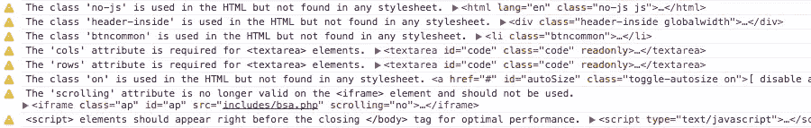

# 使用 HTML 检查器编写更好的标记

> 原文：<https://www.sitepoint.com/write-better-markup-html-inspector/>

我们经常看到很多关于前端开发各个领域的优化技术的讨论。一个可能被忽视的领域是 HTML。

我当然不是“干净的、非表示性的标记”阵营的成员。但是我确实认为标记的一致性是需要的，尤其是当处理许多开发人员将要接触的代码时。

在这篇文章中，我将介绍一个我最近重新使用的整洁的小工具，我认为许多开发团队应该考虑使用它:Philip Walton 的 [HTML Inspector](https://github.com/philipwalton/html-inspector) 。

## 什么是 HTML Inspector？

正如菲利普在回购自述文件中解释的那样，这是:

> 一个高度可定制的代码质量工具，帮助您(和您的团队)编写更好的标记。它的目标是在严格的 W3C 验证器和完全没有规则(对我们大多数人来说是不幸的现实)之间找到一个平衡。

虽然我有点不同意 Philip 关于 W3C 验证器“不折不扣的严格”的说法(他不记得 XHTML 了吗？)，我当然同意许多开发团队可能缺乏一套逻辑的内部标准来保持他们的标记可维护和最新。

运行 HTML inspector 后，您将在浏览器的开发人员工具控制台中获得一系列消息，让您知道您应该考虑解决 HTML 中的哪些问题。



你可以在上面的图片中看到一个 HTML Inspector 输出的例子，这是我在我的老项目之一[上运行的一个测试，我知道它可能有一些有问题的标记。](http://css3clickchart.com/)

## 安装并运行 HTML 检查器

如果您正在对自己的非生产代码进行测试，您可以简单地将 HTML Inspector 脚本包含在任何页面的底部，然后通过调用 primary 方法来运行它。下面是对安装方法的简单描述，然后我会解释一个更好的方法来让它在任何网站上运行，远程或本地。

要通过命令行安装和使用，您可以使用 NPM，这需要 [PhantomJS](http://phantomjs.org/) :

```
npm install -g html-inspector
```

或者，您可以安装 Bower，以便在浏览器中使用:

```
bower install html-inspector
```

如果您选择手动下载该工具，您所需要做的就是从项目的根目录中抓取一个`html-inspector.js`的副本，在所有其他脚本加载完成后，将它包含在您的文档底部。然后你需要执行它，如下所示:

```
<script src="js/html-inspector.js"></script>
<script> HTMLInspector.inspect(); </script>
```

但是，除非您正在定制脚本，否则您不需要执行上述任何操作。你可以在几秒钟内在任何安装了开发者工具的浏览器上运行它。

打开浏览器的开发人员工具控制台，运行以下命令:

```
var htmlInsp = document.createElement('script');
htmlInsp.src = '//cdnjs.cloudflare.com/ajax/libs/html-inspector/0.8.1/html-inspector.js';
document.body.appendChild(htmlInsp);
```

执行完这些之后，您可以在控制台中运行以下命令:

```
HTMLInspector.inspect();
```

*注意:正如注释中指出的，在执行了前三行之后，您必须将最后一行作为单独的命令来运行，这样才能工作。*

该脚本使用托管在 [cdnjs](https://cdnjs.com/) 上的 HTML 检查器代码。

事实上，我会让你更容易；你可以用这个要点中的代码[创建一个 bookmarklet。一旦你将 bookmarklet 添加到你的书签栏，在任何网站上执行它，打开控制台，然后运行`HTMLInspector.inspect()`。](https://gist.github.com/impressivewebs/f7f079b276f56c5bd900)

如果你想知道默认情况下它会弹出什么样的警告，可以在一个非常老的项目或者几乎任何 WordPress 网站上试试。

当然，如果您决定自定义 HTML 检查器，您需要下载它并运行您自己配置的版本。所以一旦你准备好了你的版本，你就可以像我上面描述的那样做了，但是要修改源 URL。

## HTML 检查器:伟大的部分

以下是该工具的一些优点:

*   这是独一无二的。就 HTML 林挺而言，我还没有见过另一个工具可以与之媲美。(如果你知道其中一个，请在评论中告诉我！)
*   像 CSS 和 JavaScript 的其他类似工具一样，您可以定制它，只对您喜欢的规则发出警告。
*   您可以编写自己的规则，这可能是最好的特性。
*   没有依赖关系(注意，[最初的博客文章](http://philipwalton.com/articles/introducing-html-inspector/)说它需要 jQuery，但是大约一周后[修复了这个问题](https://github.com/philipwalton/html-inspector/issues/12))。
*   它运行在浏览器中的动态 DOM 上，而不仅仅是在初始的静态 HTML 上。这很好，因为它允许您测试由页面上的其他脚本动态添加和修改的标记。

## 开发团队的绝佳工具

正如 Philip 在前面提到的发布会上解释的那样，使用 HTML Inspector 的一个很大的好处就是团队中可能会有一些开发人员短期加入(例如实习生和新员工)。

所以想象一下，一个新的、缺乏经验的开发人员在你的项目上工作了三个月，作为一个暑期实习生或者其他什么。通常，这样的员工可能需要整整三个月的时间来适应你写代码的方式。但是有了 HTML Inspector，你所需要做的就是准备好你的定制规则。新的开发人员只需要使用您的自定义规则运行 HTML Inspector，然后阅读控制台中的警告，并对代码进行必要的调整。

## 更改默认值

有两种方法可以自定义 HTML 检查器:改变配置设置中的默认值或者(如前所述)编写自己的规则。我们先来看看默认设置。

使用默认设置运行`HTMLInspector.inspect()`会使用默认值执行刀具。`inspect()`方法使用一个可选的`config`对象来改变这些。您可以通过如下方式覆盖这些值:

```
HTMLInspector.inspect({
  domRoot: "main",
  excludeRules: ["validate-elements", "validate-attributes"],
  excludeElements: ["svg", "span", "input"],
  onComplete: function(errors) {
    errors.forEach(function(error) {
      console.warn(error.message, error.context)
    }
  }
});
```

在这里，我决定不验证元素或属性，并告诉工具将某些元素排除在检查之外。

有关修改这些默认值的完整详细信息，请查看 GitHub repo 上自述文件中的相关部分:

*   [配置 HTML 检查器](https://github.com/philipwalton/html-inspector#configuring-html-inspector)
*   [内置规则](https://github.com/philipwalton/html-inspector#built-in-rules)

## 编写自定义规则

如上所述，您可能不同意 HTML 检查器的默认检查警告。如果是这种情况，或者如果你想增加这些功能，这个工具最强大的部分是编写你自己的规则的能力。

您可以使用以下结构来实现这一点:

```
HTMLInspector.rules.add(name, [config], func)
```

自述文件给出了一个开发团队的例子，该团队以前使用了两个特定的`data-*`属性名称空间，现在内部不赞成使用这两个名称空间，而支持另一种方法。下面是代码的样子:

```
HTMLInspector.rules.add(
  "deprecated-data-prefixes",
  {
    deprecated: ["foo", "bar"]
  },
  function(listener, reporter, config) {

    // register a handler for the `attribute` event
    listener.on('attribute', function(name, value, element) {

      var prefix = /data-([a-z]+)/.test(name) && RegExp.$1

      // return if there's no data prefix
      if (!prefix) return

      // loop through each of the deprecated names from the
      // config array and compare them to the prefix.
      // Warn if they're the same
      config.deprecated.forEach(function(item) {
        if (item === prefix) {
          reporter.warn(
            "deprecated-data-prefixes",
            "The 'data-" + item + "' prefix is deprecated.",
            element
          )
        }
      })
    }
  )
});
```

(请注意 [Philip 是个疯子](https://github.com/philipwalton/html-inspector/blob/master/CONTRIBUTING.md)，因此不会在行尾使用分号！)

我只是触及了自定义规则的皮毛。我希望以后能找些时间深入研究自定义规则，也许我会写点东西。同时，您可以查看自述文件的相关部分以了解更多信息:

*   [编写自己的规则](https://github.com/philipwalton/html-inspector#writing-your-own-rules)
*   [覆盖规则配置](https://github.com/philipwalton/html-inspector#overriding-rule-configurations)

## 结论

与许多开发人员工具一样，您需要一个现代化的浏览器来运行 HTML Inspector(例如，浏览器需要支持 ES5 方法、CSSOM 和`console.warn()`)。

如前所述，我还没有见过太多像这样的工具(除了一个常规的验证器)。有一个通用的 HTML Lint 工具似乎已经消失了。但是除此之外，我不记得还有其他工具像这个一样——当然也没有一个工具是可定制的，并且可以在一个动态 DOM 上运行。

如果你试用过 HTML Inspector 或者知道其他类似的工具，请在讨论中告诉我们。

## 分享这篇文章