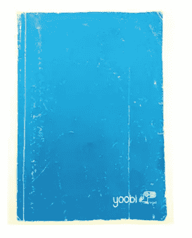

# 更快写出好内容的 6 个技巧

> 原文：<https://www.sitepoint.com/write-faster/>

我写一个 sh！测试内容的加载。

我每周要写或编辑 10 篇文章(此外还要经营一家内容营销代理公司)。

当我第一次开始的时候，我很困惑。我在努力管理数量、客户要求、截止日期和编辑。结果是一连串不合标准的内容最终伤害了我的个人品牌和代理。

我必须做出改变。

你可能没有我写得多，但我肯定你有其他的义务阻碍你及时创作有价值的内容。

如果是这样，请继续阅读。我列出了 6 个我学到的技巧(艰难的方式)来帮助我更快地写出更好的内容。

## 秘诀 1:保留一本创意手册。

想法是随机出现的，不是吗？

洗澡，上班，晚上躺在床上。

写作的一半在于想出一个要写的主题——我喜欢在后口袋里放一个小笔记本，无论去哪里都带着。

我知道，我知道，我是多么的老古董——谁还会用纸和笔呢？！？

如果你更喜欢使用你的电子产品，你可以使用一些很棒的应用程序:

1.  Evernote-一款可以在你的手机和台式电脑上使用的免费应用。你在手机上做的任何注释都会与电脑同步，反之亦然。
2.  [苹果笔记](https://www.apple.com/support/icloud/mail-notes/)——iPhone 自带的标准免费记事本。这也会与您的桌面 Mac 同步。
3.  [spring pad](http://www.springpad.com/)–非常适合用不同的多媒体做笔记。如果你更喜欢做口头、视频或图片笔记，这款应用正适合你。

如果你能强迫自己每天写一些想法，这将会有很大帮助。我个人是没有的(我很懒)。我更喜欢把想法写下来。

## 技巧二:最后写引言。

引言是你内容中最重要的部分。它为这篇文章的其余部分设定了基调、论点和主题。

我发现先写文章的核心部分，然后再回头写引言是很有帮助的。通过这种方式，我可以构建内容的主体，并创建一个与之相符的引人入胜的介绍。

另外，如果你不完全确定你要写什么，你怎么介绍它呢？

## 提示 3:放弃高中课程。

忘记高中学的所有东西。嗯，也许不是所有的东西——拼写、引用来源和语法都很重要，但你不需要花几个小时来纠正它。

在线读者的注意力持续时间有限。你需要能够抓住他们的注意力，并尽可能长时间地保持住。如果你写的文章像高中作文，你就没有机会了。

我喜欢写我说话的方式。我使用连词、俚语，遵循口语语法规则，而不是书面语。

让我举一个简单的例子来说明这一点。你告诉我哪个读起来更好:

1.  传统写法:她要去商店，因为他们正在卖鞋子。
2.  网络写作:她要去商店——他们正在卖鞋子。

差别很细微，但读起来更干净。当你的所有内容都是这样的格式时，会有很大的不同。

## 技巧 4:使用大量图片。

文字很无聊。

快速充实内容的最简单方法之一是通过添加图片来代替文字。

一个很好的例子就是我在 SitePoint 上写的最后一篇文章。

目标是不用写就能讲述故事。如果你跟着这篇文章走，你可以通过看图片来了解文章的整个主旨。

这不仅节省了写文章的大量时间，而且迎合了文章浏览者和移动读者的需求。

## 秘诀 5:照做就是了

你有没有看过几周前在网上疯传的什叶派穆斯林的视频？

他是对的。

提高写作速度的最大障碍是拖延。这是一件非黑即白的事情，你必须想办法全力以赴完成它。

试着留出一个特定的日子和时间坐下来写作。我每周日早上 7 点起床，去我最喜欢的咖啡店，戴上耳机，开始写作。我可以划分区域，创造几千字的高质量内容。

这可能不适合你——你必须找到一个适合你的时间。关掉你的手机。关闭你的无线连接。打开一个 Word 文档，然后开始写。

专注于把想法从你的大脑中取出来，然后担心以后的编辑。随着写作成为一种习惯，你会发现单词变得容易多了。

## 技巧 6:知道何时外包。

如今外包有一个负面的含义。它让人联想到廉价的海外劳动力和低质量的工作。

把那个画面从你的脑海中抹去。

编写和制作内容的目的是为您的受众提供精心编写的有价值的信息，他们可以用这些信息来解决生活中的问题。

如果你做不到这一点，请别人来做。

如果你讨厌写作——它会在你的作品中表现出来。或者，也许不值得你花时间——你可以花一半的钱雇一个比你强 3 倍的作家。

有一些外包网站聘请优质作家，但我用一个更好的方法。我只是在我喜欢的博客上联系作者。

这些作家一般不会公开他们的自由职业作品，但他们中的大多数人会很乐意付费写一篇文章。到目前为止，这是找到顶级作家外包工作的最佳方式。

## 最后的想法

写作对许多人来说很难，出版真正好的作品的压力越来越大也于事无补。

就像任何其他技能一样，你会通过练习更好地写作。所以，花时间测试这些策略，看看它们是否有帮助。

最后，记住质量就是一切。有时候外包对你和你的观众来说更有意义。

## 分享这篇文章