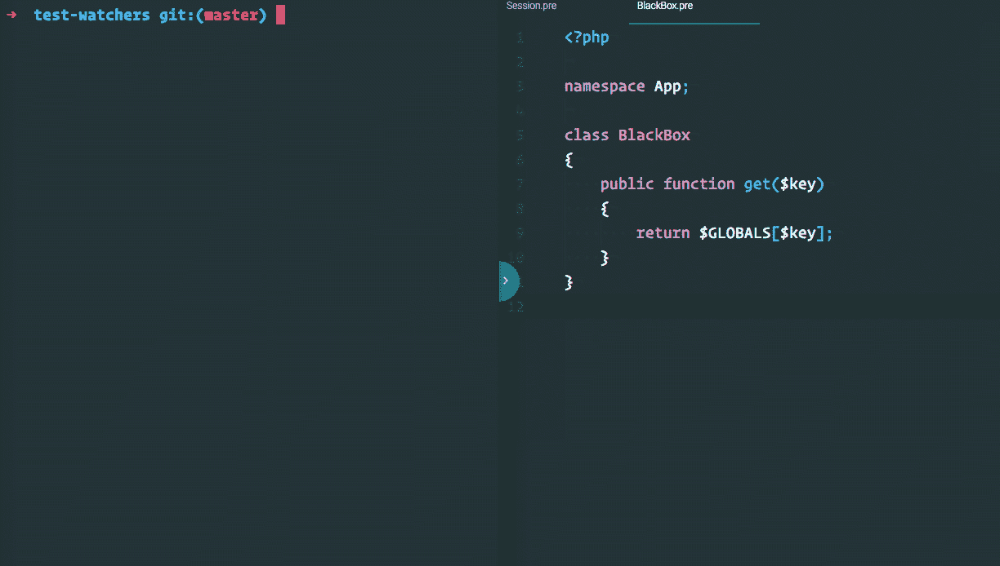

# 如何用 PHP 编写 JavaScript 风格的测试观察器

> 原文：<https://www.sitepoint.com/write-javascript-style-test-watchers-php/>

*这篇文章由[尤尼斯·拉菲](https://www.sitepoint.com/author/yrafie)同行评审。感谢 SitePoint 的所有同行评审员使 SitePoint 的内容尽可能做到最好！*

* * *

我没有开始为我的代码写测试。像之前和之后的许多人一样，我的“测试”是编写代码和刷新页面。“看起来对吗？”我会问自己。如果我这么想，我会继续前进。

事实上，我的大部分工作都是在那些不太关心其他形式的测试的公司。我花了很多年，听了像克里斯·哈特杰斯这样的人的明智之言，才明白测试的价值。我还在学习好的考试是什么样的。


我最近开始从事几个捆绑了测试观察者的 JavaScript 项目。

这里有一个关于测试驱动节点开发的[视频教程](https://www.sitepoint.com/premium/courses/test-driven-development-in-node-js-2932/?aref=bskvorc)！

在 JavaScript 领域，预处理源代码并不少见。在 JavaScript 领域，开发人员用不受广泛支持的语法编写代码，然后代码被转换成受广泛支持的语法，通常使用一种叫做 Babel 的工具。

为了减少调用转换脚本的负担，样板文件项目已经开始包括自动监视文件变化的脚本；然后调用这些脚本。

我参与的这些项目使用了类似的方法来重新运行单元测试。当我更改 JavaScript 文件时，这些文件会被转换，单元测试会重新运行。这样，我可以立即看到我是否打破了什么。

> 本教程的代码可以在 Github 上找到[。我用 PHP `7.1`测试过。](https://github.com/assertchris-tutorials/tutorial-php-test-watchers)

## 设置项目

自从开始从事这些项目以来，我已经开始为 PHPUnit 设置类似的东西。事实上，我在上面设置 PHPUnit watcher 脚本的第一个项目是一个也预处理文件的 PHP 项目。

这一切都是在我将[预处理脚本](https://preprocess.io)添加到我的项目中之后开始的:

```
composer require pre/short-closures 
```

这些特殊的预处理脚本允许我重命名 PSR-4 自动加载的类(从`path/to/file.php`开始`path/to/file.pre`，以选择加入它们提供的功能。所以我在我的`composer.json`文件中添加了以下内容:

```
"autoload": {
    "psr-4": {
        "App\\": "src"
    }
},
"autoload-dev": {
    "psr-4": {
        "App\\Tests\\": "tests"
    }
} 
```

> 这是来自`composer.json`

然后，我添加了一个类来生成包含当前用户会话详细信息的函数:

```
namespace App;

use Closure;

class Session
{
    private $user;

    public function __construct(array $user)
    {
        $this->user = $user;
    }

    public function closureWithUser(Closure $closure)
    {
        return () => {
            $closure($this->user);
        };
    }
} 
```

> 这是来自`src/Session.pre`

为了检查这是否可行，我设置了一个小的示例脚本:

```
require_once __DIR__ . "/vendor/autoload.php";

$session = new App\Session(["id" => 1]);

$closure = ($user) => {
    print "user: " . $user["id"] . PHP_EOL;
};

$closureWithUser = $session->closureWithUser($closure);
$closureWithUser(); 
```

> 这是来自`example.pre`

…因为我想在非 PSR-4 类中使用短闭包，所以我还需要设置一个加载器:

```
require_once __DIR__ . "/vendor/autoload.php";

Pre\Plugin\process(__DIR__ . "/example.pre"); 
```

> 这是来自`loader.php`

这是一大堆代码来说明一个小点。`Session`类有一个`closureWithUser`方法，它接受一个闭包并返回另一个闭包。当被调用时，这个新的闭包将调用原来的闭包，提供用户会话数组作为参数。

要运行所有这些，请在终端中键入:

```
php loader.php 
```

作为旁注，这些预处理程序生成的有效 PHP 语法非常可爱。看起来是这样的:

```
$closure = function ($user) {
   print "user: " . $user["id"] . PHP_EOL;
}; 
```

*…和*

```
public function closureWithUser(Closure $closure)
{
   return [$closure = $closure ?? null, "fn" => function () use (&$closure) {
       $closure($this->user);
   }]["fn"];
} 
```

*您可能不想将`php`和`pre`文件都提交给回购。出于这个原因，我在`.gitignore`中添加了`app/**/*.php`和`examples.php`。*

## 设置测试

那么我们如何测试这个呢？让我们从安装 PHPUnit 开始:

```
composer require --dev phpunit/phpunit 
```

然后，我们应该创建一个配置文件:

```
<?xml version="1.0" encoding="UTF-8"?>
<phpunit
    backupGlobals="false"
    backupStaticAttributes="false"
    bootstrap="vendor/autoload.php"
    colors="true"
    convertErrorsToExceptions="true"
    convertNoticesToExceptions="true"
    convertWarningsToExceptions="false"
    processIsolation="false"
    stopOnFailure="false"
    syntaxCheck="false"
>
    <testsuites>
        <testsuite>
            <directory suffix="Test.php">tests</directory>
        </testsuite>
    </testsuites>
    <filter>
        <whitelist addUncoveredFilesFromWhitelist="true">
            <directory suffix=".php">src</directory>
        </whitelist>
    </filter>
</phpunit> 
```

> 这是来自`phpunit.xml`

如果我们运行`vendor/bin/phpunit`，它会工作。但是我们还没有任何测试。让我们做一个:

```
namespace App\Tests;

use App\Session;
use PHPUnit\Framework\TestCase;

class SessionTest extends TestCase
{
    public function testClosureIsDecorated()
    {
        $user = ["id" => 1];
        $session = new Session($user);

        $expected = null;

        $closure = function($user) use (&$expected) {
            $expected = "user: " . $user["id"];
        };

        $closureWithUser = $session
            ->closureWithUser($closure);

        $closureWithUser();

        $this->assertEquals("user: 1", $expected);
    }
} 
```

> 这来自于 tests/SessionTest.php

当我们运行`vendor/bin/phpunit`时，单一测试通过。耶！

## 我们遗漏了什么？

到目前为止，一切顺利。我们已经写了一小段代码，并对这些代码进行了测试。我们甚至不需要担心预处理是如何工作的(从 JavaScript 项目开始)。

当我们试图检查代码覆盖率时，麻烦就开始了:

```
vendor/bin/phpunit --coverage-html coverage 
```

由于我们对`Session`进行了测试，因此将会报告覆盖率。这是一个简单的类，所以我们已经 100%覆盖了它。但是如果我们添加另一个类:

```
namespace App;

class BlackBox
{
    public function get($key)
    {
        return $GLOBALS[$key];
    }
} 
```

> 这是来自`src/BlackBox.pre`

当我们检查覆盖范围时会发生什么？还是 100%。

这是因为我们没有任何加载`BlackBox.pre`的测试，这意味着它从未被编译过。因此，当 PHPUnit 查找被覆盖的 PHP 文件时，它看不到这个可预处理的文件。

## 测试前构建所有文件

在尝试运行测试之前，让我们创建一个新的脚本来构建所有的 Pre 文件:

```
require_once __DIR__ . "/../vendor/autoload.php";

function getFileIteratorFromPath($path) {
    return new RecursiveIteratorIterator(
        new RecursiveDirectoryIterator($path),
        RecursiveIteratorIterator::SELF_FIRST
    );
}

function deleteFilesBeforeTests($path) {
    foreach (getFileIteratorFromPath($path) as $file) {
        if ($file->getExtension() === "php") {
            unlink($file->getPathname());
        }
    }
}

function compileFilesBeforeTests($path) {
    foreach (getFileIteratorFromPath($path) as $file) {
        if ($file->getExtension() === "pre") {
            $pre = $file->getPathname();
            $php = preg_replace("/pre$/", "php", $pre);

            Pre\Plugin\compile($pre, $php, true, true);

            print ".";
        }
    }
}

print "Building files" . PHP_EOL;

deleteFilesBeforeTests(__DIR__ . "/../src");
compileFilesBeforeTests(__DIR__ . "/../src");

print PHP_EOL; 
```

> 这是来自`tests/bootstrap.php`

这里我们创建了 3 个函数；一个用于获取递归文件迭代器(从路径中)，一个用于删除这个迭代器的文件，一个用于重新编译 Pre 文件。

我们需要替换`phpunit.xml`中的当前引导文件:

```
<phpunit
    bootstrap="tests/bootstrap.php"
    ...
> 
```

> 这是来自`phpunit.xml`

现在，每当我们运行测试时，这个脚本将首先清理所有的 Pre 文件并将其重建为 PHP 文件。报道是正确的，我们可以快乐的生活了…

## 除了另一件事…

我们的代码库很小，但不需要如此。我们可以在一个真实的应用程序中尝试这一点，然后立刻后悔每次我们想要测试时都必须重新构建文件。

在我提到的这个项目中，我有 101 个 Pre 文件。为了运行我的(希望是快速的)单元测试套件，需要做大量的预处理。我们需要的是一种观察变化的方法，只重建重要的部分。首先，让我们安装一个文件监视器:

```
composer require --dev yosymfony/resource-watcher 
```

然后，让我们创建一个测试脚本:

```
#!/usr/bin/env php
<?php

require_once __DIR__ . "/../tests/bootstrap.php";

use Symfony\Component\Finder\Finder;
use Yosymfony\ResourceWatcher\ResourceWatcher;
use Yosymfony\ResourceWatcher\ResourceCacheFile;

$finder = new Finder();

$finder->files()
    ->name("*.pre")
    ->in([
        __DIR__ . "/../src",
        __DIR__ . "/../tests",
    ]);

$cache = new ResourceCacheFile(
    __DIR__ . "/.test-changes.php"
);

$watcher = new ResourceWatcher($cache);
$watcher->setFinder($finder);

while (true) {
    $watcher->findChanges();

    if ($watcher->hasChanges()) {
        // ...do some rebuilding
    }

    usleep(100000);
} 
```

> 这是来自`scripts/watch-test`

该脚本创建了一个 Symfony finder(扫描我们的`src`和`tests`文件夹)。我们定义了一个临时的变更文件，但是这并不是我们要做的事情所严格要求的。我们用一个无限循环继续下去。`ResourceWatcher`有一个方法，我们可以用它来查看是否有文件被创建、修改或删除。

新的，让我们找出哪些文件已经改变，并重建它们:

```
if ($watcher->hasChanges()) {
    $resources = array_merge(
        $watcher->getNewResources(),
        $watcher->getDeletedResources(),
        $watcher->getUpdatedResources()
    );

    foreach ($resources as $resource) {
        $pre = realpath($resource);
        $php = preg_replace("/pre$/", "php", $pre);

        print "Rebuilding {$pre}" . PHP_EOL;

        Pre\Plugin\compile($pre, $php, true, true);
    }

    // ...re-run tests
} 
```

> 这是来自`scripts/watch-test`

这段代码类似于我们在引导文件中所做的，但它仅适用于已更改的文件。当文件发生变化时，我们也应该重新运行测试:

```
if (empty(getenv("APP_COVER"))) {
    passthru("APP_REBUILD=0 composer run test");
} else {
    passthru("APP_REBUILD=0 composer run test:coverage");
} 
```

> 这是来自`scripts/watch-test`

我们引入了几个环境变量。您可以随意管理它们，但我更喜欢将它们添加到 composer 脚本中:

```
"scripts": {
    "test": "vendor/bin/phpunit",
    "test:cover": "vendor/bin/phpunit --coverage-html cover",
    "watch:test": "APP_COVER=0 scripts/watch-test",
    "watch:test:cover": "APP_COVER=1 scripts/watch-test",
}, 
```

> 这是来自`composer.json`

没那么重要。它只是告诉观察者脚本是否包含代码覆盖率。`APP_REBUILD`起着更重要的作用:它控制在加载`tests/bootstrap.php`文件时是否重建 Pre 文件。我们需要修改该文件，以便仅在请求时才重建文件:

```
if (!empty(getenv("APP_REBUILD"))) {
    print "Building files" . PHP_EOL;

    deleteFilesBeforeTests(__DIR__ . "/../src");
    compileFilesBeforeTests(__DIR__ . "/../src");

    print PHP_EOL;
} 
```

> 这是来自`tests/bootstrap.php`

在包含引导代码之前，我们还需要修改 watcher 脚本来设置这个环境变量。整个观察器脚本如下所示:

```
#!/usr/bin/env php
<?php

putenv("APP_REBUILD=1");
require_once __DIR__ . "/../tests/bootstrap.php";

use Symfony\Component\Finder\Finder;
use Yosymfony\ResourceWatcher\ResourceWatcher;
use Yosymfony\ResourceWatcher\ResourceCacheFile;

$finder = new Finder();

$finder->files()
    ->name("*.pre")
    ->in([
        __DIR__ . "/../src",
        __DIR__ . "/../tests",
    ]);

$cache = new ResourceCacheFile(
    __DIR__ . "/.test-changes.php"
);

$watcher = new ResourceWatcher($cache);
$watcher->setFinder($finder);

while (true) {
    $watcher->findChanges();

    if ($watcher->hasChanges()) {
        $resources = array_merge(
            $watcher->getNewResources(),
            $watcher->getDeletedResources(),
            $watcher->getUpdatedResources()
        );

        foreach ($resources as $resource) {
            $pre = realpath($resource);
            $php = preg_replace("/pre$/", "php", $pre);

            print "Rebuilding {$pre}" . PHP_EOL;

            Pre\Plugin\compile($pre, $php, true, true);
        }

        if (empty(getenv("APP_COVER"))) {
            passthru("APP_REBUILD=0 composer run test");
        } else {
            passthru("APP_REBUILD=0 composer run test:cover");
        }
    }

    usleep(100000);
} 
```

> 这是来自`scripts/watch-test`

现在我们应该能够启动它，并让它在每次可预处理的文件改变时运行我们的测试…



> 有几件事要记住(rawr)。首先，您需要`chmod +x scripts/*`才能运行 watcher 脚本。第二是你需要设置`config: {process-timeout: 0}`(在`composer.json`)否则观察者会在 300 秒后死亡。

## 奖励回合！

这个测试监视器还带来了一个很酷的副作用:能够在我们的 PHPUnit 测试中使用预处理器/转换。如果我们给`tests/bootstrap.php`添加一点代码:

```
if (!empty(getenv("APP_REBUILD"))) {
    print "Building files" . PHP_EOL;

    deleteFilesBeforeTests(__DIR__ . "/../src");
    compileFilesBeforeTests(__DIR__ . "/../src");
    deleteFilesBeforeTests(__DIR__ . "/../tests");
    compileFilesBeforeTests(__DIR__ . "/../tests");

    print PHP_EOL;
} 
```

> 这是来自`tests/bootstrap.php`

…我们在测试文件中启用预处理(对于 Pre，这意味着将它们重命名为`.pre`)。然后，我们可以开始在测试文件中使用相同的预处理程序:

```
namespace App\Tests;

use App\Session;
use PHPUnit\Framework\TestCase;

class SessionTest extends TestCase
{
    public function testClosureIsDecorated()
    {
        $user = ["id" => 1];
        $session = new Session($user);

        $expected = null;

        $closure = ($user) => {
            $expected = "user: " . $user["id"];
        };

        $closureWithUser = $session
            ->closureWithUser($closure);

        $closureWithUser();

        $this->assertEquals("user: 1", $expected);
    }
} 
```

> 这是来自`tests/SessionTest.pre`

## 结论

我不敢相信在尝试创建这种测试观察器之前，我做了这么多预处理工作。这证明了我们可以从其他语言和框架中学到什么。如果我没有参与这些 JavaScript 项目，我可能会在每次测试运行之前重新构建我的文件。呸！

这种方法对你有效吗？它可以适用于异步 HTTP 服务器或其他长时间运行的进程。请在评论中告诉我们你的想法。

## 分享这篇文章