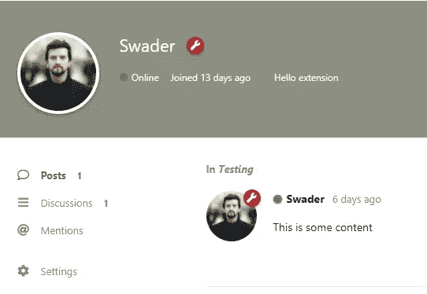
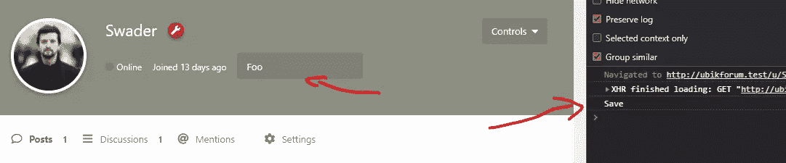
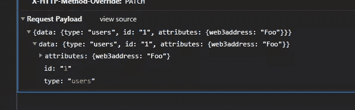
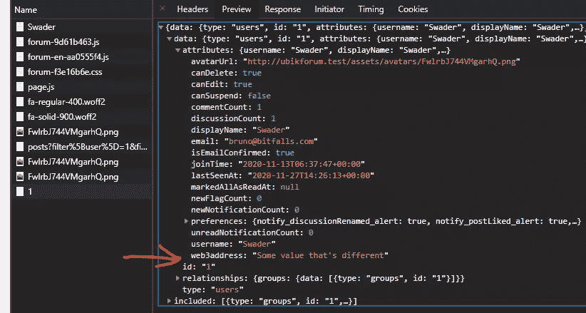
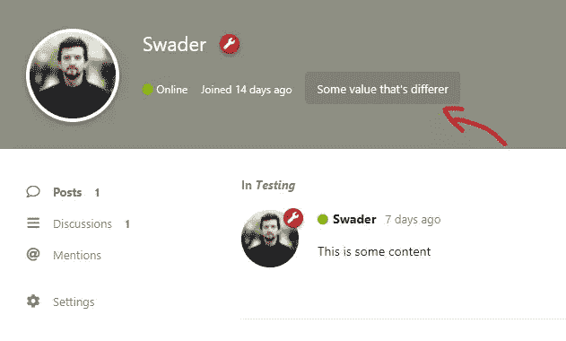
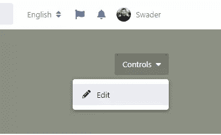
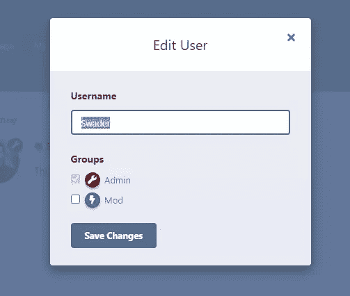
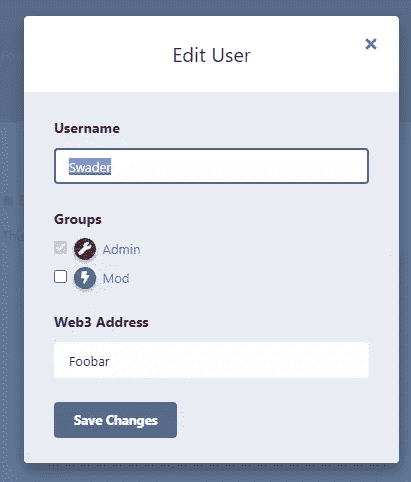

# 编写 Flarum 扩展:构建自定义字段

> 原文：<https://www.sitepoint.com/writing-a-flarum-extension-building-a-custom-field/>

**[Flarum](https://flarum.org) 是令人难以置信的快速、可扩展、免费和开源的论坛软件。它自 2014 年以来一直在开发中，正接近测试阶段的尾声。**

在本教程中，我们将向用户帐户添加一个定制字段。此自定义字段只能由用户从用户的个人资料页面设置，但也可以由管理员手动编辑。这个扩展的完整和最终源代码是 GitHub 上的[。](https://github.com/Swader/flarum-web3address)

*🙏非常感谢[@ askwortsov](https://github.com/askvortsov1)的评论和帮助。*

## 我们添加的内容

我们将允许用户将其 Web3 地址添加到他们的个人资料中。Web3 地址是 Web3 生态系统中用户的加密身份——代表一个人的区块链兼容帐户的公私密钥对(如 SSH)的公共部分。

ℹ:注意到，Web3 生态系统是一个新的分散托管、自有数据和抗审查通信的互联网。关于 Web3 的入门，请参见[在 FOSDEM](https://www.youtube.com/watch?v=St8x8hewc30) 的 15 分钟演讲。

即使你对 Web3 不感兴趣，这个教程也会很有用。本教程的第一部分将向您展示如何为用户构建一个定制字段，第二部分将以加密的安全方式添加实际的 Web3 地址。

## 先决条件

我们假设你已经安装了[NodeJS](https://github.com/nvm-sh/nvm)和一个足够新的版本(12.16+是可以的)，并且 [Composer](https://getcomposer.org/) 全球可用。为了你的理智，我们也建议使用[纱线](https://classic.yarnpkg.com/lang/en/)代替 npm。PHP、MySQL 和 Flarum 的其他[需求被假定为存在并正常运行。](https://docs.flarum.org/install.html#server-requirements)

在下面的例子中，我们在`ubikforum.test`托管本地 Flarum 副本，一些截图可能会反映出来。

也请通过在`config.php`中设置适当的值来确保您的论坛处于`debug`模式:

```
<?php return array(
    'debug' => true,
    'database' => // ... 
```

## 新扩展

我们通过在本地 Flarum 安装的根文件夹中新建的`packages`文件夹中运行[Flarum 之友](https://github.com/FriendsOfFlarum)样板文件向导来启动一个新的扩展:

```
# cd into your flarum folder
mkdir packages & cd packages
npx @friendsofflarum/create-flarum-extension web3address 
```

*重要⚠:记住遵循最佳部署实践，如果您将此 Flarum 文件夹推送到一个 repo，而您正从该 repo 部署您的 live 版本，请忽略`packages`文件夹。*

填写向导提供的输入内容:

```
✔ Admin CSS & JS … no
✔ Forum CSS & JS … yes
✔ Locale … yes
✔ Javascript … yes
✔ CSS … yes 
```

*注意ℹ:如果你打算使用设置和/或权限，比如只允许某些人修改他们的`web3address`属性或类似的，你会想要将`Admin CSS & JS`设置为`yes`。在这种情况下，我们不需要它。*

请记住，[由于一个错误](https://github.com/FriendsOfFlarum/extension-generator/issues/12)，生成器不支持包名或命名空间中的数字。因此，最好在生成完成后重命名这些值。(比如不能用`web3address`做名字，用`blockchain`就可以了。)

我们还需要编译 JavaScript。最好让它在监视模式下运行，这样它会在文件更改时自动重新编译，您可以在开发时快速检查更改:

```
cd packages/web3address
cd js
yarn && yarn dev 
```

*注意ℹ:你会希望让它在一个终端标签中运行，并在另一个标签中执行其余的命令。`dev`命令激活将占用当前终端会话的始终在线任务。*

然后*安装*我们新创建的扩展:

```
composer config repositories.0 path "packages/*"
composer require swader/blockchain @dev 
```

第一行将告诉 Composer 应该寻找我们安装在`packages`子文件夹中的包，如果没有找到，默认为[Packagist.org](https://packagist.org)。

第二行安装我们新创建的扩展。一旦它进入，我们就可以加载我们论坛的管理界面，激活扩展，并检查论坛前端的控制台上的“Hello world”消息。如果在那里，新的扩展就能工作。


## 延伸

当构建扩展时，你总是*扩展*下面的原始 Flarum。这些*扩展*在您的扩展的`extend.php`文件中定义，各种*扩展*是您可以挂接的可能扩展点的“类别”。我们稍后将修改这个文件。

请记住，论坛本身的根文件夹中也有一个`extend.php`文件。该文件对于较小的根级扩展很有用，用户可以在 Flarum 实例上进行这些扩展，而不必围绕该功能编写完整的扩展。如果你想和别人分享你的成果，或者把它发布到 Flarum 的其他版本上，扩展是个不错的选择。

当前的`extend.php`文件如下所示:

```
<?php
namespace Swader\Web3Address;

use Flarum\Extend;

return [
    (new Extend\Frontend('forum'))
        ->js(__DIR__ . '/js/dist/forum.js')
        ->css(__DIR__ . '/resources/less/forum.less'),

    new Extend\Locales(__DIR__ . '/resources/locale')
]; 
```

如果你也扩展了`admin` UI，就会有另一个`Frontend`块引用`admin`而不是`forum`。目前，我们只是在论坛的前端添加了新的 JS 和样式，并且可选地，本地化了我们扩展的 UI 元素，所以这些是被扩展的部分。

我们将在这个文件中定义替代路由和一些侦听器，稍后您将会看到。

## Java Script 语言

首先，让我们添加 UI 占位符。我们将编辑文件`js/src/forum/index.js`。

开始时，我们的`index.js`文件仅包含以下内容:

```
app.initializers.add("swader/web3address", () => {
  console.log("[swader/web3address] Hello, forum!");
}); 
```

`initializers.add`调用使应用程序将这里指定的 JavaScript 附加到应用程序中的其余 JavaScript 上。执行流程如下:

*   所有 PHP 代码加载
*   主要 JS 代码加载
*   扩展 JS 代码在管理 UI 中按激活顺序加载

如果某个扩展依赖于另一个，Flarum 会自动排序它们的依赖关系，只要它们在相关的`composer.json`文件中被指定为彼此的依赖关系。

让我们将文件的内容改为:

```
import { extend } from "flarum/extend";
import UserCard from "flarum/components/UserCard";
import Model from "flarum/Model";
import User from "flarum/models/User";

app.initializers.add("swader/web3address", () => {
  User.prototype.web3address = Model.attribute("web3address");
  extend(UserCard.prototype, "infoItems", function (items) {
    items.add("web3address", <p>{this.attrs.user.web3address()}</p>);
    if (app.session.user === this.attrs.user) {
      items.add("web3paragraph", <p>Hello extension</p>);
    }
  });
}); 
```

*   `flarum/extend`是一个实用程序集合，用于扩展或覆盖 Flarum 前端代码中的某些 UI 元素和 JS 组件。我们在这里使用`extend`而不是`override`,因为我们想用一个新的项目来扩展`UserCard`元素。`override`会用我们的实现完全取代它。更多关于差异的信息请点击[这里](https://docs.flarum.org/extend/frontend.html#extend-and-override)。
*   `UserCard`是个人资料上的用户信息卡。这个组件有它的`infoitems`，它是`itemlist`的一个实例。这种类型的方法记录在[这里](https://api.docs.flarum.org/js/master/class/src/common/utils/itemlist.ts~itemlist)。
*   `Model`是与后端共享的实体，代表一个数据库模型，`User`是那个`Model`的具体实例。

在上面的代码中，我们告诉 JS 用一个新的字段来扩展`User`原型:`web3address`，我们通过调用`Model`的`attribute`方法将其设置为一个名为`web3address`的模型属性。然后，我们希望通过添加`web3address`值作为输出来`extend`用户卡的项目列表，并且如果配置文件查看者也是配置文件所有者，则通过添加`web3paragraph`来添加一个包含“Hello extension”的段落。

*重要提示:如果输出是可变的(例如，一个对象或数组，而不是一个数字/字符串)，⚠:扩展只能改变输出。使用 override 完全修改输出，而不考虑其类型。更多信息[点击这里](https://docs.flarum.org/extend/frontend.html#extend-and-override)。*

在论坛中重新载入你的用户资料会显示“Hello extension”段落添加到用户卡中的项目。



让我们把它变成一个自定义组件。创建`src/forum/components/Web3Field.js`(您需要创建`components`文件夹)。

给它以下代码:

```
import Component from "flarum/Component";

export default class Web3Field extends Component {
  view() {
    return (
      <input
        className="FormControl"
        onblur={this.saveValue.bind(this)}
        placeholder="Your Web3 address"
      />
    );
  }

  saveValue(e) {
    console.log("Save");
  }
} 
```

import 是 Flarum 的基础组件，我们希望扩展它来构建我们自己的组件。它是一个包装好的 Mithril 组件，为了方便使用，还加入了一些 jQuery。我们`export`它是因为我们想在我们的`index.js`文件中使用它，所以我们需要将它导入到那里。然后我们定义一个`view`方法，告诉 Flarum 组件的内容是什么。在我们的例子中，它只是一个`input`字段，当它失去焦点时调用函数`saveValue`(也就是说，你导航离开它)。刷新论坛应该会发现这已经奏效了。



前端模型默认带有一个`save`方法。我们可以通过`app.session.user`得到当前的用户模型，它是`User`的一个实例。然后，我们可以更改组件上的`saveValue`方法:

```
 saveValue(e) {
    const user = app.session.user;
    user
      .save({
        web3address: "Some value that's different",
      })
      .then(() => console.log("Saved"));
  } 
```

在一个`user`对象上调用`save`将向 PHP 端的`UpdateUserController`发送一个请求:



*注意ℹ:当论坛开放时，你可以通过`console.log`调用全局`app`对象，如`session`对象，找出哪些对象可用。*

## 移民

我们希望将每个用户的`web3address`存储在数据库中，因此我们需要向`users`表中添加一列。我们可以通过创建迁移来做到这一点。在扩展的根文件夹中创建一个新的文件夹`migrations`,并在其中使用:

```
<?php

use Illuminate\Database\Schema\Blueprint;
use Illuminate\Database\Schema\Builder;

return [
    'up' => function (Builder $schema) {
        if (!$schema->hasColumn('users', 'web3address')) {
            $schema->table('users', function (Blueprint $table) use ($schema) {
                $table->string('web3address', 100)->index();
            });
        }
    },
    'down' => function (Builder $schema) {
        $schema->table('users', function (Blueprint $table) use ($schema) {
            $table->dropColumn('web3address');
        });
    }
]; 
```

这是通过迁移添加字段的标准方式。更多信息[点击这里](https://docs.flarum.org/extend/data.html#migrations)。

*注意ℹ:文件的名字是一个约定:`YYYY_MM_DD_HHMMSS_name_of_what_youre_doing.php`这有助于迁移的顺序执行。使用这种名称格式，它们很容易排序，这对于可能相互依赖的迁移很重要。理论上，甚至像`000000001_web3address.php`这样的东西也可以工作，但是会违背惯例。在 Flarum 中，迁移文件的名称**必须**中有下划线。*

然后，在您的论坛安装的根文件夹中，运行`php flarum migrate`来运行这个迁移。

## 听众

Flarum 通过监听器工作:它们监听一些事件，然后通过调用某些 PHP 类对它们做出反应。

### 连载

每当通过`app.session.user.save`更新一个用户模型，该模型在 PHP 端保存后被*序列化*并发送回前端。在这种序列化形式中，它很容易被解析并转换成一个可用的 JS 对象，供 UI 显示和交互。PHP 对象的序列化——特别是在保存之后——就是我们可以监听的一个这样的事件。

我们将编写一个侦听器，它对序列化作出反应，并在运行中将新的`web3address`字段添加到模型中，这样前端就会知道这个字段，并可以在 UI 中显示它。

创建`/src/Listener/AddUserWeb3AddressAttribute.php`(如果目录不存在，则创建目录):

```
<?php

namespace Swader\Web3Address\Listener;

use Flarum\Api\Event\Serializing;
use Flarum\Api\Serializer\UserSerializer;

class AddUserWeb3AddressAttribute
{
    public function handle(Serializing $event)
    {
        if ($event->isSerializer(UserSerializer::class)) {
            $event->attributes += [
                'web3address'        => $event->model->web3address,
            ];
        }
    }
} 
```

我们导入了`Serializing`事件，这样我们可以从中读取信息，并导入了`UserSerializer`来检查事件的类型(任何时候都有许多序列化发生，所以我们需要具体化)。然后，如果正在发生的序列化确实是用户序列化，我们向我们的事件添加一个新属性，并赋予它数据库中的`web3address`字段的值，该字段附加到当前被序列化的模型。

现在，为什么我们要给`$event`添加一个属性，而不是用户的某个实例？因为`$event`对象的`attributes`属性是被序列化的模型的`attributes`对象的引用(指针)——在本例中是用户。

在它生效之前，需要在我们的扩展的`extend.php`中注册它。在该文件列表的最后一个逗号后添加以下行:

```
(new Extend\Event())->listen(Serializing::class, AddUserWeb3AddressAttribute::class), 
```

在同一个文件中，我们还需要导入我们引用的两个类:

```
use Flarum\Api\Event\Serializing;
use Swader\Web3Address\Listener\AddUserWeb3AddressAttribute; 
```

如果我们现在刷新论坛，并试图通过移入和移出 Web3 地址栏来再次调用我们的保存功能(记住，它会触发模糊上的*)，控制台日志将显示我们确实取回了`web3address`。*



我们可以通过编辑`Web3Field.js`组件在我们的输入字段中显示:

```
// ...
export default class Web3Field extends Component {
  view() {
    return (
      <input
        className="FormControl"
        onblur={this.saveValue.bind(this)}
        placeholder="Your Web3 address"
        value={app.session.user.data.attributes.web3address} // <-- this is new
      />
    );
  }
// ... 
```



现在让我们来处理储蓄部分。

### 节约

当我们编写的 JavaScript 代码调用`app.session.user.save`时，就会调用`UpdateUserController`类。

*注意ℹ:你可以通过查看 [Model.JS#163](https://github.com/flarum/core/blob/102e76b084bf47fdfb4c73f95e1fbb322537f7aa/js/src/common/Model.js#L163-L163) 来找出这些 js 模型是如何连接到相应的控制器的，这导致 [Model.js#225](https://github.com/flarum/core/blob/102e76b084bf47fdfb4c73f95e1fbb322537f7aa/js/src/common/Model.js#L223-L225) 并且类型由序列化器作为 JSON:API 协议的一部分返回:每个序列化器都有一个类型(例如[basicdiscussionserializer . PHP # 20](https://github.com/flarum/core/blob/102e76b084bf47fdfb4c73f95e1fbb322537f7aa/src/Api/Serializer/BasicDiscussionSerializer.php#L20-L20))。*

这个`UpdateUserController`类保存了这个模型的核心定义字段(除了我们新添加的`web3address`字段之外的所有内容)，然后将`Saving`作为一个事件调度，这样任何可能需要依附它的扩展都可以对它做出反应。

我们将编写一个侦听器来对我们扩展的`/src/Listener/SaveUserWeb3Address.php`中的事件做出反应:

```
<?php

namespace Swader\Web3Address\Listener;

use Flarum\User\Event\Saving;
use Illuminate\Support\Arr;

class SaveUserWeb3Address
{
    public function handle(Saving $event)
    {
        $user = $event->user;
        $data = $event->data;
        $actor = $event->actor;

        $isSelf = $actor->id === $user->id;
        $canEdit = $actor->can('edit', $user);
        $attributes = Arr::get($data, 'attributes', []);

        if (isset($attributes['web3address'])) {
            if (!$isSelf) {
                $actor->assertPermission($canEdit);
            }
            $user->web3address = $attributes['web3address'];
            $user->save();
        }
    }
} 
```

为了意识到事件，我们导入它。为了简单地使用一些数组功能，我们添加了 Illuminate 的`Arr`助手。这个侦听器所响应的`$event`实例将作为一个参数传递给它，并将包含事件的目标(`user`)、发起这个事件的参与者(登录的用户，表示为一个`User`对象)以及附加到该事件的任何数据。

我们在 JavaScript 端的`save`函数包含:

```
.save({
        web3address: "Some value that's different",
      }) 
```

这就是`$data`将要包含的内容。

让我们将该值更改为输入字段的实际值:

```
 saveValue(e) {
    const user = app.session.user;
    user
      .save({
        web3address: e.target.value,
      })
      .then(() => console.log("Saved"));
  } 
```

这个监听器也需要在`extend.php`中注册。这个文件的最终版本如下:

```
namespace Swader\Web3Address;

use Flarum\Extend;

use Flarum\Api\Event\Serializing;
use Flarum\User\Event\Saving;
use Swader\Web3Address\Listener\AddUserWeb3AddressAttribute;
use Swader\Web3Address\Listener\SaveUserWeb3Address;

return [
    (new Extend\Frontend('forum'))
        ->js(__DIR__ . '/js/dist/forum.js')
        ->css(__DIR__ . '/resources/less/forum.less'),

    new Extend\Locales(__DIR__ . '/resources/locale'),
    (new Extend\Event())
        ->listen(Serializing::class, AddUserWeb3AddressAttribute::class)
        ->listen(Saving::class, SaveUserWeb3Address::class),
]; 
```

更改字段的值现在会自动将其保存在数据库中。刷新屏幕将使字段自动填充一个值。访问其他人的个人资料会显示他们的 Web3 地址列表。最后，让我们允许管理员编辑其他人的地址值。

## 管理控制

每个管理员都有一个“编辑用户”对话框。该控件位于某人个人资料的`Controls`菜单中。默认情况下，这允许管理员更改用户的*用户名*和他们所属的组。





用一个额外的`web3address`选项扩展这个对话框相对简单。在我们的`app.initializers`函数下的`index.js`中，让我们添加这个:

```
 extend(EditUserModal.prototype, "oninit", function () {
    this.web3address = Stream(this.attrs.user.web3address());
  });

  extend(EditUserModal.prototype, "fields", function (items) {
    items.add(
      "web3address",
      <div className="Form-group">
        <label>
          Web3 Address
        </label>
        <input
          className="FormControl"
          bidi={this.web3address}
        />
      </div>,
      1
    );
  });

  extend(EditUserModal.prototype, "data", function (data) {
    const user = this.attrs.user;
    if (this.web3address() !== user.web3address()) {
      data.web3address = this.web3address();
    }
  }); 
```

我们还需要导入两个新组件— `Stream`(即[流](https://mithril.js.org/stream.html))和`EditUserModal`:

```
import Stream from "flarum/utils/Stream";
import EditUserModal from "flarum/components/EditUserModal"; 
```

第一个`extend`在编辑弹出组件实例中注册了`web3address`属性。第二个`extend`在弹出窗口中添加一个新字段。`add`中的最后一个值是优先级；更高意味着更接近列表的开始，所以我们把它设置为 1，放在表单的末尾。`bidi`参数是 Mithril 的一个[双向绑定，这使得对字段值的任何编辑都会立即更新组件中的相同值。最后，`data`扩展确保发送到后端的数据对象包含新添加的`web3address`属性。](https://github.com/tobyzerner/m.attrs.bidi)



## 结论

我们的自定义字段有效，可由用户设置，可由论坛管理员编辑。

到目前为止，可以修改这个扩展来为您的用户添加任何自定义字段。只需更改字段和文件名以匹配您的字段(或字段！)而且会管用。别忘了[告诉全世界](https://discuss.flarum.org/t/extensions)你创造了什么！

在后续的帖子中，我们将看看如何在将某人的 web3 地址添加到其个人资料之前加密验证其所有权。

对这篇文章有什么反馈吗？需要澄清什么吗？请随时在 Twitter 上联系我。

## 分享这篇文章