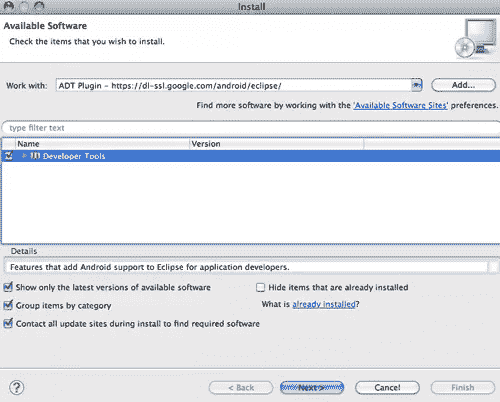
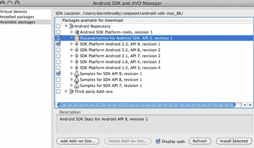
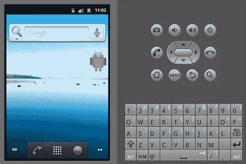
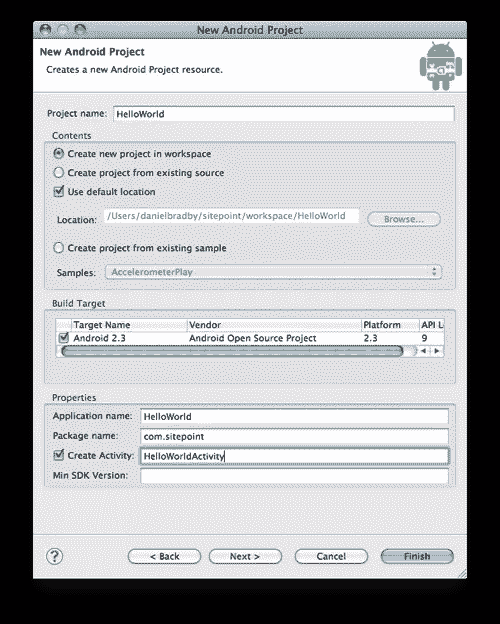
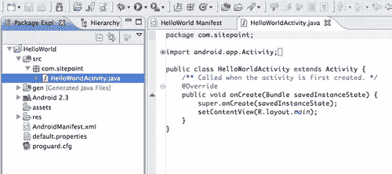
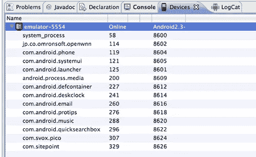
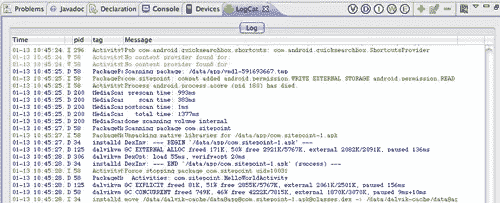
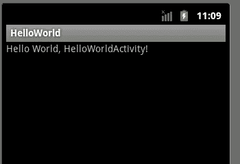

# 你好安卓

> 原文：<https://www.sitepoint.com/writing-your-first-android-app/>

对于 Android 来说，编写第一个应用程序并在手机上运行只是乐趣的一半。让你的应用程序在 Android Market 上运行相对简单，Android 用户几乎可以立即使用它。

前往[http://market.android.com/publish](http://market.android.com/publish)，使用你的谷歌账户，在安卓市场注册成为开发者。注册过程是即时的，需要一次性支付 25 美元的注册费。

到本文结束时，您将准备好向市场提交一个 Android 应用程序(尽管最好避免提交这个我们即将创建的 HelloWorld 风格的应用程序)。

### 设置您的开发环境

Java 开发人员，尤其是使用 Eclipse 的开发人员，将很容易过渡到 Android 开发世界。大多数应用程序都是用 Java 编写的(您可以使用原生 C)，由于 Google 提供的工具支持，开发通常在 Eclipse IDE 中完成(尽管一切都可以在 IDE 之外从命令行完成)。Android 开发在三大操作系统上得到支持:Windows (XP、Vista 和 7)、Mac OS X 和 Linux。

为了设置您的环境，您需要下载并安装以下软件:

*   一个 Java 开发工具包(JDK 5 或 JDK 6)——仅仅有 Java 运行时环境是不够的。您可以从 http://java.sun.com/javase/downloads/index.jsp 的[下载适合您系统的特定 JDK。](http://java.sun.com/javase/downloads/index.jsp)
*   **Eclipse 3.5** (伽利略)，可以从 http://www.eclipse.org/downloads/的[下载。“经典”是推荐版本。](http://www.eclipse.org/downloads/)
*   **http://developer.android.com/sdk/index.html[的安卓 SDK 工具](http://developer.android.com/sdk/index.html)**。记下这是在哪里安装或解压缩的，以便进行下一步。
*   **Android 开发者工具(ADT)—Eclipse 插件**，需要从 Eclipse 内部安装:
    *   从**帮助**菜单中，点击**安装新软件**，然后选择**添加**。
    *   在对话框中，输入 **ADT 插件**作为名称，输入【https://dl-ssl.google.com/android/eclipse/】T2 作为位置；然后按下**确定**。
    *   选择**开发者工具**并点击**下一步**，当出现要安装的项目时再次点击**下一步**。
    *   阅读并接受许可条款，然后点击**完成**。

安装完成后，重启 Eclipse。

现在通过点击**窗口**菜单并选择**首选项**来配置已安装的插件。如果你在 Mac 上，选择 **Eclipse - > Preferences** 。

选择 **Android** ，然后对于 **SDK 位置**，浏览到您安装 **Android SDK 工具**的位置，并选择该位置。点击**应用**，然后**确定**。

使用现在安装的工具，您需要安装 SDK 组件。这是使用 Eclipse 中**窗口**菜单下的 **Android SDK 和 AVD 管理器**完成的。启动管理器，选择**可用套餐**。然后选择*文档*、 *SDK 平台 Android 2.3* 、SDK API 9 的*样本；点击**安装选中的**。*

### 运行模拟器

现在，您已经拥有了开始开发和运行 Android 应用程序所需的所有工具，您需要为您的应用程序创建一个虚拟设备，以便在 **Android 模拟器**中运行。一个 **Android 虚拟设备** (AVD)定义了一个设备配置文件，仿真器可以在运行你的应用时使用它。您还可以创建多个 avd 来进行测试，当您想要在不同大小的屏幕和各种版本的 SDK 上测试您的应用程序时，这很方便。

要创建 AVD，从 **Android SDK 和 AVD 管理器**中选择虚拟设备，然后点击**新建**。为设备命名，并从下拉列表中选择目标 SDK。在这里，你也可以选择不同的屏幕大小和模拟器存储大小；现在，我们将一切保留为默认，并点击**创建 AVD** 。

现在你可以通过选择创建的 AVD 并点击**开始**，然后**启动**来运行模拟器。一段时间后，您会看到模拟器正在运行；你现在可以运行一些内置的应用程序。

### 创建项目

让模拟器保持运行，重启 Eclipse 以创建我们的第一个 Android 项目。一旦 Eclipse 加载完毕，进入**文件**->-**新建**->-**其他** - > **Android** ，选择 **Android 项目**。

填写**项目**和**应用**名称，然后输入 app 的包名。这个包不仅会成为你的源文件的顶层 Java 包，还会为你的应用提供一个唯一的标识符。没有两个应用程序可以同时在手机上安装相同的包标识符，提交到 Android Market 的应用程序也是如此。

选择 **Create Activity** ，为将成为应用入口点的 Java 类提供一个名称，然后点击 **Finish** 。

浏览生成的项目的内容。您会发现各种 Java、XML 和配置文件。

这是解释 Android 应用程序开发中使用的三个关键概念的好时机。

**Activity**(hello world Activity . Java)——Android Activity 是一个单一的任务，是你的应用程序的一部分。该活动将在提供的窗口中显示一个用户界面，并与用户交互以执行任务。单个活动可以是显示电子邮件列表或显示当前位置的地图。

通常，多个活动一起形成一个完整的 Android 应用程序。

生成的活动从类 **android.app.Activity** 扩展而来，并覆盖了一个方法 **onCreate** 。活动由来自 Android 操作系统的事件驱动，使活动经历其生命周期的不同阶段。当活动被创建为当前正在运行的活动时，调用 **onCreate** 方法。

熟悉活动的生命周期和可以被覆盖的方法是值得的，详见 [Android 开发人员文档](http://developer.android.com/reference/android/app/Activity.html)。

**Manifest**(androidmanifest . XML)——这是 Android 所需的中央配置文件，以了解应用程序的各个部分以及它们如何组合在一起。查看生成的清单，您将看到:

*   `package="com.sitepoint"`它构成了应用程序的唯一标识符
*   `<application ... >`包含手机上显示的应用图标和名称所需的属性
*   `<activity ... >`是用类名属性(相对于应用程序包)和活动显示标签描述生成的单个活动的地方。
*   `<intent filter>`这些 XML 元素表示该活动是应用启动时的入口点:
    *   `<action android:name=*"android.intent.action.MAIN"* />`
    *   `<category android:name=*"android.intent.category.LAUNCHER"* />`

**意图** —Android 的设计方式是应用程序可以调用其他已安装的应用程序，而不必知道它们接口的具体细节。这是通过使用意图和意图过滤器的概念实现的。意图是对动作(例如查看、发送、编辑)的抽象描述，并且通常引用要对其执行动作的一些数据(例如，地址簿中的联系人)。

活动可以创建意图，作为将任务责任传递给其他活动的一种方式。这可以在同一个应用程序中(例如从显示联系人列表的活动转到显示单个选定联系人详细信息的活动)，也可以在外部应用程序中(例如，当您想要使用安装的 PDF 查看器显示 PDF 时)。

活动通过意图过滤器宣传它们处理动作和数据类型组合的能力。我们生成的活动宣称它能够在应用程序启动时处理一个主要动作。PDF 查看器可能会宣传它可以显示 PDF 类型的数据。如果两个应用程序宣传相同的能力，Android 会提示用户选择他们想要使用的那个。意图是运行，并可以使选择默认为一个选项。

### 运行和调试

现在让我们在模拟器中运行应用程序，您应该已经运行了。在 Eclipse 中选择项目，从**运行**菜单中选择**运行**；然后在对话框中选择**安卓应用**和 **OK** 。当应用程序正在加载时(或者如果您关闭了它，模拟器会再次启动)，您应该将一些 Android 特定的视图添加到您当前的 Eclipse 透视图中。可以从**窗口**->-**显示视图**->-**其他**->-**安卓**添加。我通常会添加**设备**、**仿真器控制**和 **LogCat** 。

从 **Devices** 视图中，您可以看到您插入到系统中的任何仿真器或电话，这些仿真器或电话可用于调试应用程序。您还可以看到当前与您自己的进程一起运行的进程，这些进程由您为应用程序指定的包名来标识。如果您在这个视图中选择模拟器，然后移动到 **LogCat** 视图，您将看到系统已经写入的所有日志。

这个视图对于调试应用程序非常有用。它允许您创建过滤器，因此您可以在查看不同级别的日志记录(警告、调试、致命)和不同的标记之间切换。(通常，一个应用程序会输出带有标签的日志，该标签与日志来自的类名相同)。

切换回模拟器，您现在应该看到应用程序如下图所示运行。

### 总结

一旦你想出了一个理想的功能，为 Android 编写一个应用程序很大程度上就是确保你安装了正确的工具，然后配置它们为你做艰苦的工作。之后，你可以将你的应用提交给市场，让其他 Android 用户来取用。

## 分享这篇文章