# Linux 2 的 Windows 子系统:Windows 10 和 11 的完整指南

> 原文：<https://www.sitepoint.com/wsl2/>

本教程演示了如何在装有 WSL2 的 Windows 10 或 Windows 11 电脑上安装、管理和使用完整的 Linux 环境。您将运行 Linux 内核和执行本地应用程序，同时与 Windows 代码编辑器和浏览器无缝共享文件和服务。

## 为什么要用 Linux？

你的网络主机几乎肯定使用的是 Linux。它速度快，开源，运行大多数网络软件，包括:

*   服务器([阿帕奇](https://www.sitepoint.com/how-to-install-apache-on-windows/)、 [NGINX](https://www.sitepoint.com/apache-vs-nginx-performance-optimization-techniques/) 、LiteSpeed 等。)
*   语言运行时( [PHP](https://www.sitepoint.com/php-beginners-guide/) 、 [Python](https://www.sitepoint.com/premium/courses/learn-programming-fundamentals-with-python-2916) 、 [Node.js](https://www.sitepoint.com/an-introduction-to-node-js/) 、 [Ruby](https://www.sitepoint.com/why-ruby/) 等。)
*   实用程序库(图像处理、ZIP 创建、电子邮件等)。)
*   数据库( [MySQL](https://www.sitepoint.com/introducing-mysql-a-beginners-guide/) 、 [MongoDB](https://www.sitepoint.com/an-introduction-to-mongodb/) 、[重定向](https://www.sitepoint.com/using-redis-node-js/)等。）
*   其他依赖项( [Elasticsearch](https://www.sitepoint.com/search-engine-node-elasticsearch/) ， [RabbitMQ](https://www.sitepoint.com/use-rabbitmq-php/) ，代理等。)

其中一些依赖项可能在 Windows 和 macOS 上可用，但是安装和维护相同的版本是困难的。它们通常较慢，您可能会遇到细微的差异，这些差异在部署之前不会变得明显。

一些开发人员使用 Linux 作为他们的主要桌面操作系统，但是如果您需要非 Linux 软件，如微软或 Adobe 产品，这可能是不可行的。替代选项:

*   在一台设备上使用两台电脑或双引导。系统之间的切换可能很麻烦。

*   使用 Hyper-V、VirtualBox、Parallels、WMware 或 vagger 运行 Linux 虚拟机(VM)。这需要大量的操作系统资源和合理的 IT 知识。在系统之间共享文件可能会很尴尬。

*   在 [Docker](https://www.sitepoint.com/docker-php-development-environment/) 容器中运行 web 应用。这是另一个需要学习的话题，Docker 本身就运行在 Linux 上。Windows 和 macOS 版本都在表面下使用 Linux，Docker Desktop 的 Windows 版本需要 WSL2。

## Linux 的 Windows 子系统是什么？

Linux 的 Windows 子系统(WSL)允许开发人员直接在 Windows 上运行 Linux 环境。这是一个完整的 Linux 操作系统，运行在 Windows 中，因此您可以无缝地使用相同的应用程序和文件。

WSL1 是开创性的，它将 Linux 系统调用翻译成了 Windows 系统调用。这可能会很慢，并且某些功能不可用。WSL2 使用 Hyper-V 虚拟机技术，因此 Linux 兼容性非常好，文件访问速度比以前快 20 倍。

## Windows 10 和 Windows 11 的区别

微软在 2020 年推出了 WSL2，因此它在 2021 年 10 月被完全集成到 Windows 11 版本中。

Windows 10 需要更多一点的配置工作。如果你正在考虑升级到 Windows 11，那么在安装 WSL2 之前先升级。Windows 11 在某些方面并不是一个进步(我还是很怀念任务栏图标解组和拖动文件！)但 WSL2 似乎更稳定，我很少遇到问题。

## 电脑要求

WSL2 使用 Hyper-V。这需要硬件虚拟化支持，您必须在 BIOS 中启用该支持。

警告:**摆弄你的 BIOS 设置会毁了你的电脑！**做出改变时要小心。请咨询您的主板制造商的帮助页面或搜索有关您的具体品牌和型号的在线建议。

硬件虚拟化在大多数现代设备上都可用，但你可以通过重启和打开 BIOS 面板来检查——通常是在系统启动时按下`DEL`、`F2`或`F10`键。寻找**虚拟化技术**、 **VTx** 、**安全虚拟机(SVM)** 或类似选项。确保它们已启用，保存并重新启动机器。

最后，确保您的`C:`驱动器有 1GB 的备用磁盘空间——最好更多。你也许可以在**设置**、**系统**、**存储**中释放一些空间，或者使用 **Windows 管理工具**中的**磁盘清理**工具。

在撰写本文时，WSL2 会将 Linux 安装到您的`C:`驱动器中，尽管在安装后[有可能将它移动到其他地方](#moveorcloneyourlinuxdiskimage)。

## Windows 要求

WSL2 适用于 Windows 的家庭版、专业版或服务器版，但*不适用于*Windows 10/11S。S 模式仅允许来自微软商店的应用程序“提高”安全性。您可以使用**设置** > **更新&安全** > **激活**中的**切换到 Windows Home** 选项从 S 模式切换到 Windows Home/Pro。

Windows 10 需要 2020 年 5 月的更新，即 2004 版或更高版本。从开始菜单中选择**设置**齿轮，然后选择**系统**，再选择**关于**。面板底部显示了**窗口规格**。

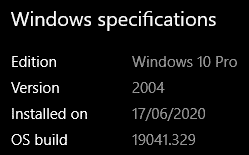

使用**设置**中的**检查更新**按钮，然后如果没有安装**更新&安全**。一些旧电脑可能永远不兼容，微软也不太可能提供补丁。

## 禁用快速启动(可选)

快速启动将 Windows 会话和设备驱动程序保存到一个文件中，这样下次启动会更快。这可能会导致 Linux 内核出现问题，在下次启动时会变得没有响应。如果遇到问题，禁用快速启动从经典的**控制面板** > **电源选项** > **选择电源按钮做什么**:

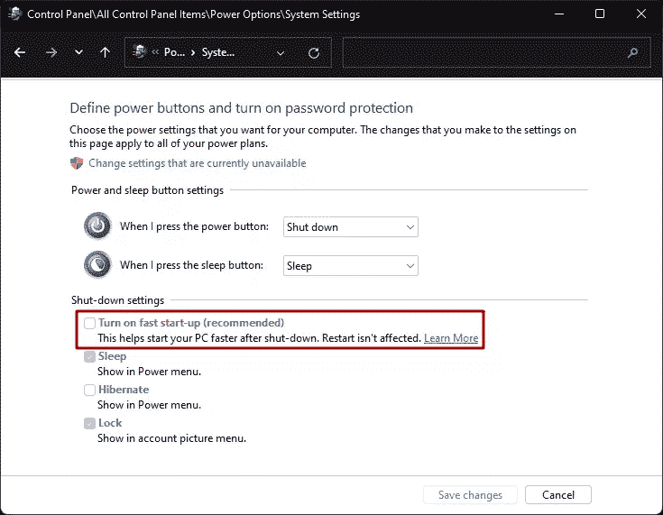

或者，在启动文件夹(`C:\Users\<user-name>\AppData\Roaming\Microsoft\Windows\Start Menu\Programs\Startup`)中创建一个`wsl.bat`文件，内容如下:

```
wsl --shutdown 
```

这将在 Windows 启动后关闭 WSL，但它会在你访问 Linux [发行版](https://www.sitepoint.com/anonymous-linux-distros/)时重新启动。

## 安装 Windows 终端(可选但推荐)

**Windows 终端**是一个很棒的终端应用程序，可从**微软商店**或其在[github.com/microsoft/terminal/](https://github.com/microsoft/terminal/)的仓库获得。

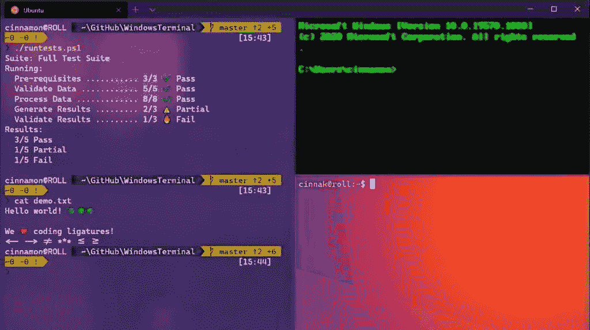

Windows 终端会在安装 WSL2 Linux 发行版时自动添加它们，并提供一系列可配置的选项，包括选项卡、拆分视图、主题、透明度和按键绑定。

可以从**设置**菜单项(`Ctrl` + `,`)、**命令面板** ( `Ctrl` + `Shift` + `P`)或**设置**面板底部的`settings.json`进行配置。

## 启用 WSL2 (Windows 10)

以下说明适用于 Windows 10。在 Windows 11 中它们应该不是必需的，尽管您应该仔细检查是否执行了 Windows 10 到 11 的升级。

**虚拟机平台**和【Linux 的 Windows 子系统功能必须在**开启或关闭 Windows 功能**中开启。点击开始并输入“功能”或从传统**控制面板**中的**程序和功能**图标进入面板。

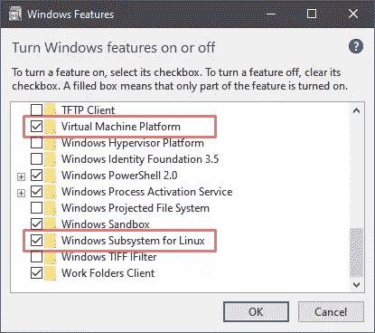

或者，您可以在以管理员身份运行的 Windows Powershell 终端中执行以下命令:

```
dism.exe /online /enable-feature /featurename:Microsoft-Windows-Subsystem-Linux /all /norestart
dism.exe /online /enable-feature /featurename:VirtualMachinePlatform /all /norestart 
```

重新启动 Windows，然后在 Windows PowerShell 或命令提示符下输入以下命令，将 WSL2 作为默认选项启用:

```
wsl --set-default-version 2 
```

## 下载 Linux

在开始菜单中搜索或找到 **PowerShell** ，然后右键单击图标并选择**以管理员身份运行**。通过输入以下命令显示可用的 Linux 发行版列表:

```
wsl --list --online 
```

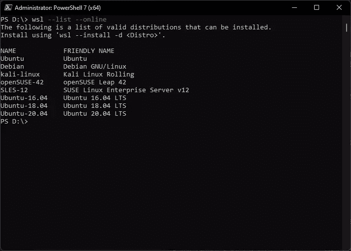

要安装默认的 Ubuntu 20.04 发行版，请输入:

```
wsl --install 
```

要按名称安装特定的发行版，如`Debian`，请输入:

```
wsl --install -d Debian 
```

或者，你可以从开始菜单的**微软商店**安装 Linux 发行版。在搜索框中输入“Linux”(注意可能有 WSL 发行版以外的软件)。

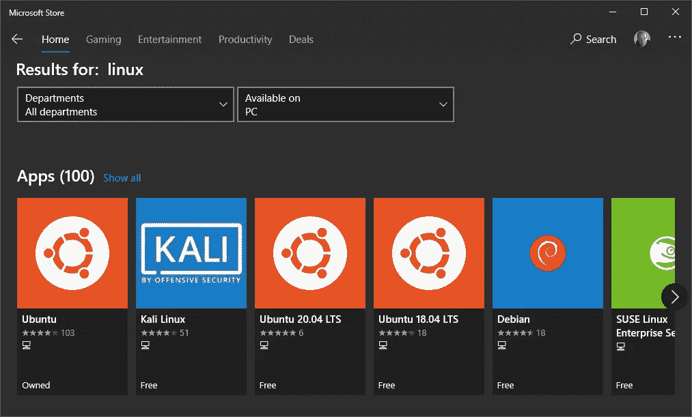

除非你有特定的 Linux 需求，否则 Ubuntu 是个不错的选择。点击**获取**按钮后的 **Ubuntu** 图标，即可安装最新版本。

根据您的网络和电脑速度，下载和安装可能需要一些时间。可能会提示您再次重新启动。

## 启动 Linux

一个新的 Linux ( **Ubuntu** )选项/图标将在以下版本中提供:

1.  开始菜单
2.  Windows 终端(如果已安装)
3.  Powershell —在提示符下输入`wsl`或`bash`

通过创建启动`%windir%\system32\bash.exe ~`的配置文件，可以使用第三方终端软件，如 [Cmder](https://github.com/cmderdev/cmder/) 、 [ConEmu](https://www.fosshub.com/ConEmu.html) 或 [Hyper](https://hyper.is/) 。

安装过程将在您第一次运行 WSL2 Linux 操作系统时完成。

*注意:你**可能**会在终端上看到一条关于内核更新的消息。将链接复制到您的浏览器中，然后下载并安装更新。您需要再次启动 Linux 发行版来继续安装。*

系统会提示您输入用户名和密码。这些是 Linux 管理的凭证:*它们与您的 Windows 用户名和密码*完全分开(尽管选择相同的用户名和密码可能比较实际)。

Linux 最终将准备就绪，您的终端将显示类似于以下内容的内容:

```
Welcome to Ubuntu 20.04.4 LTS (GNU/Linux 5.10.102.1-microsoft-standard-WSL2 x86_64)

 * Documentation:  https://help.ubuntu.com
 * Management:     https://landscape.canonical.com
 * Support:        https://ubuntu.com/advantage

  System information as of Tue Aug 16 10:19:36 BST 2022

  System load:  0.0                Processes:             8
  Usage of /:   1.6% of 250.98GB   Users logged in:       0
  Memory usage: 1%                 IPv4 address for eth0: 172.21.6.83
  Swap usage:   0%

0 updates can be applied immediately.

The list of available updates is more than a week old.
To check for new updates run: sudo apt update 
```

## 更新 Linux

可能会有几个 Linux 更新。要更新 Ubuntu 应用程序，请在 Linux 终端中输入以下命令:

```
sudo apt update
sudo apt upgrade 
```

其他 Linux 发行版也会有类似的过程——所以查看文档以获得帮助。

您还可以使用以下命令从 Powershell 检查 Linux 内核更新:

```
wsl --update 
```

## 在 WSL1 和 WSL2 之间切换

现有的 WSL1 发行版可以转换成 WSL2。在 Windows Powershell 终端中输入以下命令，以显示已安装的 Linux 发行版及其 WSL 版本:

```
PS C:\> wsl --list --verbose

  NAME    STATE    VERSION
* Ubuntu  Running  1 
```

(`*`星号突出显示了默认的 Linux 安装。)

要将`Ubuntu`切换到 WSL2，请输入:

```
wsl --set-version Ubuntu 2 
```

同样，要切换回 WSL1，请输入:

```
wsl --set-version Ubuntu 1 
```

## 设置默认的 Linux 发行版

当您安装了多个 Linux 发行版时，必须将其中一个设置为默认发行版。这将在 Windows Powershell 终端中输入`wsl`时使用。

要设置默认发行版，请列出您的 Linux 安装:

```
wsl --list 
```

并设置默认值为:

```
wsl --setdefault <DistributionName> 
```

Ubuntu 举例:`wsl --setdefault Ubuntu`。

## 以特定用户的身份运行 Linux

要以特定用户的身份运行默认分发，请在 Windows Powershell 终端中输入以下命令:

```
wsl --user <username> 
```

默认用户是在安装时定义的[，但是您可以创建其他用户。还创建了一个`root`用户，但是您应该避免在正常情况下使用它。*输入危险指令太容易了！*](#launchlinux)

## 移动或克隆您的 Linux 磁盘映像

Linux 磁盘映像安装在您的`C:`驱动器上。或者，您可以:

*   将其移动到另一个驱动器以释放`C:`上的空间，或者

*   使用同一个映像创建多个 Linux 安装(如果您需要不同的应用程序和不同项目的设置，这会很有用——尽管 [Docker 可能更实用](#installingdocker)

以下说明假设你正在将 **Ubuntu** Linux 发行版迁移到`D:\wsl`。

在 Windows Powershell 终端(*而非*Ubuntu 终端)中，输入`wsl --list`查看您的 Linux 发行版，然后按名称将一个发行版导出到一个备份`.tar`文件中——比如`D:\backup\ubuntu.tar`:

```
mkdir D:\backup
wsl --export Ubuntu D:\backup\ubuntu.tar 
```

注销该发行版以将其从`C:`驱动器中删除:

```
wsl --unregister Ubuntu 
```

输入`wsl --list`确认发行版已经删除。

将备份导入到另一个位置的新的 WSL2 发行版中，例如`D:\wsl`:

```
mkdir D:\wsl
wsl --import Ubuntu D:\wsl\ D:\backup\ubuntu.tar 
```

您可以从同一个备份中制作任意数量的命名克隆。例如:

```
wsl --import Clone01 D:\wsl\ D:\backup\ubuntu.tar
wsl --import Another D:\wsl\ D:\backup\ubuntu.tar 
```

通过输入`wsl --list`并从开始菜单或 Windows 终端启动 **Ubuntu** ，验证 WSL 发行版已经成功创建。

此时，Ubuntu 将使用`root`作为默认用户。要恢复到您自己的帐户，请输入以下命令:

```
ubuntu config --default-user <yourname> 
```

这里，`<yourname>`是您在安装时定义的用户名[。](#launchlinux)

对于其他非 WSL2 默认发行版，通过登录发行版并创建/编辑`/etc/wsl.conf`来定义用户:

```
touch /etc/wsl.conf
nano /etc/wsl.conf 
```

将以下几行添加到文件中:

```
[user]
default=<yourname> 
```

保存(`Ctrl +` `O) and exit (` `Ctrl +` `X), then restart the distro in a Powershell terminal with:`

```
wsl --terminate <distroname> 
```

假设一切顺利，您可以删除备份文件(`D:\backup\ubuntu.tar`)。

## 从 Windows 访问 Linux 文件

您可以从网络路径`\\wsl$\`访问 WSL2 Linux 文件。在文件浏览器地址栏或任何文件打开对话框中输入它。

你安装的 Linux 发行版被列出，所以你可以在`\\wsl$\Ubuntu`访问 Ubuntu 根目录。您的个人 Linux 文件通常存储在:

```
\\wsl$\Ubuntu\home\<yourname> 
```

这里，`<yourname>`是您在安装时定义的用户名[。](#launchlinux)

最好在 Windows 终端中将它设置为发行版的起始文件夹。打开**设置**，点击一个配置文件，然后更改**起始目录**选项。

### 映射网络驱动器

你可以在文件浏览器中打开`\\wsl$\`，右键点击 Ubuntu 文件夹，选择**映射网络驱动器…** ，将网络驱动器挂载到`\\wsl$\Ubuntu\`。

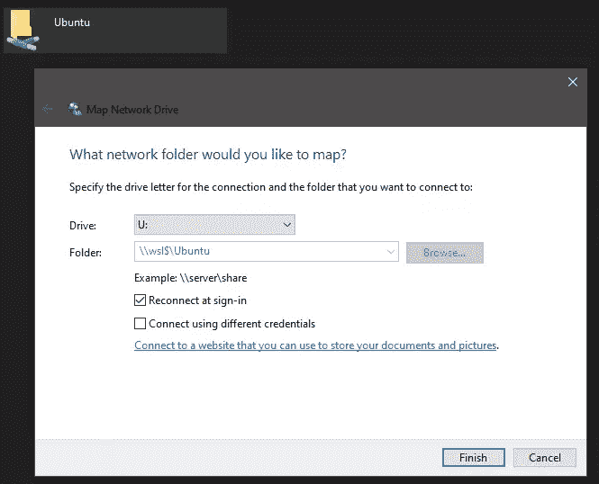

不幸的是，目前还不能映射更深的子目录。对于某些应用程序，您可能还会遇到映射驱动器问题。

## 从 Linux 访问 Windows 文件

Windows 驱动器安装在 Linux `/mnt/`目录中。例如，您在`C:\Users\<yourname>`的个人`Users`文件夹位于:

```
/mnt/c/Users/<yourname> 
```

这里，`<yourname>`是您的 Windows 用户名。

为了便于访问，您可以从终端创建一个指向任何 Windows 文件夹的 Linux 符号链接。例如，对于`C:\projects\code\`:

```
cd ~
ln -s /mnt/c/projects/code/ 
```

一个`code`文件夹将出现在您的 Linux 主目录中。使用`cd ~/code`导航到它，你实际上将在`/mnt/c/projects/code/`，它直接映射到`C:\projects\code\`。

从 Linux 访问 Windows 文件比使用原生 Linux 文件系统慢得多。在可能的情况下，在 Linux 文件空间中创建项目，通常是在您的主文件夹(`/home/<yourname>/`或`~`)中。

## 从 Windows 运行 Linux 命令

任何 Linux (bash) shell 命令都可以使用`wsl`从 Windows Powershell 或命令行终端运行:

```
wsl <linux-command> 
```

例如，`wsl ls -la`列出 Windows 文件夹中的所有文件。

## 从 Linux 运行 Windows 应用程序

任何 Windows 可执行文件都可以从 Linux 启动(通常需要指定`.exe`扩展名)。例如，要在文件资源管理器中打开当前的 Linux 目录，请输入:

```
explorer.exe . 
```

或者在记事本中编辑`.bashrc`:

```
notepad.exe ~/.bashrc 
```

或者在 VS 代码中打开一个特定的项目目录:

```
code ~/projects/mywebsite 
```

## 安装应用程序

永远记住你正在运行两个操作系统。它们可能是紧密集成的，但是有些情况下您希望应用程序安装在任何地方。

例如，Git 在 Windows 和 Linux 中都很有用。Windows 版是通过[下载可执行文件](https://git-scm.com/download/win)安装的。最好确保它不会转换行尾:

```
git config --global core.autocrlf input 
```

Ubuntu 上的 Git 是通过以下方式安装的:

```
sudo apt update
sudo apt install git-all 
```

同样，您可能希望在 Windows 和 Linux 上测试 Node.js 应用程序。同样， [Windows 有一个运行时安装程序](https://nodejs.org/)，但是 [Node.js 运行时是使用如下命令安装在 Ubuntu](https://github.com/nodesource/distributions/blob/master/README.md) 上的:

```
sudo apt-get install build-essential
curl -sL https://deb.nodesource.com/setup_18.x | sudo -E bash -
sudo apt-get install -y nodejs 
```

`git`、`node`和`npm`命令现在可以在任一操作系统中工作。要警惕它们可能是不同的版本。

## 安装图形 Linux 应用程序

WSL2 允许您直接在 Windows 上运行图形 X11 和 Wayland Linux 应用程序。您可以从“开始”菜单启动 Linux 应用程序，将它们固定到任务栏，并在应用程序之间使用剪切和粘贴等功能。有一些缺点:

*   并不是所有的图形应用都能像预期的那样工作
*   有些提供了 Linux 特性——比如文件对话框——这可能会让 Windows 用户感到困惑
*   安装带有原生 Windows 版本的应用程序，如 Firefox、VLC 或 GIMP，好处不大

若要继续，请为您的电脑安装正确的 GPU 驱动程序:

*   [用于 WSL 的英特尔 GPU 驱动程序](https://www.intel.com/content/www/us/en/download/19344/intel-graphics-windows-dch-drivers.html)
*   [用于 WSL 的 AMD GPU 驱动程序](https://www.amd.com/en/support/kb/release-notes/rn-rad-win-wsl-support)
*   [用于 WSL 的 NVIDIA GPU 驱动程序](https://developer.nvidia.com/cuda/wsl)

然后从 Linux 终端安装任何图形应用程序。例如，GNOME Gedit 文本编辑器:

```
sudo apt install gedit 
```

发布时使用:

```
gedit 
```

像使用任何其他 Windows 程序一样，将应用程序固定到开始菜单或任务栏。

Gedit 是一个下载容量不到 2MB 的小应用程序。然而，它需要 GNOME 和其他 Linux 库，这在厚重的 GPU 驱动程序上产生了数百兆字节的额外代码(英特尔为 1.1GB)。在 WSL2 中使用图形化的 Linux 应用程序只有在您需要安装几个应用程序或者没有本地 Windows 替代程序时才有意义。

## 安装 Docker

*“在两个操作系统上安装”*规则的一个例外是 Docker！

Docker 在隔离的 Linux 容器中运行应用程序，这些容器在概念上类似于带有操作系统、单个应用程序及其依赖项的轻量级虚拟机。使用 Docker 进行 web 开发提供了一个一致的环境，该环境易于安装并可在任何设备上运行。

[Docker Desktop for Windows](https://www.docker.com/products/docker-desktop) 完全支持 WSL2:

*   不需要使用 Hyper-V，所以 Docker 可以安装在 Windows Home 上
*   当配置为使用 WSL2 时，Docker 启动和运行的速度要快得多
*   在 Windows 上安装 Docker Desktop 可以在 Windows 和 Linux 上启用`docker`和`docker-compose`

Docker Desktop 建议您在 WSL2 首次启动时使用它。或者，你可以从 Docker 系统托盘图标菜单中选择**设置**，然后选择**通用**选项卡，勾选**使用基于 WSL 2 的引擎**，点击**应用&重启**。

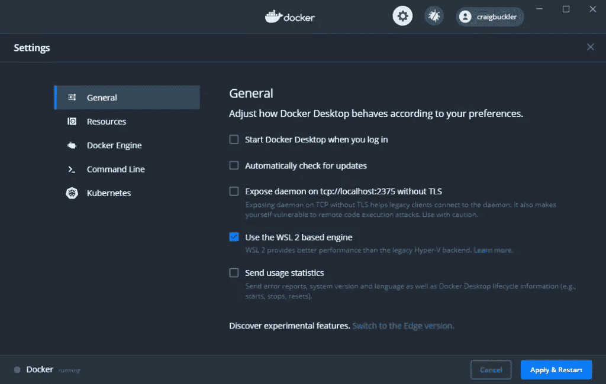

Docker 使用默认的 Linux 发行版，但是你也可以从**设置**中的 **WSL 集成**面板，然后是**资源**中启用它。

### 使用 Docker 启动 Apache 和 PHP 应用程序

可以在您的 WSL2 Linux 环境中直接安装 web 依赖项，比如 Apache 和 PHP。然而，Docker 更安全、更快速、更可配置:它允许您同时在同一台设备上运行不同版本的 PHP。

在本例中，您将创建一个小的 PHP 文件，并在 Docker 容器中使用最新版本的 PHP 7.4 运行它。确保您已经安装了 [Docker Desktop for Windows](https://www.docker.com/products/docker-desktop) 并启用了 WSL2 模式，然后在您的 Linux 环境中用`index.php`文件创建一个文件夹。例如:

```
mkdir ~/php
cd ~/php
touch index.php 
```

使用记事本或 VS 代码编辑`index.php`，也许是[，如上图](#runwindowsapplicationsfromlinux)。添加以下内容，输出 PHP 状态信息:

```
<?php
phpinfo(); 
```

运行下面的`docker`命令启动容器中支持 PHP 8.1 的 Apache web 服务器，该服务器将当前主机目录中的文件挂载到容器中的`/var/www/html`:

```
docker run \
  -it --rm -p 8080:80 --name php \
  -v "$PWD":/var/www/html \
  php:8.1-apache 
```

*注意:这个命令在 Windows 中也可以使用，但是对`$PWD`的引用必须用 Linux 符号中的完整文件路径来代替——比如`/c/php/`。*

在任何 Windows web 浏览器中打开`https://localhost:8080/`，查看`phpinfo()`命令的输出。

最后，在 Docker 终端中按`Ctrl` + `C`停止并删除容器。

## WSL2 和`localhost`

运行在 Windows、WSL2 Linux 和 Docker 容器上的应用程序总是从`localhost`或`127.0.0.1`被访问。

上面的的 [PHP 示例公开了端口`8080`，它被映射到容器中的端口`80`。类似地，如果您在 Linux 中安装了 Node.js，您可以`cd`到任何目录并启动一个静态文件服务器:](#launchingapacheandphpapplicationsusingdocker)

```
npx small-static-server 
```

在浏览器中打开`http://localhost:8888/`查看该目录下的文件(默认返回`index.html`)。

请注意，一个操作系统中可用的端口在另一个操作系统中可能不可用。小于 1000 的端口号仅适用于 Linux 超级用户。端口 80 通常由 Windows Store Skype 应用程序保留，并且不能更改(尽管经典的[桌面版](https://www.skype.com/)允许)。

使用诸如 [mkcert](https://github.com/FiloSottile/mkcert) 等工具进行自签名或本地信任的 SSL 证书可以在 Windows 和 Linux 环境中互换使用。

## VS 代码 WSL2 集成

VS 代码允许你使用任何 Windows 或 Linux 终端。用**视图打开终端** > **终端**或`Ctrl +` `' then hit the down arrow next to the **+** icon to launch a specific type. The same menu has a **Select Default Profile** option where you can select the terminal to use by default.`

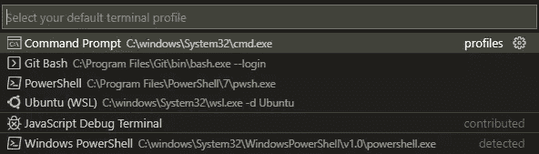

和其他应用一样，VS 代码可以在`\\wsl$\`直接访问 Linux 文件，在`localhost`上运行调试器。不需要进一步的扩展，但是下列选项允许更容易的 Linux 和 Docker 文件管理:

*   [Remote–WSL](https://marketplace.visualstudio.com/items?itemName=ms-vscode-remote.remote-wsl):打开 WSL2 Linux 文件夹
*   [远程容器](https://marketplace.visualstudio.com/items?itemName=ms-vscode-remote.remote-containers):打开或连接到正在运行的 Docker 容器
*   [远程开发包](https://marketplace.visualstudio.com/items?itemName=ms-vscode-remote.vscode-remote-extensionpack):包括上述两个扩展以及[Remote–SSH](https://marketplace.visualstudio.com/items?itemName=ms-vscode-remote.remote-ssh)来连接远程服务器

安装完**Remote–WSL**之后，您可以导航到任何 Linux 目录并启动 VS 代码的 WSL 连接实例:

```
cd ~/myproject
code . 
```

或者，单击应用程序左下角的**远程窗口**图标，然后选择一个连接选项。


或者使用活动栏中新的**远程浏览器**图标。这允许您从下拉列表中选择一个目标类型，并相应地进行连接。

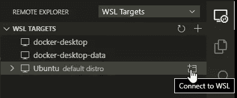

VS 代码的远程实例有一组单独的扩展和设置供 Linux 使用，但是有些可以全局启用。**扩展**面板允许您在远程实例中启用和配置扩展。

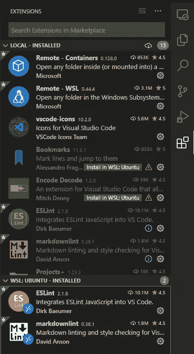

设置存储在您的 Linux `~/.vscode-server`目录中。

## 摘要

在 Windows 上运行 Linux 应用程序过去需要虚拟机、复杂的 Samba 文件夹共享和极大的耐心。WSL2 彻底改变了 web 开发。它使得使用 Windows 工具编写代码，然后在类似生产的 Linux 环境中运行代码变得容易。紧密集成提供了两种操作系统的优势。

更多 WSL2 资源:

*   [适用于 Linux 的 Windows 子系统文档](https://docs.microsoft.com/windows/wsl/)
*   [在 WSL 中开发](https://code.visualstudio.com/docs/remote/wsl)
*   [VS WSL 中的代码远程开发](https://code.visualstudio.com/docs/remote/wsl-tutorial)
*   [在 Linux 的 Windows 子系统上运行 Linux GUI 应用](https://docs.microsoft.com/en-us/windows/wsl/tutorials/gui-apps)

如果您喜欢这篇文章，您可能会发现这些资源也很有用:

*   [Windows 终端:完整指南](https://www.sitepoint.com/windows-terminal/)
*   [如何在 Windows 10 Home 上安装 Docker](https://www.sitepoint.com/docker-windows-10-home/)
*   [如何在 Windows 10 上安装 PHP(用 Apache & MySQL)](https://www.sitepoint.com/how-to-install-php-on-windows/)
*   [*PHP & MySQL:新手到忍者*](https://www.sitepoint.com/premium/books/php-mysql-novice-to-ninja-7th-edition/)
*   [如何使用 Dockerfile 文件构建图像](https://www.sitepoint.com/how-to-build-an-image-with-the-dockerfile/)
*   [了解 Docker、容器和更安全的软件交付](https://www.sitepoint.com/docker-containers-software-delivery/)
*   [*Docker for Web 开发者*](https://www.sitepoint.com/premium/books/docker-for-web-developers/)

## 分享这篇文章