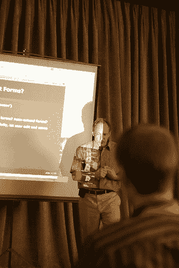

# WWW2008 北京:第一天-网上链接数据(LDOW 2008)研讨会

> 原文：<https://www.sitepoint.com/www2008-beijing-day-1-linked-data-on-the-web-ldow-2008-workshop/>

刚到研讨会的中途…到目前为止，漫长的一天。昨晚从悉尼离开，还没有睡觉，我希望我在会议期间不要打瞌睡。

现在我正在听蒂姆·伯纳斯·李谈论关联数据浏览，以及他对网络是只读媒体的沮丧。他和一个小团队(在圣诞假期)开发了他们的链接数据浏览器制表软件的第二个版本。该更新通过 SPARQL 更新查询将制表器从只读/浏览域转移到写域。

Tim 一直非常热衷于给网络回信的能力。他写的第一批网络客户既有读写能力。这种能力在早期就消失了，现在又出现了。他承认，有些人会认为 write 已经可以通过博客和维基获得，但他不会高兴，直到更多的网络是可写的。

这些东西都很新。SPARQL 最近才作为 W3C 规范发布。SPARQL 2 的开发工作已经开始。其中一个关键因素是执行更新的能力。稍后将详细介绍。

这种编辑/更新应该是所见即所得，如果屏幕上有正确的东西，你可以点击它并编辑它。这当然都是结构化的、互连的 RDF 格式。这就是它不同于维基或博客的地方。

制表师着眼于整个全局图，而不仅仅是数据或文件的单个实例。因此，如果您正在更新全局数据，那么您的编辑内容会放在哪里？只要它是可写的，它就会返回到原始源。

他们正在努力的下一步是将它与 OpenID 集成，这样可以保持安全性，并且你可以以一种分散的方式来决定。

## 分享这篇文章