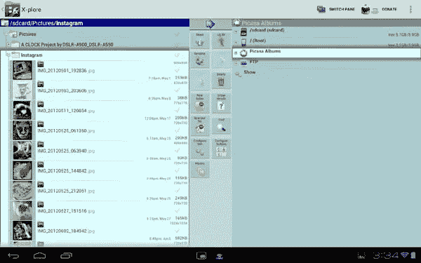
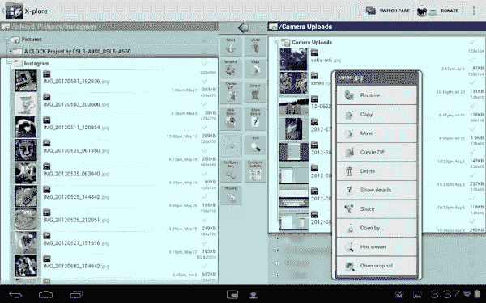
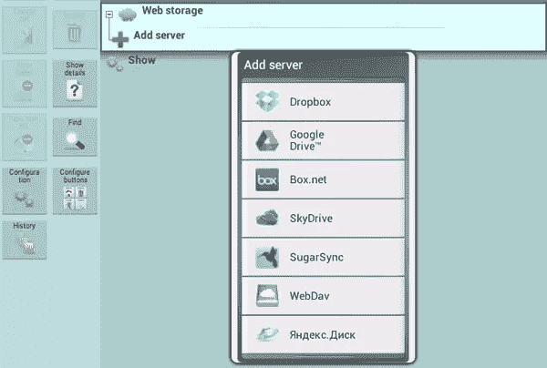

# 用于谷歌 Android 的 X-plore 双窗格文件管理器

> 原文：<https://www.sitepoint.com/x-plore-dual-pane-file-manager-for-google-android/>

有些人会告诉你，我们正处于一个所谓的“后 PC”时代，但事实并非如此。个人电脑刚刚开始以不同的形式出现，因为你口袋里的智能手机或背包里的平板电脑就像你办公室里的台式电脑一样，是一台“个人电脑”。由于智能手机和平板电脑被用来保存各种不同的文件，所以你需要一个合适的文件管理器来处理所有这些文件才是有意义的。

根据你的设备上安装的谷歌 Android 版本，你可能已经有了某种类型的文件管理器，但 Lonely Cat Games 的 X-plore 文件管理器可能更强大，给你更多在普通电脑上移动文件的外观和感觉。

### 双倍的窗格，双倍的乐趣

虽然还有许多其他特性，其中一些我将在稍后讨论，但 X-plore 最大的特性可能是它是一个*双窗格*文件管理器。

通过这种方式，您可以浏览和导航您的文件，既可以找到源文件，也可以找到目标文件。你知道你通常在电脑上打开两个窗口，然后把文件从一个文件夹“拖”到另一个文件夹吗？这种双窗格布局有效地让你做同样的事情，除了你简单地使用多选“复选框”来选择文件，然后点击“复制”或“移动”图标。

最棒的是，您还可以获得一个熟悉的“树”样式视图，显示完整的文件路径。也许你的 Android 手机上有一个名为“工作”的文件夹，在这个文件夹下还有一个名为“项目”的文件夹，在这个文件夹下是“TPS 报告”。您可以深入这个分层文件系统，就像在 Windows PC 上一样。

### 利用您的文件做更多事情

但是，你不只是得到文件名。在图片文件的例子中，你得到一个小的缩略图。然后，您可以查看图像，完成缩放或滑动功能，而无需离开应用程序。还有用于视频文件、音频文件和文本文件的内置查看器。你甚至可以查看 ZIP 格式的 APK 文件，也可以显示隐藏的文件。

无论您选择单个文件还是使用多选来选择多个文件，您都可以点击并按住来调出许多可能的选项。最直接的功能是重命名、删除、复制和移动，但也可以创建 ZIP 文件、共享文件(通过其他应用程序的每个“共享”选项)等等。

排列在两个窗格之间的按钮为您提供了更多选项，用于创建新文件夹、创建新文本文件、查找文件、配置按钮和查看历史记录。这一切都非常强大，但这几乎可以被视为一个问题。拥有如此多功能的双窗格视图在平板电脑上很好，但在智能手机显示屏上可能会非常拥挤(一次只能看到一个窗格)。你可能会无意中点击错误的图标或错误的文本字段，但这是你为能看到和这里一样多的内容所付出的代价。

### 也适用于 FTP 和云存储

现在，唯一有意义的是，你可以使用 X-plore 查看 Android 智能手机或平板电脑内存中存储的所有文件。如果你有一个 microSD 存储卡，X-plore 也可以用来浏览存储在里面的文件，随意地来回移动它们。

伟大的事情是，它并没有就此停止。X-plore 还预先配置了 Picasa 相册，这些相册已经连接到您在设备上注册的 Google 帐户。当你点击“网络存储”时，会出现另一个选项来添加网络存储服务器。

是的，这包括几个最受欢迎的云存储服务，如 [Dropbox](http://db.tt/VnATHDV) 、 [Google Drive](https://drive.google.com/start) 、 [Box](https://www.box.com/) 、 [SugarSync](https://www.sugarsync.com/) 和 [SkyDrive](https://skydrive.live.com/) 。例如，如果你已经在你的设备上安装了 Dropbox 应用，你所要做的就是点击 Dropbox 作为你想要添加的服务器，然后在相应的窗口弹出时同意授予 X-plore 权限。是的，你确实可以使用 Dropbox 应用程序本身来来回回地移动文件，但同样，这种双窗格布局让一切都变得更加容易。

X-plore 还支持 FTP、SMB 和 SQlite。这包括对安全 FTP (FTPS)的支持，您甚至可以配置多台服务器。这对于在自己的 web 服务器上存储文件的人来说非常方便，因为这意味着您可以快速方便地来回移动文件。您可以获得与本地存储文件相同的所有功能，如图像缩略图和创建 ZIP 文件的能力。能够访问局域网上的共享文件夹也是如此。

### 一个更好的文件管理器

老实说，Android 的 X-plore 文件管理器不会是你设备上最漂亮的应用。它本质上非常实用，所以你不会得到漂亮的滑动工具和华丽的图标。与此同时，它的工作非常出色，使得在 Android 设备上管理文件几乎和在成熟的 PC 上一样容易。

想要这种级别的访问和效用的用户也可能是愿意忽略不那么华丽的用户界面的用户。想要简单和放手的方法的人可能不会对此感兴趣，这很好，但对于我们这些想这样做的人来说，这个应用程序非常棒。更好的是，X-plore 在谷歌 Play 商店是免费的。你不能免费打。

## 分享这篇文章