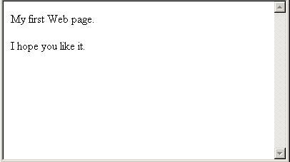
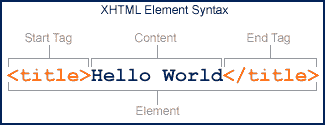
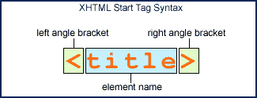
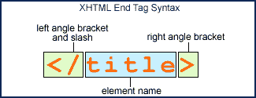
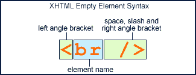
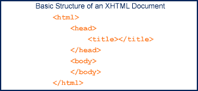
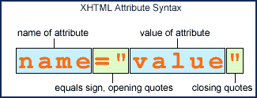
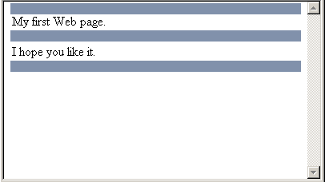
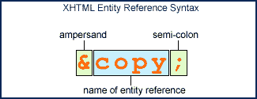
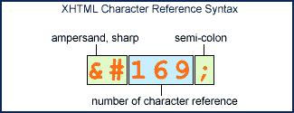

# 面向初学者的 XHTML 网页设计——第 2 部分

> 原文：<https://www.sitepoint.com/xhtml-web-design-beginners-2/>

你以前没有网页设计的经验(或者很少)？

如果您曾经尝试过从 Microsoft Word 中导出 HTML，或者使用过 FrontPage，并且想要了解自己在做什么，那么这篇文章就是为您准备的！

今天，我们将探索 XHTML 到底是什么，以及如何使用它来制作下一代网页。

本教程分为多个部分，如下所示:

[第 1 部分](https://www.sitepoint.com/blog/)问“为什么使用 XHTML？”，在我们直接开始编写我们的第一个 HTML 页面之前。然后，我们逐步介绍该技术的基本构建模块，强调 XHTML 的一些优点。

第 2 部分以这些知识为基础，我们探索 XHTML 的高级构建块，包括注释、文本等等。

第 3 部分考虑了 XHTML 处理列表、图形和链接 XHTML 文档的方式。

为了让您更容易理解，我在本文的示例 XHTML 中使用了粗体。加粗纯粹是因为这个原因，没有其他目的。

##### 第一部分

##### 为什么要编写自己的 XHTML 呢？

我不会向你展示如何使用任何为你编写 XHTML 的程序。我坚信创建网页的最佳方式是亲自动手编写代码。做了七年了，还没让我失望过！为什么手工编码很重要？原因有很多。

为你生成 HTML 的程序通常做得很差，通常生成的网页做起来很麻烦。当你手工编码你的页面时，你对你正在做的事情有一个亲密的了解，并且能使网页文件的实际大小尽可能的小。这减少了下载时间，因此您的页面加载速度更快，您的用户也更高兴。

当你用一个程序为你生成 HTML 时，你没有机会理解你的页面是如何内部构建的，因为这一切都是为你做的。只要一切正常，这就不是问题…但如果不正常呢？如果您发现您的网页在 Internet Explorer 4 中无法正常显示，并且您的许多用户都使用该浏览器，您必须解决这个问题。这意味着忘记程序，自己去看代码。你会发现问题吗？如果你一直在用程序为你编写网页，当问题出现时，你可能不具备解决问题所需的知识。

互联网不再局限于拥有电脑的人通过一两个不同的浏览器浏览网站。如今，每样东西都有网络浏览器:手机、电视、个人数字助理、汽车……甚至冰箱！盲人用户使用语音合成或盲文设备“查看”网站。你不可能在所有可能使用它的设备上测试你制作的每一页。

但是有一种方法可以确保您的站点在大多数情况下都能正常工作:使用万维网联盟(W3C)制定的标准生成页面，W3C 是研究 XHTML 和其他互联网标准的组织。W3C 提供了一个验证服务来检查您的页面是否符合标准，如果符合，那么它就有最好的机会在任何设备上使用。我不知道有任何 HTML 生成程序能产生有效的代码。

我希望这已经说服了您，XHTML 的学习曲线是值得的。如果你决定用一个程序来做这件事，那也会有一个学习曲线，所以你最好选择代码，这样将来就不会有麻烦了。

##### 为什么是 XHTML？

自 1990 年以来，HTML(或超文本标记语言)一直是创建网页的推荐语言。它非常成功(你不需要我告诉你！).但是 HTML 有它的问题。没有深入细节，因为这不是本文的主题，HTML 已经变得一团糟。为了解决这个问题，1999 年万维网联盟提出了 XHTML。XHTML 代表扩展超文本标记语言，是用一种叫做 XML 或扩展标记语言的语言编写的。

顾名思义，XHTML 具有可扩展的能力。你可以使用额外的模块来处理你的页面，这是 HTML 所不能做到的。长期目标是你的网页能被计算机和人类理解。这是如何工作的？请允许我解释。

你可能认为计算机已经理解了网页，因为你用计算机来浏览它们。这是真的。但是计算机只理解如何显示你的页面，而不理解它们的意思。想象一下，如果计算机真的理解网页的意思！你可以告诉你的电脑去访问所有当地超市的网站，并向你报告本周哪家商店购物最便宜。你的电脑可以访问世界各地的新闻网站，并带回与你感兴趣的事情相关的最新头条新闻。可能性是无限的。

希望您现在明白为什么 XHTML 如此重要了。我决定写这篇教程，从头开始教你 XHTML。主要原因是我在任何地方都找不到初学者的 XHTML 教程，有很多 HTML 初学者的文章，也有很多针对那些已经会做 HTML 的人的 XHTML 介绍，但对我来说，如果你现在开始学习网页设计，那么你还不如一开始就使用 XHTML。所以如果你还和我在一起，让我们开始吧。

##### 你好世界

如果没有向你展示如何创建一个“Hello World”页面，任何初学者指南都是不完整的。使用 XHTML，这非常简单。如果你不明白所有的事情，不要担心，时间会让你明白的。您的“Hello World”网页代码如下所示:

```
<?xml version="1.0" encoding="iso-8859-1"?>  

<!DOCTYPE html PUBLIC "-//W3C//DTD XHTML 1.0 Transitional//EN"    

"https://www.w3.org/TR/xhtml1/DTD/xhtml1-transitional.dtd">   

**<html** xml:lang="en" lang="en" **>**  

  **<head>**  

    **<title>**Hello World**</title>  

  </head>  

  <body>  

    <p>**My first Web page.**</p>  

  </body>  

</html>**
```

在可视化浏览器(如 Internet Explorer)中，上面的页面看起来会像这样:


图 1

查看这段代码如何在您的浏览器中出现[。](http://webmasterbase.com/examples/xhtml/hello-world-1.html)

我们暂时不会担心未绑定的代码:目前您需要知道的只是它告诉计算机这个页面是 XHTML 格式的，并且使用的语言是英语。这段代码需要出现在你制作并发布在网站上的每一页中，但是我们会在以后处理它。别担心。

XHTML 被称为“标记语言”,因为这就是你用它做的事情:你标记文本区域来表明它们的意思，所以浏览器可以知道如何处理它们。这是使用元素完成的。一个元素由两个标记组成，一个开始标记和一个结束标记。标签使用尖括号:`< >`来表示它们是标签，每个结束标签也有一个斜线`/`。

让我们回顾一下我们刚刚看到的文档。元素用来表示页面的标题。在 Internet Explorer 中，此标题显示在窗口顶部的栏中。我们的标题元素如下所示:

```
<title>Hello World</title>
```

标签意味着我们开始一个新的标题元素。接下来是我们想要的标题文本。在这种情况下，标题将是“Hello World”。为了告诉浏览器我们已经完成了标题，我们使用了一个结束标签`</title>`。如上所述，开始标签和结束标签的唯一区别是斜线`/`。这很重要，因为这是计算机知道你是开始一个新标签还是完成前一个标签的唯一方法。

开始和结束标记的名称必须相同，因此:

```
<title>Hello World</heading>
```

无效，将不起作用。

除了包含文本(如上面的“Hello World ”)之外，元素还可以包含其他元素。如果我们看一下`<title>`元素的外部，我们可以看到它出现在`<head>`元素内部，如下所示:

```
<head>   

  <title>Hello World</title>   

</head>
```

这意味着`<title>`是文档`<head>`的一部分，因为它在文档内部。另一个元素可以包含多少个元素是没有限制的，只要你遵守我们马上要看的规则。

文档的`<head>`用来告诉计算机关于你的文档的事情，而不是应该在文档中的事情。`<title>`不是页面本身的一部分；它描述了文档是什么，所以它放在`<head>`中。所有 XHTML 文档都必须有一个包含一个< title >元素的`<head>`元素，尽管其他元素也是允许的(同样，我们稍后会讨论这些)。

在`<head>`之后是`<body>`。`<body>`是文档中包含页面本身的部分。所有 XHTML 文档都必须有一个`<body>`元素。正文包含段落、项目符号列表、图片和其他文档的链接。当你访问一个网站时，你看到的所有信息都包含在`<body>`元素中。

我们的`<body>`元素非常简单；它包含一个元素`<p>`:

```
<body>   

  <p>My first Web page.</p>   

</body>
```

你猜到`<p>`元素是做什么用的了吗？它标记了一个段落，因此我们的页面将有一个段落，其文本为“我的第一个网页”在里面。如果我们想添加另一个段落，我们可以这样做:

```
<body>   

  <p>My first Web page.</p>   

  <p>I hope you like it.</p>   

</body>
```

在 Internet Explorer 等可视化浏览器中，上面的页面看起来会像这样:



图 2
查看这段代码如何出现在你的浏览器中[。](http://webmasterbase.com/examples/xhtml/hello-world-2.html)

还有一个我们没有提到的重要因素。元素`<head>`和`<body>`包含在元素`<html>`中。我们上面的`<html>`元素看起来像这样:

```
<html>   

  <head>   

    <title>Hello World</title>   

  </head>   

  <body>   

    <p>My first Web page.</p>   

  </body>   

</html>
```

`<html>`元素必须包含一个`<head>`元素和一个`<body>`元素。

你可能想知道为什么在一些行的开始有额外的空间。这纯粹是为了我们的利益，对处理您页面的计算机没有任何影响。这个想法是在每一行的开头添加制表符或者一定数量的空格来匹配你的标签级别。看看上面的代码，`<html>`没有包含在任何元素中，所以没有空格。`<head>`包含在一个元素`<html>`中，所以它有一个选项卡。`<title>`包含在两个元素中，`<html>`和`<head>`，所以它有两个选项卡，依此类推。相信我，当你的文档变大时，这种缩进会让事情变得简单很多。

##### 现在轮到你了

如果你准备好迎接挑战，在阅读更多内容之前，试着自己创建一些页面。首先，尝试我们刚刚看到的“Hello World”示例。以下是方法。

打开你选择的文本编辑器。如果您使用的是 Windows，那么:

开始>程序>附件>记事本

会让你进入记事本，但任何文本编辑器都可以。请注意，Microsoft Word 和其他文字处理器不是文本编辑器，不适合这项任务。

现在输入下面的代码。我建议您自己键入代码(而不是使用复制和粘贴)，因为这将有助于您理解您在做什么。tab 键(用于空格)通常位于键盘左侧的“Caps Lock”上方。

```
<html>   

  <head>   

    <title>Hello World</title>   

  </head>   

  <body>   

    <p>My first Web page.</p>   

  </body>   

</html>
```

一旦你在文本编辑器中输入了代码，你需要将它保存为一个网页文件。网页文件有自己的“扩展名”(文件名后的句点和三个字母)，以区别于其他文件，如 Microsoft Word。doc)或 Adobe Acrobat(。pdf)。

网页使用。htm 或者. html 我比较喜欢用。html，因为它匹配语言的名称。选择权在你。一些旧系统不会保存带有四个字母扩展名的文件。htm 可能是你唯一的选择。

保存文件后，在 Web 浏览器中打开它。如果输入正确，您将看到类似于上面图 1 的内容。

现在你有了自己的页面，试着像这样添加一些段落:

```
<html>   

  <head>   

    <title>Hello World</title>   

  </head>   

  <body>   

    <p>My first Web page.</p>   

    <p>A second paragraph.</p>   

    <p>Yet another paragraph.</p>   

  </body>   

</html>
```

再次保存您的文档并刷新您的 Web 浏览器。您应该会看到额外的段落出现在第一个段落之后。

##### 摘要

这就是你的“你好，世界”页面。正如我在开始时所说的，如果您没有完全理解，请不要担心，我们将更详细地查看每个区域，但希望这已经让您了解了网页是如何工作的。在下一节中，我们将进一步了解元素和标记，以及它们是如何用于构建文档的。

##### XHTML 构建块

元素和标签是 XHTML 的构造块。你需要完全理解这两个概念，才能正确地编写网页。我们已经在上面的例子中提到了它们是如何工作的，但是现在让我们更仔细地看一下。

一个元素被用来标记你的文档的部分，以便告诉计算机那个部分是什么。这可以从标记整个文档(如使用`<html>`元素)到标记单个单词为重要。这个概念在所有情况下都是一样的。

##### 元素

元素由两个标签组成:开始标签和结束标签。这些标签之间是元素内容。



这个元素告诉计算机它的内容“Hello World”是文档的标题。如果没有开始和结束标记，计算机将无法知道如何处理这些文本。

***开始标记***

开始标记由一个左尖括号、元素名称和一个右尖括号组成。



一个开始标记告诉计算机我们正在开始一个新元素，并且它应该把它现在遇到的所有东西都看作那个元素的开始标记的一部分，直到它到达右尖括号。

***结束标签***

结束标记由一个左尖括号和一个斜杠组成，后跟元素的名称，然后是一个右尖括号。



一旦计算机到达一个元素的结束标记，它就知道这个元素结束了。斜杠是区分结束标记和开始标记所必需的。

##### 区分大小写

输入标签时，必须确保名称仅使用小写字母。XHTML 区分大小写。这意味着它认为以下每个标记都与其他标记不同:

1.  <title></li><li><title/></li><li><title/></li> </ol> <p>只有数字 1 是 XHTML 标签；其余的都不存在。XHTML 中的所有标签都是小写的，所以不难记。只是要小心，以确保你得到它的权利。</p> <h5>空元素</h5> <p>某些元素没有任何内容。对于这些空元素，提供了特殊的语法。我们要做的不是在开始标记结束后立即插入结束标记，而是在开始标记的右尖括号前加一个斜杠，告诉计算机这个元素结束了。</p> <p>元素用来在你的文档中插入一个换行符。这告诉计算机在该点停止文本并开始新的一行。正如您可能已经猜到的那样，<code><br></code>元素不包含任何内容，所以不用像这样输入元素:</p> <pre><code><br></br></code></pre> <p>我们这样做:</p> <p></p> <p>这不仅节省了打字，还使代码更容易阅读和管理。斜线前的空格是支持旧的 Web 浏览器所必需的，这些浏览器不理解空元素，只要斜线前有空格就会忽略它。</p> <p/><div class="article-cms-pagebreak"/> <p/> <h5>内容</h5> <p>我们刚刚看到的元素只包含文本“Hello World”。但是元素可以包含比文本更多的东西。如果他们不能，那么 XHTML 就不会很有用。</p> <p>例如，你的大部分元素也会包含其他元素。事实上，许多元素必须包含某些其他元素才能正常工作(稍后我们将逐一介绍)。</p> <div class="vertical" id="adz"><script type="text/javascript">GA_googleFillSlot("Articles_6_300x250");</script></div> <p>包含另一个元素的元素如下所示:</p> <pre><code><head>     <br/>  <title>The document title</title>     <br/> </head></code></pre> <p>这里我们有一个包含一个<code><title></code>元素的<code><head></code>元素。随着我们继续下去，你会看到元素包含越来越多的元素，因为你积累了知识，产生了更大、更复杂的文档。</p> <h5>嵌套</h5> <p>不，我们不是在谈论为孩子做准备。嵌套描述了元素包含其他元素的方式。当我们说元素正确嵌套时，我们的意思是:</p> <ul> <li>每个元素都完全包含在包含它的元素中，并且</li><li>它完全包含了它所包含的元素。</li> </ul> <p>试着在一夜外出后说这句话！</p> <p>这听起来可能令人困惑，但实际上非常简单，这些例子将会证明这一点。我们将使用元素<code><em></code>和<code><strong></code>，它们分别给出文本强调和强强调。我们稍后将详细讨论它们。</p> <pre><code><em>The Lord Of The Rings is a <strong>fantastic</strong> story.</em></code></pre> <p>这是有效的 XHTML。</p> <pre><code><em>The Lord Of The Rings is a <strong>fantastic</em> story. </strong></code></pre> <p>这不是。<code><em></code>在<code><strong></code>的外面开始，但在里面结束。标签没有正确嵌套。把元素想象成盒子。一个盒子里面可以有一个盒子，也可以在一个盒子里面，但不能在盒子里面，也不能在盒子外面。你的元素也不能。</p> <h5>必需元素</h5> <p>所有 XHTML 文档都必须包含四个元素。我们已经看到你必须有一个<code><head></code>并且它必须包含一个<code><title></code>。我还提到了<code><html></code>和<code><body></code>元素。让我们从顶部开始，依次看看这些元素。</p> <p><strong>T2<code><html></code></strong></p> <p>元素是整个文档的容器。它首先开始，最后结束。它告诉计算机这是一个<code><html></code>文件，必须一直存在。</p> <p><strong>T2<code><head></code></strong></p> <p>在<code><html></code>之后，下一个元素应该总是<code><head></code>。页眉包含与文档相关的元素，而不是显示在页面本身的元素。这包括像文档标题、给搜索引擎的信息，以及这个文档如何与你网站上的其他文档相关联。</p> <p><strong>T2<code><title></code></strong></p> <p>在您的文档的<code><head></code>中，您必须有一个描述文档内容的<code><title></code>。没有<code><title></code>你的证件是无效的。</p> <p><strong>T2<code><body></code></strong></p> <p>最后，您的文档必须有一个<code><body></code>。<code><body></code>是网页本身。它位于<code><head></code>之后，是唯一可以放在<code><html></code>元素中的其他元素。你想放在页面上的任何东西都放在这里。</p> <p>你可以把 XHTML 文档想象成一个人体。所有的人从头到脚都是人(<code><html></code>)，他们有一个包含你看着他们时看不到的信息的头(<code><head></code>)，他们有一个名字(<code><title></code>)，他们有一个身体(<code><body></code>)。</p> <h5>把它们放在一起</h5> <p>当我们把所有这些放在一起时，我们得到了 XHTML 文档的基本结构。在这里。</p> <p></p> <p>您生成每个 XHTML 文档都将具有相同的基本结构。所有其他元素都放在<code><head></code>或<code><body></code>中。</p> <h5>属性</h5> <p>通常一个元素不能仅仅通过它的名字来传达足够的信息。例如，用于显示图像的<code></code>元素本身是没有用的。您还需要告诉浏览器在哪里可以找到图像文件，以及其他内容，比如为由于某种原因没有获得图像的用户提供文本描述。</p> <p>这是通过属性实现的。属性被添加到元素的开始标记中，并以 name="value "对的形式出现。名称是您正在使用的属性的名称，而“值”将被替换为您希望为该属性提供的值。让我们仔细看看。</p> <p></p> <p>与元素名称一样，所有属性名称都是小写的。您可以选择使用双引号<code>"</code>或单引号<code>'</code>，只要在值的前后使用相同的引号。您必须用某种形式的引号将值括起来。没有它们，您的文档将无效，并且可能无法按您的预期工作。</p> <p>让我们看一个例子来看看属性的作用。下面是一个简单的<code></code>元素，它告诉浏览img/logo.gif 中获取一个图像。</p> <pre><code></code></pre> <p>你会看到属性被大量使用，你会很快掌握它们的窍门，所以，如果这看起来势不可挡，也不要担心。</p> <h5>摘要</h5> <p>我们已经看到，当您编写 XHTML 文档时，有一些规则要遵循，并且我们已经研究了 XHTML 的基本构建块。只要您遵循这些规则，再加上我将在后面提到的其他规则，您就可以创建 XHTML 网页了。我们现在将向您的库中添加一些用于标记文本的元素。</p> <p/><div class="article-cms-pagebreak"/> <p/> <h5>表达某种意思的文字</h5> <p>恭喜你！为什么为了走到这一步:你已经度过了最困难的阶段！不管你是否理解了到目前为止阅读的所有内容，或者只是尽可能地吸收，接下来的几节应该会容易得多，因为我们会看到 XHTML 库中的不同元素以及它们的含义。</p> <p>我们将开始赋予你的文本更多的意义。这包括:</p> <ul> <li>使某些单词或短语变得更重要，</li><li>表示引用，</li><li>提供缩写和首字母缩略词的含义，</li><li>指示引号和</li><li>指示计算机相关信息</li> </ul> <h5>用<code><p></code>标记段落</h5> <p>在我们深入研究这些之前，让我们再看一下段落元素<code><p></code>。元素用来包含你的段落。这就是我们所说的块或盒元素。这意味着当它出现在您的文档中(在可视化浏览器中)时，它将在新的一行开始，当它完成时，下一个元素将在其下方开始。下面的例子很好地说明了这一点。</p> <p>看一下代码，您已经在我们的第一个示例中看到了:</p> <pre><code><body>      <br/>  <p>My first Web page.</p>      <br/>  <p>I hope you like it.</p>      <br/> </body></code></pre> <p>这里我们有两段。让我们再看一下它们的显示方式，以理解<code><p></code>元素在做什么。我在图片中添加了三个蓝色条来突出显示间距和使用<code><p></code>元素创建的新线条。</p> <p></p> <p>如果没有<code><p></code>元素，就不会有空格，文本只会出现在一长行中。</p> <p>用< p >元素试试看。</p> <p><a class="sublink" href="http://webmasterbase.com/examples/xhtml/article-xwd-text-01-2.html" rel="external">尝试一下没有< p >元素</a>的情况。</p> <div class="vertical" id="adz"><script type="text/javascript">GA_googleFillSlot("Articles_6_300x250");</script></div> <p>这种元素被称为框或块元素，因为在元素周围有一个(通常不可见的)框，它将元素与页面的其余部分分开。这对于使你的文档可读性强，而不仅仅是一大堆文本是至关重要的。</p> <p>第二种类型的元素称为内嵌元素。这是一个没有自己的框的元素，不会以任何方式影响文本的流动。我们在这一节中看到的元素是内联元素(除非另有说明)。</p> <p>让我们给我们的文本添加一些含义吧！<br/>用<code><em></code>加强调<br/>首先我们来看<code><em></code>。<code><em></code>用来表示应该给予更大强调的文字。它比周围的文字更重要。在下面的段落中,“魔戒”被认为更重要，所以用<code><em></code>来强调。</p> <pre><code><p><em>The Lord Of The Rings</em> was written by JRR Tolkien.</p></code></pre> <p><a class="sublink" href="http://webmasterbase.com/examples/xhtml/article-xwd-text-02.html" rel="external">查看例二</a>。</p> <p>Web 浏览器处理<code><em></code>的方式会有所不同。诸如 Internet Explorer 之类的视觉浏览器通常以斜体显示文本，而诸如车载网络浏览器或视障者使用的浏览器之类的音频浏览器可以用更大的声音朗读单词。稍后，我们将研究如何指定元素的显示方式，但是现在我们让浏览器来决定。</p> <h5>用<code><strong></code>增加重点</h5> <p><code><strong></code>与<code><em></code>相似，只是它表示更强的强调。让我们改变上面的例子，给文本“JRR 托尔金”一个强有力的强调。</p> <pre><code><p><em>The Lord Of The Rings</em> was written by       <br/> <strong>JRR Tolkien</strong>.</p></code></pre> <p><a class="sublink" href="http://webmasterbase.com/examples/xhtml/article-xwd-text-03.html" rel="external">查看例 3 </a>。</p> <p>与<code><em></code>一样，<code><strong></code>元素的处理方式取决于所使用的浏览器。视觉浏览器通常以粗体显示文本，语音浏览器可能会使用比<code><em></code>更大的声音。</p> <p/><div class="article-cms-pagebreak"/> <p/> <h5>用<code><cite></code>定义引文</h5> <pre><code><cite></code> is used to indicate a citation or a reference to another source, such as for further information. For example:</pre> <pre><code><p><cite>Homer Simpson</cite> said, Operator, give me        <br/> the number for nine-one-one!.</p></code></pre> <p><a class="sublink" href="http://webmasterbase.com/examples/xhtml/article-xwd-text-04.html" rel="external">查看例 4 </a>。</p> <div class="vertical" id="adz"><script type="text/javascript">GA_googleFillSlot("Articles_6_300x250");</script></div> <p>在可视浏览器中,<code><cite></code>元素通常以斜体显示，音频浏览器可能会告知听众这是一条引文。</p> <h5>带<code><abbr></code>和<code><acronym></code>的缩写和首字母缩略词</h5> <p>在今天的许多领域，缩写和首字母缩略词很常见。但不是每个人都知道它们的意思。使用<code><abbr></code>和<code><acronym></code>元素可以让你提供它们的完整含义，而不会弄乱你的页面。</p> <p><code><abbr></code>和<code><acronym></code>元素的工作方式相同，并且可以互换。缩写和首字母缩略词之间的区别没有明确的定义，所以用你觉得最合适的。我将谈论<缩写>元素，但把它理解为意味着一个或另一个。</p> <p><code><abbr></code>元素使用可选的 title 属性来显示缩写的完整版本。例如:</p> <pre><code><p>This document is in <abbr title="eXtended        <br/> Hyper Text Markup Language">XHTML</abbr>.</p></code></pre> <p><a class="sublink" href="http://webmasterbase.com/examples/xhtml/article-xwd-text-05.html" rel="external">查看例 5 </a>。</p> <p>视觉浏览器通常会提醒用户有缩写的解释；当用户将鼠标移动到该术语上时，会出现一个工具提示。语音浏览器可以根据要求朗读缩写的完整版本。</p> <p>请注意，在 PC 上，Internet Explorer 不支持版本 6 之前的这些元素。如果你正在使用这个浏览器，你不会在上面的例子中看到任何视觉差异。然而，大多数其他最新的浏览器，包括 Macintosh 的 Internet Explorer，都支持这个元素。</p> <h5>使用<code><q></code>和<code><blockquote></code>的报价</h5> <p>这些元素用于表示从其他来源引用的文本。<code><q></code>是一个行内元素(它不会打断文本流)，而<code><blockquote></code>是一个块元素(它以一个新行开始和结束)。</p> <p>先说<code><q></code>。<code><q></code>用于您想要包含在句子或段落中的短引号。<code><q></code>使用可选的 cite 属性来指明报价来源的位置。例如:</p> <pre><code><p>Homer Simpson said, <q cite="http://personal.inet.fi/       <br/> taide/karjalainen/homer.html">Operator, give me the        <br/> number for nine-one-one!</q>.</p></code></pre> <p><a class="sublink" href="http://webmasterbase.com/examples/xhtml/article-xwd-text-06.html" rel="external">查看例 6 </a>。</p> <p>cite 属性表明，最初来自 http://personal.inet.fi/taide/karjalainen/homer.html.的引用应该在引用的文本周围添加引号。语音浏览器可能会显示这是一段引文。</p> <p><code><blockquote></code>元素的工作方式与<code><q></code>元素相同，除了它是一个块元素，所以它以一个新的行开始和结束。它用于较长的报价:</p> <pre><code><p>Homer Simpson said:</p>       <br/> <blockquote cite="http://personal.inet.fi/       <br/> taide/karjalainen/homer.html">The code of the schoolyard, Marge!        <br/> The rules that teach a boy to be a man. Let's see. Don't        <br/> tattle. Always make fun of those different from you. Never        <br/> say anything, unless you're sure everyone feels exactly the        <br/> same way you do. What else...</blockquote></code></pre> <p><a class="sublink" href="http://webmasterbase.com/examples/xhtml/article-xwd-text-07.html" rel="external">查看例 7 </a>。</p> <p>可视化浏览器在块的左右两边显示一个带有额外空间的<code><blockquote></code>(它是缩进的)。语音浏览器可能会显示这是一段引文。cite 属性显示报价最初来自何处。</p> <h5>带有<code><code></code>、<code><samp></code>、<code><kbd></code>和<code><var></code>的计算机文本</h5> <p>这些元素用于表示以某种方式与计算机相关的文本，如下所示:</p> <ul> <li><strong>T2<code><code></code></strong></li> </ul> <p>表示计算机程序代码</p> <li><strong>T2<code><samp></code></strong></li> <p>表示计算机程序的示例输出</p> <li><strong>T2<code><kbd></code></strong></li> <p>指示程序用户应该输入的文本</p> <li><strong>T2<code><var></code></strong></li> <p>表示计算机程序变量或参数</p> <p>如果以上解释对你来说毫无意义，不要担心。如果你不知道它们的意思，你就不太可能在你的文档中使用它们。只要记住他们的存在。</p> <h5>用<code><ins></code>和<code><del></code>标记文档变化</h5> <p>一旦您将文档发布到网站上，您可能会发现一些信息发生了变化，您需要在文档中添加或删除文本部分。虽然没有什么可以阻止您简单地在文档中添加或删除文本，但是<code><ins></code>和<code><del></code>元素可以用来分别标记添加的文本和删除的文本。</p> <p>例如，以下文本包含每种文本类型的一个部分:</p> <pre><code><p>The code of the schoolyard, Marge! The rules        <br/> that teach a boy to be a man. Let's see. <del>Don't tattle.</del>        <br/> Always make fun of those different from you. <ins>Never        <br/> say anything, unless you're sure everyone feels exactly        <br/> the same way you do.</ins> What else...</p></code></pre> <p><a class="sublink" href="http://webmasterbase.com/examples/xhtml/article-xwd-text-08.html" rel="external">查看例 8 </a>。</p> <p>可视化浏览器通常会给<code><ins></code>元素加下划线，并在<code><del></code>元素上加一条线。语音浏览器可能会分别指示文本已被添加或删除。</p> <h5>将元素用于其预期目的</h5> <p>当你看到本节中的例子时，你可能认为使用这些元素纯粹是为了文本的视觉效果。例如，上面的<code><del></code>元素通常会显示一条穿过标记文本的线。然而，你不应该纯粹为了视觉效果而使用任何元素。稍后我们会看到样式表，它会让你完全控制文本的显示方式。元素应该仅用于标记具有该含义的文本。这被称为文档的“语义”。</p> <h5>摘要</h5> <p>这就是特定于特定类型文本的元素。尝试使用它们来创建文档，并习惯于创建 XHTML 文档。</p> <p>这也是本文第一部分的结尾。</p> <p/><div class="article-cms-pagebreak"/> <p/> <h5>第二部分</h5> <h5>高级 XHTML 构建块</h5> <p>在我们研究更多元素之前，我们需要了解一些 XHTML 的基本构建块，以便您能够理解我们接下来要研究的主题。</p> <div class="vertical" id="adz"><script type="text/javascript">GA_googleFillSlot("Articles_6_300x250");</script></div> <p>希望您现在已经理解了元素、开始标记、结束标记、XHTML 文档的基本结构以及我们在上一节中看到的文本元素。</p> <p>在本节中，我们将探讨以下主题:</p> <ul> <li>字符引用和实体引用</li><li>空格</li><li>评论</li> </ul> <h5>字符引用和实体引用</h5> <p>人物介绍并不像听起来那么吓人(没必要流汗！).让我们找出它们存在的原因，然后我们来看看如何编码和使用它们。</p> <p>看看你的键盘。你能输入一个版权符号，或者一个倒置的感叹号吗？除非你用的是非常奇怪的键盘，否则答案是否定的。</p> <p>想象你是一个网页浏览器(用户代理)正在阅读一个网页文件，你遇到了一个左尖括号<code><</code>。如何知道它是标签的开始，还是文档内容中使用的尖括号？你不知道。</p> <p>那么，这两个问题的解决方法是什么呢？实体引用和字符引用！</p> <p>XHTML 中的实体引用和字符引用极其相似，人们经常混淆这两个名称。基本上，两者都告诉 Web 浏览器(或用户代理)应该在它们的位置插入某个字符。</p> <p>如果你不知道“字符”这个词具体指的是什么，它是一个字母、数字、标点符号等的总称。a 是一个字符，AB 是两个字符，N！P 3 是五个字符(四个？你忘了数空间了！)…你明白了。</p> <p>字符引用或实体引用代表 XHTML 中的一个字符。在 SGML 或 XML 中，实体引用可以表示不止一个字符，但那是另一个故事了——你现在不需要担心它。</p> <p>字符引用和实体引用的区别在于:</p> <ul> <li>字符引用使用数字</li><li>实体引用使用名称</li> </ul> <p>我们来看看上面看到的版权符号。要在文档中插入版权符号，您可以使用以下方法之一:</p> <pre><code>&copy;</code></pre> <p>试将<a class="sublink" href="https://www.sitepoint.com/examples/xhtml/article-xwd-advanced-01-1.html" rel="external"> <code>&copy;</code>实体引用</a>。</p> <pre><code>&#169;</code></pre> <p>试试<a class="sublink" href="https://www.sitepoint.com/examples/xhtml/article-xwd-advanced-01-2.html" rel="external"> <code>&#169;</code>人物参考</a>。</p> <p>如果您尝试上面的例子(并且您的 Web 浏览器没有损坏)，您会看到在这两种情况下都会显示版权符号。我之前说过，实体引用使用名称(这里是“<code>copy</code>”)，而字符引用使用数字(这里是“<code>169</code>”)。细心的读者会注意到，字符引用还包括一个尖(或散列，或英镑)符号(“<code>#</code>”)。让我们仔细看看。</p> <p/><div class="article-cms-pagebreak"/> <p/> <p>实体引用以&符号开始，后面跟实体引用的名称。整体以分号结束，这与您使用左尖括号和右尖括号来表示(分隔)标签的开始和结束非常相似。</p> <p></p> <p>另一方面，字符引用以一个&符号开始，后面跟一个尖号。后面是字符引用的编号，以分号结束。</p> <p></p> <p>使用实体引用还是字符引用取决于您。我倾向于使用实体引用，因为我发现名字比数字更容易记住，但是选择权在你。只是不要忘记你需要在字符引用中包含尖角符号，而不是实体引用。</p> <p>我将在后面的部分解释一些实体和角色引用，但我不会一一展示，因为它们太多了(大约 250 个)。不过，为了便于您参考，我准备了三篇文章，详细介绍了您可以使用的三套工具:</p> <ul> <li><a class="sublink" href="http://spud.miswebdesign.com/resources/articles/xhtml-latin-1-character-references.html" rel="external"> XHTML 拉丁字符引用</a></li><li><a class="sublink" href="http://spud.miswebdesign.com/resources/articles/xhtml-special-character-references.html" rel="external"> XHTML 特殊字符引用</a></li><li><a class="sublink" href="http://spud.miswebdesign.com/resources/articles/xhtml-symbol-character-references.html" rel="external"> XHTML 符号字符引用</a></li> </ul> <div class="vertical" id="adz"><script type="text/javascript">GA_googleFillSlot("Articles_6_300x250");</script></div> <p>并不是所有的参考都适用于所有的浏览器，所以一定要测试你使用的浏览器。</p> <h5>和号和左尖括号</h5> <p>虽然可以使用大多数键盘输入&符号、<code>&</code>和左尖括号、<code><</code>，但是当它们出现在内容中时，您应该始终使用实体或字符引用。否则，正如我上面提到的，计算机没有办法知道实体/字符引用的开始之间的区别，或者来自与号或左尖括号的标记之间的区别。对这些字符使用字符或实体引用可以避免这个问题。</p> <p>以下代码包含一个&符号和一个左尖括号:</p> <pre><code><p>Never use a < or an & directly in your content.</p></code></pre> <p>上面的代码是错误的，应该用下面两种方法中的一种来写。第一个使用实体引用，而第二个使用字符引用编写:</p> <pre><code><p>Never use a &lt; or an &amp; directly in your content.</p></code></pre> <p><a class="sublink" href="https://www.sitepoint.com/examples/xhtml/article-xwd-advanced-02.html" rel="external">查看例二</a>。</p> <pre><code><p>Never use a &#60; or an &#38; directly in your content.</p></code></pre> <p><a class="sublink" href="https://www.sitepoint.com/examples/xhtml/article-xwd-advanced-03.html" rel="external">查看例 3 </a>。</p> <h5>空格</h5> <p>空白是指文档中除了创建空格之外没有任何其他用途的任何字符。这包括:</p> <ul> <li>间隔</li><li>制表符</li><li>表单提要</li><li>零宽度空格</li> </ul> <p>换页符是每行末尾的字符，它告诉计算机开始新的一行。在泰语等语言中，零宽度空格用于分隔单词。</p> <p>有两个与空白相关的问题需要注意。</p> <p><strong> <em>字与字之间的空格</em> </strong></p> <p>无论你在单词之间留出多少空间，网络浏览器总是会把它减少到一个空格字符。这个规则有一个例外，我们将在下一节讨论。</p> <p>我说的“话”是什么意思？我指的是任何本身不是空格的字符，以及它们之间没有空格的字符。</p> <p>这听起来可能有点复杂，但事实并非如此。举个例子应该能帮助你理解。</p> <pre><code><p>This    content          <br/>         <br/>   has    a        lot         <br/>  of     white   space              <br/> between      the          <br/>         <br/> words.</p></code></pre> <p><a class="sublink" href="https://www.sitepoint.com/examples/xhtml/article-xwd-advanced-04.html" rel="external">查看例 4 </a>。</p> <p>如果你在可视化浏览器中查看上面的例子，你会看到所有的内容都出现在一行中，每个单词之间只有一个空格。这就是全部了。</p> <p>这个功能非常方便！这意味着你可以使用制表符、空格和换行符来使你的代码更容易阅读，而不用担心你的文档在可视化浏览器中看起来很滑稽。</p> <p><strong> <em>周围空格标记</em> </strong></p> <p>你需要小心在你的标签周围放置空白，直到你习惯了这个规则。然后就会变成第二天性。</p> <p>如果您想要在元素包含的单词之前或之后出现一个空格，您应该将该空格放在元素之外。我的意思是你应该在开始标签之前和结束标签之后插入空格。如果你把空格放在标签里，你的单词之间可能没有空格。</p> <pre><code><p>Always leave white space <strong>outside</strong> your          <br/> elements when you want it and          <br/> not<strong> inside </strong>.</p></code></pre> <p>在上面的例子中，包含单词“outside”的<code><strong></code>元素在标签外有空格，这是插入空格的正确方法。包含单词“inside”的<code><strong></code>元素包括标签内的空白，而不包括标签外的空白。在某些网络浏览器上，单词“not”和“inside”之间可能没有显示任何空格。</p> <h5>评论</h5> <p>创建文档时，您可能希望在代码中包含自己或查看文档代码的其他人的信息。但是，如何确保在 Web 浏览器中查看文档的用户看不到这些信息呢？你需要使用我们所说的“注释”。注释具有以下语法:</p> <p></p> <p>你应该注意不要在你的注释中同时使用两个破折号，因为这可能被浏览器解释为标记注释的结束(即使没有右尖括号)。</p> <p>这里有一个例子:</p> <pre><code><!-- This is the first Web page I ever created. -->         <br/> <p>My first Web page.</p>         <br/> <!-- This is a comment         <br/>               <br/> spread over two lines. --></code></pre> <p><a class="sublink" href="https://www.sitepoint.com/examples/xhtml/article-xwd-advanced-05.html" rel="external">查看例 5 </a>。</p> <p>如果您查看这个示例，您将会看到注释中的文本被忽略。</p> <p>批注对于给自己留下提醒很有用，例如关于文档中仍需完成的内容的注释。</p> <h5>摘要</h5> <p>在这一节中，我们已经看完了 XHTML 的基本构件。我们已经看到了如何在带有字符引用和实体引用的页面中使用特殊字符，我们已经看到了空白的处理方式，我们还看到了如何在代码中添加注释。</p> <p>在下一节中，我们将继续讨论您可以使用的与文本相关的元素，包括标题、换行符和预格式化文本。</p> <p/><div class="article-cms-pagebreak"/> <p/> <h5>说明第二点的文字</h5> <p>在这一节中，我们将会看到 XHTML 库中更多与文本相关的元素(和一些实体引用)，这是对“说明某些事情的文本”一节中所介绍的内容的补充。</p> <p>具体来说，我们将涵盖:</p> <div class="vertical" id="adz"><script type="text/javascript">GA_googleFillSlot("Articles_6_300x250");</script></div> <ul> <li>从<code><h1></code>到<code><h6></code>的标题，</li><li>带有<code><sub></code>和<code><sup></code>的下标和上标，</li><li>用<code><br></code>换行，</li><li>带<code>&nbsp;</code>的不间断空格，</li><li>带<code>&shy;</code>的软连字符，以及</li><li>带有<code><pre></code>的预格式化文本。</li> </ul> <p>在我们开始之前，我想重申一个重要的观点:所有的元素都应该按照它们的含义来使用，而不是它们产生的视觉效果。您可以使用样式表使任何元素看起来完全像您想要的样子(稍后我们将详细讨论这个主题)。</p> <p>所以，请帮你自己一个忙，使用元素的目的。</p> <p>这种方法有很多好处，最重要的是，它使您的网站更容易被残疾用户以及那些使用个人数字助理和车载浏览器等替代浏览器的用户访问。这也有助于你获得一个合适的搜索引擎位置。</p> <p>所以现在，咆哮结束了，让我们继续吧！</p> <h5>从<code><h1></code>到<code><h6></code>的标题</h5> <p>任何长于几个句子的文档都需要分成几个部分，这样才是有用的。这个概念并不是专门为网络而发明的——它可能是在书写发明后不久构思的。</p> <p>有 6 种元素可以用来标记 XHTML 中的标题。随着与该元素相关联的数字的增加，应用该元素的子标题的深度级别也增加。这六个要素是:</p> <ul> <li><code><h1></code></li><li><code><h2></code></li><li><code><h3></code></li><li><code><h4></code></li><li><code><h5></code></li><li><code><h6></code></li> </ul> <p>你应该总是以<code><h1></code>开头，然后是<code><h2></code>作为副标题，<code><h3></code>作为子副标题，依此类推。例如，你不应该从<code><h1></code>开始，然后直接跳到<code><h3></code>，或者从<code><h2></code>开始。</p> <p>过去，网页设计者用<code><h2></code>或<code><h3></code>标签开始他们的标题，因为他们想要比<code><h1></code>标签通常提供的文本更小的视觉效果。然而，正如我们已经讨论过的，使用样式表可以达到预期的效果，所以这不再是用除了<code><h1></code>之外的任何其他标签开始标题的有效理由。</p> <p>标题是块级别的元素，正如你所料，它们的上下都有空间。</p> <p>使用标题元素来标记标题是很重要的，因为这可以确保使用各种用户代理的访问者能够理解你的文档结构。它还可以帮助你在搜索引擎中获得更高的排名，因为搜索引擎可以通过检查标题更好地了解你的文档是关于什么的。</p> <p>下面是一个三层文档示例。我相信你可以从中得出，一个更深层次的文档会是什么样子。</p> <pre><code><h1>XHTML Web Design for Beginners: Introduction</h1>          <br/> <h2>Introduction</h2>          <br/> <p>This article is for readers who have either no prior experience...</p>          <br/> <h3>Colour</h3>          <br/> <p>I have used colour in the example...</p>          <br/> <h3>No Programs</h3>          <br/> <p>I will not be showing you how...</p></code></pre> <p><a class="sublink" href="https://www.sitepoint.com/examples/xhtml/article-xwd-text2-01.html" rel="external">查看例 1 </a>。</p> <p>一般来说，大多数 XHTML 文档应该只包含一个<code><h1></code>元素。如果您决定使用多个主题，请确保它们是两个独立的主题，并且您有充分的理由将它们包含在同一页上。如果两个主题出现在同一个页面上，通常它们是有联系的。理想情况下，你应该有一个单独的<code><h1></code>来描述这两个主题，然后用<code><h2></code>来描述每个子主题。一个页面应该有两个<code><h1></code>元素的情况非常少见。</p> <p>盲人用户代理通常使用标题作为给用户提供文档概览的方式，这样用户就可以决定他们想听哪一部分。因此，从可访问性和可用性的角度来看，正确使用标题标签至关重要。</p> <h5>带有<code><sub></code>和<code><sup></code>的下标和上标</h5> <p>下标是字母或数字，看起来比文档文本的其余部分小，位于行的底部，如 H <sub> 2 </sub> O 中的 2。</p> <p>上标也比文本的其余部分小，出现在一行的顶部，例如二月 13 日的“th”。</p> <p>要在 XHTML 中标记下标和上标，可以分别使用<code><sub></code>和<code><sup></code>元素。一个例子应该可以说明这一点:</p> <pre><code><p>The symbol for water is H<sub>2</sub>0.</p>          <br/> <p>This example was written on the 13<sup>th</sup> of February.</p></code></pre> <p><a class="sublink" href="https://www.sitepoint.com/examples/xhtml/article-xwd-text2-02.html" rel="external">查看例二</a>。</p> <h5>用<br/>换行</h5> <p>当你写文档时，你可能想在不结束段落的情况下开始新的一行。为此，您可以使用<code><br></code>元素。<code><br></code>是一个空元素，因此您必须确保通过将它写成<code><br /></code>来使用空元素语法。</p> <p>这里有一个例子:</p> <pre><code><p>          <br/>        The Road goes ever on and on<br />          <br/>  Down from the door where it began.<br />          <br/>  Now far ahead the Road has gone,<br />          <br/>  And I must follow, if I can,<br />          <br/>  Pursuing it with eager feet,<br />          <br/>  Until it joins some larger way<br />          <br/>  Where many paths and errands meet.<br />          <br/>  And wither then? I cannot say.          <br/> </p></code></pre> <p><em>(版权归 J.R.R .托尔金 1967 年和解的受托人所有 1954 年，1966 年)</em></p> <p><a class="sublink" href="https://www.sitepoint.com/examples/xhtml/article-xwd-text2-03.html" rel="external">查看例 3 </a>。</p> <p>该元素在可视化浏览器之外没有任何效果。</p> <p/><div class="article-cms-pagebreak"/> <p/> <h5>带<code>&nbsp;</code>的不间断空格</h5> <p>网络浏览器可以将一组单词分成两行。有时候这不是你想要的。解决方法是实体引用<code>&nbsp;</code>，代表“不破空格”。</p> <p>如果您在单词之间插入一个<code>&nbsp;</code>而不是一个空格，并且注意两边都不包含空格，那么该文本将被视为单行，并且永远不会被分割。这里有一个例子:</p> <pre><code><p>This&nbsp;is&nbsp;a&nbsp;solid&nbsp;line.</p></code></pre> <p><a class="sublink" href="https://www.sitepoint.com/examples/xhtml/article-xwd-text2-04.html" rel="external">查看例 4 </a>。</p> <p>如果您在可视浏览器中查看示例，请尝试将浏览器窗口变薄，看看是否可以将文本换行到两行。你做不到！现在，让我们尝试正常空间:</p> <pre><code><p>This is not a solid line.</p></code></pre> <p><a class="sublink" href="https://www.sitepoint.com/examples/xhtml/article-xwd-text2-05.html" rel="external">查看例 5 </a>。</p> <p>这是另一个在可视化浏览器之外没有效果的元素。</p> <h5>带<code>&shy;</code>的软连字符</h5> <p>软连字符用于指示单词中的某一点，如果需要，您希望该点被分成两行。在空间有限的情况下，比如需要在细栏中显示文本的情况下(我们将在后面介绍)，它只是让外观稍微好看一点。</p> <p>要使用软连字符，您只需在单词中您希望出现潜在拆分的位置插入<code>&shy;</code>。这里有一个例子:</p> <pre><code><p>I have no idea what antidisestablishment&shy;arianism means.</p></code></pre> <p><a class="sublink" href="https://www.sitepoint.com/examples/xhtml/article-xwd-text2-06.html" rel="external">查看例 6 </a>。</p> <div class="vertical" id="adz"><script type="text/javascript">GA_googleFillSlot("Articles_6_300x250");</script></div> <p>在可视化浏览器中，如果你折叠浏览器窗口，让这个长单词(我不会重复！)靠着窗口的右边，那么这个单词应该在软连字符出现的地方分成两行。</p> <p>正如您所料，这个元素在可视化浏览器之外没有任何效果。</p> <h5>带有<code><pre></code>的预格式化文本</h5> <p>还记得我们在上一节中讨论空白的时候吗？我当时告诉过你，任何数量的空白总是被压缩成一个单独的空间。嗯，有一个例外！</p> <p>元素允许你以你想要的方式在一个可视化用户代理中显示你的文本。<code><pre></code>是一个 block level 元素，(提醒你)表示它的上下都有空间。</p> <p>使用<code><pre></code>很简单。让我们重做上面用<code><br></code>创建的例子，用<code><pre></code>代替:</p> <pre><code><pre>The Road goes ever on and on           <br/> Down from the door where it began.           <br/> Now far ahead the Road has gone,           <br/> And I must follow, if I can,           <br/> Pursuing it with eager feet,           <br/> Until it joins some larger way           <br/> Where many paths and errands meet.           <br/> And wither then? I cannot say.</pre></code></pre> <p><em>(版权归 J.R.R .托尔金 1967 年和解的受托人所有 1954 年，1966 年)</em></p> <p><a class="sublink" href="https://www.sitepoint.com/examples/xhtml/article-xwd-text2-07.html" rel="external">查看例 7 </a>。</p> <p>你猜对了！这是另一个在可视化浏览器之外没有效果的元素。</p> <h5>摘要</h5> <p>对于文本元素来说，这就差不多了。希望您现在已经理解了可以在 XHTML 文档中用来标记文本的大多数元素和实体引用。</p> <p>在本系列的第 3 部分中，我们将研究 XHTML 的三种不同类型的列表:有序列表、无序列表和定义列表。我们还将了解如何在页面中添加图形，以及如何将我们的文档链接在一起，并链接到其他文档/网站。回头见！</p> </div><aside class="flex space-x-4"><h2 class="text-lg my-2 mr-2">分享这篇文章</h2><button aria-label="Share Sitepoint on facebook" data-network="facebook" class="social-share-button mr-2 cursor-pointer transform transition duration-200 hover:scale-125 text-primary-700"><svg aria-hidden="true" focusable="false" data-prefix="fab" data-icon="facebook-square" class="svg-inline--fa fa-facebook-square fa-w-14 fa-lg share-icon" role="img" viewbox="0 0 448 512"><path fill="currentColor" d="M400 32H48A48 48 0 0 0 0 80v352a48 48 0 0 0 48 48h137.25V327.69h-63V256h63v-54.64c0-62.15 37-96.48 93.67-96.48 27.14 0 55.52 4.84 55.52 4.84v61h-31.27c-30.81 0-40.42 19.12-40.42 38.73V256h68.78l-11 71.69h-57.78V480H400a48 48 0 0 0 48-48V80a48 48 0 0 0-48-48z"/></svg></button><button aria-label="Share Sitepoint on reddit" data-network="reddit" class="social-share-button mr-2 cursor-pointer transform transition duration-200 hover:scale-125 text-primary-700"><svg aria-hidden="true" focusable="false" data-prefix="fab" data-icon="reddit" class="svg-inline--fa fa-reddit fa-w-16 fa-lg share-icon" role="img" viewbox="0 0 512 512"><path fill="currentColor" d="M201.5 305.5c-13.8 0-24.9-11.1-24.9-24.6 0-13.8 11.1-24.9 24.9-24.9 13.6 0 24.6 11.1 24.6 24.9 0 13.6-11.1 24.6-24.6 24.6zM504 256c0 137-111 248-248 248S8 393 8 256 119 8 256 8s248 111 248 248zm-132.3-41.2c-9.4 0-17.7 3.9-23.8 10-22.4-15.5-52.6-25.5-86.1-26.6l17.4-78.3 55.4 12.5c0 13.6 11.1 24.6 24.6 24.6 13.8 0 24.9-11.3 24.9-24.9s-11.1-24.9-24.9-24.9c-9.7 0-18 5.8-22.1 13.8l-61.2-13.6c-3-.8-6.1 1.4-6.9 4.4l-19.1 86.4c-33.2 1.4-63.1 11.3-85.5 26.8-6.1-6.4-14.7-10.2-24.1-10.2-34.9 0-46.3 46.9-14.4 62.8-1.1 5-1.7 10.2-1.7 15.5 0 52.6 59.2 95.2 132 95.2 73.1 0 132.3-42.6 132.3-95.2 0-5.3-.6-10.8-1.9-15.8 31.3-16 19.8-62.5-14.9-62.5zM302.8 331c-18.2 18.2-76.1 17.9-93.6 0-2.2-2.2-6.1-2.2-8.3 0-2.5 2.5-2.5 6.4 0 8.6 22.8 22.8 87.3 22.8 110.2 0 2.5-2.2 2.5-6.1 0-8.6-2.2-2.2-6.1-2.2-8.3 0zm7.7-75c-13.6 0-24.6 11.1-24.6 24.9 0 13.6 11.1 24.6 24.6 24.6 13.8 0 24.9-11.1 24.9-24.6 0-13.8-11-24.9-24.9-24.9z"/></svg></button><button aria-label="Share Sitepoint on twitter" data-network="twitter" class="social-share-button mr-2 cursor-pointer transform transition duration-200 hover:scale-125 text-primary-700"><svg aria-hidden="true" focusable="false" data-prefix="fab" data-icon="twitter-square" class="svg-inline--fa fa-twitter-square fa-w-14 fa-lg share-icon" role="img" viewbox="0 0 448 512"><path fill="currentColor" d="M400 32H48C21.5 32 0 53.5 0 80v352c0 26.5 21.5 48 48 48h352c26.5 0 48-21.5 48-48V80c0-26.5-21.5-48-48-48zm-48.9 158.8c.2 2.8.2 5.7.2 8.5 0 86.7-66 186.6-186.6 186.6-37.2 0-71.7-10.8-100.7-29.4 5.3.6 10.4.8 15.8.8 30.7 0 58.9-10.4 81.4-28-28.8-.6-53-19.5-61.3-45.5 10.1 1.5 19.2 1.5 29.6-1.2-30-6.1-52.5-32.5-52.5-64.4v-.8c8.7 4.9 18.9 7.9 29.6 8.3a65.447 65.447 0 0 1-29.2-54.6c0-12.2 3.2-23.4 8.9-33.1 32.3 39.8 80.8 65.8 135.2 68.6-9.3-44.5 24-80.6 64-80.6 18.9 0 35.9 7.9 47.9 20.7 14.8-2.8 29-8.3 41.6-15.8-4.9 15.2-15.2 28-28.8 36.1 13.2-1.4 26-5.1 37.8-10.2-8.9 13.1-20.1 24.7-32.9 34z"/></svg></button><button aria-label="Share Sitepoint on linkedin" data-network="linkedin" class="social-share-button mr-2 cursor-pointer transform transition duration-200 hover:scale-125 text-primary-700"><svg aria-hidden="true" focusable="false" data-prefix="fab" data-icon="linkedin" class="svg-inline--fa fa-linkedin fa-w-14 fa-lg share-icon" role="img" viewbox="0 0 448 512"><path fill="currentColor" d="M416 32H31.9C14.3 32 0 46.5 0 64.3v383.4C0 465.5 14.3 480 31.9 480H416c17.6 0 32-14.5 32-32.3V64.3c0-17.8-14.4-32.3-32-32.3zM135.4 416H69V202.2h66.5V416zm-33.2-243c-21.3 0-38.5-17.3-38.5-38.5S80.9 96 102.2 96c21.2 0 38.5 17.3 38.5 38.5 0 21.3-17.2 38.5-38.5 38.5zm282.1 243h-66.4V312c0-24.8-.5-56.7-34.5-56.7-34.6 0-39.9 27-39.9 54.9V416h-66.4V202.2h63.7v29.2h.9c8.9-16.8 30.6-34.5 62.9-34.5 67.2 0 79.7 44.3 79.7 101.9V416z"/></svg></button><button aria-label="Share Sitepoint on email" data-network="email" class="social-share-button mr-2 cursor-pointer transform transition duration-200 hover:scale-125 text-primary-700"><svg aria-hidden="true" focusable="false" data-prefix="fas" data-icon="envelope" class="svg-inline--fa fa-envelope fa-w-16 fa-lg share-icon" role="img" viewbox="0 0 512 512"><path fill="currentColor" d="M502.3 190.8c3.9-3.1 9.7-.2 9.7 4.7V400c0 26.5-21.5 48-48 48H48c-26.5 0-48-21.5-48-48V195.6c0-5 5.7-7.8 9.7-4.7 22.4 17.4 52.1 39.5 154.1 113.6 21.1 15.4 56.7 47.8 92.2 47.6 35.7.3 72-32.8 92.3-47.6 102-74.1 131.6-96.3 154-113.7zM256 320c23.2.4 56.6-29.2 73.4-41.4 132.7-96.3 142.8-104.7 173.4-128.7 5.8-4.5 9.2-11.5 9.2-18.9v-19c0-26.5-21.5-48-48-48H48C21.5 64 0 85.5 0 112v19c0 7.4 3.4 14.3 9.2 18.9 30.6 23.9 40.7 32.4 173.4 128.7 16.8 12.2 50.2 41.8 73.4 41.4z"/></svg></button></aside> </body> </html></title>